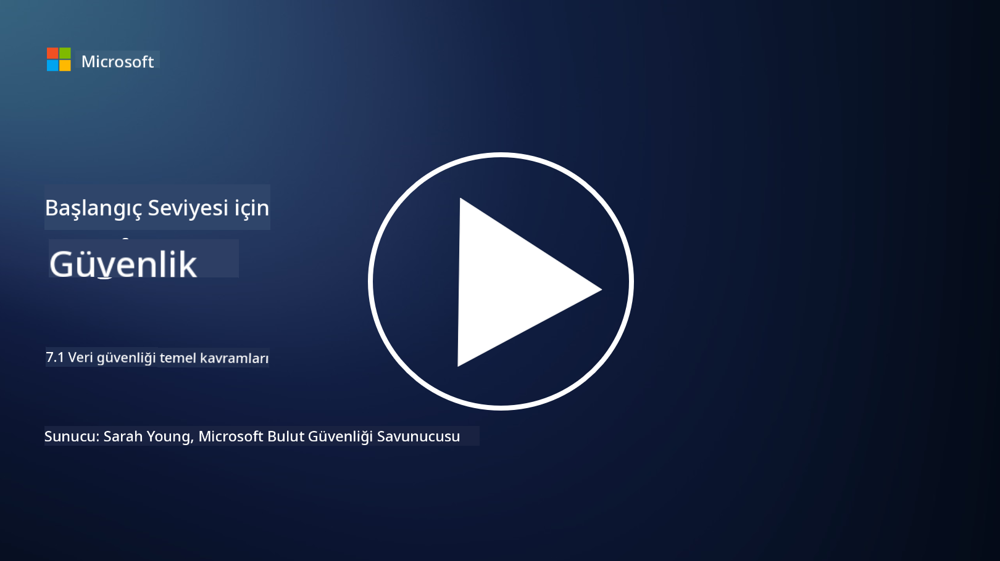

<!--
CO_OP_TRANSLATOR_METADATA:
{
  "original_hash": "9703868f41dcddd5a98dea9ea6fcd94d",
  "translation_date": "2025-09-03T23:56:16+00:00",
  "source_file": "7.1 Data security key concepts.md",
  "language_code": "tr"
}
-->
# Veri Güvenliği Temel Kavramları

Bu derste, veri güvenliğine birkaç kez değindik ve bu konuyu ele aldık. Şimdi, bu konuyu daha derinlemesine inceleyelim. Bu derste şunları öğreneceksiniz:

- Veri güvenliği nedir?

- Veri sınıflandırması nedir?

- Veri yaşam döngüsü yönetimi nedir?

- Veri kaybını önleme (DLP) nedir?

- Veri güvenliği bir organizasyon için neden önemlidir?

## Veri güvenliği nedir?

**Veri güvenliği**, dijital verilerin, örneğin veritabanları, dosyalar ve hassas bilgilerin, yetkisiz erişim, ifşa, değiştirme veya yok edilmeden korunması uygulamasını ifade eder. Veri güvenliğinin temel amacı, verilerin gizliliğini, bütünlüğünü ve erişilebilirliğini sağlamaktır. Bu, siber saldırılar, iç tehditler ve veri ihlalleri gibi çeşitli tehditlere ve zayıflıklara karşı verileri korumak için teknik, idari ve fiziksel güvenlik önlemlerinin bir kombinasyonunu uygulamayı içerir. Veri güvenliği önlemleri arasında şifreleme, erişim kontrolleri, kimlik doğrulama, denetim izleri ve güvenlik politikaları yer alabilir.

## Veri sınıflandırması nedir?

**Veri sınıflandırması**, verilerin hassasiyetine, değerine ve bir organizasyon için önemine göre kategorilere ayrılması sürecidir. Veri sınıflandırmasının amacı, organizasyonların farklı veri türlerinin korunması ve işlenmesi için öncelik belirlemesine yardımcı olmaktır. Yaygın veri sınıflandırma kategorileri arasında "genel," "dahili," "gizli" ve "kısıtlı" veya "çok gizli" bulunur. Veriler sınıflandırıldıktan sonra, organizasyonlar hassas verilerin yeterince korunmasını ve düzenleyici gerekliliklere uyumun sağlanmasını temin etmek için uygun güvenlik kontrolleri ve erişim kısıtlamaları uygulayabilir.

## Veri yaşam döngüsü yönetimi nedir?

**Veri yaşam döngüsü yönetimi**, verilerin oluşturulmasından veya edinilmesinden arşivlenmesine veya silinmesine kadar tüm yaşam döngüsü boyunca yönetilmesi için yapılandırılmış bir yaklaşımdır. Veri yaşam döngüsü genellikle oluşturma, depolama, işleme, iletim, arşivleme ve imha gibi aşamalardan oluşur. Veri yaşam döngüsü yönetimi, verilerin yaşam döngüsünün her aşaması için veri saklama, erişim kontrolleri, yedekleme ve veri temizleme gibi politikalar ve prosedürler tanımlamayı içerir. Etkili veri yaşam döngüsü yönetimi, organizasyonların veri depolamayı optimize etmesine, veri kalitesini artırmasına ve veri koruma düzenlemelerine uyumu sağlamasına yardımcı olur.

## Veri kaybını önleme (DLP) nedir?

**Veri Kaybını Önleme (DLP)**, hassas veya gizli verilerin yetkisiz erişimini, paylaşımını veya sızdırılmasını önlemek için tasarlanmış bir dizi teknoloji, politika ve uygulamayı ifade eder. DLP çözümleri, hareket halindeki verileri (ör. e-posta, web trafiği), dinamik olmayan verileri (ör. depolanan dosyalar ve veritabanları) ve kullanım halindeki verileri (ör. kullanıcılar tarafından erişilen veya işlenen veriler) izlemek ve kontrol etmek için içerik incelemesi ve bağlamsal analiz kullanır. DLP, veri ihlallerini önlemek, veri koruma düzenlemelerine uymak ve bir organizasyonun itibarını korumak için hassas verileri tanımlamayı ve engellemeyi veya şifrelemeyi amaçlar.

## Veri güvenliği bir organizasyon için neden önemlidir?

Veri güvenliği, organizasyonlar için birkaç nedenden dolayı kritik öneme sahiptir:

- **Hassas Bilgilerin Korunması**: Organizasyonlar genellikle müşteri kayıtları, fikri mülkiyet, finansal veriler ve çalışan bilgileri gibi hassas verileri saklar. Veri güvenliği, bu hassas bilgileri yetkisiz erişim veya hırsızlıktan korur.

- **Uyumluluk**: Birçok sektör ve yargı bölgesi, katı veri koruma ve gizlilik düzenlemelerine sahiptir. Veri güvenliği, organizasyonların bu yasalara uymasına, yasal cezalardan ve itibar kaybından kaçınmasına yardımcı olur.

- **Veri İhlallerinin Önlenmesi**: Veri ihlalleri, finansal kayıplara, itibar zedelenmesine ve yasal sonuçlara yol açabilir. Etkili veri güvenliği önlemleri, veri ihlallerini önlemeye veya etkilerini sınırlamaya yardımcı olur.

- **Güvenin Korunması**: Müşteriler ve paydaşlar, organizasyonlara verileriyle güven duyar. Veri güvenliği ihlalleri bu güveni zedeler. Güçlü veri güvenliği, güvenin ve müşteri memnuniyetinin korunmasına yardımcı olur.

- **Rekabet Avantajı**: Veri güvenliğine bağlılık göstermek, bir rekabet avantajı olabilir. Müşteriler ve iş ortakları, veri güvenliğini ciddiye alan organizasyonlarla çalışmayı tercih eder.

- **Operasyonel Süreklilik**: Veri güvenliği önlemleri, veri yedekleme ve felaket kurtarma planlaması dahil, kritik verilerin erişilebilirliğini ve veri kaybı veya felaket durumlarında iş sürekliliğini sağlar.

- **İç Tehditlere Karşı Koruma**: Veri güvenliği önlemleri, çalışanların kazara veri ifşası ve içeriden gelen kötü niyetli eylemler gibi organizasyon içindeki tehditleri de ele alır.

Özetle, veri güvenliği, hassas bilgilerin korunması, düzenlemelere uyum, veri ihlallerinin önlenmesi, güvenin korunması ve bir organizasyonun devam eden başarısı ve itibarı için hayati öneme sahiptir.

## Daha fazla okuma

- [What Is Data Security? | Microsoft Security](https://www.microsoft.com/en-au/security/business/security-101/what-is-data-security?WT.mc_id=academic-96948-sayoung)
- [Automatically Classify & Protect Documents & Data | Microsoft Purview Information Protection](https://youtu.be/v8LqmzBUaOo)
- [Example data classification policy](https://www.cmu.edu/data/guidelines/data-classification.html)
- [What is Data Security? Data Security Definition and Overview | IBM](https://www.ibm.com/topics/data-security)
- [Data Lifecycle Management: A 2023 Guide for Your Business (cloudwards.net)](https://www.cloudwards.net/data-lifecycle-management/)
- [What is data loss prevention (DLP)? | Microsoft Security](https://www.microsoft.com/security/business/security-101/what-is-data-loss-prevention-dlp?WT.mc_id=academic-96948-sayoung)
- [What is DLP? How data loss prevention software works and why you need it | CSO Online](https://www.csoonline.com/article/569559/what-is-dlp-how-data-loss-prevention-software-works-and-why-you-need-it.html)

---

**Feragatname**:  
Bu belge, [Co-op Translator](https://github.com/Azure/co-op-translator) adlı yapay zeka çeviri hizmeti kullanılarak çevrilmiştir. Doğruluk için çaba göstersek de, otomatik çevirilerin hata veya yanlışlıklar içerebileceğini lütfen unutmayın. Orijinal belgenin kendi dilindeki hali yetkili kaynak olarak kabul edilmelidir. Kritik bilgiler için profesyonel insan çevirisi önerilir. Bu çevirinin kullanımından kaynaklanan yanlış anlamalar veya yanlış yorumlamalardan sorumlu değiliz.