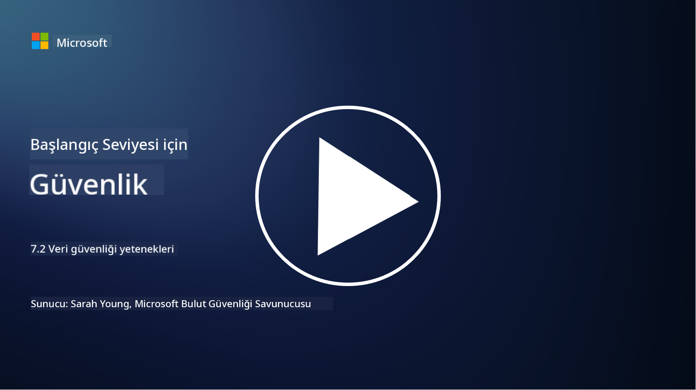

<!--
CO_OP_TRANSLATOR_METADATA:
{
  "original_hash": "50697add9758e54693442d502d2d5f8a",
  "translation_date": "2025-09-04T00:55:50+00:00",
  "source_file": "7.2 Data security capabilities.md",
  "language_code": "tr"
}
-->
# Veri Güvenliği Yetkinlikleri

Bu bölümde, veri güvenliğinde kullanılan temel araçlar ve yetkinlikler hakkında daha fazla ayrıntıya değineceğiz:

**Giriş**

Bu derste ele alacağımız konular:

- Veri kaybını önleme araçları nedir?

- İç tehdit yönetimi araçları nedir?

- Hangi veri saklama araçları mevcut?

## Veri kaybını önleme araçları nedir?

Veri Kaybını Önleme (DLP) araçları, bir organizasyon içinde hassas veya gizli verilere yetkisiz erişimi, paylaşımı veya sızıntısını önlemek için tasarlanmış bir dizi yazılım çözümü ve teknolojiyi ifade eder. Bu araçlar, içerik incelemesi, politika uygulaması ve izleme kullanarak hassas verileri tespit eder ve korur, böylece verilerin ifşa edilmesi veya kötüye kullanılmasını önler. Örnek DLP ürünleri şunlardır: Symantec Data Loss Prevention, McAfee Total Protection for Data Loss Prevention, Microsoft 365 DLP**: Microsoft 365 uygulamalarıyla entegre olarak organizasyonların e-postalar, belgeler ve mesajlar içindeki hassas verileri tanımlamasına ve korumasına yardımcı olur.

## İç tehdit yönetimi araçları nedir?

İç Tehdit Yönetimi araçları, organizasyonların çalışanlar, yükleniciler veya ortaklar tarafından kasıtlı veya kasıtsız olarak veri güvenliğini tehlikeye atabilecek riskleri tanımlamasına ve azaltmasına yardımcı olur. Bu araçlar, kullanıcı davranışlarını, erişim modellerini ve veri kullanımını izleyerek şüpheli aktiviteleri ve potansiyel iç tehditleri tespit eder. Örnek iç tehdit yönetimi ürünleri şunlardır: Microsoft Insider Risk Management (Microsoft 365'in bir parçası), Forcepoint Insider Threat Data Protection, Varonis Insider Threat Detection.

## Hangi veri saklama araçları mevcut?

Veri saklama araçları, bir organizasyonun veri saklama politikaları ve yasal gerekliliklere uygun olarak verilerin saklanmasını ve silinmesini yönetmek için tasarlanmış yazılım ve çözümleri içerir. Bu araçlar, verilerin belirli süreler boyunca saklanmasını ve artık ihtiyaç duyulmadığında güvenli bir şekilde silinmesini otomatikleştirme sürecine yardımcı olur. Örnek veri saklama ürünleri şunlardır: Veritas Enterprise Vault, Commvault Complete Data Protection, Microsoft data lifecycle management. Bu araçlar, organizasyonların veri saklama ve imha süreçlerini kontrol altında tutmasına, veri koruma düzenlemelerine uyum sağlamasına ve veriyi yaşam döngüsü boyunca verimli bir şekilde yönetmesine olanak tanır.

## Daha Fazla Okuma

- [Guide to Data Security Posture Management (DSPM) | CSA (cloudsecurityalliance.org)](https://cloudsecurityalliance.org/blog/2023/03/31/the-big-guide-to-data-security-posture-management-dspm/)
- [Data Loss Prevention across endpoints, apps, & services | Microsoft Purview](https://youtu.be/hvqq8L_0kgI)
- [18 Best Data Loss Prevention Software Tools 2023 (Free + Paid) (comparitech.com)](https://www.comparitech.com/data-privacy-management/data-loss-prevention-tools-software/)
- [Data Loss Prevention (nist.gov)](https://tsapps.nist.gov/publication/get_pdf.cfm?pub_id=904672)
- [Learn about insider risk management | Microsoft Learn](https://learn.microsoft.com/purview/insider-risk-management?WT.mc_id=academic-96948-sayoung)
- [Data Lifecycle Management | IBM](https://www.ibm.com/topics/data-lifecycle-management)
- [What Is Data Lifecycle Management (DLM)? | 2023 Best Practices (selecthub.com)](https://www.selecthub.com/big-data-analytics/data-lifecycle-management/)

---

**Feragatname**:  
Bu belge, AI çeviri hizmeti [Co-op Translator](https://github.com/Azure/co-op-translator) kullanılarak çevrilmiştir. Doğruluk için çaba göstersek de, otomatik çevirilerin hata veya yanlışlık içerebileceğini lütfen unutmayın. Belgenin orijinal dili, yetkili kaynak olarak kabul edilmelidir. Kritik bilgiler için profesyonel insan çevirisi önerilir. Bu çevirinin kullanımından kaynaklanan yanlış anlamalar veya yanlış yorumlamalar için sorumluluk kabul etmiyoruz.