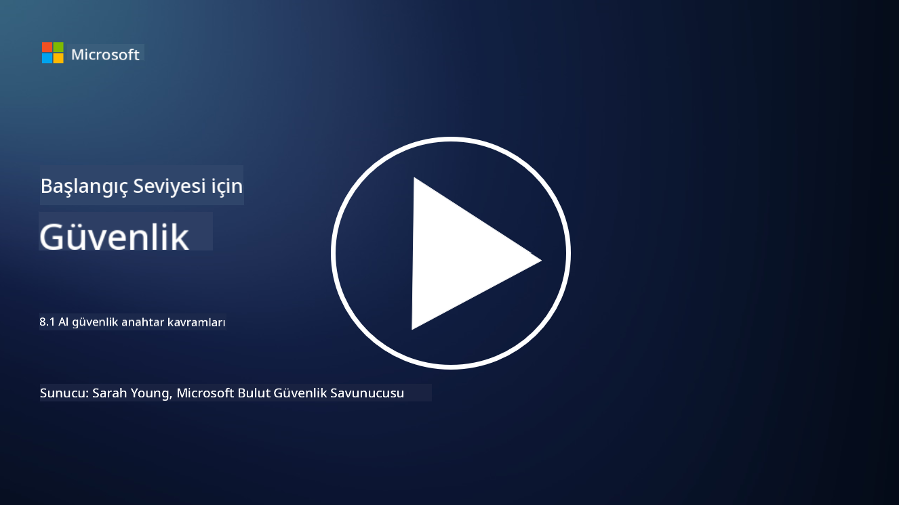

<!--
CO_OP_TRANSLATOR_METADATA:
{
  "original_hash": "66b61d96936cf25d20fcb411d4ce5227",
  "translation_date": "2025-09-03T22:47:35+00:00",
  "source_file": "8.1 AI security key concepts.md",
  "language_code": "tr"
}
-->
# AI güvenliği temel kavramları

## AI güvenliği geleneksel siber güvenlikten nasıl farklıdır?

AI sistemlerini güvence altına almak, AI’nin öğrenme yetenekleri ve karar verme süreçlerinin doğası nedeniyle geleneksel siber güvenlikten farklı zorluklar sunar. İşte bazı temel farklılıklar:

-   **Veri Bütünlüğü**: AI sistemleri öğrenme için büyük ölçüde verilere dayanır. [Bu verilerin bütünlüğünü sağlamak çok önemlidir, çünkü saldırganlar verileri manipüle ederek AI davranışını etkileyebilir; bu taktik veri zehirleme olarak bilinir.
-   **Model Güvenliği**: AI’nin karar verme modeli doğrudan bir hedef olabilir. [Saldırganlar modeli tersine mühendislik yapmaya veya zayıf noktalarını kullanarak yanlış veya zararlı kararlar almasını sağlamaya çalışabilir.
-   **Adversaryal Saldırılar**: AI sistemleri, giriş verilerinde küçük ve genellikle algılanamaz değişiklikler yaparak AI’nin hatalar veya yanlış tahminler yapmasına neden olan adversaryal saldırılara karşı savunmasız olabilir.
-   **Altyapı Güvenliği**: Geleneksel siber güvenlik altyapıyı korumaya odaklanırken, AI sistemleri bulut tabanlı hizmetler veya özel donanım gibi ek karmaşıklık katmanlarına sahip olabilir ve bunlar için özel güvenlik önlemleri gereklidir.
-   **Etik Hususlar**: Güvenlikte AI kullanımı, gizlilik endişeleri ve karar verme sürecindeki önyargı potansiyeli gibi etik hususları beraberinde getirir ve bu hususlar güvenlik stratejisinde ele alınmalıdır.

Genel olarak, AI sistemlerini güvence altına almak, AI teknolojisinin veri, modeller ve öğrenme sürecini koruma gibi benzersiz yönlerini dikkate alan farklı bir yaklaşım gerektirir ve aynı zamanda AI’nin uygulanmasının etik sonuçlarını ele almayı içerir.

AI güvenliği ve geleneksel siber güvenlik birçok benzerliği paylaşır, ancak yapay zeka sistemlerinin benzersiz özellikleri ve yetenekleri nedeniyle bazı belirgin farklılıklar da vardır. İşte nasıl farklılık gösterdikleri:

- **Tehditlerin Karmaşıklığı**: AI sistemleri, siber güvenliğe yeni karmaşıklık katmanları ekler. Geleneksel siber güvenlik, genellikle kötü amaçlı yazılım, kimlik avı saldırıları ve ağ ihlalleri gibi tehditlerle ilgilenir. Ancak, AI sistemleri adversaryal saldırılar, veri zehirleme ve model kaçırma gibi makine öğrenme algoritmalarını doğrudan hedef alan saldırılara karşı savunmasız olabilir.

- **Saldırı Yüzeyi**: AI sistemleri, geleneksel sistemlere kıyasla genellikle daha büyük saldırı yüzeylerine sahiptir. Bunun nedeni, yalnızca yazılıma değil, aynı zamanda veri ve modellere de dayanmasıdır. Saldırganlar eğitim verilerini hedef alabilir, modelleri manipüle edebilir veya algoritmalardaki zayıflıkları kullanabilir.

- **Tehditlerin Uyarlanabilirliği**: AI sistemleri çevresinden öğrenebilir ve uyum sağlayabilir, bu da onları uyarlanabilir ve sürekli evrilen tehditlere karşı daha savunmasız hale getirebilir. Geleneksel siber güvenlik önlemleri, AI sisteminin davranışına göre sürekli evrilen saldırılara karşı yeterli olmayabilir.

- **Yorumlanabilirlik ve Açıklanabilirlik**: Bir AI sisteminin neden belirli bir karar verdiğini anlamak, geleneksel yazılım sistemlerine kıyasla genellikle daha zordur. Bu yorumlanabilirlik ve açıklanabilirlik eksikliği, AI sistemlerine yönelik saldırıları etkili bir şekilde tespit etmeyi ve hafifletmeyi zorlaştırabilir.

- **Veri Gizliliği Endişeleri**: AI sistemleri genellikle büyük miktarda veriye dayanır, bu da uygun şekilde ele alınmazsa gizlilik risklerini artırabilir. Geleneksel siber güvenlik önlemleri, AI sistemlerine özgü veri gizliliği endişelerini yeterince ele almayabilir.

- **Düzenleyici Uyumluluk**: AI güvenliği için düzenleyici ortam hala gelişmekte olup, AI sistemlerinin getirdiği benzersiz zorlukları ele almak için özel düzenlemeler ve standartlar ortaya çıkmaktadır. Geleneksel siber güvenlik çerçevelerinin bu yeni düzenlemelere uyumu sağlamak için genişletilmesi veya uyarlanması gerekebilir.

- **Etik Hususlar**: AI güvenliği, sistemleri kötü niyetli saldırılardan korumanın yanı sıra AI sistemlerinin etik ve sorumlu bir şekilde kullanılmasını sağlamayı da içerir. Bu, adalet, şeffaflık ve hesap verebilirlik gibi hususları içerir ve bunlar geleneksel siber güvenlikte genellikle daha az ön plandadır.

## AI güvenliği geleneksel BT sistemlerini güvence altına almakla nasıl aynıdır?

AI sistemlerini güvence altına almak, geleneksel siber güvenlikle birkaç temel prensibi paylaşır:

-   **Tehdit Koruması**: Hem AI hem de geleneksel sistemler, yetkisiz erişim, veri değişikliği ve yok edilme gibi yaygın tehditlere karşı korunmalıdır.
-   **Zafiyet Yönetimi**: Yazılım hataları veya yanlış yapılandırmalar gibi geleneksel sistemleri etkileyen birçok zafiyet, AI sistemlerini de etkileyebilir.
-   **Veri Güvenliği**: İşlenen verilerin korunması, veri ihlallerini önlemek ve gizliliği sağlamak için her iki alanda da kritik öneme sahiptir.
-   **Tedarik Zinciri Güvenliği**: Her iki tür sistem de, bir bileşenin güvenliğinin tehlikeye girmesi durumunda tüm sistemin güvenliğini zayıflatabilecek tedarik zinciri saldırılarına karşı savunmasızdır.

Bu benzerlikler, AI sistemlerinin yeni güvenlik zorlukları getirmesine rağmen, sağlam bir koruma sağlamak için yerleşik siber güvenlik uygulamalarının uygulanmasını gerektirdiğini göstermektedir. Bu, geleneksel güvenlik bilgeliğini kullanmanın yanı sıra AI teknolojisinin benzersiz yönlerine uyum sağlamayı içerir.

## Daha fazla okuma

- [Not with a Bug, But with a Sticker [Kitap] (oreilly.com)](https://www.oreilly.com/library/view/not-with-a/9781119883982/)
   
- [Intro to AI Security Part 1: AI Security 101 | by HarrietHacks | Medium](https://medium.com/@harrietfarlow/intro-to-ai-security-part-1-ai-security-101-b8662a9efe5)
   
- [Best practices for AI security risk management | Microsoft Security Blog](https://www.microsoft.com/en-us/security/blog/2021/12/09/best-practices-for-ai-security-risk-management/?WT.mc_id=academic-96948-sayoung)
   
- [OWASP AI Security and Privacy Guide | OWASP Foundation](https://owasp.org/www-project-ai-security-and-privacy-guide/)

---

**Feragatname**:  
Bu belge, AI çeviri hizmeti [Co-op Translator](https://github.com/Azure/co-op-translator) kullanılarak çevrilmiştir. Doğruluk için çaba göstersek de, otomatik çevirilerin hata veya yanlışlıklar içerebileceğini lütfen unutmayın. Belgenin orijinal dili, yetkili kaynak olarak kabul edilmelidir. Kritik bilgiler için profesyonel insan çevirisi önerilir. Bu çevirinin kullanımından kaynaklanan yanlış anlamalar veya yanlış yorumlamalar için sorumluluk kabul etmiyoruz.