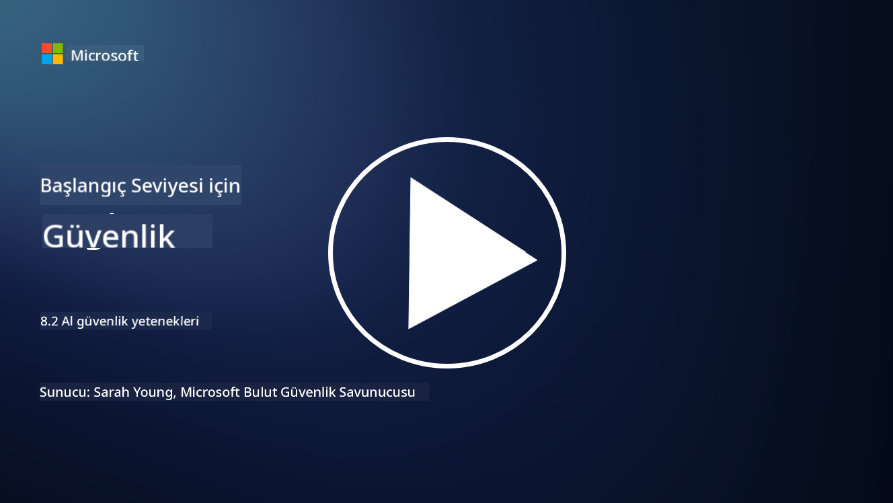

<!--
CO_OP_TRANSLATOR_METADATA:
{
  "original_hash": "b6bb7175672298d1e2f73ba7e0006f95",
  "translation_date": "2025-09-04T01:05:00+00:00",
  "source_file": "8.2 AI security capabilities.md",
  "language_code": "tr"
}
-->
# AI güvenlik yetenekleri

## Şu anda AI sistemlerini güvence altına almak için hangi araçlar ve yetenekler mevcut?

Şu anda AI sistemlerini güvence altına almak için çeşitli araçlar ve yetenekler bulunmaktadır:

-   **Counterfit**: AI sistemlerinin güvenlik testleri için tasarlanmış açık kaynaklı bir otomasyon aracı. Kuruluşların AI güvenlik risk değerlendirmeleri yapmasına ve algoritmalarının dayanıklılığını sağlamasına yardımcı olur.
-   **Adversarial Machine Learning Araçları**: Bu araçlar, makine öğrenimi modellerinin saldırılara karşı dayanıklılığını değerlendirir ve güvenlik açıklarını belirleyip azaltmaya yardımcı olur.
-   **AI Güvenlik Araç Setleri**: AI sistemlerini güvence altına almak için kaynaklar sunan, güvenlik önlemlerini uygulamak için kütüphaneler ve çerçeveler içeren açık kaynaklı araç setleri mevcuttur.
-   **İşbirlikçi Platformlar**: Şirketler ve AI toplulukları arasında, AI tedarik zincirini güvence altına almak için AI'ya özel güvenlik tarayıcıları ve diğer araçlar geliştirmek üzere yapılan ortaklıklar.

Bu araçlar ve yetenekler, AI sistemlerini çeşitli tehditlere karşı koruma alanında büyüyen bir alanın parçasıdır. AI teknolojilerinin sunduğu benzersiz zorlukları ele almak için araştırma, pratik araçlar ve endüstri işbirliğinin bir kombinasyonunu temsil ederler.

## Peki ya AI red teaming? Bu, geleneksel güvenlik red teaming uygulamalarından nasıl farklıdır?

AI red teaming, geleneksel güvenlik red teaming uygulamalarından birkaç önemli açıdan farklıdır:

-   **AI Sistemlerine Odaklanma**: AI red teaming, geleneksel BT altyapısından ziyade makine öğrenimi modelleri ve veri hatları gibi AI sistemlerinin benzersiz güvenlik açıklarını hedef alır.
-   **AI Davranışını Test Etme**: AI sistemlerinin alışılmadık veya beklenmedik girdilere nasıl tepki verdiğini test etmeyi içerir. Bu, saldırganlar tarafından kullanılabilecek güvenlik açıklarını ortaya çıkarabilir.
-   **AI Hatalarını Keşfetme**: Hem kötü niyetli hem de zararsız hataları inceleyerek, yalnızca güvenlik ihlallerinin ötesinde daha geniş bir kişilik ve olası sistem hataları yelpazesini ele alır.
-   **Prompt Injection ve İçerik Üretimi**: AI red teaming, saldırganların AI sistemlerini zararlı veya temelsiz içerik üretmeye yönlendirdiği prompt injection gibi hataları araştırmayı da içerir.
-   **Etik ve Sorumlu AI**: AI sistemlerinin istenmeyen şekillerde davranmasını önlemek için tasarım aşamasında sorumlu AI sağlamanın bir parçasıdır.

Genel olarak, AI red teaming, yalnızca güvenlik açıklarını araştırmayı değil, aynı zamanda AI teknolojilerine özgü diğer sistem hatalarını test etmeyi de içeren genişletilmiş bir uygulamadır. AI sistemlerinin daha güvenli bir şekilde geliştirilmesi için, AI dağıtımıyla ilgili yeni riskleri anlamak ve azaltmak açısından kritik bir rol oynar.

## Daha fazla okuma

 - [Microsoft AI Red Team gelecekte daha güvenli AI oluşturuyor | Microsoft Security Blog](https://www.microsoft.com/en-us/security/blog/2023/08/07/microsoft-ai-red-team-building-future-of-safer-ai/?WT.mc_id=academic-96948-sayoung)
 - [Microsoft’un generative AI sistemlerini red team için açık otomasyon çerçevesini duyurması | Microsoft Security Blog](https://www.microsoft.com/en-us/security/blog/2024/02/22/announcing-microsofts-open-automation-framework-to-red-team-generative-ai-systems/?WT.mc_id=academic-96948-sayoung)
 - [AI Güvenlik Araçları: Açık Kaynaklı Araç Seti | Wiz](https://www.wiz.io/academy/ai-security-tools)

---

**Feragatname**:  
Bu belge, AI çeviri hizmeti [Co-op Translator](https://github.com/Azure/co-op-translator) kullanılarak çevrilmiştir. Doğruluk için çaba göstersek de, otomatik çevirilerin hata veya yanlışlıklar içerebileceğini lütfen unutmayın. Belgenin orijinal dili, yetkili kaynak olarak kabul edilmelidir. Kritik bilgiler için profesyonel insan çevirisi önerilir. Bu çevirinin kullanımından kaynaklanan yanlış anlamalar veya yanlış yorumlamalar için sorumluluk kabul etmiyoruz.