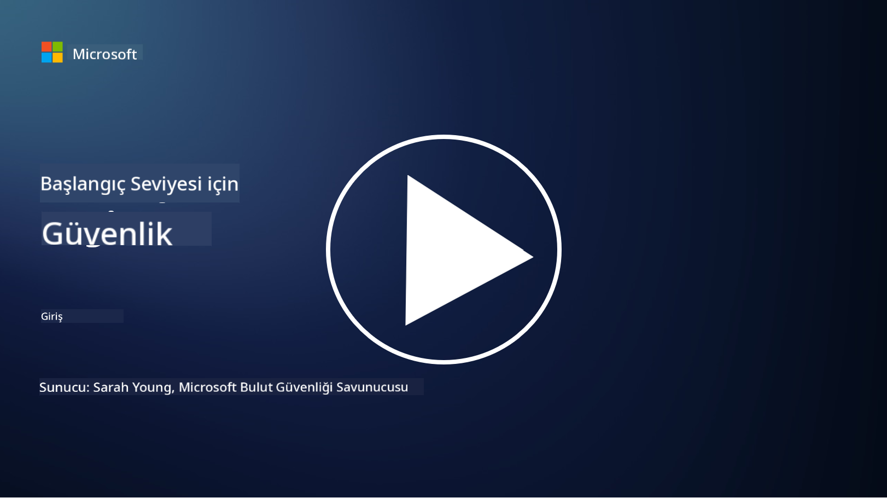

<!--
CO_OP_TRANSLATOR_METADATA:
{
  "original_hash": "79a7e63fa60f649eb3560e1cd7246272",
  "translation_date": "2025-11-18T17:27:09+00:00",
  "source_file": "README.md",
  "language_code": "tr"
}
-->

### 🌐 Çok Dilli Destek

#### GitHub Action ile Desteklenir (Otomatik ve Her Zaman Güncel)

<!-- CO-OP ÇEVİRİCİ DİLLER TABLOSU BAŞLANGIÇ -->
[Arabic](../ar/README.md) | [Bengali](../bn/README.md) | [Bulgarian](../bg/README.md) | [Burmese (Myanmar)](../my/README.md) | [Chinese (Simplified)](../zh/README.md) | [Chinese (Traditional, Hong Kong)](../hk/README.md) | [Chinese (Traditional, Macau)](../mo/README.md) | [Chinese (Traditional, Taiwan)](../tw/README.md) | [Croatian](../hr/README.md) | [Czech](../cs/README.md) | [Danish](../da/README.md) | [Dutch](../nl/README.md) | [Estonian](../et/README.md) | [Finnish](../fi/README.md) | [French](../fr/README.md) | [German](../de/README.md) | [Greek](../el/README.md) | [Hebrew](../he/README.md) | [Hindi](../hi/README.md) | [Hungarian](../hu/README.md) | [Indonesian](../id/README.md) | [Italian](../it/README.md) | [Japanese](../ja/README.md) | [Korean](../ko/README.md) | [Lithuanian](../lt/README.md) | [Malay](../ms/README.md) | [Marathi](../mr/README.md) | [Nepali](../ne/README.md) | [Nigerian Pidgin](../pcm/README.md) | [Norwegian](../no/README.md) | [Persian (Farsi)](../fa/README.md) | [Polish](../pl/README.md) | [Portuguese (Brazil)](../br/README.md) | [Portuguese (Portugal)](../pt/README.md) | [Punjabi (Gurmukhi)](../pa/README.md) | [Romanian](../ro/README.md) | [Russian](../ru/README.md) | [Serbian (Cyrillic)](../sr/README.md) | [Slovak](../sk/README.md) | [Slovenian](../sl/README.md) | [Spanish](../es/README.md) | [Swahili](../sw/README.md) | [Swedish](../sv/README.md) | [Tagalog (Filipino)](../tl/README.md) | [Tamil](../ta/README.md) | [Thai](../th/README.md) | [Turkish](./README.md) | [Ukrainian](../uk/README.md) | [Urdu](../ur/README.md) | [Vietnamese](../vi/README.md)
<!-- CO-OP ÇEVİRİCİ DİLLER TABLOSU BİTİŞ -->

**Ek dil desteği istiyorsanız, desteklenen diller [burada](https://github.com/Azure/co-op-translator/blob/main/getting_started/supported-languages.md) listelenmiştir.**

#### Topluluğumuza Katılın 

# 🚀 Yeni Başlayanlar için Siber Güvenlik – bir müfredat

AI teknolojisinin hızla benimsendiği bu çağda, BT sistemlerini nasıl güvence altına alacağımızı anlamak daha da kritik hale geliyor. Bu kurs, güvenlik öğreniminize başlamak için temel siber güvenlik kavramlarını öğretmek üzere tasarlanmıştır. Satıcı bağımsızdır ve tamamlanması yaklaşık 30-60 dakika sürecek küçük derslere bölünmüştür. Her dersin küçük bir testi ve konuyu daha derinlemesine incelemek isterseniz ek okuma bağlantıları vardır.

Bu kursun kapsadığı konular 📚

- 🔐 CIA üçlüsü gibi temel siber güvenlik kavramları, riskler, tehditler arasındaki farklar vb.
- 🛡️ Güvenlik kontrolünün ne olduğunu ve hangi biçimlerde olduğunu anlamak.
- 🌐 Sıfır güvenin ne olduğunu ve modern siber güvenlikte neden önemli olduğunu anlamak.
- 🔑 Kimlik, ağ, güvenlik operasyonları, altyapı ve veri güvenliği gibi alanlarda temel kavramları ve temaları anlamak.
- 🔧 Güvenlik kontrollerini uygulamak için kullanılan araçlara bazı örnekler vermek.

Bu kursun kapsamadığı konular 🙅‍♂️

- 🚫 Belirli güvenlik araçlarını nasıl kullanacağınız.
- 🚫 "Hackleme" veya kırmızı takım/offensive güvenlik yapma.
- 🚫 Belirli uyumluluk standartlarını öğrenme.

Bu kursu tamamladığınızda, Microsoft Learn modüllerimizden bazılarına geçebilirsiniz. Öğreniminize [Microsoft Güvenlik, Uyumluluk ve Kimlik Temelleri](https://learn.microsoft.com/training/paths/describe-concepts-of-security-compliance-identity/?WT.mc_id=academic-96948-sayoung) ile devam etmenizi öneririz.

Son olarak, [SC-900 Sınavı: Microsoft Güvenlik, Uyumluluk ve Kimlik Temelleri sınavını](https://learn.microsoft.com/credentials/certifications/exams/sc-900/?WT.mc_id=academic-96948-sayoung) almayı düşünebilirsiniz.

> 💁 Bu kurs hakkında herhangi bir geri bildiriminiz veya öneriniz varsa ve eksik olduğunu düşündüğünüz içerikler varsa, sizden haber almak isteriz!

## Modül Genel Bakışı 📝 
| **Modül numarası** | **Modül adı**                           | **Öğretilen kavramlar**                  | **Öğrenme hedefleri**                                                                                          |
|-------------------|-------------------------------------------|--------------------------------------|-----------------------------------------------------------------------------------------------------------------|
| **1.1**           | Temel güvenlik kavramları                   | [CIA üçlüsü](https://github.com/microsoft/Security-101/blob/main/1.1%20The%20CIA%20triad%20and%20other%20key%20concepts.md)                        | Gizlilik, erişilebilirlik ve bütünlük hakkında bilgi edinin. Ayrıca kimlik doğrulama, inkâr edilememe ve gizlilik. |
| **1.2**           | Temel güvenlik kavramları                   | [Yaygın siber güvenlik tehditleri](https://github.com/microsoft/Security-101/blob/main/1.2%20Common%20cybersecurity%20threats.md)        | Bireylerin ve kuruluşların karşılaştığı yaygın siber güvenlik tehditlerini öğrenin.                             |
| **1.3**           | Temel güvenlik kavramları                   | [Risk yönetimini anlamak](https://github.com/microsoft/Security-101/blob/main/1.3%20Understanding%20risk%20management.md)       | Risk değerlendirme ve anlama – etki/olabilirlik ve kontrolleri uygulama hakkında bilgi edinin.                                                                                                               | |
| **1.4**           | Temel güvenlik kavramları                   | [Güvenlik uygulamaları ve belgeler](https://github.com/microsoft/Security-101/blob/main/1.4%20Security%20practices%20and%20documentation.md) | Politikalar, prosedürler, standartlar ve düzenlemeler/yasalar arasındaki fark hakkında bilgi edinin.                         |
| **1.5**           | Temel güvenlik kavramları                   | [Sıfır güven](https://github.com/microsoft/Security-101/blob/main/1.5%20Zero%20trust.md)                           | Sıfır güvenin ne olduğunu ve mimariyi nasıl etkilediğini öğrenin. Derinlemesine savunma nedir?                   |
| **1.6**           | Temel güvenlik kavramları                   | [Paylaşılan sorumluluk modeli](https://github.com/microsoft/Security-101/blob/main/1.6%20Shared%20responsibility%20model.md)                           | Paylaşılan sorumluluk modeli nedir ve siber güvenliği nasıl etkiler?                  |
| **1.7**           | [Modül sonu testi](https://github.com/microsoft/Security-101/blob/main/1.7%20End%20of%20module%20quiz.md)                        |                                      |                                                                                                                 |
| **2.1**           | Kimlik ve erişim yönetimi temelleri | [IAM temel kavramları](https://github.com/microsoft/Security-101/blob/main/2.1%20IAM%20key%20concepts.md)                     | En az ayrıcalık ilkesi, görev ayrımı, IAM'in sıfır güveni nasıl desteklediği hakkında bilgi edinin.               |
| **2.2**           | Kimlik ve erişim yönetimi temelleri | [IAM sıfır güven mimarisi](https://github.com/microsoft/Security-101/blob/main/2.2%20IAM%20zero%20trust%20architecture.md)          | Kimliğin modern BT ortamları için yeni sınır olduğunu ve önlediği tehditleri öğrenin.          |
| **2.3**           | Kimlik ve erişim yönetimi temelleri | [IAM yetenekleri](https://github.com/microsoft/Security-101/blob/main/2.3%20IAM%20capabilities.md)                     | Kimlikleri güvence altına almak için IAM yetenekleri ve kontrolleri hakkında bilgi edinin.                                                  |
| **2.4**           | [Modül sonu testi](https://github.com/microsoft/Security-101/blob/main/2.4%20End%20of%20module%20quiz.md)                        |                                      |                                                                                                                 |
| **3.1**           | Ağ güvenliği temelleri             | [Ağ temel kavramları](https://github.com/microsoft/Security-101/blob/main/3.1%20Networking%20key%20concepts.md)              | Ağ kavramları (IP adresleme, port numaraları, şifreleme vb.) hakkında bilgi edinin.                                 |
| **3.2**           | Ağ güvenliği temelleri             | [Ağ sıfır güven mimarisi](https://github.com/microsoft/Security-101/blob/main/3.2%20Networking%20zero%20trust%20architecture.md)   | Ağın uçtan uca sıfır güven mimarisine nasıl katkıda bulunduğunu ve önlediği tehditleri öğrenin.                  |
| **3.3**           | Ağ güvenliği temelleri             | [Ağ güvenliği yetenekleri](https://github.com/microsoft/Security-101/blob/main/3.3%20Network%20security%20capabilities.md)        | Ağ güvenliği araçları – güvenlik duvarları, WAF, DDoS koruması vb. hakkında bilgi edinin.                                    |
| **3.4**           | [Modül sonu testi](https://github.com/microsoft/Security-101/blob/main/3.4%20End%20of%20module%20quiz.md)                        |                                      |                                                                                                                 |
| **4.1**           | Güvenlik operasyonları temelleri          | [SecOps temel kavramları](https://github.com/microsoft/Security-101/blob/main/4.1%20SecOps%20key%20concepts.md)                  | Güvenlik operasyonlarının neden önemli olduğunu ve normal BT operasyon ekiplerinden nasıl farklılaştığını öğrenin.                  |
| **4.2**           | Güvenlik operasyonları temelleri          | [SecOps sıfır güven mimarisi](https://github.com/microsoft/Security-101/blob/main/4.2%20SecOps%20zero%20trust%20architecture.md)       | SecOps'un uçtan uca sıfır güven mimarisine nasıl katkıda bulunduğunu ve önlediği tehditleri öğrenin.                      |
| **4.3**           | Güvenlik operasyonları temelleri          | [SecOps yetenekleri](https://github.com/microsoft/Security-101/blob/main/4.3%20SecOps%20capabilities.md)                  | SecOps araçları – SIEM, XDR vb. hakkında bilgi edinin.                                                                    |
| **4.4**           | [Modül sonu testi](https://github.com/microsoft/Security-101/blob/main/4.4%20End%20of%20module%20quiz.md)                        |                                      |                                                                                                                 |
| **5.1**           | Uygulama güvenliği temelleri         | [AppSec temel kavramları](https://github.com/microsoft/Security-101/blob/main/5.1%20AppSec%20key%20concepts.md)                  | AppSec kavramları, tasarımda güvenlik, giriş doğrulama vb. hakkında bilgi edinin.                                    |
| **5.2**           | Uygulama güvenliği temelleri             | [AppSec yetenekleri](https://github.com/microsoft/Security-101/blob/main/5.2%20AppSec%20key%20capabilities.md)                  | AppSec araçlarını öğrenin: pipeline güvenlik araçları, kod tarama, gizli bilgi tarama vb.                       |
| **5.3**           | [Modül sonu testi](https://github.com/microsoft/Security-101/blob/main/5.3%20End%20of%20module%20quiz.md)                        |                                      |                                                                                                                 |
| **6.1**           | Altyapı güvenliği temelleri              | [Altyapı güvenliği temel kavramları](https://github.com/microsoft/Security-101/blob/main/6.1%20Infrastructure%20security%20key%20concepts.md) | Sistemleri güçlendirme, yamalama, güvenlik hijyeni, konteyner güvenliği hakkında bilgi edinin.                  |
| **6.2**           | Altyapı güvenliği temelleri              | [Altyapı güvenliği yetenekleri](https://github.com/microsoft/Security-101/blob/main/6.2%20Infrastructure%20security%20capabilities.md) | Altyapı güvenliğine yardımcı olabilecek araçlar hakkında bilgi edinin, örneğin CSPM, konteyner güvenliği vb.     |
| **6.3**           | [Modül sonu testi](https://github.com/microsoft/Security-101/blob/main/6.3%20End%20of%20module%20quiz.md)                        |                                      |                                                                                                                 |
| **7.1**           | Veri güvenliği temelleri                 | [Veri güvenliği temel kavramları](https://github.com/microsoft/Security-101/blob/main/7.1%20Data%20security%20key%20concepts.md)           | Veri sınıflandırması ve saklama hakkında bilgi edinin ve bunun bir organizasyon için neden önemli olduğunu öğrenin.                     |
| **7.2**           | Veri güvenliği temelleri                 | [Veri güvenliği yetenekleri](https://github.com/microsoft/Security-101/blob/main/7.2%20Data%20security%20capabilities.md)           | Veri güvenliği araçları hakkında bilgi edinin – DLP, iç risk yönetimi, veri yönetimi vb.                          |
| **7.3**           | [Modül sonu testi](https://github.com/microsoft/Security-101/blob/main/7.3%20End%20of%20module%20quiz.md)                        |
| **8.1**           | Yapay zeka güvenliği temelleri           | [Yapay zeka güvenliği temel kavramları](https://github.com/microsoft/Security-101/blob/main/8.1%20AI%20security%20key%20concepts.md)          | Geleneksel güvenlik ile yapay zeka güvenliği arasındaki farklar ve benzerlikler hakkında bilgi edinin.                 |
| **8.2**           | Yapay zeka güvenliği temelleri           | [Yapay zeka güvenliği yetenekleri](https://github.com/microsoft/Security-101/blob/main/8.2%20AI%20security%20capabilities.md)           | Yapay zeka güvenliği araçları ve yapay zekayı güvence altına almak için kullanılabilecek kontroller hakkında bilgi edinin.                         |
| **8.3**           | Yapay zeka güvenliği temelleri           | [Sorumlu Yapay Zeka](https://github.com/microsoft/Security-101/blob/main/8.3%20Responsible%20AI.md)          | Sorumlu yapay zekanın ne olduğunu ve güvenlik uzmanlarının farkında olması gereken yapay zeka kaynaklı zararları öğrenin.                          |
| **8.4**           | [Modül sonu testi](https://github.com/microsoft/Security-101/blob/main/8.4%20End%20of%20module%20quiz.md)     

## 🎒 Diğer Kurslar 

Ekibimiz başka kurslar da hazırlıyor! Şunlara göz atabilirsiniz:

### Azure / Edge / MCP / Agentler

---
 
### Üretken Yapay Zeka Serisi

[-9333EA?style=for-the-badge&labelColor=E5E7EB&color=9333EA)](https://github.com/microsoft/Generative-AI-for-beginners-dotnet?WT.mc_id=academic-105485-koreyst)
[-C084FC?style=for-the-badge&labelColor=E5E7EB&color=C084FC)](https://github.com/microsoft/generative-ai-for-beginners-java?WT.mc_id=academic-105485-koreyst)
[-E879F9?style=for-the-badge&labelColor=E5E7EB&color=E879F9)](https://github.com/microsoft/generative-ai-with-javascript?WT.mc_id=academic-105485-koreyst)

---
 
### Temel Öğrenim

---
 
### Copilot Serisi

## Yardım Alma

Eğer takılırsanız veya yapay zeka uygulamaları oluşturma konusunda sorularınız olursa, diğer öğrenenler ve deneyimli geliştiricilerle MCP hakkında tartışmalara katılabilirsiniz. Soruların memnuniyetle karşılandığı ve bilginin özgürce paylaşıldığı destekleyici bir topluluk.

Eğer ürünle ilgili geri bildirimleriniz veya oluşturma sırasında hatalarınız varsa, şu adresi ziyaret edin:

---

<!-- CO-OP TRANSLATOR DISCLAIMER START -->
**Feragatname**:  
Bu belge, [Co-op Translator](https://github.com/Azure/co-op-translator) adlı yapay zeka çeviri hizmeti kullanılarak çevrilmiştir. Doğruluk için çaba göstersek de, otomatik çevirilerin hata veya yanlışlıklar içerebileceğini lütfen unutmayın. Belgenin orijinal dili, yetkili kaynak olarak kabul edilmelidir. Kritik bilgiler için profesyonel insan çevirisi önerilir. Bu çevirinin kullanımından kaynaklanan yanlış anlamalar veya yanlış yorumlamalar için sorumluluk kabul edilmez.
<!-- CO-OP TRANSLATOR DISCLAIMER END -->