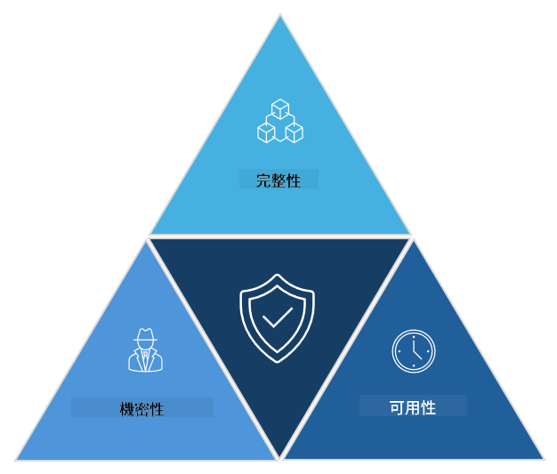

<!--
CO_OP_TRANSLATOR_METADATA:
{
  "original_hash": "16a76f9fa372fb63cffb6d76b855f023",
  "translation_date": "2025-09-03T17:40:32+00:00",
  "source_file": "1.1 The CIA triad and other key concepts.md",
  "language_code": "tw"
}
-->
# CIA 三元組及其他關鍵概念

## 簡介

在本課程中，我們將探討：

 - 什麼是網路安全？
   
 - 什麼是網路安全的 CIA 三元組？

 - 在網路安全的背景下，什麼是真實性、不可否認性和隱私？

## 什麼是網路安全？

網路安全，也稱為資訊安全，是保護電腦系統、網路、設備和數據免受數位攻擊、未經授權的訪問、損害或竊取的實踐。網路安全的主要目標是確保數位資產和資訊的機密性、完整性和可用性。網路安全專業人員設計並實施安全控制措施來保護資產、數據和資訊。隨著我們的生活越來越數位化和線上化，網路安全已成為個人和組織的首要關注事項。

## 什麼是網路安全的 CIA 三元組？

網路安全三元組是指一個模型，包含了進行任何網路安全工作或設計系統/環境時的三個主要考量：

### 機密性

這是大多數人在想到「網路安全」時最熟悉的考量：機密性是指保護數據和資訊免受未經授權的訪問，也就是說，只有需要查看資訊的人才能訪問它。然而，並非所有數據都是一樣的，數據通常根據如果被錯誤的人訪問會造成的損害程度來分類和保護。

### 完整性

指的是保護環境中數據的準確性和可信度，並防止未經授權的人更改或修改數據。例如，一名學生修改了 DMV（車輛管理局）中的駕照記錄上的出生日期，使自己看起來年齡更大，從而重新打印駕照以購買酒精。

### 可用性

這是運營 IT 的一個重要考量，但對於網路安全來說，可用性同樣重要。有些特定類型的攻擊專門針對可用性，安全專業人員必須防範這些攻擊（例如分散式阻斷服務攻擊 – DDoS 攻擊）。

**網路安全 CIA 三元組**

## 在網路安全的背景下，什麼是真實性、不可否認性和隱私？

這些是與確保系統和數據的安全性及可信度相關的其他重要概念：

**真實性** - 指的是保證您所互動的資訊、通信或實體是真實的，並且未被未經授權的方篡改或修改。

**不可否認性** - 是指確保某一方無法否認其參與某項交易或通信的概念。它防止某人聲稱他們沒有發送某條訊息或執行某項行動，而事實上有證據顯示相反。

**隱私** - 指的是保護敏感和個人可識別資訊免受未經授權的訪問、使用、披露或操縱。它涉及控制誰可以訪問個人數據，以及這些數據如何被收集、存儲和共享。

## 延伸閱讀

[什麼是資訊安全（InfoSec）？| Microsoft Security](https://www.microsoft.com/security/business/security-101/what-is-information-security-infosec#:~:text=Three%20pillars%20of%20information%20security%3A%20the%20CIA%20triad,as%20guiding%20principles%20for%20implementing%20an%20InfoSec%20plan.)

---

**免責聲明**：  
本文件使用 AI 翻譯服務 [Co-op Translator](https://github.com/Azure/co-op-translator) 進行翻譯。儘管我們努力確保翻譯的準確性，但請注意，自動翻譯可能包含錯誤或不精確之處。原始文件的母語版本應被視為權威來源。對於重要資訊，建議尋求專業人工翻譯。我們對因使用此翻譯而引起的任何誤解或錯誤解釋不承擔責任。