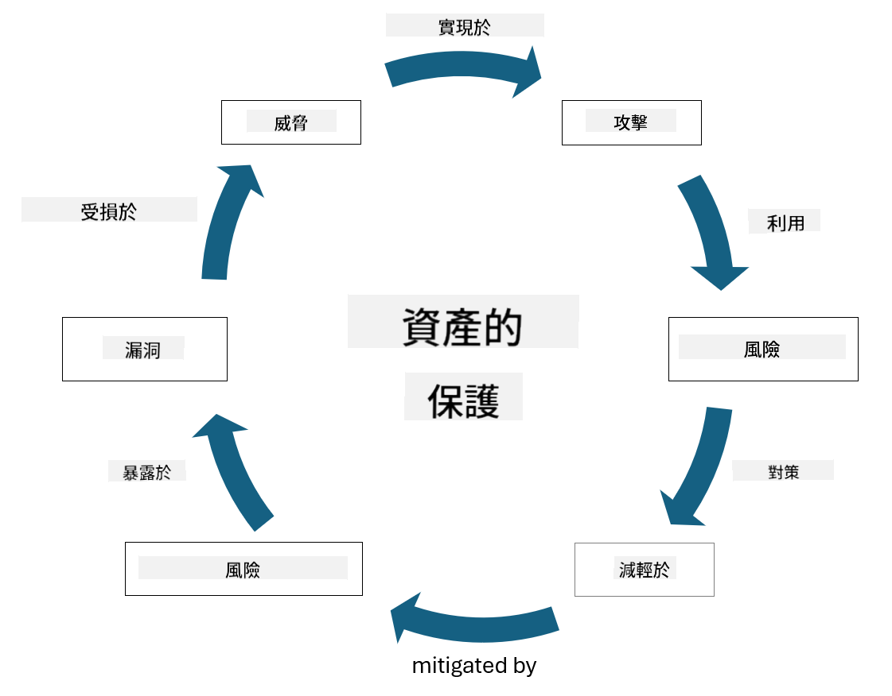

<!--
CO_OP_TRANSLATOR_METADATA:
{
  "original_hash": "fcca304f072cabf206388199e8e2e578",
  "translation_date": "2025-09-03T17:46:29+00:00",
  "source_file": "1.3 Understanding risk management.md",
  "language_code": "tw"
}
-->
# 理解風險管理

## 簡介

在本課程中，我們將探討：

- 常用安全術語的定義

- 安全控制的類型

- 評估安全風險

## 常用安全術語的定義

這些術語是網絡安全和風險管理領域的基本概念。讓我們逐一解析這些術語及其相互關係：

1. **威脅代理**：

威脅代理是指具有潛力利用系統或網絡中的漏洞來造成損害或破壞的個人、群體、組織或自動化系統。威脅代理可能包括駭客、惡意軟件作者、不滿的員工或任何對信息和技術系統構成風險的實體。

2. **威脅**：

威脅是指可能利用系統漏洞並對資產造成損害的潛在事件或行動。威脅可能包括駭客攻擊、數據洩露、拒絕服務攻擊等行為。威脅是指可能對組織資產造成傷害的「事件」。

3. **漏洞**：

漏洞是系統設計、實施或配置中的弱點或缺陷，可能被威脅代理利用以破壞系統的安全性。漏洞可能存在於軟件、硬件、流程或人為行為中。識別和解決漏洞對於減少成功攻擊的風險至關重要。

4. **風險**：

風險是指威脅與漏洞相互作用可能導致的損失、傷害或損害。它是威脅代理利用漏洞造成負面影響的可能性。風險通常根據其潛在影響和發生可能性進行評估。

5. **資產**：

資產是指組織希望保護的任何有價值的事物。資產可以包括實物（如電腦和伺服器）、數據（客戶信息、財務記錄）、知識產權（商業秘密、專利）以及人力資源（員工的技能和知識）。保護資產是網絡安全的核心目標。

6. **暴露**：

暴露是指處於可能受到威脅的狀態。當系統或網絡中存在漏洞時，就會出現暴露。暴露突出了因漏洞存在而帶來的風險。

7. **控制措施**：

控制措施是為減少與漏洞和威脅相關的風險而採取的措施。控制措施可以是技術性、程序性或管理性的，旨在預防、檢測或減輕潛在威脅和漏洞的影響。例如防火牆、訪問控制、加密、安全政策和員工培訓。

總結這些術語之間的關係：威脅代理利用漏洞來實施威脅，可能導致風險並對有價值的資產造成損害。當漏洞存在時，就會出現暴露，而控制措施則用於減少風險，通過預防或減輕威脅對資產的影響。這一框架構成了網絡安全風險管理的基礎，指導組織識別、評估和處理信息系統及資產的潛在風險。

## 安全控制的類型

安全控制是為保護信息系統和資產免受各種威脅和漏洞而實施的措施或保障。根據其重點和目的，安全控制可以分為幾個類別。以下是一些常見的安全控制類型：

1. **管理控制**：

這些控制措施與政策、程序和指南有關，用於管理組織的安全實踐和用戶行為。

- 安全政策和程序：定義如何在組織內維持安全的文件化指南。

- 安全意識和培訓：教育員工安全最佳實踐和潛在威脅的計劃。

- 事件響應和管理：應對和減輕安全事件的計劃。

2. **技術控制**：

技術控制涉及使用技術來執行安全措施並保護系統和數據。技術控制的例子包括：

- 訪問控制：根據角色和權限限制用戶對資源的訪問。

- 加密：將數據轉換為安全格式以防止未授權訪問。

- 防火牆：過濾和控制進出網絡流量的安全設備。

- 入侵檢測和防禦系統（IDPS）：監控網絡流量以檢測可疑活動的工具。

- 防病毒和反惡意軟件：檢測和移除惡意軟件的程序。

- 身份驗證機制：驗證用戶身份的方法，例如密碼、生物識別、多重身份驗證。

- 補丁管理：定期更新軟件以解決已知漏洞。

3. **物理控制**：

物理控制是保護實物資產和設施的措施。

- 安全人員和訪問控制人員：監控和控制物理場地訪問的工作人員。

- 監控攝像頭：監控和記錄活動的視頻監控系統。

- 鎖具和物理屏障：限制敏感區域訪問的物理措施。

- 環境控制：調節溫度、濕度等影響設備和數據中心的環境因素。

4. **操作控制**：

這些控制措施與日常運營和活動有關，確保系統的持續安全。

- 變更管理：跟踪和批准系統和配置變更的流程。

- 備份和災難恢復：在系統故障或災難情況下的數據備份和恢復計劃。

- 日誌記錄和審計：監控和記錄系統活動以確保安全和合規。

- 安全編碼實踐：編寫軟件以最大限度減少漏洞的指南。

5. **法律和監管控制**：

這些控制措施確保遵守相關法律、法規和行業標準。組織需要遵守的標準取決於司法管轄區、行業領域及其他因素。

- 數據保護法規：遵守如 GDPR、HIPAA 和 CCPA 等法律。

- 行業特定標準：遵守如 PCI DSS 等支付卡數據安全標準。

這些安全控制類別共同作用，為組織建立全面的安全防護，幫助保護其系統、數據和資產免受各種威脅。

## 評估安全風險

一些安全專業人士認為風險管理應由風險專業人士負責，但理解管理安全風險的過程對任何安全專業人士都很重要，這有助於以組織其他部門能理解並採取行動的語言表達安全風險。

組織必須不斷評估安全風險，並決定是否採取行動（或不採取行動）來應對業務風險。以下是通常進行此過程的概述。請注意，此過程通常由組織內的多個團隊共同完成，很少有單一團隊負責風險的端到端管理。

1. **識別資產和威脅**：

組織識別其希望保護的資產，包括數據、系統、硬件、軟件、知識產權等。接著，識別可能針對這些資產的潛在威脅。

2. **評估漏洞**：

組織接著識別系統或流程中可能被威脅利用的漏洞或弱點。這些漏洞可能源於軟件缺陷、配置錯誤、安全控制不足或人為錯誤。

3. **可能性評估**：

組織接著評估每個威脅發生的可能性。這涉及考慮歷史數據、威脅情報、行業趨勢和內部因素。可能性可以根據威脅實現的概率分為低、中、高。

4. **影響評估**：

接著，組織確定每個威脅在利用漏洞後可能造成的影響。影響可能包括財務損失、運營中斷、聲譽損害、法律後果等。影響也可以根據潛在後果分為低、中、高。

5. **風險計算**：

可能性和影響評估結合起來計算每個識別威脅的整體風險水平。這通常使用風險矩陣進行，為可能性和影響水平分配數值或定性描述。所得的風險水平有助於確定需要立即關注的風險。

6. **優先排序和決策**：

組織接著根據可能性和影響值的最高組合優先處理風險。這使其能更有效地分配資源並實施控制措施。高風險威脅需要立即關注，而低風險威脅可能在較長時間內處理。

7. **風險處理**：

根據風險評估，組織決定如何減輕或管理每個風險。這可能包括實施安全控制、通過保險轉移風險，甚至接受某些可控的剩餘風險（如果修復成本過高等）。

8. **持續監控和審查**：

風險評估不是一次性過程。應定期進行，或在組織環境發生重大變化時進行。持續監控確保新威脅、漏洞或業務環境的變化得到考慮。

通過以結構化方式評估安全風險，組織可以就資源分配、安全控制和整體風險管理策略做出明智決策。目標是減少組織的整體風險暴露，同時使安全工作與組織的業務目標和宗旨保持一致。

---

**免責聲明**：  
本文件已使用 AI 翻譯服務 [Co-op Translator](https://github.com/Azure/co-op-translator) 進行翻譯。儘管我們致力於提供準確的翻譯，請注意自動翻譯可能包含錯誤或不準確之處。原始文件的母語版本應被視為權威來源。對於重要資訊，建議使用專業人工翻譯。我們對因使用此翻譯而引起的任何誤解或錯誤解釋不承擔責任。