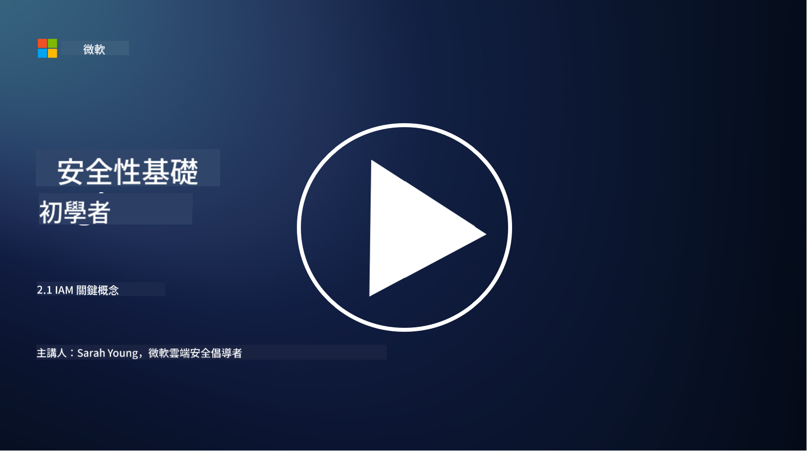

<!--
CO_OP_TRANSLATOR_METADATA:
{
  "original_hash": "2e3864e3d579f0dbb4ac2ec8c5f82acf",
  "translation_date": "2025-09-03T16:57:20+00:00",
  "source_file": "2.1 IAM key concepts.md",
  "language_code": "tw"
}
-->
# IAM 關鍵概念

你是否曾經登入過電腦或網站？當然有！這意味著你在日常生活中已經使用了身份控制。身份與存取管理（IAM）是安全性的核心支柱，我們將在接下來的課程中深入了解它。

**介紹**

在本課程中，我們將探討：

- 在網路安全的背景下，什麼是身份與存取管理（IAM）？
- 什麼是最小權限原則？
- 什麼是職責分離？
- 什麼是身份驗證與授權？

## 在網路安全的背景下，什麼是身份與存取管理（IAM）？

身份與存取管理（IAM）是指一組流程、技術和政策，旨在確保正確的個體能夠獲得適當的資源存取權限，這些資源存在於組織的數位環境中。IAM 涉及管理數位身份（如用戶、員工、合作夥伴）及其對系統、應用程式、數據和網路的存取。IAM 的主要目標是提升安全性、簡化用戶存取流程，並確保符合組織政策和法規。IAM 解決方案通常包括用戶身份驗證、授權、身份配置、存取控制以及用戶生命週期管理（確保不再使用的帳戶被刪除）。

## 什麼是最小權限原則？

最小權限原則是一個基本概念，主張僅授予用戶和系統執行其指定任務或角色所需的最低權限。這一原則有助於限制在安全漏洞或內部威脅情況下可能造成的潛在損害。通過遵循最小權限原則，組織可以減少攻擊面，並降低未經授權存取、數據洩露以及權限誤用的風險。在實踐中，這意味著用戶僅能存取其工作角色所需的特定資源和功能，且不會擁有多餘的權限。例如，如果你只需要閱讀一份文件，那麼授予你該文件的完整管理權限就顯得過於多餘。

## 什麼是職責分離？

職責分離是一項旨在防止利益衝突並降低欺詐和錯誤風險的原則，通過將關鍵任務和責任分配給組織內的不同個體來實現。在網路安全的背景下，職責分離確保沒有任何單一個體能夠完全控制關鍵流程或系統的所有方面。其目標是建立一個制衡系統，防止任何人能夠同時執行流程的設置和批准階段。例如，在財務系統中，輸入交易的人不應該是批准交易的人。這樣可以降低未經授權或欺詐行為未被發現的風險。

## 什麼是身份驗證與授權？

身份驗證與授權是網路安全中的兩個基本概念，對於確保計算機系統和數據的安全性與完整性至關重要。這兩者通常結合使用，以控制資源存取並保護敏感信息。

**1. 身份驗證**：  
身份驗證是指驗證試圖存取計算機系統或特定資源的用戶、系統或實體的身份的過程。它確保聲稱的身份是真實且準確的。身份驗證方法通常包括以下一種或多種因素：

a. 你知道的東西：包括密碼、PIN 碼或其他只有授權用戶知道的秘密資訊。  
b. 你擁有的東西：包括實體令牌或設備，如智慧卡、安全令牌或用於確認用戶身份的手機。  
c. 你是什麼：包括指紋、面部識別或視網膜掃描等生物特徵，這些特徵對個體是唯一的。

身份驗證機制用於確認用戶是否為其聲稱的身份，然後才允許其存取系統或資源。這有助於防止未經授權的存取，並確保只有合法用戶能夠在系統中執行操作。

**2. 授權**：  
授權是指在身份驗證後，根據用戶或實體的身份，授予或拒絕特定權限和特權的過程。它決定了用戶在系統內或特定資源上可以執行的操作或操作範圍。授權通常基於預定義的政策、存取控制規則以及分配給用戶的角色。

授權可以被視為回答「已驗證的用戶可以做什麼？」這個問題。它涉及定義和執行存取控制政策，以保護敏感數據和資源免受未經授權的存取或修改。

**總結：**

- 身份驗證確立用戶或實體的身份。  
- 授權決定已驗證的用戶可以存取或操作的資源和行為。

## 延伸閱讀

- [描述身份概念 - Training | Microsoft Learn](https://learn.microsoft.com/training/modules/describe-identity-principles-concepts/?WT.mc_id=academic-96948-sayoung)  
- [身份介紹 - Microsoft Entra | Microsoft Learn](https://learn.microsoft.com/azure/active-directory/fundamentals/identity-fundamental-concepts?WT.mc_id=academic-96948-sayoung)  
- [什麼是身份與存取管理（IAM）？| Microsoft Security](https://www.microsoft.com/security/business/security-101/what-is-identity-access-management-iam?WT.mc_id=academic-96948-sayoung)  
- [什麼是 IAM？身份與存取管理解釋 | CSO Online](https://www.csoonline.com/article/518296/what-is-iam-identity-and-access-management-explained.html)  
- [什麼是 IAM？(auth0.com)](https://auth0.com/blog/what-is-iam/)  
- [Security+：實施身份與存取管理（IAM）控制 [更新於 2021] | Infosec (infosecinstitute.com)](https://resources.infosecinstitute.com/certifications/securityplus/security-implementing-identity-and-access-management-iam-controls/)  
- [最小權限 - 詞彙表 | CSRC (nist.gov)](https://csrc.nist.gov/glossary/term/least_privilege)  
- [安全性：最小權限原則（POLP） - Microsoft Community Hub](https://techcommunity.microsoft.com/t5/azure-sql-blog/security-the-principle-of-least-privilege-polp/ba-p/2067390?WT.mc_id=academic-96948-sayoung)  
- [最小權限原則 | CERT NZ](https://www.cert.govt.nz/it-specialists/critical-controls/principle-of-least-privilege/)  
- [為什麼 NIST 800-171 和 CMMC 要求職責分離？- (totem.tech)](https://www.totem.tech/cmmc-separation-of-duties/)  

---

**免責聲明**：  
本文件已使用 AI 翻譯服務 [Co-op Translator](https://github.com/Azure/co-op-translator) 進行翻譯。儘管我們致力於提供準確的翻譯，請注意自動翻譯可能包含錯誤或不準確之處。原始文件的母語版本應被視為權威來源。對於關鍵資訊，建議使用專業人工翻譯。我們對因使用此翻譯而引起的任何誤解或錯誤解釋不承擔責任。