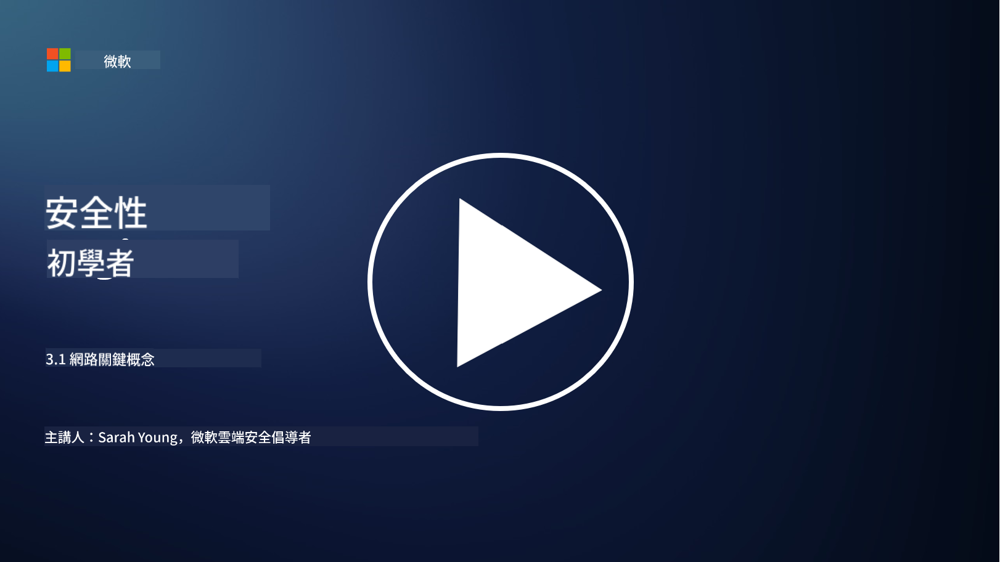
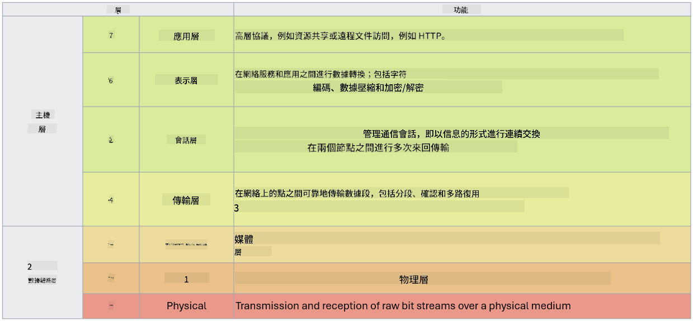

<!--
CO_OP_TRANSLATOR_METADATA:
{
  "original_hash": "252724eceeb183fb9018f88c5e1a3f0c",
  "translation_date": "2025-09-03T17:49:54+00:00",
  "source_file": "3.1 Networking key concepts.md",
  "language_code": "tw"
}
-->
# 網路核心概念

如果你曾經從事過 IT 工作，很可能已經接觸過網路相關概念。雖然在現代環境中，我們主要使用身份驗證作為主要的邊界控制，但這並不意味著網路控制已經過時。儘管這是一個非常廣泛的主題，在本課程中，我們將探討一些關鍵的網路概念。

在本課程中，我們將討論：

- 什麼是 IP 位址？

- 什麼是 OSI 模型？

- 什麼是 TCP/UDP？

- 什麼是埠號？

- 什麼是靜態加密與傳輸加密？

## 什麼是 IP 位址？

IP 位址（Internet Protocol 位址）是分配給每個使用網際網路協議進行通信的電腦網路設備的數字標籤。它作為網路中設備的唯一識別碼，允許它們在網際網路或其他互聯網路中發送和接收數據。IP 位址主要有兩個版本：IPv4（網際網路協議版本 4）和 IPv6（網際網路協議版本 6）。IP 位址通常以 IPv4 格式（例如：192.168.1.1）或 IPv6 格式（例如：2001:0db8:85a3:0000:0000:8a2e:0370:7334）表示。

## 什麼是 OSI 模型？

OSI（開放系統互連）模型是一個概念框架，將通信系統的功能標準化為七個不同的層級。每一層執行特定任務，並與相鄰層級進行通信，以確保設備之間的數據通信高效且可靠。從底層到頂層的層級如下：

1. 實體層

2. 資料鏈路層

3. 網路層

4. 傳輸層

5. 會話層

6. 表示層

7. 應用層

OSI 模型提供了一個通用的參考，用於理解網路協議和技術如何交互，而不受特定硬體或軟體實現的影響。

_來源：https://en.wikipedia.org/wiki/OSI_model_

## 什麼是 TCP/UDP？

TCP（傳輸控制協議）和 UDP（使用者資料報協議）是電腦網路中用於促進設備之間通信的兩個基本傳輸層協議。它們負責將數據分解為封包進行傳輸，並在接收端重新組裝這些封包為原始數據。然而，它們在特性和使用情境上有所不同。

**TCP（傳輸控制協議）**：

TCP 是一種面向連接的協議，提供可靠且有序的數據傳輸。它在數據交換開始之前建立發送方和接收方之間的連接。TCP 確保數據封包按正確順序到達，並能處理丟失封包的重傳，以保證數據的完整性和準確性。這使得 TCP 適合需要可靠數據傳輸的應用，例如網頁瀏覽、電子郵件、檔案傳輸（FTP）和資料庫通信。

**UDP（使用者資料報協議）**：

UDP 是一種無連接的協議，提供更快的數據傳輸，但不具備 TCP 的可靠性。它在發送數據之前不建立正式連接，也不包含確認或重傳丟失封包的機制。UDP 適合速度和效率比保證傳輸更重要的應用，例如即時通信、媒體串流、線上遊戲和 DNS 查詢。

總結來說，TCP 注重可靠性和有序傳輸，適合需要數據準確性的應用；而 UDP 強調速度和效率，適合允許少量數據丟失或順序重排以換取低延遲的應用。選擇 TCP 或 UDP 取決於應用或服務的具體需求。

## 什麼是埠號？

在網路中，埠號是一個用於區分單一設備上不同服務或應用的數字識別碼。埠號幫助將接收到的數據路由到正確的應用。埠號是 16 位元無符號整數，範圍從 0 到 65535，分為三個範圍：

- 知名埠（0-1023）：保留給標準服務，例如 HTTP（埠 80）和 FTP（埠 21）。

- 註冊埠（1024-49151）：用於不屬於知名範圍但已正式註冊的應用和服務。

- 動態/私有埠（49152-65535）：供應用臨時或私有使用。

## 什麼是靜態加密與傳輸加密？

加密是將數據轉換為安全格式以防止未授權訪問或篡改的過程。加密可以應用於「靜態」（存儲在設備或伺服器上）和「傳輸」（在設備之間或網路上傳輸）的數據。

靜態加密：這是指加密存儲在設備、伺服器或存儲系統上的數據。即使攻擊者獲得存儲媒體的物理訪問權，沒有加密密鑰也無法訪問數據。這對於保護敏感數據免受設備被盜、數據洩露或未授權訪問至關重要。

傳輸加密：這是指加密在設備之間或網路上傳輸的數據。這可以防止在傳輸過程中數據被竊聽或未授權攔截。常見的傳輸加密協議包括用於網頁通信的 HTTPS 和用於保護各類網路流量的 TLS/SSL。

## 延伸閱讀
- [IP 位址如何運作？ (howtogeek.com)](https://www.howtogeek.com/341307/how-do-ip-addresses-work/)
- [理解 IP 位址：入門指南 (geekflare.com)](https://geekflare.com/understanding-ip-address/)
- [什麼是 OSI 模型？OSI 的七層解釋 (techtarget.com)](https://www.techtarget.com/searchnetworking/definition/OSI)
- [OSI 模型——用簡單英文解釋網路的七層 (freecodecamp.org)](https://www.freecodecamp.org/news/osi-model-networking-layers-explained-in-plain-english/)
- [TCP/IP 協議 - IBM 文件](https://www.ibm.com/docs/en/aix/7.3?topic=protocol-tcpip-protocols)
- [常見埠速查表：最終埠與協議清單 (stationx.net)](https://www.stationx.net/common-ports-cheat-sheet/)
- [Azure 靜態加密 - Azure 安全性 | Microsoft Learn](https://learn.microsoft.com/azure/security/fundamentals/encryption-atrest?WT.mc_id=academic-96948-sayoung)

---

**免責聲明**：  
本文件已使用 AI 翻譯服務 [Co-op Translator](https://github.com/Azure/co-op-translator) 進行翻譯。儘管我們致力於提供準確的翻譯，請注意自動翻譯可能包含錯誤或不準確之處。原始文件的母語版本應被視為權威來源。對於關鍵資訊，建議使用專業人工翻譯。我們對因使用此翻譯而引起的任何誤解或錯誤解釋不承擔責任。