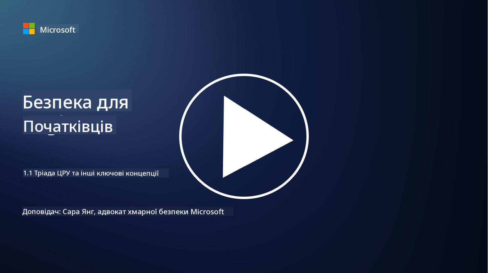
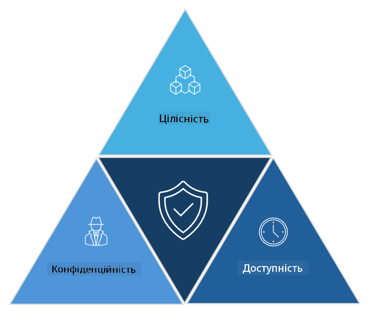

<!--
CO_OP_TRANSLATOR_METADATA:
{
  "original_hash": "16a76f9fa372fb63cffb6d76b855f023",
  "translation_date": "2025-09-03T21:41:38+00:00",
  "source_file": "1.1 The CIA triad and other key concepts.md",
  "language_code": "uk"
}
-->
# Тріада CIA та інші ключові концепції

## Вступ

У цьому уроці ми розглянемо:

 - Що таке кібербезпека?
   
 
 - Що таке тріада CIA у кібербезпеці?

   

 - Що таке автентичність, незаперечність і конфіденційність у контексті кібербезпеки?

## Що таке кібербезпека?

Кібербезпека, також відома як інформаційна безпека, — це практика захисту комп’ютерних систем, мереж, пристроїв і даних від цифрових атак, несанкціонованого доступу, пошкодження або крадіжки. Основна мета кібербезпеки — забезпечити конфіденційність, цілісність і доступність цифрових активів та інформації. Фахівці з кібербезпеки розробляють і впроваджують засоби захисту для захисту активів, даних та інформації. Оскільки все більше аспектів нашого життя стають цифровими та онлайн, кібербезпека стала головним пріоритетом як для приватних осіб, так і для організацій.

## Що таке тріада CIA у кібербезпеці?

Тріада кібербезпеки стосується моделі, яка включає три основні аспекти будь-якої роботи з кібербезпеки або проектування системи/середовища:

### Конфіденційність

Це аспект, який більшість людей асоціює з терміном «кібербезпека»: конфіденційність — це процес захисту даних та інформації від спроб несанкціонованого доступу, тобто лише ті, хто має потребу бачити інформацію, можуть отримати до неї доступ. Однак не всі дані однакові, і зазвичай дані класифікуються та захищаються залежно від того, наскільки серйозними будуть наслідки, якщо їх отримає хтось сторонній.

### Цілісність

Це захист точності та достовірності даних у середовищах, а також недопущення їх зміни або коригування несанкціонованими особами. Наприклад, студент змінює свою дату народження в записах DMV, щоб зробити себе старшим і отримати водійське посвідчення з іншою датою народження для купівлі алкоголю.

### Доступність

Цей аспект важливий для операційної ІТ, але доступність також має значення для кібербезпеки. Існують специфічні типи атак, які спрямовані на доступність, і фахівці з безпеки повинні захищати від них (наприклад, атаки типу розподіленої відмови в обслуговуванні – DDoS).

**Тріада кібербезпеки CIA**

## Що таке автентичність, незаперечність і конфіденційність у контексті кібербезпеки?

Це додаткові важливі концепції, які стосуються забезпечення безпеки та надійності систем і даних:

**Автентичність** - стосується впевненості в тому, що інформація, комунікація або суб’єкт, з яким ви взаємодієте, є справжніми і не були змінені або підроблені несанкціонованими сторонами.

**Незаперечність** - це концепція, яка гарантує, що сторона не може заперечувати свою участь або автентичність транзакції чи комунікації. Вона запобігає ситуаціям, коли хтось стверджує, що не надсилав повідомлення або не виконував певну дію, якщо є докази протилежного.

**Конфіденційність** - стосується захисту чутливої та особисто ідентифікованої інформації від несанкціонованого доступу, використання, розголошення або маніпуляції. Вона передбачає контроль над тим, хто має доступ до персональних даних і як ці дані збираються, зберігаються та передаються.

## Додаткове читання

[Що таке інформаційна безпека (InfoSec)? | Microsoft Security](https://www.microsoft.com/security/business/security-101/what-is-information-security-infosec#:~:text=Three%20pillars%20of%20information%20security%3A%20the%20CIA%20triad,as%20guiding%20principles%20for%20implementing%20an%20InfoSec%20plan.)

---

**Відмова від відповідальності**:  
Цей документ було перекладено за допомогою сервісу автоматичного перекладу [Co-op Translator](https://github.com/Azure/co-op-translator). Хоча ми прагнемо до точності, звертаємо вашу увагу, що автоматичні переклади можуть містити помилки або неточності. Оригінальний документ мовою оригіналу слід вважати авторитетним джерелом. Для критично важливої інформації рекомендується професійний людський переклад. Ми не несемо відповідальності за будь-які непорозуміння або неправильні тлумачення, що виникли внаслідок використання цього перекладу.