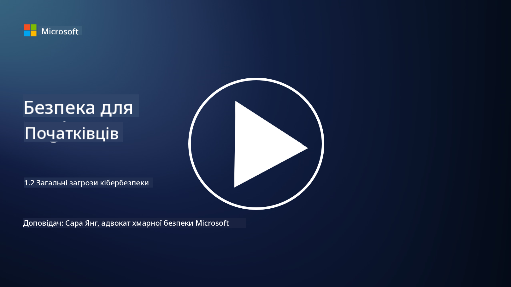

<!--
CO_OP_TRANSLATOR_METADATA:
{
  "original_hash": "6fc3030323139d7134a4ca9d03eccac9",
  "translation_date": "2025-09-03T20:17:08+00:00",
  "source_file": "1.2 Common cybersecurity threats.md",
  "language_code": "uk"
}
-->
# Загальні загрози кібербезпеки

## Вступ

У цьому уроці ми розглянемо:

- Що таке загроза кібербезпеки?

- Чому зловмисники прагнуть скомпрометувати дані та IT-системи?

- Які найпоширеніші типи загроз кібербезпеки?

- Що таке MITRE ATT&CK framework?

- Де можна стежити за актуальними загрозами кібербезпеки?

## Що таке загроза кібербезпеки?

Загроза кібербезпеки — це будь-яка потенційна небезпека або ризик, який може порушити конфіденційність, цілісність або доступність даних чи IT-систем. Такі загрози створюються зловмисниками, які намагаються скористатися вразливостями, щоб отримати несанкціонований доступ, викрасти конфіденційну інформацію, порушити роботу систем або завдати шкоди окремим особам, організаціям чи навіть цілим країнам. Загрози кібербезпеки можуть мати різні форми та бути спрямованими на різні аспекти цифрових систем і даних.

## Чому зловмисники прагнуть скомпрометувати дані та IT-системи?

Зловмисники атакують дані та IT-системи з різних причин, часто керуючись особистою вигодою, ідеологічними мотивами або бажанням спричинити хаос. Розуміння цих мотивів допомагає організаціям та окремим особам краще захищатися від кіберзагроз. Ось деякі поширені причини, чому зловмисники здійснюють кібернапади:

1. **Фінансова вигода**: Багато атак спрямовані на отримання фінансового прибутку. Зловмисники можуть викрадати конфіденційну інформацію, таку як номери кредитних карток, банківські реквізити або особисті дані, щоб здійснювати шахрайство, крадіжку особистості, вимагати викуп або продавати викрадені дані на темному вебі.

2. **Шпигунство**: Держави, конкуренти або інші суб'єкти можуть займатися кібершпигунством, щоб викрадати конфіденційні урядові, корпоративні або дослідницькі дані для політичної, економічної чи військової переваги.

3. **Дестабілізація та саботаж**: Деякі атаки спрямовані на порушення роботи критичної інфраструктури, послуг або операцій з політичних чи ідеологічних причин. Такі атаки можуть спричинити масштабний хаос, фінансові втрати та шкоду репутації.

4. **Ідеологічні мотиви**: Хактивісти та групи з ідеологічними чи політичними мотивами можуть атакувати системи, щоб привернути увагу до певних питань, просувати свої переконання або протестувати проти конкретних дій чи організацій.

5. **Ненавмисні дії**: Не всі зловмисні дії є навмисними; деякі люди можуть несвідомо сприяти кіберзагрозам, ставши жертвами соціальної інженерії або частиною скомпрометованої мережі.

Зрештою, мотиви компрометації даних та IT-систем можуть бути дуже різноманітними, а наслідки таких атак — серйозними. Важливо, щоб окремі особи, організації та уряди серйозно ставилися до кібербезпеки та впроваджували заходи для захисту від цих загроз.

## Які найпоширеніші типи загроз кібербезпеки?

Існує кілька поширених типів кіберзагроз, які зловмисники використовують для компрометації систем, викрадення даних та спричинення порушень. Ось деякі з найпоширеніших типів на момент написання:

1. **Фішинг**:

Фішинг передбачає надсилання оманливих електронних листів або повідомлень, які виглядають як від легітимних джерел, щоб обманом змусити отримувачів розкрити конфіденційну інформацію, таку як паролі, номери кредитних карток або особисті дані. Фішинг також може спрямовувати жертв на шкідливі вебсайти або змушувати завантажувати шкідливе програмне забезпечення.

2. **Шкідливе програмне забезпечення (Malware)**:

Шкідливе програмне забезпечення охоплює широкий спектр програм, створених для зараження систем, викрадення даних або спричинення шкоди. Типи шкідливого ПЗ включають:

- **Вимагальне ПЗ (Ransomware)**: Шифрує файли та вимагає викуп за їх розшифрування.

- **Трояни**: Маскуються під легітимне програмне забезпечення, надаючи зловмисникам несанкціонований доступ.

- **Віруси**: Самовідтворювані програми, які прикріплюються до файлів і поширюються.

- **Черви**: Самовідтворювані програми, які поширюються через мережі.

3. **Атаки типу "відмова в обслуговуванні" (DoS) та розподілені атаки (DDoS)**:

Атаки DoS перевантажують цільову систему, роблячи її недоступною для користувачів. Атаки DDoS використовують мережу скомпрометованих пристроїв для затоплення цілі трафіком, що ускладнює або повністю зупиняє роботу системи.

4. **SQL-ін'єкція**:

У цій атаці зловмисники маніпулюють полями введення вебдодатків, щоб впровадити шкідливі SQL-запити, потенційно отримуючи несанкціонований доступ до баз даних і конфіденційних даних.

5. **Міжсайтовий скриптинг (XSS)**:

Зловмисники впроваджують шкідливі скрипти у вебдодатки, які потім виконуються браузерами нічого не підозрюючих користувачів. Це може призвести до крадіжки даних користувачів або поширення шкідливого ПЗ.

6. **Соціальна інженерія**:

Соціальна інженерія використовує людську психологію для маніпулювання людьми з метою розкриття конфіденційної інформації або виконання дій, які компрометують безпеку.

7. **Експлойти нульового дня (Zero-Day)**:

Ці атаки спрямовані на вразливості в програмному або апаратному забезпеченні, які ще не відомі постачальнику або громадськості. Зловмисники використовують ці вразливості до того, як будуть розроблені патчі. Хоча організації часто хвилюються через нульові дні, вони менш поширені порівняно з іншими атаками у цьому списку. Коли виявляється нульовий день, дослідники безпеки швидко працюють над створенням патча, і тому такі вразливості зазвичай мають короткий термін дії.

8. **Атаки на облікові дані**:

Ці атаки включають грубий перебір паролів, коли зловмисники багаторазово намагаються вгадати паролі, та атаки з використанням викрадених облікових даних, коли викрадені дані з одного сайту використовуються для спроб доступу до інших сайтів.

## Що таке MITRE ATT&CK framework?

[MITRE ATT&CK framework](https://attack.mitre.org/) (Adversarial Tactics, Techniques, and Common Knowledge) — це фреймворк, який каталогізує та класифікує тактики, техніки та процедури (TTPs), які використовують зловмисники під час кібернападів. Фреймворк був створений корпорацією MITRE, некомерційною організацією, яка керує центрами досліджень і розробок для різних урядових агентств.

MITRE ATT&CK framework забезпечує стандартизований спосіб опису та аналізу кіберзагроз, дозволяючи фахівцям з кібербезпеки краще розуміти та захищатися від різних технік атак. Він широко використовується командами безпеки, мисливцями за загрозами та реагувальниками на інциденти для:

1. **Розуміння поведінки зловмисників**: Фреймворк документує реальні сценарії атак, описуючи кроки, які зловмисники здійснюють від початкового проникнення до досягнення своїх цілей. Він охоплює широкий спектр технік атак, які використовують різні групи загроз.

2. **Планування та впровадження стратегій захисту**: Команди безпеки можуть використовувати фреймворк для розробки проактивних стратегій захисту, які відповідають конкретним тактикам і технікам, які можуть застосовувати зловмисники.

3. **Реагування на інциденти та пошук загроз**: Під час розслідування інцидентів або пошуку загроз фахівці з безпеки можуть звертатися до фреймворку, щоб ідентифікувати та нейтралізувати конкретні техніки, які використовують зловмисники.

Фреймворк MITRE ATT&CK організований у матриці, які групують техніки атак залежно від конкретних платформ і середовищ, таких як Windows, macOS, Linux та хмарні сервіси. Кожна матриця поділена на тактики (високорівневі цілі) та техніки (конкретні методи для досягнення цих цілей). Для кожної техніки фреймворк надає інформацію про її роботу, можливі способи захисту та відповідні посилання на реальні групи загроз, які використовували цю техніку.

Фреймворк постійно оновлюється та розширюється у міру отримання нової інформації про загрози та розвитку ландшафту кібербезпеки. Це цінний ресурс для покращення кібербезпеки організації, оскільки він дозволяє глибше зрозуміти, як діють зловмисники та як захищатися від їхніх тактик.

## Де можна стежити за актуальними загрозами кібербезпеки?

Існує багато джерел, які можна використовувати для стеження за кіберзагрозами. Ось кілька з них:

- [Open Web Application Security Project (OWASP) top 10 vulnerabilities](https://owasp.org/Top10/)
- [Common Vulnerabilities and Exposures (CVEs)](https://www.bing.com/ck/a?!&&p=53df6007f017bca2JmltdHM9MTY5MjU3NjAwMCZpZ3VpZD0zYmY4N2RiYS1jYWI1LTYwMDgtMWY1YS02ZmYyY2JjNjYxZWUmaW5zaWQ9NTc2OQ&ptn=3&hsh=3&fclid=3bf87dba-cab5-6008-1f5a-6ff2cbc661ee&psq=cve&u=a1aHR0cHM6Ly9iaW5nLmNvbS9hbGluay9saW5rP3VybD1odHRwcyUzYSUyZiUyZmN2ZS5taXRyZS5vcmclMmYmc291cmNlPXNlcnAtcnImaD1BZXN4S0VBWTNnbGhNZEFpd3daMlNSZkZQNTlrODhIUnYxRUtlSkY1RTk0JTNkJnA9a2NvZmZjaWFsd2Vic2l0ZQ&ntb=1 "Common Vulnerabilities and Exposures")
- [Microsoft Security Response Center blogs](https://msrc.microsoft.com/blog/)
- [Національний інститут стандартів і технологій (NIST)](https://www.dhs.gov/topics/cybersecurity): NIST надає ресурси, сповіщення та останні оновлення про потенційні загрози кібербезпеки.
- [Агентство кібербезпеки та інфраструктурної безпеки (CISA)](https://www.cisa.gov/resources-tools/resources/free-cybersecurity-services-and-tools): CISA надає ресурси кібербезпеки та найкращі практики для бізнесу, урядових агентств та інших організацій. CISA ділиться актуальною інформацією про високоефективні типи активності безпеки, що впливають на спільноту, а також детальним аналізом нових і розвиваючих кіберзагроз.
- [Національний центр кібербезпеки (NCCoE)](https://www.dhs.gov/topics/cybersecurity): NCCoE є центром, який надає практичні рішення кібербезпеки, які можна застосувати в реальних ситуаціях.
- [US-CERT](https://www.cisa.gov/resources-tools/resources/free-cybersecurity-services-and-tools): Комп'ютерна команда готовності до надзвичайних ситуацій США (US-CERT) надає різноманітні ресурси кібербезпеки, включаючи сповіщення, поради тощо.
- CERT вашої країни.

---

**Відмова від відповідальності**:  
Цей документ був перекладений за допомогою сервісу автоматичного перекладу [Co-op Translator](https://github.com/Azure/co-op-translator). Хоча ми прагнемо до точності, будь ласка, майте на увазі, що автоматичні переклади можуть містити помилки або неточності. Оригінальний документ на його рідній мові слід вважати авторитетним джерелом. Для критичної інформації рекомендується професійний людський переклад. Ми не несемо відповідальності за будь-які непорозуміння або неправильні тлумачення, що виникають внаслідок використання цього перекладу.