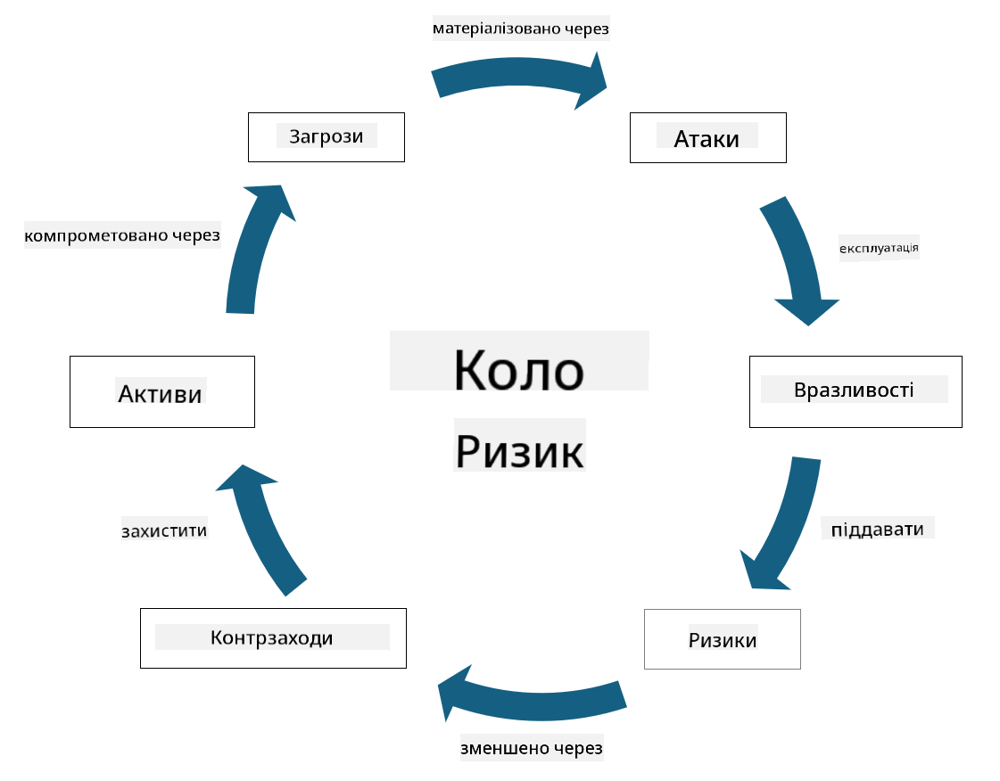

<!--
CO_OP_TRANSLATOR_METADATA:
{
  "original_hash": "fcca304f072cabf206388199e8e2e578",
  "translation_date": "2025-09-03T21:58:17+00:00",
  "source_file": "1.3 Understanding risk management.md",
  "language_code": "uk"
}
-->
# Розуміння управління ризиками

## Вступ

У цьому уроці ми розглянемо:

- Визначення загальновживаної термінології безпеки

- Типи заходів безпеки

- Оцінка ризиків безпеки

## Визначення загальновживаної термінології безпеки

Ці терміни є основними поняттями у сфері кібербезпеки та управління ризиками. Давайте розглянемо кожен термін і як вони взаємопов’язані:

1. **Агент загрози**:

Агент загрози — це особа, група, організація або автоматизована система, яка має потенціал використати вразливості системи чи мережі для завдання шкоди або пошкодження. Агентами загрози можуть бути хакери, автори шкідливого програмного забезпечення, незадоволені співробітники або будь-яка сутність, яка становить ризик для інформаційних і технологічних систем.

2. **Загроза**:

Загроза — це потенційна подія або дія, яка може використати вразливості системи та завдати шкоди активу. Загрози можуть включати такі дії, як хакерські атаки, витоки даних, атаки типу "відмова в обслуговуванні" тощо. Загрози — це "що саме" може завдати шкоди активам організації.

3. **Вразливість**:

Вразливість — це слабкість або недолік у дизайні, реалізації чи конфігурації системи, який може бути використаний агентом загрози для компрометації безпеки системи. Вразливості можуть існувати в програмному забезпеченні, апаратному забезпеченні, процесах або поведінці людей. Виявлення та усунення вразливостей є важливим для мінімізації ризику успішних атак.

4. **Ризик**:

Ризик — це потенційна втрата, шкода або пошкодження, що виникає внаслідок взаємодії між загрозою та вразливістю. Це ймовірність того, що агент загрози використає вразливість для завдання негативного впливу. Ризики часто оцінюються з точки зору їх потенційного впливу та ймовірності виникнення.

5. **Актив**:

Актив — це будь-що цінне, що організація прагне захистити. Активи можуть включати фізичні об’єкти (наприклад, комп’ютери та сервери), дані (інформація про клієнтів, фінансові записи), інтелектуальну власність (торгові секрети, патенти) і навіть людські ресурси (навички та знання співробітників). Захист активів є ключовою метою кібербезпеки.

6. **Експозиція**:

Експозиція означає стан вразливості до потенційних загроз. Вона виникає, коли існує вразливість, яка може бути використана агентом загрози. Експозиція підкреслює ризик, пов’язаний із наявністю вразливостей у системі чи мережі.

7. **Контроль**:

Контроль — це захід, впроваджений для зменшення ризику, пов’язаного з вразливостями та загрозами. Контролі можуть бути технічними, процедурними або адміністративними. Вони призначені для запобігання, виявлення або пом’якшення потенційних загроз і вразливостей. Приклади включають брандмауери, контроль доступу, шифрування, політики безпеки та навчання співробітників.

Щоб підсумувати взаємозв’язок між цими термінами: агенти загрози використовують вразливості для реалізації загроз, які можуть призвести до ризиків, що мають потенціал завдати шкоди цінним активам. Експозиція виникає, коли вразливості присутні, а контролі впроваджуються для зменшення ризику шляхом запобігання або пом’якшення впливу загроз на активи. Ця структура є основою управління ризиками кібербезпеки, допомагаючи організаціям ідентифікувати, оцінювати та вирішувати потенційні ризики для їхніх інформаційних систем і активів.

## Типи заходів безпеки

Заходи безпеки — це заходи або засоби, впроваджені для захисту інформаційних систем і активів від різних загроз і вразливостей. Їх можна класифікувати за кількома категоріями залежно від їхнього фокусу та мети. Ось деякі поширені типи заходів безпеки:

1. **Адміністративні заходи**:

Ці заходи стосуються політик, процедур і рекомендацій, які регулюють практики безпеки організації та поведінку користувачів.

- Політики та процедури безпеки: Документовані рекомендації, які визначають, як підтримується безпека в організації.

- Підвищення обізнаності та навчання: Програми для навчання співробітників найкращим практикам безпеки та потенційним загрозам.

- Реагування на інциденти та управління: Плани реагування на інциденти безпеки та їх пом’якшення.

2. **Технічні заходи**:

Технічні заходи включають використання технологій для забезпечення заходів безпеки та захисту систем і даних. Приклади технічних заходів:

- Контроль доступу: Заходи, які обмежують доступ користувачів до ресурсів залежно від їхніх ролей і дозволів.

- Шифрування: Перетворення даних у захищений формат для запобігання несанкціонованому доступу.

- Брандмауери: Пристрої мережевої безпеки, які фільтрують і контролюють вхідний та вихідний трафік.

- Системи виявлення та запобігання вторгнень (IDPS): Інструменти, які моніторять мережевий трафік на предмет підозрілої активності.

- Антивірусне та антималварне програмне забезпечення: Програми, які виявляють і видаляють шкідливе програмне забезпечення.

- Механізми автентифікації: Методи перевірки особи користувачів, такі як паролі, біометрія та багатофакторна автентифікація.

- Управління патчами: Регулярне оновлення програмного забезпечення для усунення відомих вразливостей.

3. **Фізичні заходи**:

Фізичні заходи — це заходи для захисту фізичних активів і приміщень.

- Охоронці та персонал контролю доступу: Персонал, який моніторить і контролює доступ до фізичних приміщень.

- Камери спостереження: Системи відеомоніторингу для спостереження та запису активності.

- Замки та фізичні бар’єри: Фізичні заходи для обмеження доступу до чутливих зон.

- Контроль навколишнього середовища: Заходи для регулювання температури, вологості та інших факторів, які впливають на обладнання та центри обробки даних.

4. **Операційні заходи**:

Ці заходи стосуються щоденних операцій і діяльності, які забезпечують постійну безпеку систем.

- Управління змінами: Процеси для відстеження та затвердження змін у системах і конфігураціях.

- Резервне копіювання та відновлення після аварій: Плани резервного копіювання даних і їх відновлення у разі збоїв системи або катастроф.

- Логування та аудит: Моніторинг і запис активності системи для забезпечення безпеки та відповідності.

- Практики безпечного кодування: Рекомендації для написання програмного забезпечення з мінімізацією вразливостей.

5. **Юридичні та регуляторні заходи**:

Ці заходи забезпечують відповідність чинним законам, регуляціям і галузевим стандартам. Стандарти, яким організація повинна відповідати, залежать від юрисдикції, галузі та інших факторів.

- Регуляції захисту даних: Відповідність законам, таким як GDPR, HIPAA і CCPA.

- Галузеві стандарти: Дотримання стандартів, таких як PCI DSS для безпеки даних платіжних карток.

Ці категорії заходів безпеки працюють разом, щоб створити комплексну систему безпеки для організацій, допомагаючи захистити їхні системи, дані та активи від широкого спектра загроз.

## Оцінка ризиків безпеки

Деякі фахівці з безпеки вважають, що управління ризиками — це завдання виключно для спеціалістів з ризиків, але розуміння процесу управління ризиками безпеки важливе для будь-якого фахівця з безпеки, щоб висловлювати ризики безпеки мовою, яку решта організації може зрозуміти та діяти відповідно.

Організації повинні постійно оцінювати ризики безпеки та вирішувати, які дії (або їх відсутність) слід вжити щодо ризиків для бізнесу. Нижче наведено огляд того, як це зазвичай робиться. Зазначимо, що цей процес зазвичай здійснюється кількома різними командами в межах організації, рідко одна команда відповідає за управління ризиками від початку до кінця.

1. **Ідентифікація активів і загроз**:

Організація визначає активи, які вона хоче захистити. Це можуть бути дані, системи, апаратне забезпечення, програмне забезпечення, інтелектуальна власність тощо. Далі вони визначають потенційні загрози, які можуть націлюватися на ці активи.

2. **Оцінка вразливостей**:

Організації визначають вразливості або слабкі місця в системах чи процесах, які можуть бути використані загрозами. Ці вразливості можуть виникати через недоліки програмного забезпечення, неправильні конфігурації, відсутність заходів безпеки та людські помилки.

3. **Оцінка ймовірності**:

Організація оцінює ймовірність кожної загрози. Це включає врахування історичних даних, розвідки загроз, галузевих тенденцій та внутрішніх факторів. Ймовірність може бути класифікована як низька, середня або висока залежно від ймовірності реалізації загрози.

4. **Оцінка впливу**:

Далі організація визначає потенційний вплив кожної загрози, якщо вона використає вразливість. Вплив може включати фінансові втрати, операційні збої, репутаційні збитки, юридичні наслідки тощо. Вплив також може бути класифікований як низький, середній або високий залежно від потенційних наслідків.

5. **Розрахунок ризику**:

Оцінки ймовірності та впливу комбінуються для розрахунку загального рівня ризику для кожної визначеної загрози. Це часто робиться за допомогою матриці ризиків, яка присвоює числові значення або якісні характеристики рівням ймовірності та впливу. Отриманий рівень ризику допомагає визначити пріоритетність ризиків, які потребують негайної уваги.

6. **Пріоритизація та прийняття рішень**:

Організація визначає пріоритетність ризиків, зосереджуючись на тих, які мають найвищі значення ймовірності та впливу. Це дозволяє ефективніше розподіляти ресурси та впроваджувати заходи безпеки. Загрози високого ризику потребують негайної уваги, тоді як загрози низького ризику можуть бути вирішені протягом тривалішого періоду.

7. **Обробка ризику**:

На основі оцінки ризику організація визначає, як пом’якшити або управляти кожним ризиком. Це може включати впровадження заходів безпеки, передачу ризику через страхування або навіть прийняття певного рівня залишкового ризику, якщо він вважається керованим/надто дорогим для усунення тощо.

8. **Безперервний моніторинг і перегляд**:

Оцінка ризику — це не одноразовий процес. Її слід проводити періодично або щоразу, коли відбуваються значні зміни в середовищі організації. Безперервний моніторинг забезпечує врахування нових загроз, вразливостей або змін у бізнес-ландшафті.

Оцінюючи ризики безпеки таким структурованим чином, організації можуть приймати обґрунтовані рішення щодо розподілу ресурсів, заходів безпеки та загальних стратегій управління ризиками. Мета полягає в тому, щоб зменшити загальну експозицію організації до ризиків, водночас узгоджуючи зусилля з безпеки з бізнес-цілями та завданнями організації.

---

**Відмова від відповідальності**:  
Цей документ був перекладений за допомогою сервісу автоматичного перекладу [Co-op Translator](https://github.com/Azure/co-op-translator). Хоча ми прагнемо до точності, будь ласка, майте на увазі, що автоматичні переклади можуть містити помилки або неточності. Оригінальний документ на його рідній мові слід вважати авторитетним джерелом. Для критичної інформації рекомендується професійний людський переклад. Ми не несемо відповідальності за будь-які непорозуміння або неправильні тлумачення, що виникають внаслідок використання цього перекладу.