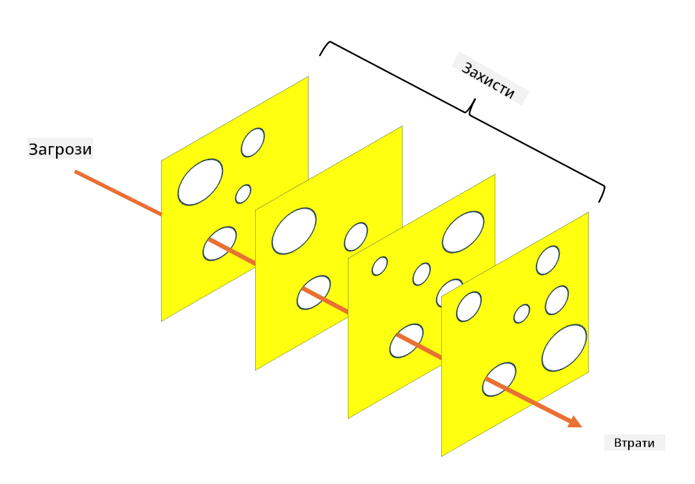

<!--
CO_OP_TRANSLATOR_METADATA:
{
  "original_hash": "75f77f972d2233c584f87c1eb96c983b",
  "translation_date": "2025-09-03T20:34:04+00:00",
  "source_file": "1.5 Zero trust.md",
  "language_code": "uk"
}
-->
# Нульова довіра

«Нульова довіра» — це термін, який зараз часто використовується в колах кібербезпеки. Але що він означає? Чи це просто модне слово? У цьому уроці ми детально розглянемо, що таке нульова довіра.

## Вступ

 - У цьому уроці ми розглянемо:
   
   
 - Що таке нульова довіра?

   
  

 - Чим нульова довіра відрізняється від традиційних архітектур безпеки?

   
   

 - Що таке багаторівневий захист?

## Нульова довіра

Нульова довіра — це підхід до кібербезпеки, який кидає виклик традиційному принципу «довіряй, але перевіряй», припускаючи, що жодна сутність, незалежно від того, знаходиться вона всередині чи поза мережею організації, не повинна бути автоматично довіреною. Натомість нульова довіра передбачає перевірку кожного користувача, пристрою та застосунку, які намагаються отримати доступ до ресурсів, незалежно від їхнього місцезнаходження. Основний принцип нульової довіри — мінімізувати «поверхню атаки» та зменшити потенційний вплив порушень безпеки.

У моделі нульової довіри акцент робиться на таких принципах:

1. **Перевірка ідентичності**: Аутентифікація та авторизація суворо застосовуються до всіх користувачів і пристроїв, незалежно від їхнього місцезнаходження. Пам’ятайте, що ідентичність — це не обов’язково людина: це може бути пристрій, застосунок тощо.

2. **Мінімальні привілеї**: Користувачам і пристроям надається мінімальний рівень доступу, необхідний для виконання їхніх завдань, що зменшує потенційні збитки у разі компрометації.

3. **Мікросегментація**: Ресурси мережі розділяються на менші сегменти, щоб обмежити бічний рух у мережі у разі порушення.

4. **Безперервний моніторинг**: Постійний моніторинг і аналіз поведінки користувачів і пристроїв проводяться для виявлення аномалій і потенційних загроз. Сучасні методи моніторингу також використовують машинне навчання, штучний інтелект і розвідку загроз для надання додаткових деталей і контексту.

5. **Шифрування даних**: Дані шифруються як під час передачі, так і в стані спокою, щоб запобігти несанкціонованому доступу.

6. **Суворий контроль доступу**: Контроль доступу здійснюється на основі контексту, такого як ролі користувачів, стан пристроїв і місцезнаходження в мережі.

Microsoft розділяє нульову довіру на п’ять основних стовпів, які ми обговоримо в наступному уроці.

## Відмінності від традиційних архітектур безпеки

Нульова довіра відрізняється від традиційних архітектур безпеки, таких як моделі, засновані на периметрі, у кількох аспектах:

1. **Периметр проти ідентифікаційного центру**: Традиційні моделі зосереджуються на захисті периметра мережі та припускають, що внутрішнім користувачам і пристроям можна довіряти після входу. Нульова довіра, навпаки, припускає, що загрози можуть виникати як всередині, так і поза мережею, і застосовує суворий контроль на основі ідентичності.

2. **Імпліцитна проти експліцитної довіри**: Традиційні моделі автоматично довіряють пристроям і користувачам у мережі, поки не буде доведено протилежне. Нульова довіра явно перевіряє ідентичності та постійно моніторить аномалії.

3. **Плоска проти сегментованої мережі**: Традиційні архітектури часто включають плоскі мережі, де внутрішні користувачі мають широкий доступ. Нульова довіра пропонує сегментувати мережу на менші, ізольовані зони для стримування потенційних порушень.

4. **Реактивний проти проактивного підходу**: Традиційна безпека часто покладається на реактивні заходи, такі як периметрові брандмауери та системи виявлення вторгнень. Нульова довіра застосовує проактивний підхід, припускаючи, що порушення ймовірні, і мінімізуючи їхній вплив.

## Багаторівневий захист

Багаторівневий захист, також відомий як багатошарова безпека, — це стратегія кібербезпеки, яка передбачає впровадження кількох рівнів контролю та заходів безпеки для захисту активів організації. Мета полягає в створенні перекриваючих шарів захисту, щоб у разі порушення одного шару інші могли забезпечити захист. Кожен шар зосереджується на різних аспектах безпеки та підвищує загальний рівень безпеки організації.

Багаторівневий захист включає комбінацію технічних, процедурних і фізичних заходів безпеки. Це можуть бути брандмауери, системи виявлення вторгнень, контроль доступу, шифрування, навчання користувачів, політики безпеки тощо. Ідея полягає в створенні кількох бар’єрів, які разом ускладнюють проникнення в системи та мережі організації. Це також іноді називають «моделлю швейцарського сиру», яка використовується для запобігання аваріям в інших галузях (наприклад, транспорт).

## Додаткове читання

[Що таке нульова довіра?](https://learn.microsoft.com/security/zero-trust/zero-trust-overview?WT.mc_id=academic-96948-sayoung)

[Розвиток нульової довіри – позиційний документ Microsoft](https://query.prod.cms.rt.microsoft.com/cms/api/am/binary/RWJJdT?WT.mc_id=academic-96948-sayoung)

[Нульова довіра та BeyondCorp Google Cloud | Блог Google Cloud](https://cloud.google.com/blog/topics/developers-practitioners/zero-trust-and-beyondcorp-google-cloud)

---

**Відмова від відповідальності**:  
Цей документ був перекладений за допомогою сервісу автоматичного перекладу [Co-op Translator](https://github.com/Azure/co-op-translator). Хоча ми прагнемо до точності, будь ласка, майте на увазі, що автоматичні переклади можуть містити помилки або неточності. Оригінальний документ на його рідній мові слід вважати авторитетним джерелом. Для критичної інформації рекомендується професійний людський переклад. Ми не несемо відповідальності за будь-які непорозуміння або неправильні тлумачення, що виникають внаслідок використання цього перекладу.