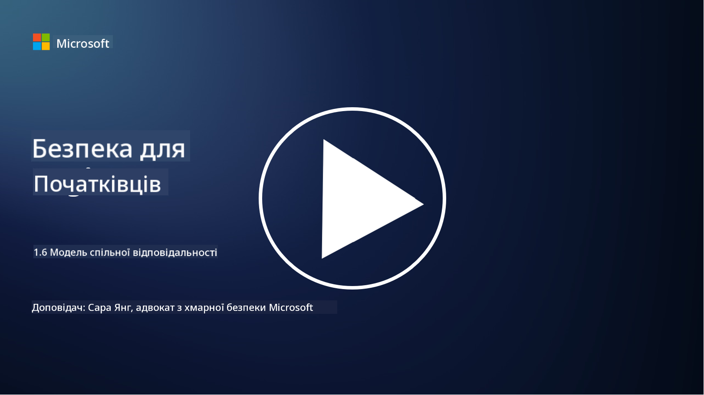

<!--
CO_OP_TRANSLATOR_METADATA:
{
  "original_hash": "a48db640d80c786b928ca178c414f084",
  "translation_date": "2025-09-03T21:07:09+00:00",
  "source_file": "1.6 Shared responsibility model.md",
  "language_code": "uk"
}
-->
# Модель спільної відповідальності

Спільна відповідальність — це нова концепція в ІТ, яка виникла з появою хмарних обчислень. З точки зору кібербезпеки, важливо розуміти, хто забезпечує які засоби захисту, щоб уникнути прогалин у обороні.

## Вступ

У цьому уроці ми розглянемо:

- Що таке спільна відповідальність у контексті кібербезпеки?

- У чому полягає різниця в спільній відповідальності за засоби захисту між IaaS, PaaS і SaaS?

- Де можна дізнатися, які засоби захисту надає ваша хмарна платформа?

- Що означає "довіряй, але перевіряй"?

## Що таке спільна відповідальність у контексті кібербезпеки?

Спільна відповідальність у кібербезпеці стосується розподілу обов’язків щодо захисту між постачальником хмарних послуг (CSP) і його клієнтами. У середовищах хмарних обчислень, таких як Інфраструктура як Послуга (IaaS), Платформа як Послуга (PaaS) і Програмне забезпечення як Послуга (SaaS), як CSP, так і клієнт відіграють роль у забезпеченні безпеки даних, додатків і систем.

## У чому полягає різниця в спільній відповідальності за засоби захисту між IaaS, PaaS і SaaS?

Розподіл обов’язків зазвичай залежить від типу хмарної послуги, яка використовується:

- **IaaS (Інфраструктура як Послуга)**: CSP надає базову інфраструктуру (сервери, мережі, сховище), тоді як клієнт відповідає за управління операційними системами, додатками та конфігураціями безпеки на цій інфраструктурі.

- **PaaS (Платформа як Послуга):** CSP пропонує платформу, на якій клієнти можуть створювати та розгортати додатки. CSP управляє базовою інфраструктурою, а клієнт зосереджується на розробці додатків і захисті даних.

- **SaaS (Програмне забезпечення як Послуга):** CSP надає повністю функціональні додатки, доступні через інтернет. У цьому випадку CSP відповідає за безпеку додатків і інфраструктури, а клієнт управляє доступом користувачів і використанням даних.

Розуміння спільної відповідальності є важливим, оскільки воно уточнює, які аспекти безпеки покриває CSP, а які має забезпечити клієнт. Це допомагає уникнути непорозумінь і гарантує, що заходи безпеки реалізуються комплексно.

## Де можна дізнатися, які засоби захисту надає ваша хмарна платформа?

Щоб дізнатися, які засоби захисту надає ваша хмарна платформа, потрібно звернутися до документації та ресурсів постачальника хмарних послуг. Це включає:

- **Вебсайт і документація CSP**: на вебсайті CSP буде інформація про функції безпеки та засоби захисту, які пропонуються в рамках їхніх послуг. CSP зазвичай надають детальну документацію, яка пояснює їхні практики безпеки, засоби захисту та рекомендації. Це може включати технічні документи, посібники з безпеки та білі книги.

- **Оцінки та аудити безпеки**: більшість CSP проходять оцінку своїх засобів захисту незалежними експертами та організаціями. Ці огляди можуть надати уявлення про якість заходів безпеки CSP. Іноді це призводить до отримання сертифікатів відповідності безпеки (див. наступний пункт).

- **Сертифікати відповідності безпеки**: більшість CSP отримують сертифікати, такі як ISO:27001, SOC 2, FedRAMP тощо. Ці сертифікати демонструють, що постачальник відповідає певним стандартам безпеки та відповідності.

Пам’ятайте, що рівень деталізації та доступність інформації можуть варіюватися між хмарними постачальниками. Завжди переконуйтеся, що ви консультуєтеся з офіційними та актуальними ресурсами, наданими постачальником хмарних послуг, щоб приймати обґрунтовані рішення щодо безпеки ваших активів у хмарі.

## Що означає "довіряй, але перевіряй"?

У контексті використання CSP, стороннього програмного забезпечення або іншої ІТ-послуги безпеки організація може спочатку довіряти заявам постачальника про заходи безпеки. Однак, щоб дійсно забезпечити безпеку своїх даних і систем, вона повинна перевірити ці заяви через оцінки безпеки, тестування на проникнення та огляд засобів захисту сторонньої сторони перед повною інтеграцією програмного забезпечення або послуги в свої операції. Усі особи та організації повинні прагнути довіряти, але перевіряти засоби захисту, за які вони не несуть відповідальності.

## Спільна відповідальність у межах організації

Пам’ятайте, що спільна відповідальність за безпеку в межах організації між різними командами також має враховуватися. Команда безпеки рідко реалізує всі засоби захисту самостійно і повинна співпрацювати з операційними командами, розробниками та іншими частинами бізнесу, щоб впровадити всі необхідні заходи безпеки для захисту організації.

## Додаткові матеріали
- [Спільна відповідальність у хмарі - Microsoft Azure | Microsoft Learn](https://learn.microsoft.com/azure/security/fundamentals/shared-responsibility?WT.mc_id=academic-96948-sayoung)
- [Що таке модель спільної відповідальності? – Визначення від TechTarget.com](https://www.techtarget.com/searchcloudcomputing/definition/shared-responsibility-model)
- [Модель спільної відповідальності пояснена та її значення для хмарної безпеки | CSO Online](https://www.csoonline.com/article/570779/the-shared-responsibility-model-explained-and-what-it-means-for-cloud-security.html)
- [Спільна відповідальність за хмарну безпеку: що потрібно знати (cisecurity.org)](https://www.cisecurity.org/insights/blog/shared-responsibility-cloud-security-what-you-need-to-know)

---

**Відмова від відповідальності**:  
Цей документ був перекладений за допомогою сервісу автоматичного перекладу [Co-op Translator](https://github.com/Azure/co-op-translator). Хоча ми прагнемо до точності, будь ласка, майте на увазі, що автоматичні переклади можуть містити помилки або неточності. Оригінальний документ на його рідній мові слід вважати авторитетним джерелом. Для критичної інформації рекомендується професійний людський переклад. Ми не несемо відповідальності за будь-які непорозуміння або неправильні тлумачення, що виникають внаслідок використання цього перекладу.