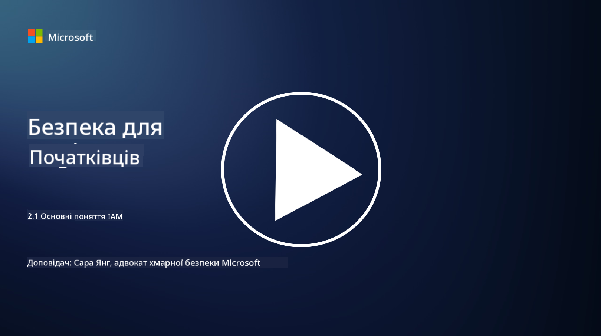

<!--
CO_OP_TRANSLATOR_METADATA:
{
  "original_hash": "2e3864e3d579f0dbb4ac2ec8c5f82acf",
  "translation_date": "2025-09-03T19:39:10+00:00",
  "source_file": "2.1 IAM key concepts.md",
  "language_code": "uk"
}
-->
# Основні поняття IAM

Чи доводилося вам коли-небудь входити в комп’ютер або на вебсайт? Звісно, так! Це означає, що ви вже використовували засоби контролю ідентичності у своєму повсякденному житті. Управління ідентичністю та доступом (IAM) є ключовим елементом безпеки, і ми дізнаємося більше про це в наступних уроках.

**Вступ**

У цьому уроці ми розглянемо:

- Що ми маємо на увазі під управлінням ідентичністю та доступом (IAM) у контексті кібербезпеки?

- Що таке принцип найменших привілеїв?

- Що таке розподіл обов’язків?

- Що таке автентифікація та авторизація?

## Що ми маємо на увазі під управлінням ідентичністю та доступом (IAM) у контексті кібербезпеки?

Управління ідентичністю та доступом (IAM) — це набір процесів, технологій і політик, які впроваджуються для забезпечення того, щоб правильні особи мали відповідний доступ до ресурсів у цифровому середовищі організації. IAM включає управління цифровими ідентичностями (користувачами, співробітниками, партнерами) та їх доступом до систем, додатків, даних і мереж. Основна мета IAM — підвищити безпеку, спростити доступ користувачів і забезпечити відповідність політикам та регуляціям організації. Рішення IAM зазвичай охоплюють автентифікацію користувачів, авторизацію, створення ідентичностей, контроль доступу та управління життєвим циклом користувачів (забезпечення видалення облікових записів, коли вони більше не використовуються).

## Що таке принцип найменших привілеїв?

Принцип найменших привілеїв — це фундаментальна концепція, яка передбачає надання користувачам і системам лише мінімальних привілеїв, необхідних для виконання їхніх завдань або ролей. Цей принцип допомагає обмежити потенційні збитки у разі порушення безпеки або внутрішньої загрози. Дотримуючись принципу найменших привілеїв, організації зменшують поверхню атаки та мінімізують ризик несанкціонованого доступу, витоку даних і випадкового зловживання привілеями. На практиці це означає, що користувачам надається доступ лише до конкретних ресурсів і функцій, необхідних для виконання їхніх робочих завдань, і не більше. Наприклад, якщо вам потрібно лише прочитати документ, було б надмірним надавати вам повні адміністративні привілеї до цього документа.

## Що таке розподіл обов’язків?

Розподіл обов’язків — це принцип, спрямований на запобігання конфліктам інтересів і зменшення ризику шахрайства та помилок шляхом розподілу критичних завдань і відповідальностей між різними особами в організації. У контексті кібербезпеки розподіл обов’язків передбачає забезпечення того, щоб жодна окрема особа не мала контролю над усіма аспектами критичного процесу або системи. Мета полягає у створенні системи перевірок і балансів, яка запобігає можливості однієї людини виконувати як етап налаштування, так і етап затвердження процесу. Наприклад, у фінансових системах це може означати, що особа, яка вводить транзакції в систему, не повинна бути тією самою особою, яка їх затверджує. Це зменшує ризик несанкціонованих або шахрайських дій, які можуть залишитися непоміченими.

## Що таке автентифікація та авторизація?

Автентифікація та авторизація — це два фундаментальні поняття в кібербезпеці, які відіграють важливу роль у забезпеченні безпеки та цілісності комп’ютерних систем і даних. Вони часто використовуються разом для контролю доступу до ресурсів і захисту конфіденційної інформації.

**1. Автентифікація**: Автентифікація — це процес перевірки особи користувача, системи або суб’єкта, який намагається отримати доступ до комп’ютерної системи або конкретного ресурсу. Вона забезпечує, що заявлена особа є справжньою та достовірною. Методи автентифікації зазвичай включають використання одного або кількох із наступних факторів:

   a. Щось, що ви знаєте: Це включає паролі, PIN-коди або інші секретні знання, які має лише авторизований користувач.

   b. Щось, що ви маєте: Це передбачає фізичні токени або пристрої, такі як смарт-карти, токени безпеки або мобільні телефони, які використовуються для підтвердження особи користувача.

   c. Щось, чим ви є: Це стосується біометричних факторів, таких як відбитки пальців, розпізнавання обличчя або сканування сітківки, які є унікальними для кожної особи.

Механізми автентифікації використовуються для підтвердження того, що користувач є тим, за кого себе видає, перед наданням доступу до системи або ресурсу. Це допомагає запобігти несанкціонованому доступу та забезпечує, що лише легітимні користувачі можуть виконувати дії в системі.

**2. Авторизація**: Авторизація — це процес надання або відмови в конкретних дозволах і привілеях для автентифікованих користувачів або суб’єктів після перевірки їхньої особи. Вона визначає, які дії або операції користувач може виконувати в системі або з конкретними ресурсами. Авторизація часто базується на заздалегідь визначених політиках, правилах контролю доступу та ролях, призначених користувачам.

Авторизацію можна уявити як відповідь на запитання: "Що може робити автентифікований користувач?" Вона передбачає визначення та впровадження політик контролю доступу для захисту конфіденційних даних і ресурсів від несанкціонованого доступу або модифікації.

**Підсумок:**

- Автентифікація встановлює особу користувачів або суб’єктів.
- Авторизація визначає, які дії та ресурси автентифіковані користувачі можуть отримати або змінити.

## Додаткові матеріали

- [Опис концепцій ідентичності - Навчання | Microsoft Learn](https://learn.microsoft.com/training/modules/describe-identity-principles-concepts/?WT.mc_id=academic-96948-sayoung)
- [Вступ до ідентичності - Microsoft Entra | Microsoft Learn](https://learn.microsoft.com/azure/active-directory/fundamentals/identity-fundamental-concepts?WT.mc_id=academic-96948-sayoung)
- [Що таке управління ідентичністю та доступом (IAM)? | Microsoft Security](https://www.microsoft.com/security/business/security-101/what-is-identity-access-management-iam?WT.mc_id=academic-96948-sayoung)
- [Що таке IAM? Пояснення управління ідентичністю та доступом | CSO Online](https://www.csoonline.com/article/518296/what-is-iam-identity-and-access-management-explained.html)
- [Що таке IAM? (auth0.com)](https://auth0.com/blog/what-is-iam/)
- [Security+: впровадження контролю управління ідентичністю та доступом (IAM) [оновлено 2021] | Infosec (infosecinstitute.com)](https://resources.infosecinstitute.com/certifications/securityplus/security-implementing-identity-and-access-management-iam-controls/)
- [найменші привілеї - Глосарій | CSRC (nist.gov)](https://csrc.nist.gov/glossary/term/least_privilege)
- [Безпека: принцип найменших привілеїв (POLP) - Microsoft Community Hub](https://techcommunity.microsoft.com/t5/azure-sql-blog/security-the-principle-of-least-privilege-polp/ba-p/2067390?WT.mc_id=academic-96948-sayoung)
- [Принцип найменших привілеїв | CERT NZ](https://www.cert.govt.nz/it-specialists/critical-controls/principle-of-least-privilege/)
- [Чому розподіл обов’язків потрібен за NIST 800-171 та CMMC? - (totem.tech)](https://www.totem.tech/cmmc-separation-of-duties/)

---

**Відмова від відповідальності**:  
Цей документ було перекладено за допомогою сервісу автоматичного перекладу [Co-op Translator](https://github.com/Azure/co-op-translator). Хоча ми прагнемо до точності, зверніть увагу, що автоматичні переклади можуть містити помилки або неточності. Оригінальний документ мовою оригіналу слід вважати авторитетним джерелом. Для критично важливої інформації рекомендується професійний людський переклад. Ми не несемо відповідальності за будь-які непорозуміння або неправильні тлумачення, що виникли внаслідок використання цього перекладу.