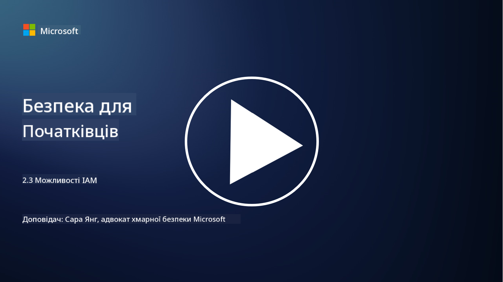

<!--
CO_OP_TRANSLATOR_METADATA:
{
  "original_hash": "bf0b8a54f2c69951744df5a94bc923f7",
  "translation_date": "2025-09-03T22:12:50+00:00",
  "source_file": "2.3 IAM capabilities.md",
  "language_code": "uk"
}
-->
# Можливості IAM

У цьому розділі ми розглянемо детальніше основні інструменти та можливості, які використовуються для забезпечення безпеки ідентичності.

## Вступ

У цьому уроці ми розглянемо:

 - Що таке служба каталогів?
      
     
    
 - Які можливості можна використовувати для захисту ідентичностей?
>
>        Багатофакторна автентифікація (MFA)
> 
>        Єдиний вхід (SSO)
> 
>        Контроль доступу на основі ролей (RBAC)
> 
>        Адаптивна автентифікація
> 
>        Біометрична автентифікація
> 
>        Управління привілейованим доступом (PAM)
> 
>        Управління ідентичностями та адміністрування (IGA)
> 
>        Поведінковий аналіз

## Що таке служба каталогів?

Служба каталогів — це спеціалізована база даних, яка зберігає та управляє інформацією про мережеві ресурси, включаючи користувачів, групи, пристрої, додатки та інші об'єкти. Вона слугує централізованим сховищем даних, пов'язаних з ідентичністю та доступом, дозволяючи організаціям ефективно управляти автентифікацією користувачів, авторизацією та іншими завданнями, пов'язаними з безпекою.

Служби каталогів відіграють ключову роль у сучасних ІТ-середовищах, забезпечуючи основу для рішень з управління ідентичностями та доступом (IAM). Вони сприяють безпечному доступу до ресурсів, впроваджують політики доступу та спрощують адміністративні завдання. Однією з найвідоміших служб каталогів є Microsoft Active Directory, але існують й інші рішення, такі як LDAP (Lightweight Directory Access Protocol), які виконують схожі функції.

Основні функції та особливості служби каталогів у контексті кібербезпеки включають:

 - **Автентифікація користувачів**: Служби каталогів перевіряють облікові дані користувачів (наприклад, імена користувачів і паролі), щоб забезпечити доступ лише авторизованим користувачам.
 - **Авторизація користувачів**: Вони визначають рівень доступу кожного користувача на основі його ролі, членства в групах та інших атрибутів. Це гарантує, що користувачі мають доступ лише до тих ресурсів, на які вони мають право.
 - **Управління групами**: Служби каталогів дозволяють адміністраторам організовувати користувачів у логічні групи, спрощуючи управління доступом. Дозволи можуть бути призначені групам, а не окремим користувачам.
 - **Політики паролів**: Вони впроваджують правила складності та терміну дії паролів, підвищуючи безпеку облікових записів користувачів.
 - **Єдиний вхід (SSO)**: Деякі служби каталогів підтримують SSO, дозволяючи користувачам отримувати доступ до кількох додатків і сервісів за допомогою одного набору облікових даних.
 - **Централізоване управління користувачами**: Служби каталогів централізують інформацію про користувачів, спрощуючи управління обліковими записами, профілями та атрибутами з одного місця.
 - **Аудит і логування**: Вони можуть записувати дії автентифікації та доступу користувачів, допомагаючи у проведенні аудитів безпеки та забезпеченні відповідності вимогам.

## Які можливості можна використовувати для захисту ідентичностей?

**Багатофакторна автентифікація (MFA)**

MFA вимагає від користувачів надання кількох форм перевірки перед наданням доступу. Зазвичай це включає те, що користувач знає (пароль), те, що він має (смартфон або токен безпеки), і те, ким він є (біометричні дані, такі як відбиток пальця або розпізнавання обличчя).

**Єдиний вхід (SSO)**

SSO дозволяє користувачам отримувати доступ до кількох додатків і систем за допомогою одного набору облікових даних. Це покращує досвід користувача та знижує ризики, пов'язані з управлінням кількома паролями.

**Контроль доступу на основі ролей (RBAC)**

RBAC призначає дозволи на основі попередньо визначених ролей. Користувачі отримують доступ відповідно до своїх ролей у організації.

**Адаптивна автентифікація**

Адаптивна автентифікація оцінює фактори ризику, такі як місцезнаходження, пристрій, час доступу та поведінка користувача, щоб динамічно регулювати рівень необхідної автентифікації. Якщо запит здається підозрілим, можуть бути активовані додаткові кроки автентифікації.

**Біометрична автентифікація**

Біометрична автентифікація використовує унікальні біологічні характеристики, такі як відбитки пальців, риси обличчя, голосові шаблони та навіть поведінкові ознаки, як-от швидкість набору тексту, для перевірки ідентичності.

**Управління привілейованим доступом (PAM)**

PAM зосереджується на захисті доступу до критичних систем і даних, впроваджуючи суворий контроль над привілейованими обліковими записами. Це включає функції, такі як доступ "за запитом" і моніторинг сеансів.

**Управління ідентичностями та адміністрування (IGA)**

IGA-рішення управляють ідентичностями користувачів та їх доступом до ресурсів протягом усього життєвого циклу. Це включає прийом на роботу, надання доступу, контроль доступу на основі ролей та припинення доступу.

**Поведінковий аналіз**

Поведінковий аналіз відстежує поведінку користувачів і встановлює базові шаблони. Відхилення від норми можуть викликати сповіщення для подальшого розслідування.

# Додаткові матеріали
- [Документація з основ Azure Active Directory - Microsoft Entra | Microsoft Learn](https://learn.microsoft.com/azure/active-directory/fundamentals/?WT.mc_id=academic-96948-sayoung)
- [Що таке Azure Active Directory? - Microsoft Entra | Microsoft Learn](https://learn.microsoft.com/azure/active-directory/fundamentals/whatis?WT.mc_id=academic-96948-sayoung)
- [Управління вашою багатохмарною інфраструктурою ідентичностей за допомогою Microsoft Entra - YouTube](https://www.youtube.com/watch?v=9qQiq3wTS2Y&list=PLXtHYVsvn_b_gtX1-NB62wNervQx1Fhp4&index=18)

---

**Відмова від відповідальності**:  
Цей документ був перекладений за допомогою сервісу автоматичного перекладу [Co-op Translator](https://github.com/Azure/co-op-translator). Хоча ми прагнемо до точності, будь ласка, майте на увазі, що автоматичні переклади можуть містити помилки або неточності. Оригінальний документ на його рідній мові слід вважати авторитетним джерелом. Для критичної інформації рекомендується професійний людський переклад. Ми не несемо відповідальності за будь-які непорозуміння або неправильні тлумачення, що виникають внаслідок використання цього перекладу.