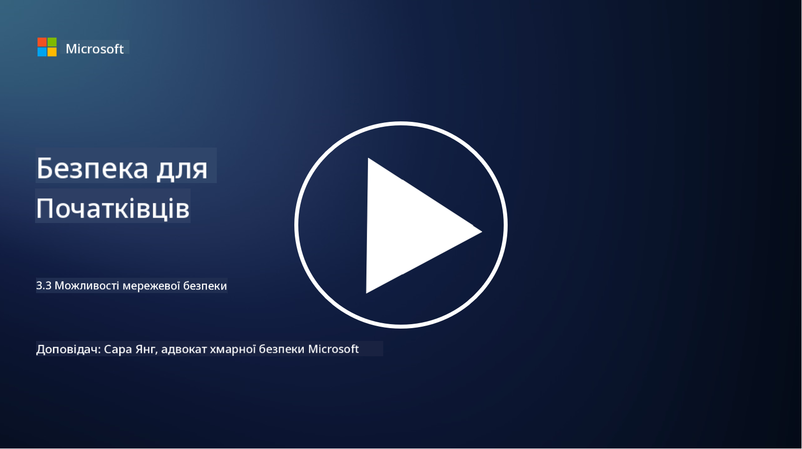

<!--
CO_OP_TRANSLATOR_METADATA:
{
  "original_hash": "c3aba077bb98eebc925dd58d870229ab",
  "translation_date": "2025-09-03T20:22:38+00:00",
  "source_file": "3.3 Network security capabilities.md",
  "language_code": "uk"
}
-->
# Можливості мережевої безпеки

У цьому уроці ми розглянемо наступні можливості, які можна використовувати для захисту мережі:

 - Традиційні міжмережеві екрани
 - Міжмережеві екрани для веб-додатків
 - Хмарні групи безпеки
 - CDN
 - Балансувальники навантаження
 - Хости бастіонів
 - VPN
 - Захист від DDoS-атак

## Традиційні міжмережеві екрани

Традиційні міжмережеві екрани — це пристрої безпеки, які контролюють і моніторять вхідний та вихідний мережевий трафік на основі попередньо визначених правил безпеки. Вони діють як бар'єр між довіреною внутрішньою мережею та ненадійними зовнішніми мережами, фільтруючи трафік для запобігання несанкціонованому доступу та потенційним загрозам.

## Міжмережеві екрани для веб-додатків

Міжмережеві екрани для веб-додатків (WAF) — це спеціалізовані екрани, призначені для захисту веб-додатків від різних атак, таких як SQL-ін'єкції, міжсайтовий скриптинг та інші вразливості. Вони аналізують HTTP-запити та відповіді, щоб виявляти та блокувати шкідливий трафік, спрямований на веб-додатки.

## Хмарні групи безпеки

Групи безпеки — це базова функція мережевої безпеки, яку надають постачальники хмарних послуг. Вони діють як віртуальні міжмережеві екрани, які контролюють вхідний та вихідний трафік до і від хмарних ресурсів, таких як віртуальні машини (VM) та інстанси. Групи безпеки дозволяють організаціям визначати правила, які визначають, який тип трафіку дозволено або заборонено, додаючи додатковий рівень захисту до хмарних розгортань.

## Мережа доставки контенту (CDN)

Мережа доставки контенту — це розподілена мережа серверів, розташованих у різних географічних місцях. CDN допомагають покращити продуктивність і доступність веб-сайтів, кешуючи контент і надаючи його з серверів, які ближче до користувача. Вони також забезпечують певний рівень захисту від DDoS-атак, розподіляючи трафік між кількома локаціями серверів.

## Балансувальники навантаження

Балансувальники навантаження розподіляють вхідний мережевий трафік між кількома серверами, щоб оптимізувати використання ресурсів, забезпечити високу доступність і покращити продуктивність додатків. Вони допомагають запобігти перевантаженню серверів і підтримувати ефективний час відгуку, підвищуючи стійкість мережі.

## Хости бастіонів

Хости бастіонів — це високозахищені та ізольовані сервери, які забезпечують контрольований доступ до мережі з зовнішньої, ненадійної мережі (наприклад, інтернету). Вони слугують точками входу для адміністраторів, які хочуть безпечно отримати доступ до внутрішніх систем. Хости бастіонів зазвичай налаштовуються з сильними заходами безпеки, щоб мінімізувати поверхню атаки.

## Віртуальні приватні мережі (VPN)

VPN створюють зашифровані тунелі між пристроєм користувача та віддаленим сервером, забезпечуючи безпечну та приватну комунікацію через потенційно ненадійні мережі, такі як інтернет. VPN часто використовуються для забезпечення віддаленого доступу до внутрішніх мереж, дозволяючи користувачам отримувати доступ до ресурсів так, ніби вони фізично знаходяться в тій самій мережі.

## Інструменти захисту від DDoS-атак

Інструменти та сервіси захисту від DDoS (розподілених атак на відмову в обслуговуванні) призначені для зменшення впливу DDoS-атак, коли кілька скомпрометованих пристроїв перевантажують мережу або сервіс. Рішення для захисту від DDoS-атак виявляють і фільтрують шкідливий трафік, забезпечуючи можливість легітимного трафіку досягати своєї цільової точки.

## Додаткові матеріали

- [Що таке міжмережевий екран? - Cisco](https://www.cisco.com/c/en/us/products/security/firewalls/what-is-a-firewall.html#~types-of-firewalls)
- [Що насправді робить міжмережевий екран? (howtogeek.com)](https://www.howtogeek.com/144269/htg-explains-what-firewalls-actually-do/)
- [Що таке міжмережевий екран? Як працюють міжмережеві екрани та їх типи (kaspersky.com)](https://www.kaspersky.com/resource-center/definitions/firewall)
- [Група безпеки мережі - як це працює | Microsoft Learn](https://learn.microsoft.com/azure/virtual-network/network-security-group-how-it-works)
- [Вступ до Azure Content Delivery Network (CDN) - Навчання | Microsoft Learn](https://learn.microsoft.com/training/modules/intro-to-azure-content-delivery-network/?WT.mc_id=academic-96948-sayoung)
- [Що таке мережа доставки контенту (CDN)? - Azure | Microsoft Learn](https://learn.microsoft.com/azure/cdn/cdn-overview?WT.mc_id=academic-96948-sayoung)
- [Що таке балансування навантаження? Як працюють балансувальники навантаження (nginx.com)](https://www.nginx.com/resources/glossary/load-balancing/)
- [Хости бастіонів проти VPN · Tailscale](https://tailscale.com/learn/bastion-hosts-vs-vpns/)
- [Що таке VPN? Як це працює, типи VPN (kaspersky.com)](https://www.kaspersky.com/resource-center/definitions/what-is-a-vpn)
- [Вступ до Azure DDoS Protection - Навчання | Microsoft Learn](https://learn.microsoft.com/training/modules/introduction-azure-ddos-protection/?WT.mc_id=academic-96948-sayoung)
- [Що таке DDoS-атака? | Microsoft Security](https://www.microsoft.com/security/business/security-101/what-is-a-ddos-attack?WT.mc_id=academic-96948-sayoung)

---

**Відмова від відповідальності**:  
Цей документ було перекладено за допомогою сервісу автоматичного перекладу [Co-op Translator](https://github.com/Azure/co-op-translator). Хоча ми прагнемо до точності, зверніть увагу, що автоматичні переклади можуть містити помилки або неточності. Оригінальний документ мовою оригіналу слід вважати авторитетним джерелом. Для критично важливої інформації рекомендується професійний людський переклад. Ми не несемо відповідальності за будь-які непорозуміння або неправильні тлумачення, що виникли внаслідок використання цього перекладу.