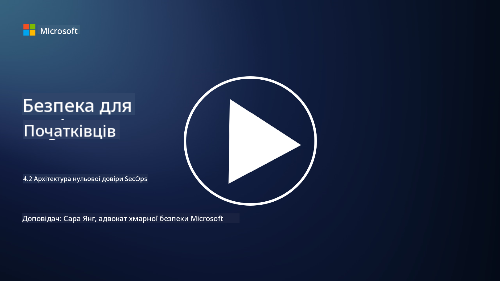

<!--
CO_OP_TRANSLATOR_METADATA:
{
  "original_hash": "45bbdc114e70936816b0b3e7c40189cf",
  "translation_date": "2025-09-03T21:21:50+00:00",
  "source_file": "4.2 SecOps zero trust architecture.md",
  "language_code": "uk"
}
-->
# Архітектура нульової довіри для SecOps

Операції безпеки складають дві частини архітектури нульової довіри, і в цьому уроці ми розглянемо обидві:

- Як повинні бути побудовані IT-архітектури для забезпечення централізованого збору журналів?

- Які найкращі практики для операцій безпеки в сучасних IT-середовищах?

## Як повинні бути побудовані IT-архітектури для забезпечення централізованого збору журналів?

Централізований збір журналів є критичним компонентом сучасних операцій безпеки. Він дозволяє організаціям агрегувати журнали та дані з різних джерел, таких як сервери, додатки, мережеві пристрої та інструменти безпеки, в центральне сховище для аналізу, моніторингу та реагування на інциденти. Ось кілька найкращих практик для побудови IT-архітектур, які підтримують централізований збір журналів:

1. **Інтеграція джерел журналів**:

- Переконайтеся, що всі відповідні пристрої та системи налаштовані на генерацію журналів. Це включає сервери, міжмережеві екрани, маршрутизатори, комутатори, додатки та пристрої безпеки.

- Налаштуйте джерела журналів для пересилання журналів до централізованого колектора або системи управління.

2. **Вибір правильного SIEM (Security Information and Event Management) інструменту**:

- Оберіть рішення SIEM, яке відповідає потребам і масштабу вашої організації.

- Переконайтеся, що обране рішення підтримує збір, агрегування, аналіз і звітність журналів.

3. **Масштабованість і резервування**:

- Спроєктуйте архітектуру з урахуванням масштабованості для підтримки зростаючої кількості джерел журналів і збільшення обсягу даних.

- Реалізуйте резервування для забезпечення високої доступності та запобігання перебоям через апаратні або мережеві збої.

4. **Безпечна передача журналів**:

- Використовуйте захищені протоколи, такі як TLS/SSL або IPsec, для передачі журналів від джерел до централізованого сховища.

- Реалізуйте автентифікацію та контроль доступу, щоб гарантувати, що лише авторизовані пристрої можуть надсилати журнали.

5. **Нормалізація**:

- Стандартизуйте формати журналів і нормалізуйте дані для забезпечення їхньої узгодженості та зручності аналізу.

6. **Зберігання та утримання**:

- Визначте відповідний період утримання журналів на основі вимог до відповідності та безпеки.

- Зберігайте журнали безпечно, захищаючи їх від несанкціонованого доступу та підробки.

## Які найкращі практики для операцій безпеки в сучасних IT-середовищах?

Окрім централізованого збору журналів, ось кілька найкращих практик для операцій безпеки в сучасних IT-середовищах:

1. **Безперервний моніторинг**: Реалізуйте безперервний моніторинг мережевої та системної активності для виявлення та реагування на загрози в реальному часі.

2. **Інтелект загроз**: Будьте в курсі нових загроз і вразливостей, використовуючи джерела та сервіси інтелекту загроз.

3. **Навчання користувачів**: Проводьте регулярне навчання з питань безпеки для співробітників, щоб зменшити ризики, пов'язані з соціальною інженерією та фішинговими атаками.

4. **План реагування на інциденти**: Розробіть і протестуйте план реагування на інциденти для забезпечення швидкого та ефективного реагування на інциденти безпеки.

5. **Автоматизація безпеки**: Використовуйте інструменти автоматизації та оркестрації безпеки для оптимізації реагування на інциденти та повторюваних завдань.

6. **Резервне копіювання та відновлення**: Реалізуйте надійні рішення для резервного копіювання та відновлення даних, щоб забезпечити їхню доступність у разі втрати даних або атак програм-вимагачів.

## Додаткові матеріали

- [Модуль найкращих практик безпеки Microsoft: Операції безпеки | Microsoft Learn](https://learn.microsoft.com/security/operations/security-operations-videos-and-decks?WT.mc_id=academic-96948-sayoung)
- [Операції безпеки - Cloud Adoption Framework | Microsoft Learn](https://learn.microsoft.com/azure/cloud-adoption-framework/secure/security-operations?WT.mc_id=academic-96948-sayoung)
- [Що таке архітектура платформи операцій безпеки та аналітики? Визначення SOAPA, як це працює, переваги та інше (digitalguardian.com)](https://www.digitalguardian.com/blog/what-security-operations-and-analytics-platform-architecture-definition-soapa-how-it-works#:~:text=All%20in%20all%2C%20security%20operations%20and%20analytics%20platform,become%20more%20efficient%20and%20operative%20with%20your%20security.)

---

**Відмова від відповідальності**:  
Цей документ був перекладений за допомогою сервісу автоматичного перекладу [Co-op Translator](https://github.com/Azure/co-op-translator). Хоча ми прагнемо до точності, будь ласка, майте на увазі, що автоматичні переклади можуть містити помилки або неточності. Оригінальний документ на його рідній мові слід вважати авторитетним джерелом. Для критичної інформації рекомендується професійний людський переклад. Ми не несемо відповідальності за будь-які непорозуміння або неправильні тлумачення, що виникають внаслідок використання цього перекладу.