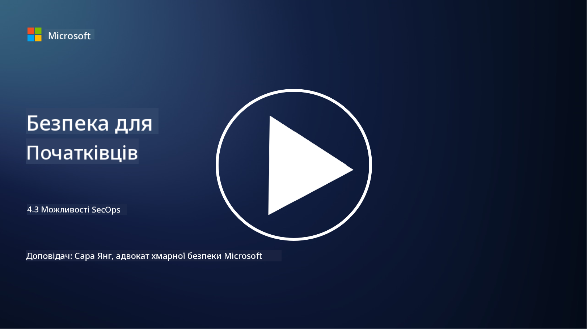

<!--
CO_OP_TRANSLATOR_METADATA:
{
  "original_hash": "553eb694c89f1caca0694e8d8ab89e0e",
  "translation_date": "2025-09-03T21:48:23+00:00",
  "source_file": "4.3 SecOps capabilities.md",
  "language_code": "uk"
}
-->
# Можливості SecOps

У цьому розділі ми розглянемо детальніше основні інструменти та можливості, які можна використовувати в операціях безпеки.

У цьому уроці ми розглянемо:

- Що таке інструмент управління інформацією та подіями безпеки (SIEM)?

- Що таке XDR?

- Які можливості можна використовувати для покращення операцій безпеки?

## Що таке інструмент управління інформацією та подіями безпеки (SIEM)?

Інструмент управління інформацією та подіями безпеки (SIEM) використовується для аналізу сповіщень про безпеку, які генеруються в ІТ-середовищі організації. Вони збирають, агрегують, корелюють і аналізують дані журналів та події безпеки з різних джерел, таких як мережеві пристрої, сервери, додатки та системи безпеки.

Основні функції та можливості інструментів SIEM включають:

1. **Збір журналів**: Інструменти SIEM збирають журнали та дані про події безпеки з широкого спектру пристроїв, систем і додатків, включаючи міжмережеві екрани, системи виявлення вторгнень, антивірусне програмне забезпечення тощо.

2. **Нормалізація даних**: Вони нормалізують дані журналів у загальний формат для полегшення аналізу та кореляції.

3. **Кореляція подій**: Інструменти SIEM корелюють події для виявлення шаблонів і аномалій, які можуть свідчити про інциденти безпеки або загрози.

4. **Сповіщення та повідомлення**: Інструменти SIEM генерують сповіщення та повідомлення в реальному часі, коли виявляються підозрілі дії або порушення безпеки, що дозволяє негайно реагувати.

5. **Виявлення інцидентів**: Вони сприяють виявленню інцидентів безпеки, включаючи несанкціонований доступ, витоки даних, зараження шкідливим програмним забезпеченням і внутрішні загрози.

6. **Аналіз поведінки користувачів і об'єктів (UEBA)**: Деякі інструменти SIEM включають можливості UEBA для виявлення аномальної поведінки користувачів і об'єктів, що може свідчити про компрометовані облікові записи або внутрішні загрози.

7. **Інтеграція з розвідкою загроз**: Інструменти SIEM можуть інтегруватися з джерелами розвідки загроз для покращення виявлення загроз шляхом порівняння відомих індикаторів компрометації (IOC) з активністю в мережі.

8. **Автоматизація та оркестрація**: Функції автоматизації дозволяють SIEM автоматизувати реакції на поширені інциденти безпеки, скорочуючи час реагування та зменшуючи ручну роботу.

9. **Панель управління та візуалізація**: Вони пропонують панелі управління та інструменти візуалізації для моніторингу даних безпеки та створення індивідуальних звітів.

10. **Інтеграція з іншими інструментами безпеки**: Інструменти SIEM часто інтегруються з іншими інструментами та технологіями безпеки, такими як рішення для виявлення та реагування на загрози на кінцевих точках (EDR), щоб забезпечити цілісне уявлення про стан безпеки організації.

## Що таке XDR?

XDR (Extended Detection and Response) — це технологія, яка розширює можливості традиційного виявлення та реагування на загрози на кінцевих точках (EDR) і об'єднує їх із ширшою телеметрією безпеки з різних джерел, щоб забезпечити більш комплексне уявлення про стан безпеки організації. XDR спрямований на покращення виявлення загроз, реагування на інциденти та загальної безпеки, вирішуючи обмеження, пов'язані з використанням лише EDR, SIEM або інших окремих інструментів безпеки.

Основні характеристики та компоненти XDR включають:

1. **Інтеграція даних**: XDR інтегрує дані з кількох джерел, включаючи кінцеві точки, мережевий трафік, хмарні сервіси, електронну пошту тощо. Ця комплексна агрегація даних забезпечує ширший контекст для виявлення та аналізу загроз.

2. **Розширена аналітика**: XDR використовує розширену аналітику, машинне навчання та аналіз поведінки для виявлення та пріоритизації загроз безпеки. Він шукає шаблони та аномалії в інтегрованих даних для виявлення як відомих, так і невідомих загроз.

3. **Автоматизоване виявлення загроз**: XDR автоматизує виявлення загроз і аномалій шляхом кореляції інформації з різних джерел. Він може ідентифікувати складні ланцюги атак, які можуть охоплювати кілька векторів.

4. **Розслідування та реагування на інциденти**: XDR надає інструменти для розслідування та реагування на інциденти, допомагаючи командам безпеки швидко оцінювати масштаб і вплив інцидентів та вживати відповідних заходів.

5. **Інтеграція з розвідкою загроз**: Він інтегрує джерела розвідки загроз і дані для покращення виявлення загроз шляхом порівняння відомих індикаторів компрометації (IOC) з активністю в мережі та на кінцевих точках.

6. **Єдина консоль**: XDR зазвичай пропонує єдину консоль або панель управління, де команди безпеки можуть переглядати та керувати сповіщеннями та інцидентами безпеки з різних джерел централізовано.

7. **Покриття різних платформ**: Рішення XDR охоплюють широкий спектр платформ, включаючи кінцеві точки, сервери, хмарні середовища та мобільні пристрої, що робить їх придатними для сучасних багатоплатформних ІТ-середовищ.

## Які можливості можна використовувати для покращення операцій безпеки?

Для покращення операцій безпеки організації можуть використовувати кілька можливостей на додаток до інструментів SIEM:

1. **Машинне навчання та штучний інтелект**: Впровадження розширеної аналітики, машинного навчання та штучного інтелекту для виявлення нових загроз і автоматизації пошуку загроз.

2. **Аналіз поведінки користувачів і об'єктів (UEBA)**: Аналіз поведінки користувачів і об'єктів для виявлення аномалій і внутрішніх загроз.

3. **Джерела розвідки загроз**: Інтеграція джерел розвідки загроз для отримання актуальної інформації про останні загрози та індикатори компрометації.

4. **Оркестрація, автоматизація та реагування на загрози (SOAR)**: Впровадження платформ SOAR для автоматизації реагування на інциденти та оптимізації робочих процесів операцій безпеки.

5. **Технології обману**: Використання технологій обману для введення в оману та виявлення атакуючих у мережі.

## Додаткові матеріали

- [What is SIEM? | Microsoft Security](https://www.microsoft.com/security/business/security-101/what-is-siem?WT.mc_id=academic-96948-sayoung)  
- [What Is SIEM? - Security Information and Event Management - Cisco](https://www.cisco.com/c/en/us/products/security/what-is-siem.html)  
- [Security information and event management - Wikipedia](https://en.wikipedia.org/wiki/Security_information_and_event_management)  
- [What Is XDR? | Microsoft Security](https://www.microsoft.com/security/business/security-101/what-is-xdr?WT.mc_id=academic-96948-sayoung)  
- [XDR & XDR Security (kaspersky.com.au)](https://www.kaspersky.com.au/resource-center/definitions/what-is-xdr)  
- [The Power of SecOps: Redefining Core Security Capabilities - The New Stack](https://thenewstack.io/the-power-of-secops-redefining-core-security-capabilities/)  
- [Seven Steps to Improve Your Security Operations and Response (securityintelligence.com)](https://securityintelligence.com/seven-steps-to-improve-your-security-operations-and-response/)  

---

**Відмова від відповідальності**:  
Цей документ був перекладений за допомогою сервісу автоматичного перекладу [Co-op Translator](https://github.com/Azure/co-op-translator). Хоча ми прагнемо до точності, будь ласка, майте на увазі, що автоматичні переклади можуть містити помилки або неточності. Оригінальний документ на його рідній мові слід вважати авторитетним джерелом. Для критичної інформації рекомендується професійний людський переклад. Ми не несемо відповідальності за будь-які непорозуміння або неправильні тлумачення, що виникають внаслідок використання цього перекладу.