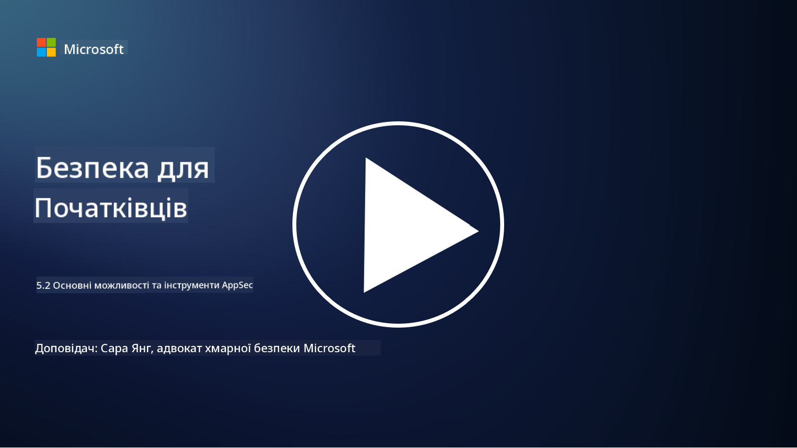

<!--
CO_OP_TRANSLATOR_METADATA:
{
  "original_hash": "790a3fa7e535ec60bb51bde13e759781",
  "translation_date": "2025-09-03T21:26:46+00:00",
  "source_file": "5.2 AppSec key capabilities.md",
  "language_code": "uk"
}
-->
## Вступ

У цьому уроці ми розглянемо ключові можливості та інструменти, які використовуються для забезпечення безпеки додатків.

## Основні можливості та інструменти AppSec

Ключові можливості та інструменти, які використовуються для забезпечення безпеки додатків, є важливими для виявлення, пом'якшення та запобігання вразливостям і загрозам у програмному забезпеченні. Ось деякі з найважливіших:

**1. Статичне тестування безпеки додатків (SAST)**:

- **Можливості**: Аналізує вихідний код, байт-код або бінарний код для виявлення вразливостей у кодовій базі додатка.

- **Інструменти**: Приклади включають Fortify, Checkmarx і Veracode.

**2. Динамічне тестування безпеки додатків (DAST)**:

- **Можливості**: Сканує працюючий додаток для виявлення вразливостей шляхом надсилання запитів і аналізу відповідей.

- **Інструменти**: Приклади включають ZAP, Burp Suite і Qualys Web Application Scanning.

**3. Інтерактивне тестування безпеки додатків (IAST)**:

- **Можливості**: Поєднує елементи SAST і DAST для аналізу коду під час виконання, забезпечуючи більш точні результати та зменшуючи кількість хибних спрацювань.

- **Інструменти**: Приклади включають Contrast Security і HCL AppScan.

**4. Самозахист додатків під час виконання (RASP)**:

- **Можливості**: Моніторить і захищає додатки в реальному часі, виявляючи та реагуючи на загрози безпеці під час їх виникнення.

- **Інструменти**: Приклади включають Veracode Runtime Protection і F5 Advanced WAF з RASP.

**5. Брандмауери веб-додатків (WAFs)**:

- **Можливості**: Забезпечують захисний шар між додатком і інтернетом, фільтруючи вхідний трафік і блокуючи шкідливі запити.

- **Інструменти**: Приклади включають ModSecurity, AWS WAF і Akamai Kona Site Defender.

**6. Сканування залежностей**:

- **Можливості**: Виявляє вразливості в сторонніх бібліотеках і компонентах, які використовуються в додатку.

- **Інструменти**: Приклади включають OWASP Dependency-Check і Snyk.

**7. Тестування на проникнення (Pen Testing)**:

- **Можливості**: Імітує реальні атаки для виявлення вразливостей і оцінки безпеки додатка.

- **Інструменти**: Виконується сертифікованими етичними хакерами та фахівцями з безпеки за допомогою різних інструментів, таких як Metasploit і Nmap.

**8. Сканування та аналіз безпеки**:

- **Можливості**: Сканує на наявність відомих вразливостей, помилок конфігурації та неправильних налаштувань безпеки.

- **Інструменти**: Приклади включають Nessus, Qualys Vulnerability Management і OpenVAS.

**9. Інструменти безпеки контейнерів**:

- **Можливості**: Зосереджуються на забезпеченні безпеки контейнеризованих додатків та їх середовищ.

- **Інструменти**: Приклади включають Docker Security Scanning і Aqua Security.

**10. Навчання з безпечної розробки**:

- **Можливості**: Забезпечує навчальні програми та підвищення обізнаності для команд розробників, сприяючи практикам безпечного кодування.

- **Інструменти**: Індивідуальні навчальні програми та платформи.

**11. Фреймворки тестування безпеки**:

- **Можливості**: Забезпечують комплексні фреймворки для різних потреб тестування безпеки додатків.

- **Інструменти**: OWASP Amass, OWASP OWTF і FrAppSec.

**12. Інструменти для огляду безпеки коду**:

- **Можливості**: Перевіряють вихідний код на наявність вразливостей і відповідність найкращим практикам кодування.

- **Інструменти**: Приклади включають SonarQube і Checkmarx.

**13. Інструменти для безпеки API та мікросервісів**:

- **Можливості**: Зосереджуються на забезпеченні безпеки API та мікросервісів, включаючи автентифікацію, авторизацію та захист даних.

- **Інструменти**: Приклади включають Apigee, AWS API Gateway і Istio.

## Додаткові матеріали

- [Що таке безпека додатків? Концепції, інструменти та найкращі практики | HackerOne](https://www.hackerone.com/knowledge-center/what-application-security-concepts-tools-best-practices)
- [Що таке IAST? (Інтерактивне тестування безпеки додатків) (comparitech.com)](https://www.comparitech.com/net-admin/what-is-iast/)
- [10 типів інструментів тестування безпеки додатків: коли і як їх використовувати (cmu.edu)](https://insights.sei.cmu.edu/blog/10-types-of-application-security-testing-tools-when-and-how-to-use-them/)
- [Зміна балансу ризиків кібербезпеки: принципи та підходи до безпеки за дизайном і за замовчуванням | Cyber.gov.au](https://www.cyber.gov.au/about-us/view-all-content/publications/principles-and-approaches-for-security-by-design-and-default)

---

**Відмова від відповідальності**:  
Цей документ був перекладений за допомогою сервісу автоматичного перекладу [Co-op Translator](https://github.com/Azure/co-op-translator). Хоча ми прагнемо до точності, зверніть увагу, що автоматичні переклади можуть містити помилки або неточності. Оригінальний документ на його рідній мові слід вважати авторитетним джерелом. Для критично важливої інформації рекомендується професійний людський переклад. Ми не несемо відповідальності за будь-які непорозуміння або неправильні тлумачення, що виникають внаслідок використання цього перекладу.