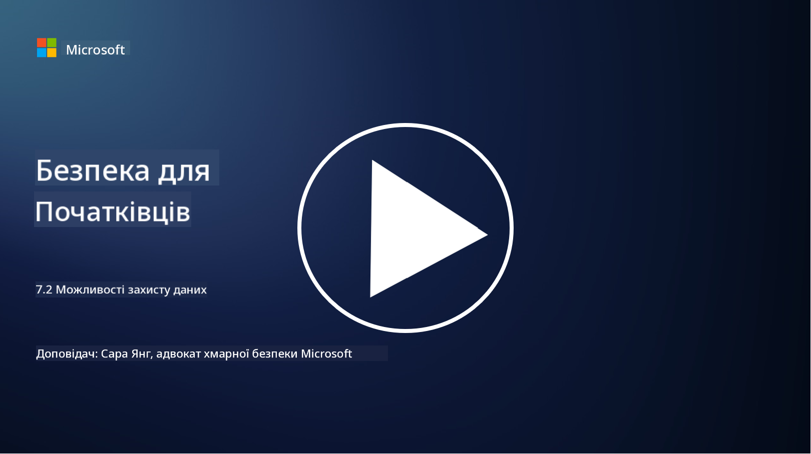

<!--
CO_OP_TRANSLATOR_METADATA:
{
  "original_hash": "50697add9758e54693442d502d2d5f8a",
  "translation_date": "2025-09-03T21:30:56+00:00",
  "source_file": "7.2 Data security capabilities.md",
  "language_code": "uk"
}
-->
# Можливості забезпечення безпеки даних

У цьому розділі ми розглянемо детальніше основні інструменти та можливості, які використовуються для забезпечення безпеки даних:

**Вступ**

У цьому уроці ми розглянемо:

- Що таке інструменти запобігання втраті даних?

- Що таке інструменти управління ризиками інсайдерів?

- Які інструменти для збереження даних доступні?

## Що таке інструменти запобігання втраті даних?

Інструменти запобігання втраті даних (Data Loss Prevention, DLP) — це набір програмних рішень і технологій, призначених для запобігання несанкціонованому доступу, поширенню або витоку конфіденційних чи чутливих даних в організації. Ці інструменти використовують інспекцію вмісту, впровадження політик і моніторинг для виявлення та захисту чутливих даних від розголошення або неправильного використання. Приклади продуктів DLP включають: Symantec Data Loss Prevention, McAfee Total Protection for Data Loss Prevention, Microsoft 365 DLP**: інтегрується з додатками Microsoft 365, щоб допомогти організаціям ідентифікувати та захищати чутливі дані в електронних листах, документах і повідомленнях.

## Що таке інструменти управління ризиками інсайдерів?

Інструменти управління ризиками інсайдерів допомагають організаціям ідентифікувати та зменшувати ризики, які виникають через співробітників, підрядників або партнерів, які можуть навмисно або ненавмисно порушити безпеку даних. Ці інструменти моніторять поведінку користувачів, шаблони доступу та використання даних, щоб виявляти підозрілі дії та потенційні загрози з боку інсайдерів. Приклади продуктів для управління ризиками інсайдерів включають: Microsoft Insider Risk Management (частина Microsoft 365), Forcepoint Insider Threat Data Protection, Varonis Insider Threat Detection.

## Які інструменти для збереження даних доступні?

Інструменти для збереження даних включають програмне забезпечення та рішення, призначені для управління збереженням і видаленням даних відповідно до політик збереження даних організації та юридичних вимог. Ці інструменти допомагають автоматизувати процес збереження даних на визначені періоди та їх безпечного видалення, коли вони більше не потрібні. Приклади продуктів для збереження даних включають: Veritas Enterprise Vault, Commvault Complete Data Protection, Microsoft data lifecycle management. Ці рішення допомагають організаціям контролювати збереження та утилізацію даних, забезпечуючи відповідність регуляторним вимогам щодо захисту даних і ефективно керуючи даними протягом їх життєвого циклу.

## Додаткова література

- [Guide to Data Security Posture Management (DSPM) | CSA (cloudsecurityalliance.org)](https://cloudsecurityalliance.org/blog/2023/03/31/the-big-guide-to-data-security-posture-management-dspm/)
- [Data Loss Prevention across endpoints, apps, & services | Microsoft Purview](https://youtu.be/hvqq8L_0kgI)
- [18 Best Data Loss Prevention Software Tools 2023 (Free + Paid) (comparitech.com)](https://www.comparitech.com/data-privacy-management/data-loss-prevention-tools-software/)
- [Data Loss Prevention (nist.gov)](https://tsapps.nist.gov/publication/get_pdf.cfm?pub_id=904672)
- [Learn about insider risk management | Microsoft Learn](https://learn.microsoft.com/purview/insider-risk-management?WT.mc_id=academic-96948-sayoung)
- [Data Lifecycle Management | IBM](https://www.ibm.com/topics/data-lifecycle-management)
- [What Is Data Lifecycle Management (DLM)? | 2023 Best Practices (selecthub.com)](https://www.selecthub.com/big-data-analytics/data-lifecycle-management/)

---

**Відмова від відповідальності**:  
Цей документ був перекладений за допомогою сервісу автоматичного перекладу [Co-op Translator](https://github.com/Azure/co-op-translator). Хоча ми прагнемо до точності, будь ласка, майте на увазі, що автоматичні переклади можуть містити помилки або неточності. Оригінальний документ на його рідній мові слід вважати авторитетним джерелом. Для критичної інформації рекомендується професійний людський переклад. Ми не несемо відповідальності за будь-які непорозуміння або неправильні тлумачення, що виникають внаслідок використання цього перекладу.