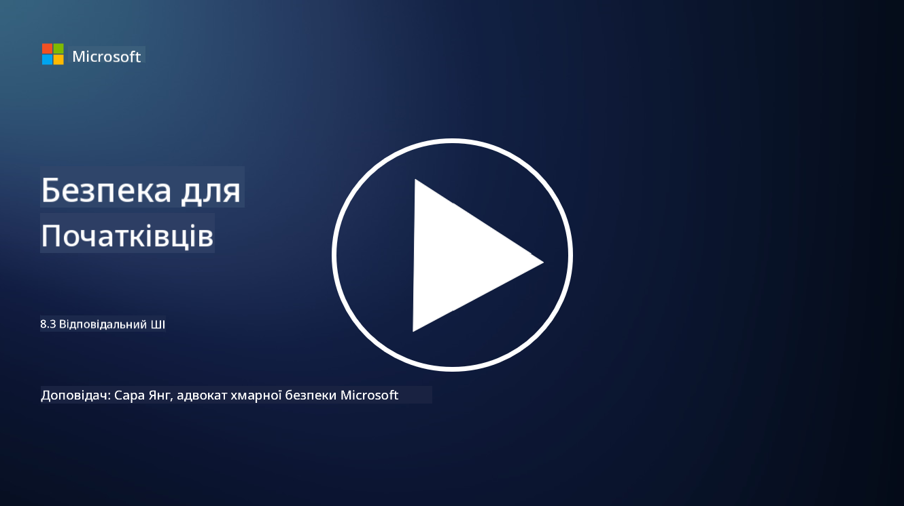

<!--
CO_OP_TRANSLATOR_METADATA:
{
  "original_hash": "5e9775ee91bde7d44577891d5f11c4c5",
  "translation_date": "2025-09-03T20:49:26+00:00",
  "source_file": "8.3 Responsible AI.md",
  "language_code": "uk"
}
-->
# Відповідальний штучний інтелект

## Що таке відповідальний штучний інтелект і як він пов’язаний із безпекою ШІ?

Відповідальний штучний інтелект означає розробку та використання штучного інтелекту таким чином, щоб це було етично, прозоро та відповідало суспільним цінностям. Він охоплює принципи, такі як справедливість, відповідальність і надійність, забезпечуючи, що системи ШІ створені та працюють на благо окремих осіб, спільнот і суспільства загалом.

Зв’язок між відповідальним ШІ та безпекою ШІ є важливим, оскільки:

-   **Етичні аспекти**: Відповідальний ШІ включає етичні аспекти, які безпосередньо впливають на безпеку, такі як конфіденційність і захист даних. Забезпечення того, що системи ШІ поважають конфіденційність користувачів і захищають персональні дані, є ключовим аспектом відповідального ШІ.
-   **Надійність і стійкість**: Системи ШІ повинні бути стійкими до маніпуляцій і атак, що є основним принципом як відповідального ШІ, так і безпеки ШІ. Це включає захист від атак зловмисників і забезпечення цілісності процесів прийняття рішень ШІ.
-   **Прозорість і пояснюваність**: Частина відповідального ШІ полягає в тому, щоб забезпечити прозорість систем ШІ та можливість пояснення їхніх рішень. Це важливо для безпеки, оскільки зацікавлені сторони повинні розуміти, як працюють системи ШІ, щоб довіряти їхнім заходам безпеки.
-   **Відповідальність**: Системи ШІ повинні бути відповідальними за свої дії, тобто повинні існувати механізми для відстеження рішень і виправлення будь-яких проблем. Це узгоджується з практиками безпеки, які моніторять і перевіряють діяльність систем для запобігання та реагування на порушення.

Таким чином, відповідальний ШІ та безпека ШІ тісно пов’язані, причому практики відповідального ШІ покращують безпеку систем ШІ і навпаки. Впровадження принципів відповідального ШІ допомагає створювати системи ШІ, які є не лише етично правильними, але й більш захищеними від потенційних загроз.

## Як я можу забезпечити, щоб моя система ШІ була одночасно безпечною та етичною?

Забезпечення того, щоб ваша система ШІ була одночасно безпечною та етичною, вимагає багатогранного підходу, який включає наступні кроки:

- **Дотримуйтесь етичних принципів**: Слідуйте встановленим етичним рекомендаціям, які акцентують увагу на добробуті людей, суспільства та довкілля; справедливості; захисті конфіденційності; надійності; прозорості; можливості оскарження; та відповідальності.

- **Впроваджуйте надійні заходи безпеки**: Використовуйте проактивне тестування безпеки та програми управління довірою, ризиками та безпекою ШІ для захисту від загроз і вразливостей.

- **Залучайте різноманітних учасників**: Залучайте широкий спектр учасників до процесу розробки ШІ, включаючи етиків, соціологів і представників постраждалих спільнот, щоб врахувати різноманітні перспективи та цінності.

- **Забезпечте прозорість і пояснюваність**: Переконайтеся, що процеси прийняття рішень ШІ є прозорими та можуть бути пояснені, що сприяє більшій довірі та полегшує виявлення потенційних упереджень або помилок.

- **Захищайте конфіденційність даних**: Захищайте конфіденційність і автентичність даних за допомогою шифрування та інших заходів захисту даних, щоб поважати права користувачів на конфіденційність.

- **Забезпечте людський контроль**: Впроваджуйте механізми людського контролю, щоб забезпечити можливість оскарження рішень, прийнятих системами ШІ, і гарантувати відповідальність.

- **Будьте в курсі питань безпеки ШІ**: Слідкуйте за останніми дослідженнями та дискусіями щодо безпеки ШІ, щоб розуміти змінюваний ландшафт безпеки та етики ШІ.

- **Дотримуйтесь нормативних вимог**: Переконайтеся, що ваша система ШІ відповідає всім відповідним законам і нормативним актам, які можуть включати закони про захист даних, закони проти дискримінації та галузеві рекомендації.

## Чи можете ви навести приклади проблем безпеки, спричинених неетичним використанням ШІ?

Ось кілька прикладів проблем безпеки, які можуть виникнути через неетичне використання ШІ:

- **Упереджене прийняття рішень**: Системи ШІ можуть підтримувати та посилювати існуючі упередження, якщо вони навчені на упереджених наборах даних. Наприклад, якщо пошукова система навчена на даних, що відображають суспільні стереотипи, вона може показувати упереджені результати пошуку, що може призвести до несправедливого ставлення або дискримінації.

- **ШІ в судових системах**: Використання ШІ в юридичному прийнятті рішень може викликати етичні занепокоєння, особливо якщо процес прийняття рішень ШІ не є прозорим або залежить від упереджених даних. Це може призвести до несправедливих юридичних наслідків і порушення прав осіб.

- **Маніпуляція системами ШІ**: Системи ШІ можуть бути вразливими до атак зловмисників, коли незначні зміни вхідних даних можуть спричинити неправильні результати. Наприклад, автономні транспортні засоби можуть бути введені в оману, неправильно інтерпретуючи дорожні знаки, що створює ризики для безпеки.

- **ШІ для спостереження**: Використання ШІ для цілей спостереження може призвести до порушення конфіденційності, особливо якщо це відбувається без належної згоди або способами, які порушують свободи особистості. Це може бути особливо проблематичним у авторитарних режимах, які можуть використовувати ШІ для моніторингу та придушення інакомислення.

Ці приклади підкреслюють важливість етичних аспектів у розробці та впровадженні систем ШІ для запобігання проблемам безпеки та захисту прав і конфіденційності людей.

## Додаткові матеріали

 - [Microsoft Responsible AI Standard v2 General Requirements](https://query.prod.cms.rt.microsoft.com/cms/api/am/binary/RE5cmFl?culture=en-us&country=us&WT.mc_id=academic-96948-sayoung)
 - [Responsible AI (mit.edu)](https://sloanreview.mit.edu/big-ideas/responsible-ai/)
 - [13 Principles for Using AI Responsibly (hbr.org)](https://hbr.org/2023/06/13-principles-for-using-ai-responsibly)

---

**Відмова від відповідальності**:  
Цей документ був перекладений за допомогою сервісу автоматичного перекладу [Co-op Translator](https://github.com/Azure/co-op-translator). Хоча ми прагнемо до точності, будь ласка, майте на увазі, що автоматичні переклади можуть містити помилки або неточності. Оригінальний документ на його рідній мові слід вважати авторитетним джерелом. Для критичної інформації рекомендується професійний людський переклад. Ми не несемо відповідальності за будь-які непорозуміння або неправильні тлумачення, що виникають внаслідок використання цього перекладу.