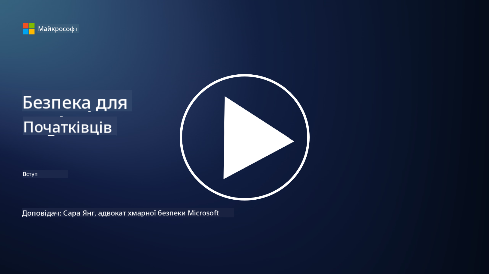

<!--
CO_OP_TRANSLATOR_METADATA:
{
  "original_hash": "0f9381fb23638f9341416474ce3c1563",
  "translation_date": "2025-09-03T19:55:59+00:00",
  "source_file": "README.md",
  "language_code": "uk"
}
-->
  
  
  
  
  
  

# 🚀 Кібербезпека для початківців – навчальна програма  

У цьому швидко змінюваному світі впровадження технологій штучного інтелекту ще важливіше розуміти, як захищати ІТ-системи. Цей курс створений для того, щоб навчити вас основним концепціям кібербезпеки та розпочати ваше навчання у сфері безпеки. Курс не залежить від конкретного постачальника і розділений на невеликі уроки, які займають приблизно 30-60 хвилин. Кожен урок містить невеликий тест і посилання на додаткові матеріали для тих, хто хоче глибше зануритися в тему.  

  

Що охоплює цей курс 📚  

- 🔐 Основні концепції кібербезпеки, такі як триада CIA, відмінності між ризиками, загрозами тощо.  
- 🛡️ Розуміння, що таке контроль безпеки і які форми він може приймати.  
- 🌐 Розуміння концепції "нульової довіри" і її важливості в сучасній кібербезпеці.  
- 🔑 Розуміння ключових концепцій і тем у сферах ідентифікації, мереж, операцій безпеки, інфраструктури та захисту даних.  
- 🔧 Приклади інструментів, які використовуються для впровадження контролю безпеки.  

Що цей курс не охоплює 🙅‍♂️  

- 🚫 Як використовувати конкретні інструменти безпеки.  
- 🚫 Як "зламувати" або проводити тестування на проникнення/офенсивну безпеку.  
- 🚫 Вивчення конкретних стандартів відповідності.  

  

Після завершення цього курсу ви можете перейти до деяких модулів Microsoft Learn. Ми рекомендуємо продовжити навчання з [Microsoft Security, Compliance, and Identity Fundamentals.](https://learn.microsoft.com/training/paths/describe-concepts-of-security-compliance-identity/?WT.mc_id=academic-96948-sayoung)  

Зрештою, ви можете розглянути можливість складання [Exam SC-900: Microsoft Security, Compliance, and Identity Fundamentals exam.](https://learn.microsoft.com/credentials/certifications/exams/sc-900/?WT.mc_id=academic-96948-sayoung)  

> 💁 Якщо у вас є відгуки або пропозиції щодо цього курсу чи контенту, якого, на вашу думку, не вистачає, ми будемо раді почути вас!  

## Огляд модулів 📝  
| **Номер модуля** | **Назва модуля**                           | **Вивчені концепції**                | **Цілі навчання**                                                                                              |  
|-------------------|-------------------------------------------|--------------------------------------|-----------------------------------------------------------------------------------------------------------------|  
| **1.1**           | Основні концепції безпеки                 | [Триада CIA](https://github.com/microsoft/Security-101/blob/main/1.1%20The%20CIA%20triad%20and%20other%20key%20concepts.md)                        | Дізнайтеся про конфіденційність, доступність і цілісність, а також автентичність, незаперечність і конфіденційність. |  
| **1.2**           | Основні концепції безпеки                 | [Поширені загрози кібербезпеки](https://github.com/microsoft/Security-101/blob/main/1.2%20Common%20cybersecurity%20threats.md)        | Дізнайтеся про поширені загрози кібербезпеки, які впливають на людей і організації.                             |  
| **1.3**           | Основні концепції безпеки                 | [Розуміння управління ризиками](https://github.com/microsoft/Security-101/blob/main/1.3%20Understanding%20risk%20management.md)       | Дізнайтеся про оцінку та розуміння ризиків – вплив/ймовірність і впровадження контролю.                                                                                                               | |  
| **1.4**           | Основні концепції безпеки                 | [Практики безпеки та документація](https://github.com/microsoft/Security-101/blob/main/1.4%20Security%20practices%20and%20documentation.md) | Дізнайтеся про різницю між політиками, процедурами, стандартами та регламентами/законами.                         |  
| **1.5**           | Основні концепції безпеки                 | [Нульова довіра](https://github.com/microsoft/Security-101/blob/main/1.5%20Zero%20trust.md)                           | Дізнайтеся, що таке "нульова довіра" і як вона впливає на архітектуру. Що таке захист у глибину?                   |  
| **1.6**           | Основні концепції безпеки                 | [Модель спільної відповідальності](https://github.com/microsoft/Security-101/blob/main/1.6%20Shared%20responsibility%20model.md)                           | Що таке модель спільної відповідальності і як вона впливає на кібербезпеку?                  |  
| **1.7**           | [Тест наприкінці модуля](https://github.com/microsoft/Security-101/blob/main/1.7%20End%20of%20module%20quiz.md)                        |                                      |                                                                                                                 |  
| **2.1**           | Основи управління ідентифікацією та доступом | [Ключові концепції IAM](https://github.com/microsoft/Security-101/blob/main/2.1%20IAM%20key%20concepts.md)                     | Дізнайтеся про принцип найменших привілеїв, розподіл обов'язків, як IAM підтримує "нульову довіру".               |  
| **2.2**           | Основи управління ідентифікацією та доступом | [Архітектура IAM з нульовою довірою](https://github.com/microsoft/Security-101/blob/main/2.2%20IAM%20zero%20trust%20architecture.md)          | Дізнайтеся, як ідентифікація стає новим периметром для сучасних ІТ-середовищ і які загрози вона зменшує.          |  
| **2.3**           | Основи управління ідентифікацією та доступом | [Можливості IAM](https://github.com/microsoft/Security-101/blob/main/2.3%20IAM%20capabilities.md)                     | Дізнайтеся про можливості IAM і контроль для захисту ідентифікацій                                                  |  
| **2.4**           | [Тест наприкінці модуля](https://github.com/microsoft/Security-101/blob/main/2.4%20End%20of%20module%20quiz.md)                        |                                      |                                                                                                                 |  
| **3.1**           | Основи мережевої безпеки                  | [Ключові концепції мереж](https://github.com/microsoft/Security-101/blob/main/3.1%20Networking%20key%20concepts.md)              | Дізнайтеся про концепції мереж (IP-адресація, номери портів, шифрування тощо).                                 |  
| **3.2**           | Основи мережевої безпеки                  | [Архітектура мережевої безпеки з нульовою довірою](https://github.com/microsoft/Security-101/blob/main/3.2%20Networking%20zero%20trust%20architecture.md)   | Дізнайтеся, як мережі сприяють архітектурі E2E ZT і які загрози вони зменшують.                  |  
| **3.3**           | Основи мережевої безпеки                  | [Можливості мережевої безпеки](https://github.com/microsoft/Security-101/blob/main/3.3%20Network%20security%20capabilities.md)        | Дізнайтеся про інструменти мережевої безпеки – брандмауери, WAF, захист від DDoS тощо.                                    |  
| **3.4**           | [Тест наприкінці модуля](https://github.com/microsoft/Security-101/blob/main/3.4%20End%20of%20module%20quiz.md)                        |                                      |                                                                                                                 |  
| **4.1**           | Основи операцій безпеки                   | [Ключові концепції SecOps](https://github.com/microsoft/Security-101/blob/main/4.1%20SecOps%20key%20concepts.md)                  | Дізнайтеся, чому операції безпеки важливі і чим вони відрізняються від звичайних ІТ-операційних команд.                  |  
| **4.2**           | Основи операцій безпеки                   | [Архітектура SecOps з нульовою довірою](https://github.com/microsoft/Security-101/blob/main/4.2%20SecOps%20zero%20trust%20architecture.md)       | Дізнайтеся, як SecOps сприяє архітектурі E2E ZT і які загрози вони зменшують.                      |  
| **4.3**           | Основи операцій безпеки                   | [Можливості SecOps](https://github.com/microsoft/Security-101/blob/main/4.3%20SecOps%20capabilities.md)                  | Дізнайтеся про інструменти SecOps – SIEM, XDR тощо.                                                                    |  
| **4.4**           | [Тест наприкінці модуля](https://github.com/microsoft/Security-101/blob/main/4.4%20End%20of%20module%20quiz.md)                        |                                      |                                                                                                                 |  
| **5.1**           | Основи безпеки додатків                   | [Ключові концепції AppSec](https://github.com/microsoft/Security-101/blob/main/5.1%20AppSec%20key%20concepts.md)                  | Дізнайтеся про концепції AppSec, такі як безпека за дизайном, перевірка введення тощо.                                    |  
| **5.2**           | Основи безпеки додатків                   | [Можливості AppSec](https://github.com/microsoft/Security-101/blob/main/5.2%20AppSec%20key%20capabilities.md)                  | Дізнайтеся про інструменти AppSec: інструменти безпеки конвеєра, сканування коду, сканування секретів тощо.                       |  
| **5.3**           | [Тест наприкінці модуля](https://github.com/microsoft/Security-101/blob/main/5.3%20End%20of%20module%20quiz.md)                        |                                      |                                                                                                                 |  
| **6.1**           | Основи безпеки інфраструктури             | [Ключові концепції безпеки інфраструктури](https://github.com/microsoft/Security-101/blob/main/6.1%20Infrastructure%20security%20key%20concepts.md) | Дізнайтеся про посилення систем, патчинг, гігієну безпеки, безпеку контейнерів.                                  |  
| **6.2**           | Основи безпеки інфраструктури             | [Можливості безпеки інфраструктури](https://github.com/microsoft/Security-101/blob/main/6.2%20Infrastructure%20security%20capabilities.md) | Дізнайтеся про інструменти, які можуть допомогти з безпекою інфраструктури, наприклад CSPM, безпека контейнерів тощо.            |  
| **6.3**           | [Тест наприкінці модуля](https://github.com/microsoft/Security-101/blob/main/6.3%20End%20of%20module%20quiz.md)                        |                                      |                                                                                                                 |  
| **7.1**           | Основи безпеки даних                      | [Ключові концепції безпеки даних](https://github.com/microsoft/Security-101/blob/main/7.1%20Data%20security%20key%20concepts.md)           | Дізнайтеся про класифікацію та збереження даних і чому це важливо для організації.                     |  
| **7.2**           | Основи безпеки даних                      | [Можливості безпеки даних](https://github.com/microsoft/Security-101/blob/main/7.2%20Data%20security%20capabilities.md)           | Дізнайтеся про інструменти безпеки даних – DLP, управління внутрішніми ризиками, управління даними тощо.                          |  
| **7.3**           | [Тест наприкінці модуля](https://github.com/microsoft/Security-101/blob/main/7.3%20End%20of%20module%20quiz.md)                        |                                      |                                                                                                                 |  
| **8.1**           | Основи безпеки штучного інтелекту         | [Ключові концепції безпеки AI](https://github.com/microsoft/Security-101/blob/main/8.1%20AI%20security%20key%20concepts.md)          | Дізнайтеся про відмінності та схожість між традиційною безпекою та безпекою AI.                 |  
| **8.2**           | Основи безпеки штучного інтелекту         | [Можливості безпеки AI](https://github.com/microsoft/Security-101/blob/main/8.2%20AI%20security%20capabilities.md)           | Дізнайтеся про інструменти безпеки AI та контроль, який можна використовувати для захисту AI.                         |  
| **8.3**           | Основи безпеки штучного інтелекту         | [Відповідальний AI](https://github.com/microsoft/Security-101/blob/main/8.3%20Responsible%20AI.md)          | Дізнайтеся, що таке відповідальний AI і про специфічні загрози AI, які повинні враховувати фахівці з безпеки.                          |  
| **8.4**           | [Тест наприкінці модуля](https://github.com/microsoft/Security-101/blob/main/8.4%20End%20of%20module%20quiz.md)                        |                                      |                                                                                                                 |  

## 🎒 Інші курси  

Наша команда створює інші курси! Ознайомтеся з:  

- [Генеративний AI для початківців](https://aka.ms/genai-beginners)  
- [Генеративний AI для початківців .NET](https://github.com/microsoft/Generative-AI-for-beginners-dotnet)  
- [Генеративний AI з JavaScript](https://github.com/microsoft/generative-ai-with-javascript)  
- [Генеративний AI з Java](https://github.com/microsoft/Generative-AI-for-beginners-java)  
- [Штучний інтелект для початківців](https://aka.ms/ai-beginners)
- [Наука про дані для початківців](https://aka.ms/datascience-beginners)
- [Машинне навчання для початківців](https://aka.ms/ml-beginners)
- [Кібербезпека для початківців](https://github.com/microsoft/Security-101) 
- [Веб-розробка для початківців](https://aka.ms/webdev-beginners)
- [Інтернет речей для початківців](https://aka.ms/iot-beginners)
- [Розробка XR для початківців](https://github.com/microsoft/xr-development-for-beginners)
- [Опанування GitHub Copilot для парного програмування](https://github.com/microsoft/Mastering-GitHub-Copilot-for-Paired-Programming)
- [Опанування GitHub Copilot для розробників C#/.NET](https://github.com/microsoft/mastering-github-copilot-for-dotnet-csharp-developers)
- [Обери свою пригоду з Copilot](https://github.com/microsoft/CopilotAdventures)

---

**Відмова від відповідальності**:  
Цей документ було перекладено за допомогою сервісу автоматичного перекладу [Co-op Translator](https://github.com/Azure/co-op-translator). Хоча ми прагнемо до точності, зверніть увагу, що автоматичні переклади можуть містити помилки або неточності. Оригінальний документ мовою оригіналу слід вважати авторитетним джерелом. Для критично важливої інформації рекомендується професійний людський переклад. Ми не несемо відповідальності за будь-які непорозуміння або неправильні тлумачення, що виникли внаслідок використання цього перекладу.