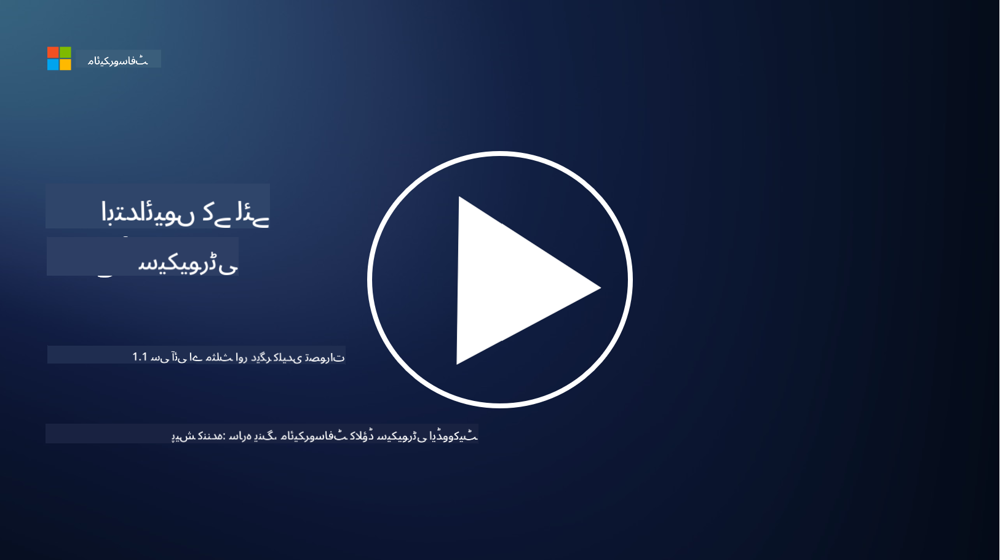
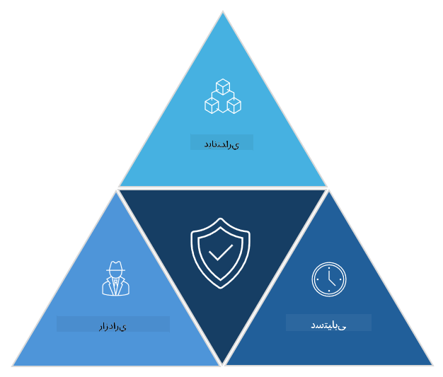

<!--
CO_OP_TRANSLATOR_METADATA:
{
  "original_hash": "16a76f9fa372fb63cffb6d76b855f023",
  "translation_date": "2025-09-03T21:41:53+00:00",
  "source_file": "1.1 The CIA triad and other key concepts.md",
  "language_code": "ur"
}
-->
# سی آئی اے ٹرائیڈ اور دیگر اہم تصورات

## تعارف

اس سبق میں ہم درج ذیل موضوعات کا احاطہ کریں گے:

 - سائبر سیکیورٹی کیا ہے؟
   
 - سائبر سیکیورٹی سی آئی اے ٹرائیڈ کیا ہے؟
   
 - سائبر سیکیورٹی کے تناظر میں صداقت، انکار نہ کرنے کی صلاحیت، اور رازداری کیا ہیں؟

## سائبر سیکیورٹی کیا ہے؟

سائبر سیکیورٹی، جسے معلوماتی تحفظ بھی کہا جاتا ہے، کمپیوٹر سسٹمز، نیٹ ورکس، ڈیوائسز، اور ڈیٹا کو ڈیجیٹل حملوں، غیر مجاز رسائی، نقصان، یا چوری سے محفوظ رکھنے کا عمل ہے۔ سائبر سیکیورٹی کا بنیادی مقصد ڈیجیٹل اثاثوں اور معلومات کی رازداری، سالمیت، اور دستیابی کو یقینی بنانا ہے۔ سائبر سیکیورٹی کے ماہرین اثاثوں، ڈیٹا، اور معلومات کے تحفظ کے لیے حفاظتی کنٹرولز ڈیزائن اور نافذ کرتے ہیں۔ جیسے جیسے ہماری زندگیوں کا زیادہ حصہ ڈیجیٹل اور آن لائن ہو رہا ہے، سائبر سیکیورٹی نجی افراد اور تنظیموں دونوں کے لیے ایک اہم تشویش بن گئی ہے۔

## سائبر سیکیورٹی سی آئی اے ٹرائیڈ کیا ہے؟

سائبر سیکیورٹی ٹرائیڈ اس ماڈل کو کہتے ہیں جو کسی بھی سائبر سیکیورٹی کے کام یا سسٹم/ماحول کے ڈیزائن کے لیے تین اہم پہلوؤں کو شامل کرتا ہے:

### رازداری (Confidentiality)

یہ وہ پہلو ہے جس سے زیادہ تر لوگ واقف ہوں گے جب وہ "سائبر سیکیورٹی" کے بارے میں سوچتے ہیں: رازداری کا مطلب ہے ڈیٹا اور معلومات کو غیر مجاز رسائی کی کوششوں سے محفوظ رکھنا، یعنی صرف وہی لوگ معلومات تک رسائی حاصل کر سکیں جنہیں اس کی ضرورت ہو۔ تاہم، تمام ڈیٹا برابر نہیں ہوتا، اور ڈیٹا کو عام طور پر اس بنیاد پر درجہ بندی اور محفوظ کیا جاتا ہے کہ اگر یہ غلط لوگوں کے ہاتھ لگ جائے تو کتنا نقصان ہو سکتا ہے۔

### سالمیت (Integrity)

یہ اس بات کو یقینی بنانے سے متعلق ہے کہ ماحول میں موجود ڈیٹا کی درستگی اور اعتبار محفوظ رہے اور غیر مجاز افراد ڈیٹا کو تبدیل یا ترمیم نہ کر سکیں۔ مثال کے طور پر، ایک طالب علم ڈی ایم وی میں اپنے ڈرائیور ریکارڈ پر اپنی تاریخ پیدائش میں ترمیم کرتا ہے تاکہ وہ اپنی عمر زیادہ ظاہر کر سکے اور شراب خریدنے کے لیے اپنی لائسنس کی تاریخ کو پہلے کی تاریخ میں دوبارہ پرنٹ کروا سکے۔

### دستیابی (Availability)

یہ آپریشنل آئی ٹی کے تمام پہلوؤں میں ایک اہم پہلو ہے، لیکن دستیابی سائبر سیکیورٹی کے لیے بھی اہم ہے۔ کچھ خاص قسم کے حملے دستیابی کو نشانہ بناتے ہیں، جن سے سیکیورٹی ماہرین کو تحفظ فراہم کرنا ہوتا ہے (مثال کے طور پر، ڈسٹریبیوٹڈ ڈینائل آف سروس – DDoS – حملے)۔

**سائبر سیکیورٹی سی آئی اے ٹرائیڈ**

## سائبر سیکیورٹی کے تناظر میں صداقت، انکار نہ کرنے کی صلاحیت، اور رازداری کیا ہیں؟

یہ اضافی اہم تصورات ہیں جو سسٹمز اور ڈیٹا کی سیکیورٹی اور اعتبار کو یقینی بنانے سے متعلق ہیں:

**صداقت (Authenticity)** - اس بات کی یقین دہانی سے متعلق ہے کہ آپ جس معلومات، مواصلات، یا ادارے کے ساتھ تعامل کر رہے ہیں وہ حقیقی ہے اور اسے غیر مجاز فریقوں نے چھیڑا یا تبدیل نہیں کیا ہے۔

**انکار نہ کرنے کی صلاحیت (Nonrepudiation)** - اس تصور سے مراد یہ ہے کہ کسی فریق کو ان کے کسی عمل یا مواصلات کی صداقت سے انکار کرنے کی اجازت نہ دی جائے۔ یہ اس بات کو یقینی بناتا ہے کہ کوئی یہ دعویٰ نہ کر سکے کہ انہوں نے کوئی پیغام نہیں بھیجا یا کوئی خاص عمل انجام نہیں دیا، جب کہ اس کے برعکس شواہد موجود ہوں۔

**رازداری (Privacy)** - اس کا مطلب ہے حساس اور ذاتی طور پر قابل شناخت معلومات کو غیر مجاز رسائی، استعمال، انکشاف، یا چھیڑ چھاڑ سے محفوظ رکھنا۔ اس میں یہ کنٹرول شامل ہے کہ ذاتی ڈیٹا تک کس کو رسائی حاصل ہے اور یہ ڈیٹا کیسے جمع، محفوظ، اور شیئر کیا جاتا ہے۔

## اضافی مطالعہ

[What Is Information Security (InfoSec)? | Microsoft Security](https://www.microsoft.com/security/business/security-101/what-is-information-security-infosec#:~:text=Three%20pillars%20of%20information%20security%3A%20the%20CIA%20triad,as%20guiding%20principles%20for%20implementing%20an%20InfoSec%20plan.)

---

**ڈسکلیمر**:  
یہ دستاویز AI ترجمہ سروس [Co-op Translator](https://github.com/Azure/co-op-translator) کا استعمال کرتے ہوئے ترجمہ کی گئی ہے۔ ہم درستگی کے لیے کوشش کرتے ہیں، لیکن براہ کرم آگاہ رہیں کہ خودکار ترجمے میں غلطیاں یا غیر درستیاں ہو سکتی ہیں۔ اصل دستاویز کو اس کی اصل زبان میں مستند ذریعہ سمجھا جانا چاہیے۔ اہم معلومات کے لیے، پیشہ ور انسانی ترجمہ کی سفارش کی جاتی ہے۔ ہم اس ترجمے کے استعمال سے پیدا ہونے والی کسی بھی غلط فہمی یا غلط تشریح کے ذمہ دار نہیں ہیں۔