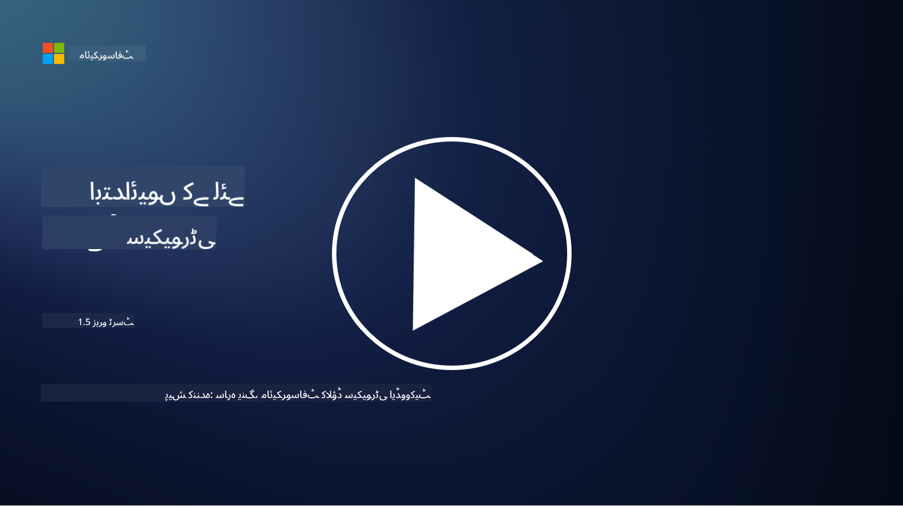
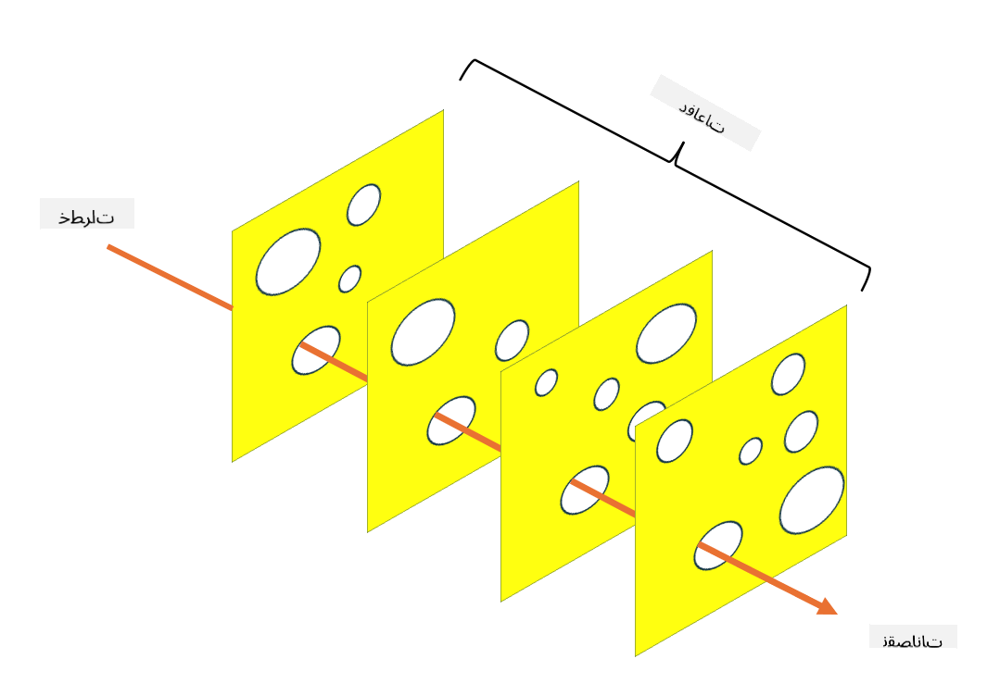

<!--
CO_OP_TRANSLATOR_METADATA:
{
  "original_hash": "75f77f972d2233c584f87c1eb96c983b",
  "translation_date": "2025-09-03T20:34:24+00:00",
  "source_file": "1.5 Zero trust.md",
  "language_code": "ur"
}
-->
# زیرو ٹرسٹ

"زیرو ٹرسٹ" آج کل سیکیورٹی حلقوں میں بہت زیادہ استعمال ہونے والا ایک جملہ ہے۔ لیکن اس کا مطلب کیا ہے؟ کیا یہ صرف ایک فیشن کا لفظ ہے؟ اس سبق میں، ہم زیرو ٹرسٹ کے بارے میں تفصیل سے بات کریں گے۔

## تعارف

- اس سبق میں ہم کور کریں گے:

- زیرو ٹرسٹ کیا ہے؟

- زیرو ٹرسٹ روایتی سیکیورٹی آرکیٹیکچرز سے کیسے مختلف ہے؟

- ڈیفنس ان ڈیپتھ کیا ہے؟

## زیرو ٹرسٹ

زیرو ٹرسٹ ایک سائبر سیکیورٹی طریقہ کار ہے جو "اعتماد کرو لیکن تصدیق کرو" کے روایتی تصور کو چیلنج کرتا ہے۔ یہ فرض کرتا ہے کہ کسی بھی ادارے، چاہے وہ تنظیم کے نیٹ ورک کے اندر ہو یا باہر، پر خود بخود اعتماد نہیں کیا جانا چاہیے۔ اس کے بجائے، زیرو ٹرسٹ ہر صارف، ڈیوائس، اور ایپلیکیشن کی تصدیق کرنے کی حمایت کرتا ہے جو وسائل تک رسائی حاصل کرنے کی کوشش کر رہے ہوں، چاہے وہ کہیں بھی ہوں۔ زیرو ٹرسٹ کا بنیادی اصول "حملے کی سطح" کو کم کرنا اور سیکیورٹی کی خلاف ورزیوں کے ممکنہ اثرات کو محدود کرنا ہے۔

زیرو ٹرسٹ ماڈل میں درج ذیل اصولوں پر زور دیا جاتا ہے:

1. **شناخت کی تصدیق کریں**: تمام صارفین اور ڈیوائسز کی تصدیق اور اجازت سختی سے کی جاتی ہے، چاہے وہ کہیں بھی ہوں۔ یاد رکھیں کہ شناخت ضروری نہیں کہ انسان ہو؛ یہ ایک ڈیوائس، ایپلیکیشن وغیرہ بھی ہو سکتی ہے۔

2. **کم سے کم رسائی**: صارفین اور ڈیوائسز کو صرف وہی رسائی دی جاتی ہے جو ان کے کاموں کو انجام دینے کے لیے ضروری ہو، تاکہ اگر وہ متاثر ہوں تو نقصان کم ہو۔

3. **مائیکرو-سیگمنٹیشن**: نیٹ ورک کے وسائل کو چھوٹے حصوں میں تقسیم کیا جاتا ہے تاکہ خلاف ورزی کی صورت میں نیٹ ورک کے اندر حرکت کو محدود کیا جا سکے۔

4. **مسلسل نگرانی**: صارفین اور ڈیوائسز کے رویے کی مسلسل نگرانی اور تجزیہ کیا جاتا ہے تاکہ غیر معمولی حرکات اور ممکنہ خطرات کا پتہ لگایا جا سکے۔ جدید نگرانی کی تکنیکیں مشین لرننگ، AI، اور تھریٹ انٹیلیجنس کا استعمال کرتی ہیں تاکہ نگرانی میں اضافی تفصیلات اور سیاق و سباق فراہم کیا جا سکے۔

5. **ڈیٹا انکرپشن**: ڈیٹا کو منتقلی کے دوران اور محفوظ حالت میں انکرپٹ کیا جاتا ہے تاکہ غیر مجاز رسائی کو روکا جا سکے۔

6. **سخت رسائی کنٹرول**: رسائی کنٹرولز سیاق و سباق کی بنیاد پر نافذ کیے جاتے ہیں، جیسے صارف کے کردار، ڈیوائس کی صحت، اور نیٹ ورک کی جگہ۔

مائیکروسافٹ زیرو ٹرسٹ کو پانچ ستونوں میں تقسیم کرتا ہے، جن پر ہم ایک بعد کے سبق میں بات کریں گے۔

## روایتی سیکیورٹی آرکیٹیکچرز سے فرق

زیرو ٹرسٹ روایتی سیکیورٹی آرکیٹیکچرز، جیسے کہ پیریمیٹر پر مبنی ماڈلز، سے کئی طریقوں سے مختلف ہے:

1. **پیریمیٹر بمقابلہ شناخت پر مبنی**: روایتی ماڈلز نیٹ ورک کے پیریمیٹر کو محفوظ کرنے پر توجہ دیتے ہیں اور فرض کرتے ہیں کہ اندرونی صارفین اور ڈیوائسز پر اعتماد کیا جا سکتا ہے۔ زیرو ٹرسٹ، اس کے برعکس، فرض کرتا ہے کہ خطرات نیٹ ورک کے اندر اور باہر دونوں سے پیدا ہو سکتے ہیں اور سخت شناخت پر مبنی کنٹرولز نافذ کرتا ہے۔

2. **ضمنی بمقابلہ واضح اعتماد**: روایتی ماڈلز نیٹ ورک کے اندر موجود ڈیوائسز اور صارفین پر ضمنی طور پر اعتماد کرتے ہیں جب تک کہ ان کے خلاف کچھ ثابت نہ ہو۔ زیرو ٹرسٹ واضح طور پر شناختوں کی تصدیق کرتا ہے اور غیر معمولی حرکات کی مسلسل نگرانی کرتا ہے۔

3. **فلیٹ بمقابلہ سیگمنٹڈ نیٹ ورک**: روایتی آرکیٹیکچرز اکثر فلیٹ نیٹ ورکس شامل کرتے ہیں جہاں اندرونی صارفین کو وسیع رسائی حاصل ہوتی ہے۔ زیرو ٹرسٹ نیٹ ورک کو چھوٹے، الگ تھلگ زونز میں تقسیم کرنے کی حمایت کرتا ہے تاکہ ممکنہ خلاف ورزیوں کو محدود کیا جا سکے۔

4. **ردعمل بمقابلہ پیشگی اقدامات**: روایتی سیکیورٹی اکثر ردعمل پر مبنی اقدامات جیسے پیریمیٹر فائر والز اور انٹروژن ڈیٹیکشن پر انحصار کرتی ہے۔ زیرو ٹرسٹ ایک پیشگی طریقہ اپناتا ہے، یہ فرض کرتے ہوئے کہ خلاف ورزیاں ممکن ہیں اور ان کے اثرات کو کم کرنے پر توجہ دیتا ہے۔

## ڈیفنس ان ڈیپتھ

ڈیفنس ان ڈیپتھ، جسے لیئرڈ سیکیورٹی بھی کہا جاتا ہے، ایک سائبر سیکیورٹی حکمت عملی ہے جس میں تنظیم کے اثاثوں کی حفاظت کے لیے متعدد سیکیورٹی کنٹرولز اور اقدامات کی تہیں تعینات کی جاتی ہیں۔ اس کا مقصد دفاع کی اوورلیپنگ تہیں بنانا ہے تاکہ اگر ایک تہہ متاثر ہو جائے تو دیگر تہیں اب بھی تحفظ فراہم کر سکیں۔ ہر تہہ سیکیورٹی کے مختلف پہلو پر توجہ دیتی ہے اور تنظیم کی مجموعی سیکیورٹی کو بہتر بناتی ہے۔

ڈیفنس ان ڈیپتھ میں تکنیکی، طریقہ کار، اور جسمانی سیکیورٹی اقدامات کا امتزاج شامل ہوتا ہے۔ ان میں فائر والز، انٹروژن ڈیٹیکشن سسٹمز، رسائی کنٹرولز، انکرپشن، صارفین کی تربیت، سیکیورٹی پالیسیاں، اور مزید شامل ہو سکتے ہیں۔ اس کا تصور یہ ہے کہ متعدد رکاوٹیں پیدا کی جائیں جو مجموعی طور پر حملہ آوروں کے لیے تنظیم کے سسٹمز اور نیٹ ورکس میں داخل ہونا مشکل بنا دیں۔ اسے کبھی کبھار "سوئس چیز" ماڈل بھی کہا جاتا ہے، جو دیگر صنعتوں (جیسے ٹرانسپورٹ) میں حادثات کی روک تھام کے لیے استعمال ہوتا ہے۔

## مزید مطالعہ

[زیرو ٹرسٹ کیا ہے؟](https://learn.microsoft.com/security/zero-trust/zero-trust-overview?WT.mc_id=academic-96948-sayoung)

[زیرو ٹرسٹ کی ترقی – مائیکروسافٹ پوزیشن پیپر](https://query.prod.cms.rt.microsoft.com/cms/api/am/binary/RWJJdT?WT.mc_id=academic-96948-sayoung)

[زیرو ٹرسٹ اور بیونڈ کارپ گوگل کلاؤڈ | گوگل کلاؤڈ بلاگ](https://cloud.google.com/blog/topics/developers-practitioners/zero-trust-and-beyondcorp-google-cloud)

---

**ڈسکلیمر**:  
یہ دستاویز AI ترجمہ سروس [Co-op Translator](https://github.com/Azure/co-op-translator) کا استعمال کرتے ہوئے ترجمہ کی گئی ہے۔ ہم درستگی کے لیے کوشش کرتے ہیں، لیکن براہ کرم آگاہ رہیں کہ خودکار ترجمے میں غلطیاں یا غیر درستیاں ہو سکتی ہیں۔ اصل دستاویز کو اس کی اصل زبان میں مستند ذریعہ سمجھا جانا چاہیے۔ اہم معلومات کے لیے، پیشہ ور انسانی ترجمہ کی سفارش کی جاتی ہے۔ ہم اس ترجمے کے استعمال سے پیدا ہونے والی کسی بھی غلط فہمی یا غلط تشریح کے ذمہ دار نہیں ہیں۔