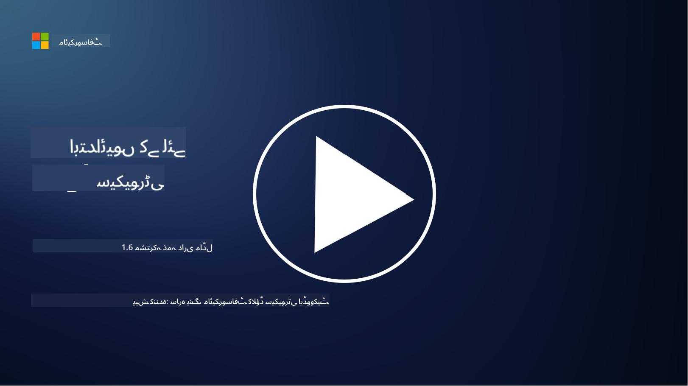

<!--
CO_OP_TRANSLATOR_METADATA:
{
  "original_hash": "a48db640d80c786b928ca178c414f084",
  "translation_date": "2025-09-03T21:07:29+00:00",
  "source_file": "1.6 Shared responsibility model.md",
  "language_code": "ur"
}
-->
# مشترکہ ذمہ داری کا ماڈل

مشترکہ ذمہ داری آئی ٹی میں ایک نیا تصور ہے جو کلاؤڈ کمپیوٹنگ کے آغاز کے ساتھ وجود میں آیا۔ سائبر سیکیورٹی کے نقطہ نظر سے، یہ سمجھنا بہت ضروری ہے کہ کون کون سے حفاظتی اقدامات فراہم کر رہا ہے تاکہ دفاع میں کوئی خلا نہ رہے۔

## تعارف

اس سبق میں ہم درج ذیل موضوعات کا احاطہ کریں گے:

- سائبر سیکیورٹی کے تناظر میں مشترکہ ذمہ داری کیا ہے؟

- IaaS، PaaS اور SaaS کے درمیان حفاظتی اقدامات میں مشترکہ ذمہ داری کا فرق کیا ہے؟

- آپ کہاں سے معلوم کر سکتے ہیں کہ آپ کا کلاؤڈ پلیٹ فارم کون سے حفاظتی اقدامات فراہم کر رہا ہے؟

- "اعتماد کریں لیکن تصدیق کریں" کیا ہے؟

## سائبر سیکیورٹی کے تناظر میں مشترکہ ذمہ داری کیا ہے؟

سائبر سیکیورٹی میں مشترکہ ذمہ داری سے مراد کلاؤڈ سروس فراہم کنندہ (CSP) اور اس کے صارفین کے درمیان حفاظتی ذمہ داریوں کی تقسیم ہے۔ کلاؤڈ کمپیوٹنگ کے ماحول میں، جیسے کہ Infrastructure as a Service (IaaS)، Platform as a Service (PaaS)، اور Software as a Service (SaaS)، CSP اور صارف دونوں کو ڈیٹا، ایپلیکیشنز، اور سسٹمز کی حفاظت کو یقینی بنانے میں کردار ادا کرنا ہوتا ہے۔

## IaaS، PaaS اور SaaS کے درمیان حفاظتی اقدامات میں مشترکہ ذمہ داری کا فرق کیا ہے؟

ذمہ داریوں کی تقسیم عام طور پر استعمال ہونے والی کلاؤڈ سروس کی قسم پر منحصر ہوتی ہے:

- **IaaS (Infrastructure as a Service)**: CSP بنیادی انفراسٹرکچر (سرورز، نیٹ ورکنگ، اسٹوریج) فراہم کرتا ہے، جبکہ صارف آپریٹنگ سسٹمز، ایپلیکیشنز، اور اس انفراسٹرکچر پر حفاظتی ترتیبات کا انتظام کرتا ہے۔

- **PaaS (Platform as a Service)**: CSP ایک پلیٹ فارم فراہم کرتا ہے جس پر صارفین ایپلیکیشنز بنا اور تعینات کر سکتے ہیں۔ CSP بنیادی انفراسٹرکچر کا انتظام کرتا ہے، اور صارف ایپلیکیشن کی ترقی اور ڈیٹا کی حفاظت پر توجہ دیتا ہے۔

- **SaaS (Software as a Service)**: CSP مکمل طور پر فعال ایپلیکیشنز فراہم کرتا ہے جو انٹرنیٹ کے ذریعے قابل رسائی ہوتی ہیں۔ اس صورت میں، CSP ایپلیکیشن کی حفاظت اور انفراسٹرکچر کا ذمہ دار ہوتا ہے، جبکہ صارف صارفین کی رسائی اور ڈیٹا کے استعمال کا انتظام کرتا ہے۔

مشترکہ ذمہ داری کو سمجھنا بہت ضروری ہے کیونکہ یہ واضح کرتا ہے کہ کون سے حفاظتی پہلو CSP کے ذریعے کور کیے گئے ہیں اور کون سے صارف کو حل کرنے کی ضرورت ہے۔ یہ غلط فہمیوں کو روکنے میں مدد کرتا ہے اور یقینی بناتا ہے کہ حفاظتی اقدامات جامع طور پر نافذ کیے جائیں۔

## آپ کہاں سے معلوم کر سکتے ہیں کہ آپ کا کلاؤڈ پلیٹ فارم کون سے حفاظتی اقدامات فراہم کر رہا ہے؟

یہ معلوم کرنے کے لیے کہ آپ کا کلاؤڈ پلیٹ فارم کون سے حفاظتی اقدامات فراہم کر رہا ہے، آپ کو کلاؤڈ سروس فراہم کنندہ کی دستاویزات اور وسائل کا حوالہ دینا ہوگا۔ ان میں شامل ہیں:

- **CSP کی ویب سائٹ اور دستاویزات**: CSP کی ویب سائٹ پر ان کی خدمات کے حصے کے طور پر پیش کیے جانے والے حفاظتی فیچرز اور اقدامات کے بارے میں معلومات موجود ہوں گی۔ CSP عام طور پر تفصیلی دستاویزات فراہم کرتے ہیں جو ان کے حفاظتی طریقوں، اقدامات، اور سفارشات کی وضاحت کرتی ہیں۔ اس میں وائٹ پیپرز، حفاظتی گائیڈز، اور تکنیکی دستاویزات شامل ہو سکتی ہیں۔

- **حفاظتی جائزے اور آڈٹس**: زیادہ تر CSP اپنے حفاظتی اقدامات کو آزاد حفاظتی ماہرین اور تنظیموں کے ذریعے جانچتے ہیں۔ یہ جائزے CSP کے حفاظتی اقدامات کے معیار کے بارے میں بصیرت فراہم کر سکتے ہیں۔ کبھی کبھار یہ CSP کو حفاظتی تعمیل کا سرٹیفکیٹ حاصل کرنے کا باعث بنتا ہے (اگلے نقطہ دیکھیں)۔

- **حفاظتی تعمیل کے سرٹیفکیٹس**: زیادہ تر CSP ISO:27001، SOC 2، اور FedRAMP جیسے سرٹیفکیٹس حاصل کرتے ہیں۔ یہ سرٹیفکیٹس ظاہر کرتے ہیں کہ فراہم کنندہ مخصوص حفاظتی اور تعمیل کے معیارات پر پورا اترتا ہے۔

یاد رکھیں کہ معلومات کی تفصیل اور دستیابی کلاؤڈ فراہم کنندگان کے درمیان مختلف ہو سکتی ہے۔ ہمیشہ یہ یقینی بنائیں کہ آپ کلاؤڈ سروس فراہم کنندہ کے فراہم کردہ سرکاری اور تازہ ترین وسائل سے مشورہ کر رہے ہیں تاکہ اپنے کلاؤڈ پر مبنی اثاثوں کی حفاظت کے بارے میں باخبر فیصلے کر سکیں۔

## "اعتماد کریں لیکن تصدیق کریں" کیا ہے؟

CSP، تھرڈ پارٹی سافٹ ویئر یا دیگر آئی ٹی حفاظتی خدمات کے استعمال کے تناظر میں، ایک تنظیم ابتدائی طور پر فراہم کنندہ کے حفاظتی اقدامات کے دعووں پر اعتماد کر سکتی ہے۔ تاہم، اپنے ڈیٹا اور سسٹمز کی حفاظت کو یقینی بنانے کے لیے، وہ ان دعووں کی تصدیق حفاظتی جائزوں، پینیٹریشن ٹیسٹنگ، اور بیرونی پارٹی کے حفاظتی اقدامات کے جائزے کے ذریعے کرے گی، اس سے پہلے کہ سافٹ ویئر یا سروس کو مکمل طور پر اپنے آپریشنز میں شامل کرے۔ تمام افراد اور تنظیموں کو ان حفاظتی اقدامات پر اعتماد کرنا چاہیے لیکن تصدیق بھی کرنی چاہیے جن کے وہ خود ذمہ دار نہیں ہیں۔

## تنظیم کے اندر مشترکہ ذمہ داری

یاد رکھیں، تنظیم کے اندر مختلف ٹیموں کے لیے حفاظتی اقدامات میں مشترکہ ذمہ داری کو بھی مدنظر رکھنا ضروری ہے۔ حفاظتی ٹیم شاذ و نادر ہی تمام اقدامات خود نافذ کرے گی اور آپریشنز ٹیموں، ڈویلپرز، اور کاروبار کے دیگر حصوں کے ساتھ تعاون کی ضرورت ہوگی تاکہ تمام حفاظتی اقدامات نافذ کیے جا سکیں جو تنظیم کو محفوظ رکھنے کے لیے ضروری ہیں۔

## مزید مطالعہ
- [Shared responsibility in the cloud - Microsoft Azure | Microsoft Learn](https://learn.microsoft.com/azure/security/fundamentals/shared-responsibility?WT.mc_id=academic-96948-sayoung)
- [What is shared responsibility model? – Definition from TechTarget.com](https://www.techtarget.com/searchcloudcomputing/definition/shared-responsibility-model)
- [The shared responsibility model explained and what it means for cloud security | CSO Online](https://www.csoonline.com/article/570779/the-shared-responsibility-model-explained-and-what-it-means-for-cloud-security.html)
- [Shared Responsibility for Cloud Security: What You Need to Know (cisecurity.org)](https://www.cisecurity.org/insights/blog/shared-responsibility-cloud-security-what-you-need-to-know)

---

**ڈسکلیمر**:  
یہ دستاویز AI ترجمہ سروس [Co-op Translator](https://github.com/Azure/co-op-translator) کا استعمال کرتے ہوئے ترجمہ کی گئی ہے۔ ہم درستگی کے لیے کوشش کرتے ہیں، لیکن براہ کرم آگاہ رہیں کہ خودکار ترجمے میں غلطیاں یا غیر درستیاں ہو سکتی ہیں۔ اصل دستاویز کو اس کی اصل زبان میں مستند ذریعہ سمجھا جانا چاہیے۔ اہم معلومات کے لیے، پیشہ ور انسانی ترجمہ کی سفارش کی جاتی ہے۔ ہم اس ترجمے کے استعمال سے پیدا ہونے والی کسی بھی غلط فہمی یا غلط تشریح کے ذمہ دار نہیں ہیں۔