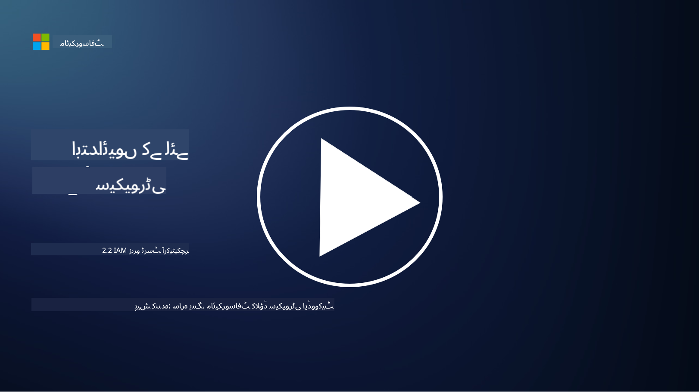

<!--
CO_OP_TRANSLATOR_METADATA:
{
  "original_hash": "4774a978af123f72ebb872199c4c4d4f",
  "translation_date": "2025-09-03T20:29:23+00:00",
  "source_file": "2.2 IAM zero trust architecture.md",
  "language_code": "ur"
}
-->
# IAM زیرو ٹرسٹ آرکیٹیکچر

شناخت کسی بھی آئی ٹی ماحول کے لیے زیرو ٹرسٹ آرکیٹیکچر نافذ کرنے اور ایک حد قائم کرنے کا ایک اہم حصہ ہے۔ اس سیکشن میں ہم یہ دریافت کریں گے کہ زیرو ٹرسٹ نافذ کرنے کے لیے شناختی کنٹرولز کا استعمال کیوں ضروری ہے۔

## تعارف

اس سبق میں ہم درج ذیل موضوعات کا احاطہ کریں گے:

- جدید آئی ٹی ماحول میں اپنی حد کے طور پر شناخت کا استعمال کیوں ضروری ہے؟

- یہ روایتی آئی ٹی آرکیٹیکچرز سے کیسے مختلف ہے؟

- زیرو ٹرسٹ آرکیٹیکچر نافذ کرنے کے لیے شناخت کا استعمال کیسے کیا جاتا ہے؟

## جدید آئی ٹی ماحول میں اپنی حد کے طور پر شناخت کا استعمال کیوں ضروری ہے؟

جدید آئی ٹی ماحول میں، سائبر خطرات کے خلاف دفاع کے لیے جسمانی حد (جیسے فائر والز اور نیٹ ورک کی حدود) کے روایتی تصور کا استعمال کم مؤثر ہوتا جا رہا ہے۔ اس کی وجہ ٹیکنالوجی کی بڑھتی ہوئی پیچیدگی، ریموٹ ورک کے رجحان، اور کلاؤڈ سروسز کو اپنانا ہے۔ اس کے بجائے، تنظیمیں شناخت کو نئی حد کے طور پر استعمال کرنے کی طرف بڑھ رہی ہیں۔ اس کا مطلب یہ ہے کہ سیکیورٹی صارفین، ڈیوائسز، اور ایپلیکیشنز کی شناخت کی تصدیق اور انتظام کے گرد گھومتی ہے، چاہے وہ کسی بھی جسمانی مقام سے وسائل تک رسائی حاصل کر رہے ہوں۔

جدید آئی ٹی ماحول میں شناخت کو حد کے طور پر استعمال کرنے کی اہمیت درج ذیل وجوہات کی بنا پر ہے:

**ریموٹ ورک فورس**: ریموٹ ورک اور موبائل ڈیوائسز کے عام ہونے کے ساتھ، صارفین مختلف مقامات اور ڈیوائسز سے وسائل تک رسائی حاصل کر سکتے ہیں۔ روایتی حد کا طریقہ کار اس وقت کام نہیں کرتا جب صارفین جسمانی دفتر تک محدود نہ ہوں۔

**کلاؤڈ اور ہائبرڈ ماحول**: تنظیمیں کلاؤڈ سروسز اور ہائبرڈ ماحول کو اپنانے میں اضافہ کر رہی ہیں۔ ڈیٹا اور ایپلیکیشنز اب صرف تنظیم کے احاطے میں موجود نہیں ہیں، جس سے روایتی حد کے دفاع کم مؤثر ہو جاتے ہیں۔

**زیرو ٹرسٹ سیکیورٹی**: زیرو ٹرسٹ سیکیورٹی کا تصور فرض کرتا ہے کہ کوئی بھی ادارہ، چاہے وہ نیٹ ورک کے اندر ہو یا باہر، خود بخود قابل اعتماد نہیں ہونا چاہیے۔ شناخت رسائی کی درخواستوں کی تصدیق کے لیے بنیاد بن جاتی ہے، چاہے وہ کہیں سے بھی آئیں۔

**خطرات کا منظرنامہ**: سائبر خطرات ترقی کر رہے ہیں، اور حملہ آور روایتی حد کے دفاع کو نظرانداز کرنے کے طریقے تلاش کر رہے ہیں۔ فشنگ، سوشل انجینئرنگ، اور اندرونی خطرات اکثر انسانی کمزوریوں کا فائدہ اٹھاتے ہیں بجائے اس کے کہ نیٹ ورک کی حدود کو توڑنے کی کوشش کریں۔

**ڈیٹا پر مرکوز نقطہ نظر**: حساس ڈیٹا کی حفاظت سب سے اہم ہے۔ شناخت پر توجہ مرکوز کرکے، تنظیمیں یہ کنٹرول کر سکتی ہیں کہ کون سا ڈیٹا کس تک رسائی حاصل کرتا ہے، جس سے ڈیٹا کی خلاف ورزیوں کا خطرہ کم ہو جاتا ہے۔

## یہ روایتی آئی ٹی آرکیٹیکچرز سے کیسے مختلف ہے؟

روایتی آئی ٹی آرکیٹیکچرز حد پر مبنی سیکیورٹی ماڈلز پر بہت زیادہ انحصار کرتے تھے، جہاں فائر والز اور نیٹ ورک کی حدود خطرات کو باہر رکھنے میں اہم کردار ادا کرتے تھے۔ روایتی اور شناخت پر مبنی طریقوں کے درمیان اہم فرق درج ذیل ہیں:

|      پہلو                  |      روایتی آئی ٹی آرکیٹیکچرز                                                                  |      شناخت پر مبنی طریقہ                                                                             |
|-----------------------------|----------------------------------------------------------------------------------------------------|------------------------------------------------------------------------------------------------------------|
|     توجہ                   |     حد پر توجہ: فائر والز اور رسائی کنٹرول جیسے حد کے دفاع پر انحصار۔             |     شناخت کی تصدیق پر توجہ: نیٹ ورک کی حدود سے صارف/ڈیوائس کی شناخت کی تصدیق کی طرف منتقلی۔     |
|     مقام                  |     مقام پر انحصار: - سیکیورٹی جسمانی دفتر کے مقامات اور نیٹ ورک کی حدود سے منسلک۔    |     مقام کی آزادی: سیکیورٹی مخصوص مقامات سے منسلک نہیں؛ کہیں سے بھی رسائی۔                |
|     اعتماد کا مفروضہ        |     مفروضہ اعتماد: نیٹ ورک کی حد کے اندر صارفین/ڈیوائسز پر اعتماد کیا جاتا تھا۔                 |     زیرو ٹرسٹ طریقہ: اعتماد کبھی فرض نہیں کیا جاتا؛ رسائی کی تصدیق شناخت اور سیاق و سباق کی بنیاد پر کی جاتی ہے۔       |
|     ڈیوائس کا خیال          |     ڈیوائس کی تنوع: نیٹ ورک کی حد کے اندر موجود ڈیوائسز کو محفوظ سمجھا جاتا تھا۔                  |     ڈیوائس کی آگاہی: مقام سے قطع نظر، ڈیوائس کی صحت اور سیکیورٹی کی حالت کو مدنظر رکھا جاتا ہے۔               |
|     ڈیٹا کی حفاظت          |     ڈیٹا کی حفاظت: ڈیٹا کی حفاظت کے لیے نیٹ ورک کی حدود کو محفوظ بنایا جاتا تھا۔                 |     ڈیٹا پر مرکوز حفاظت: شناخت اور ڈیٹا کی حساسیت کی بنیاد پر ڈیٹا تک رسائی کو کنٹرول کرنے پر توجہ۔    |
|                             |                                                                                                    |                                                                                                            |

## زیرو ٹرسٹ آرکیٹیکچر نافذ کرنے کے لیے شناخت کا استعمال کیسے کیا جاتا ہے؟

زیرو ٹرسٹ آرکیٹیکچر میں بنیادی اصول یہ ہے کہ کسی بھی ادارے پر خود بخود اعتماد نہ کیا جائے، چاہے وہ نیٹ ورک کی حد کے اندر ہو یا باہر۔ شناخت زیرو ٹرسٹ کے طریقہ کار کو نافذ کرنے میں مرکزی کردار ادا کرتی ہے، جس سے وسائل تک رسائی حاصل کرنے والے اداروں کی مسلسل تصدیق ممکن ہوتی ہے۔ جدید شناختی سیکیورٹی کنٹرولز کے ذریعے ہر صارف، ڈیوائس، ایپلیکیشن، اور سروس جو وسائل تک رسائی حاصل کرنا چاہتی ہے، کو مکمل طور پر شناخت اور تصدیق کرنا ضروری ہوتا ہے۔ اس میں ان کی ڈیجیٹل شناخت کی تصدیق شامل ہوتی ہے، جیسے کہ یوزر نیم/پاس ورڈ کے امتزاج، ملٹی فیکٹر تصدیق (MFA)، بایومیٹرکس، اور دیگر مضبوط تصدیقی طریقے۔

## مزید مطالعہ

- [Securing identity with Zero Trust | Microsoft Learn](https://learn.microsoft.com/security/zero-trust/deploy/identity?WT.mc_id=academic-96948-sayoung)
- [Zero Trust Principles and Guidance for Identity and Access | CSA (cloudsecurityalliance.org)](https://cloudsecurityalliance.org/artifacts/zero-trust-principles-and-guidance-for-iam/)
- [Zero Trust Identity Controls - Essentials Series - Episode 2 - YouTube](https://www.youtube.com/watch?v=fQZQznIKcGM&list=PLXtHYVsvn_b_gtX1-NB62wNervQx1Fhp4&index=13)

---

**ڈسکلیمر**:  
یہ دستاویز AI ترجمہ سروس [Co-op Translator](https://github.com/Azure/co-op-translator) کا استعمال کرتے ہوئے ترجمہ کی گئی ہے۔ ہم درستگی کے لیے کوشش کرتے ہیں، لیکن براہ کرم آگاہ رہیں کہ خودکار ترجمے میں غلطیاں یا غیر درستیاں ہو سکتی ہیں۔ اصل دستاویز کو اس کی اصل زبان میں مستند ذریعہ سمجھا جانا چاہیے۔ اہم معلومات کے لیے، پیشہ ور انسانی ترجمہ کی سفارش کی جاتی ہے۔ ہم اس ترجمے کے استعمال سے پیدا ہونے والی کسی بھی غلط فہمی یا غلط تشریح کے ذمہ دار نہیں ہیں۔