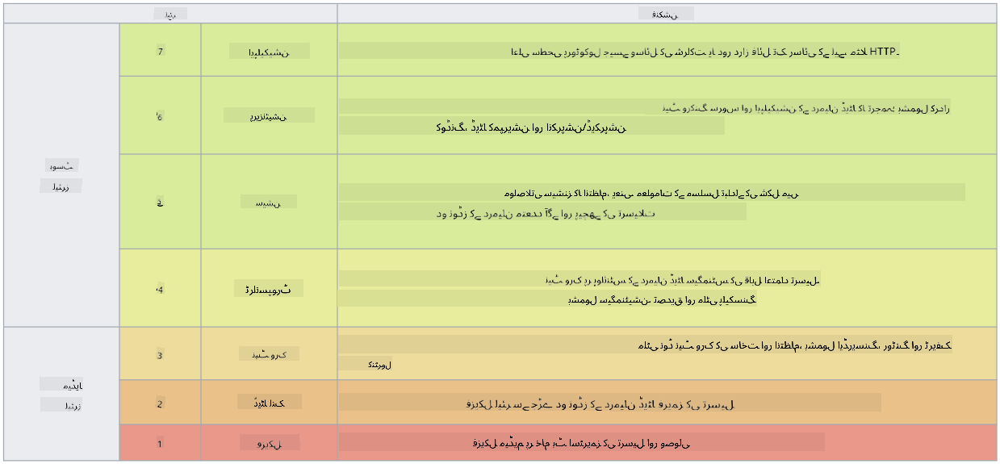

<!--
CO_OP_TRANSLATOR_METADATA:
{
  "original_hash": "252724eceeb183fb9018f88c5e1a3f0c",
  "translation_date": "2025-09-03T22:07:55+00:00",
  "source_file": "3.1 Networking key concepts.md",
  "language_code": "ur"
}
-->
# نیٹ ورکنگ کے اہم تصورات

اگر آپ نے آئی ٹی میں کوئی کام کیا ہے، تو ممکن ہے کہ آپ نیٹ ورکنگ کے تصورات سے واقف ہوں۔ جدید ماحول میں ہم شناخت کو اپنی بنیادی حفاظتی حد کے طور پر استعمال کرتے ہیں، لیکن اس کا مطلب یہ نہیں کہ نیٹ ورک کنٹرول غیر ضروری ہو گئے ہیں۔ یہ ایک وسیع موضوع ہے، لیکن اس سبق میں ہم نیٹ ورکنگ کے کچھ اہم تصورات پر بات کریں گے۔

اس سبق میں ہم درج ذیل موضوعات کا احاطہ کریں گے:

- آئی پی ایڈریسنگ کیا ہے؟

- او ایس آئی ماڈل کیا ہے؟

- ٹی سی پی/یو ڈی پی کیا ہے؟

- پورٹ نمبرز کیا ہیں؟

- ڈیٹا کو محفوظ رکھنے اور منتقل کرنے کے دوران انکرپشن کیا ہے؟

## آئی پی ایڈریسنگ کیا ہے؟

آئی پی ایڈریسنگ، یا انٹرنیٹ پروٹوکول ایڈریسنگ، ایک عددی لیبل ہے جو ہر اس ڈیوائس کو دیا جاتا ہے جو انٹرنیٹ پروٹوکول کے ذریعے کسی کمپیوٹر نیٹ ورک سے جڑی ہوتی ہے۔ یہ نیٹ ورک میں موجود ڈیوائسز کے لیے ایک منفرد شناخت فراہم کرتا ہے، تاکہ وہ انٹرنیٹ یا دیگر جڑے ہوئے نیٹ ورکس کے ذریعے ڈیٹا بھیج اور وصول کر سکیں۔ آئی پی ایڈریسنگ کے دو اہم ورژنز ہیں: IPv4 (انٹرنیٹ پروٹوکول ورژن 4) اور IPv6 (انٹرنیٹ پروٹوکول ورژن 6)۔ آئی پی ایڈریس عام طور پر IPv4 فارمیٹ (مثلاً 192.168.1.1) یا IPv6 فارمیٹ (مثلاً 2001:0db8:85a3:0000:0000:8a2e:0370:7334) میں ظاہر کیا جاتا ہے۔

## او ایس آئی ماڈل کیا ہے؟

او ایس آئی (اوپن سسٹمز انٹرکنیکشن) ماڈل ایک تصوراتی فریم ورک ہے جو کسی کمیونیکیشن سسٹم کے افعال کو سات مختلف تہوں میں معیاری بناتا ہے۔ ہر تہہ مخصوص کام انجام دیتی ہے اور مؤثر اور قابل اعتماد ڈیٹا کمیونیکیشن کو یقینی بنانے کے لیے قریبی تہوں کے ساتھ بات چیت کرتی ہے۔ یہ تہیں نیچے سے اوپر تک درج ذیل ہیں:

1. فزیکل تہہ

2. ڈیٹا لنک تہہ

3. نیٹ ورک تہہ

4. ٹرانسپورٹ تہہ

5. سیشن تہہ

6. پریزنٹیشن تہہ

7. ایپلیکیشن تہہ

او ایس آئی ماڈل نیٹ ورکنگ پروٹوکولز اور ٹیکنالوجیز کے درمیان تعامل کو سمجھنے کے لیے ایک عام حوالہ فراہم کرتا ہے، چاہے مخصوص ہارڈویئر یا سافٹ ویئر کے نفاذ کچھ بھی ہوں۔

_ref: https://en.wikipedia.org/wiki/OSI_model_

## ٹی سی پی/یو ڈی پی کیا ہے؟

ٹی سی پی (ٹرانسمیشن کنٹرول پروٹوکول) اور یو ڈی پی (یوزر ڈیٹا گرام پروٹوکول) دو بنیادی ٹرانسپورٹ لیئر پروٹوکولز ہیں جو کمپیوٹر نیٹ ورکس میں ڈیوائسز کے درمیان انٹرنیٹ یا لوکل نیٹ ورک کے ذریعے کمیونیکیشن کو آسان بناتے ہیں۔ یہ ڈیٹا کو پیکٹس میں تقسیم کرتے ہیں تاکہ اسے منتقل کیا جا سکے اور پھر وصول کرنے والے سرے پر ان پیکٹس کو اصل ڈیٹا میں دوبارہ ترتیب دیتے ہیں۔ تاہم، ان کی خصوصیات اور استعمال کے معاملات مختلف ہیں۔

**ٹی سی پی (ٹرانسمیشن کنٹرول پروٹوکول)**:

ٹی سی پی ایک کنکشن پر مبنی پروٹوکول ہے جو ڈیوائسز کے درمیان قابل اعتماد اور ترتیب وار ڈیٹا کی ترسیل فراہم کرتا ہے۔ یہ ڈیٹا کے تبادلے سے پہلے بھیجنے والے اور وصول کرنے والے کے درمیان کنکشن قائم کرتا ہے۔ ٹی سی پی اس بات کو یقینی بناتا ہے کہ ڈیٹا پیکٹس صحیح ترتیب میں پہنچیں اور گمشدہ پیکٹس کی دوبارہ ترسیل کو سنبھال سکتا ہے تاکہ ڈیٹا کی سالمیت اور مکملیت کی ضمانت دی جا سکے۔ یہ ٹی سی پی کو ان ایپلیکیشنز کے لیے موزوں بناتا ہے جنہیں قابل اعتماد ڈیٹا کی ترسیل کی ضرورت ہوتی ہے، جیسے ویب براؤزنگ، ای میل، فائل ٹرانسفر (ایف ٹی پی)، اور ڈیٹا بیس کمیونیکیشن۔

**یو ڈی پی (یوزر ڈیٹا گرام پروٹوکول)**:

یو ڈی پی ایک کنکشن لیس پروٹوکول ہے جو تیز تر ڈیٹا کی ترسیل فراہم کرتا ہے لیکن ٹی سی پی جیسی قابل اعتمادیت فراہم نہیں کرتا۔ یہ ڈیٹا بھیجنے سے پہلے رسمی کنکشن قائم نہیں کرتا اور گمشدہ پیکٹس کی تصدیق یا دوبارہ ترسیل کے لیے کوئی میکانزم شامل نہیں کرتا۔ یو ڈی پی ان ایپلیکیشنز کے لیے موزوں ہے جہاں رفتار اور کارکردگی قابل اعتماد ترسیل سے زیادہ اہم ہیں، جیسے ریئل ٹائم کمیونیکیشن، اسٹریمنگ میڈیا، آن لائن گیمنگ، اور ڈی این ایس کوئریز۔

خلاصہ یہ کہ ٹی سی پی قابل اعتمادیت اور ترتیب وار ترسیل کو ترجیح دیتا ہے، جو اسے ان ایپلیکیشنز کے لیے موزوں بناتا ہے جنہیں ڈیٹا کی درستگی کی ضرورت ہوتی ہے، جبکہ یو ڈی پی رفتار اور کارکردگی کو ترجیح دیتا ہے، جو اسے ان ایپلیکیشنز کے لیے موزوں بناتا ہے جہاں معمولی ڈیٹا کا نقصان یا ترتیب کی تبدیلی قابل قبول ہو، لیکن کم لیٹنسی کی ضرورت ہو۔ ٹی سی پی اور یو ڈی پی کے درمیان انتخاب ایپلیکیشن یا سروس کی مخصوص ضروریات پر منحصر ہوتا ہے۔

## پورٹ نمبرز کیا ہیں؟

نیٹ ورکنگ میں، پورٹ نمبر ایک عددی شناخت ہے جو ایک نیٹ ورک میں موجود کسی ڈیوائس پر چلنے والی مختلف سروسز یا ایپلیکیشنز کے درمیان فرق کرنے کے لیے استعمال ہوتی ہے۔ پورٹس آنے والے ڈیٹا کو مناسب ایپلیکیشن کی طرف بھیجنے میں مدد کرتی ہیں۔ پورٹ نمبرز 16-بٹ غیر دستخط شدہ اعداد ہیں، جس کا مطلب ہے کہ ان کی حد 0 سے 65535 تک ہوتی ہے۔ یہ تین رینجز میں تقسیم کیے گئے ہیں:

- ویل-نون پورٹس (0-1023): معیاری سروسز کے لیے مخصوص، جیسے HTTP (پورٹ 80) اور FTP (پورٹ 21)۔

- رجسٹرڈ پورٹس (1024-49151): ان ایپلیکیشنز اور سروسز کے لیے استعمال ہوتی ہیں جو ویل-نون رینج کا حصہ نہیں ہیں لیکن باضابطہ طور پر رجسٹرڈ ہیں۔

- ڈائنامک/پرائیویٹ پورٹس (49152-65535): ایپلیکیشنز کے ذریعے عارضی یا نجی استعمال کے لیے دستیاب ہیں۔

## ڈیٹا کو محفوظ رکھنے اور منتقل کرنے کے دوران انکرپشن کیا ہے؟

انکرپشن ڈیٹا کو ایک محفوظ فارمیٹ میں تبدیل کرنے کا عمل ہے تاکہ اسے غیر مجاز رسائی یا چھیڑ چھاڑ سے بچایا جا سکے۔ انکرپشن کو ڈیٹا پر "محفوظ حالت" (جب ڈیوائس یا سرور پر محفوظ ہو) اور "منتقلی کے دوران" (جب ڈیوائسز یا نیٹ ورکس کے درمیان منتقل ہو رہا ہو) لاگو کیا جا سکتا ہے۔

محفوظ حالت میں انکرپشن: یہ انکرپشن ان ڈیٹا پر لاگو ہوتی ہے جو ڈیوائسز، سرورز، یا اسٹوریج سسٹمز پر محفوظ ہو۔ اگر کوئی حملہ آور اسٹوریج میڈیا تک جسمانی رسائی حاصل کر لے، تو وہ انکرپشن کیز کے بغیر ڈیٹا تک رسائی حاصل نہیں کر سکتا۔ یہ حساس ڈیٹا کو ڈیوائس چوری، ڈیٹا کی خلاف ورزی، یا غیر مجاز رسائی کے معاملے میں محفوظ رکھنے کے لیے اہم ہے۔

منتقلی کے دوران انکرپشن: یہ انکرپشن اس ڈیٹا پر لاگو ہوتی ہے جو ڈیوائسز یا نیٹ ورکس کے درمیان منتقل ہو رہا ہو۔ یہ ڈیٹا کی ترسیل کے دوران جاسوسی اور غیر مجاز مداخلت کو روکتا ہے۔ منتقلی کے دوران انکرپشن کے عام پروٹوکولز میں ویب کمیونیکیشن کے لیے HTTPS اور مختلف قسم کے نیٹ ورک ٹریفک کو محفوظ کرنے کے لیے TLS/SSL شامل ہیں۔

## مزید مطالعہ
- [How Do IP Addresses Work? (howtogeek.com)](https://www.howtogeek.com/341307/how-do-ip-addresses-work/)
- [Understanding IP Address: An Introductory Guide (geekflare.com)](https://geekflare.com/understanding-ip-address/)
- [What is the OSI model? The 7 layers of OSI explained (techtarget.com)](https://www.techtarget.com/searchnetworking/definition/OSI)
- [The OSI Model – The 7 Layers of Networking Explained in Plain English (freecodecamp.org)](https://www.freecodecamp.org/news/osi-model-networking-layers-explained-in-plain-english/)
- [TCP/IP protocols - IBM Documentation](https://www.ibm.com/docs/en/aix/7.3?topic=protocol-tcpip-protocols)
- [Common Ports Cheat Sheet: The Ultimate Ports & Protocols List (stationx.net)](https://www.stationx.net/common-ports-cheat-sheet/)
- [Azure Data Encryption-at-Rest - Azure Security | Microsoft Learn](https://learn.microsoft.com/azure/security/fundamentals/encryption-atrest?WT.mc_id=academic-96948-sayoung)

---

**ڈسکلیمر**:  
یہ دستاویز AI ترجمہ سروس [Co-op Translator](https://github.com/Azure/co-op-translator) کا استعمال کرتے ہوئے ترجمہ کی گئی ہے۔ ہم درستگی کے لیے کوشش کرتے ہیں، لیکن براہ کرم آگاہ رہیں کہ خودکار ترجمے میں غلطیاں یا غیر درستیاں ہو سکتی ہیں۔ اصل دستاویز کو اس کی اصل زبان میں مستند ذریعہ سمجھا جانا چاہیے۔ اہم معلومات کے لیے، پیشہ ور انسانی ترجمہ کی سفارش کی جاتی ہے۔ ہم اس ترجمے کے استعمال سے پیدا ہونے والی کسی بھی غلط فہمی یا غلط تشریح کے ذمہ دار نہیں ہیں۔