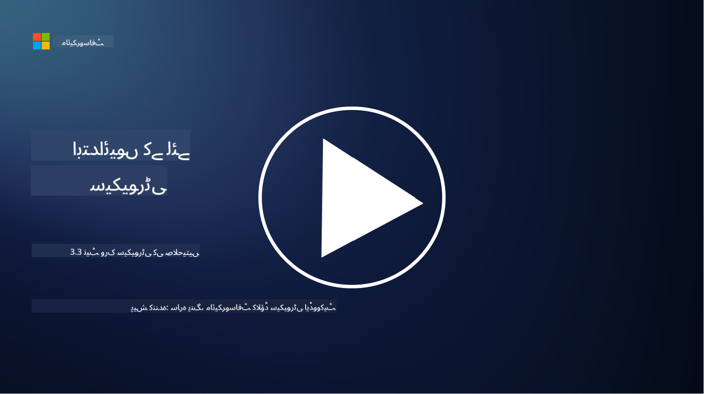

<!--
CO_OP_TRANSLATOR_METADATA:
{
  "original_hash": "c3aba077bb98eebc925dd58d870229ab",
  "translation_date": "2025-09-03T20:22:57+00:00",
  "source_file": "3.3 Network security capabilities.md",
  "language_code": "ur"
}
-->
# نیٹ ورک سیکیورٹی کی صلاحیتیں

اس سبق میں ہم درج ذیل صلاحیتوں کے بارے میں سیکھیں گے جو نیٹ ورک کو محفوظ بنانے کے لیے استعمال کی جا سکتی ہیں:

- روایتی فائر والز  
- ویب ایپلیکیشن فائر والز  
- کلاؤڈ سیکیورٹی گروپس  
- سی ڈی این  
- لوڈ بیلنسرز  
- باسٹین ہوسٹس  
- وی پی اینز  
- ڈی ڈی او ایس تحفظ  

## روایتی فائر والز  

روایتی فائر والز وہ سیکیورٹی ڈیوائسز ہیں جو پہلے سے طے شدہ سیکیورٹی اصولوں کی بنیاد پر آنے اور جانے والے نیٹ ورک ٹریفک کو کنٹرول اور مانیٹر کرتے ہیں۔ یہ ایک قابل اعتماد اندرونی نیٹ ورک اور غیر معتبر بیرونی نیٹ ورکس کے درمیان رکاوٹ کے طور پر کام کرتے ہیں، ٹریفک کو فلٹر کرتے ہیں تاکہ غیر مجاز رسائی اور ممکنہ خطرات کو روکا جا سکے۔

## ویب ایپلیکیشن فائر والز  

ویب ایپلیکیشن فائر والز (WAFs) خاص طور پر ویب ایپلیکیشنز کو مختلف حملوں جیسے SQL انجیکشن، کراس سائٹ اسکرپٹنگ، اور دیگر کمزوریوں سے بچانے کے لیے ڈیزائن کیے گئے ہیں۔ یہ HTTP درخواستوں اور جوابات کا تجزیہ کرتے ہیں تاکہ ویب ایپلیکیشنز کو نشانہ بنانے والے نقصان دہ ٹریفک کی شناخت اور اسے بلاک کیا جا سکے۔

## کلاؤڈ سیکیورٹی گروپس  

سیکیورٹی گروپس کلاؤڈ سروس فراہم کنندگان کی طرف سے فراہم کردہ ایک بنیادی نیٹ ورک سیکیورٹی فیچر ہیں۔ یہ ورچوئل فائر والز کے طور پر کام کرتے ہیں جو کلاؤڈ وسائل جیسے ورچوئل مشینز (VMs) اور انسٹینسز کے لیے آنے اور جانے والے ٹریفک کو کنٹرول کرتے ہیں۔ سیکیورٹی گروپس تنظیموں کو یہ اصول متعین کرنے کی اجازت دیتے ہیں کہ کون سا ٹریفک اجازت یافتہ ہے اور کون سا روکا جائے گا، کلاؤڈ ڈیپلائمنٹس میں اضافی دفاعی تہہ فراہم کرتے ہیں۔

## مواد کی ترسیل کا نیٹ ورک (CDN)  

مواد کی ترسیل کا نیٹ ورک مختلف جغرافیائی مقامات پر موجود سرورز کا ایک تقسیم شدہ نیٹ ورک ہے۔ سی ڈی اینز ویب سائٹس کی کارکردگی اور دستیابی کو بہتر بنانے میں مدد کرتے ہیں، مواد کو کیش کرتے ہیں اور صارف کے قریب موجود سرورز سے فراہم کرتے ہیں۔ یہ ڈی ڈی او ایس حملوں کے خلاف کچھ حد تک تحفظ بھی فراہم کرتے ہیں، ٹریفک کو متعدد سرور مقامات پر تقسیم کرتے ہیں۔

## لوڈ بیلنسرز  

لوڈ بیلنسرز آنے والے نیٹ ورک ٹریفک کو متعدد سرورز پر تقسیم کرتے ہیں تاکہ وسائل کے استعمال کو بہتر بنایا جا سکے، اعلی دستیابی کو یقینی بنایا جا سکے، اور ایپلیکیشن کی کارکردگی کو بہتر بنایا جا سکے۔ یہ سرور کے اوورلوڈ کو روکنے اور مؤثر جواب کے اوقات کو برقرار رکھنے میں مدد کرتے ہیں، نیٹ ورک کی لچک کو بڑھاتے ہیں۔

## باسٹین ہوسٹس  

باسٹین ہوسٹس انتہائی محفوظ اور الگ تھلگ سرورز ہیں جو بیرونی، غیر معتبر نیٹ ورک (جیسے انٹرنیٹ) سے نیٹ ورک تک کنٹرول شدہ رسائی فراہم کرتے ہیں۔ یہ منتظمین کے لیے داخلی نظاموں تک محفوظ طریقے سے رسائی حاصل کرنے کے داخلی پوائنٹس کے طور پر کام کرتے ہیں۔ باسٹین ہوسٹس عام طور پر مضبوط حفاظتی اقدامات کے ساتھ ترتیب دیے جاتے ہیں تاکہ حملے کے امکانات کو کم کیا جا سکے۔

## ورچوئل پرائیویٹ نیٹ ورکس (VPNs)  

وی پی اینز صارف کے ڈیوائس اور ریموٹ سرور کے درمیان خفیہ کردہ سرنگیں بناتے ہیں، ممکنہ طور پر غیر محفوظ نیٹ ورکس جیسے انٹرنیٹ پر محفوظ اور نجی مواصلات کو یقینی بناتے ہیں۔ وی پی اینز عام طور پر داخلی نیٹ ورکس تک ریموٹ رسائی فراہم کرنے کے لیے استعمال کیے جاتے ہیں، صارفین کو وسائل تک ایسے رسائی دینے کے لیے جیسے وہ جسمانی طور پر اسی نیٹ ورک پر موجود ہوں۔

## ڈی ڈی او ایس تحفظ کے آلات  

ڈی ڈی او ایس (ڈسٹریبیوٹڈ ڈینائل آف سروس) تحفظ کے آلات اور خدمات ڈی ڈی او ایس حملوں کے اثرات کو کم کرنے کے لیے ڈیزائن کیے گئے ہیں، جہاں متعدد متاثرہ ڈیوائسز نیٹ ورک یا سروس کو اوورلوڈ کرنے کے لیے ٹریفک کا سیلاب پیدا کرتی ہیں۔ ڈی ڈی او ایس تحفظ کے حل نقصان دہ ٹریفک کی شناخت کرتے ہیں اور اسے فلٹر کرتے ہیں، اس بات کو یقینی بناتے ہیں کہ جائز ٹریفک اپنی مطلوبہ منزل تک پہنچ سکے۔

## مزید مطالعہ  

- [What Is a Firewall? - Cisco](https://www.cisco.com/c/en/us/products/security/firewalls/what-is-a-firewall.html#~types-of-firewalls)  
- [What Does a Firewall Actually Do? (howtogeek.com)](https://www.howtogeek.com/144269/htg-explains-what-firewalls-actually-do/)  
- [What is a Firewall? How Firewalls Work & Types of Firewalls (kaspersky.com)](https://www.kaspersky.com/resource-center/definitions/firewall)  
- [Network security group - how it works | Microsoft Learn](https://learn.microsoft.com/azure/virtual-network/network-security-group-how-it-works)  
- [Introduction to Azure Content Delivery Network (CDN) - Training | Microsoft Learn](https://learn.microsoft.com/training/modules/intro-to-azure-content-delivery-network/?WT.mc_id=academic-96948-sayoung)  
- [What is a content delivery network (CDN)? - Azure | Microsoft Learn](https://learn.microsoft.com/azure/cdn/cdn-overview?WT.mc_id=academic-96948-sayoung)  
- [What Is Load Balancing? How Load Balancers Work (nginx.com)](https://www.nginx.com/resources/glossary/load-balancing/)  
- [Bastion hosts vs. VPNs · Tailscale](https://tailscale.com/learn/bastion-hosts-vs-vpns/)  
- [What is VPN? How It Works, Types of VPN (kaspersky.com)](https://www.kaspersky.com/resource-center/definitions/what-is-a-vpn)  
- [Introduction to Azure DDoS Protection - Training | Microsoft Learn](https://learn.microsoft.com/training/modules/introduction-azure-ddos-protection/?WT.mc_id=academic-96948-sayoung)  
- [What Is a DDoS Attack? | Microsoft Security](https://www.microsoft.com/security/business/security-101/what-is-a-ddos-attack?WT.mc_id=academic-96948-sayoung)  

---

**ڈسکلیمر**:  
یہ دستاویز AI ترجمہ سروس [Co-op Translator](https://github.com/Azure/co-op-translator) کا استعمال کرتے ہوئے ترجمہ کی گئی ہے۔ ہم درستگی کے لیے کوشش کرتے ہیں، لیکن براہ کرم آگاہ رہیں کہ خودکار ترجمے میں غلطیاں یا غیر درستیاں ہو سکتی ہیں۔ اصل دستاویز کو اس کی اصل زبان میں مستند ذریعہ سمجھا جانا چاہیے۔ اہم معلومات کے لیے، پیشہ ور انسانی ترجمہ کی سفارش کی جاتی ہے۔ ہم اس ترجمے کے استعمال سے پیدا ہونے والی کسی بھی غلط فہمی یا غلط تشریح کے ذمہ دار نہیں ہیں۔