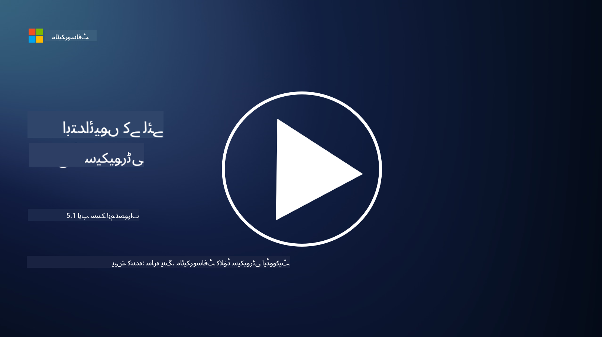

<!--
CO_OP_TRANSLATOR_METADATA:
{
  "original_hash": "e4b56bb23078d3ffb7ad407d280b0c36",
  "translation_date": "2025-09-03T21:11:25+00:00",
  "source_file": "5.1 AppSec key concepts.md",
  "language_code": "ur"
}
-->
# ایپلیکیشن سیکیورٹی کے اہم تصورات

ایپلیکیشن سیکیورٹی اپنی جگہ ایک خاص مہارت ہے۔ اس کورس کے اس حصے میں ہم ایپلیکیشن سیکیورٹی کو مزید تفصیل سے دیکھیں گے۔

## تعارف

اس سبق میں ہم کور کریں گے:

- ایپلیکیشن سیکیورٹی کیا ہے؟

- ایپلیکیشن سیکیورٹی کے اہم تصورات/اصول کیا ہیں؟

## ایپلیکیشن سیکیورٹی کیا ہے؟

ایپلیکیشن سیکیورٹی، جسے اکثر "AppSec" کہا جاتا ہے، سافٹ ویئر ایپلیکیشنز کو سیکیورٹی خطرات، کمزوریوں، اور حملوں سے محفوظ رکھنے کے عمل کو کہتے ہیں۔ یہ ان طریقوں، تکنیکوں، اور ٹولز پر مشتمل ہوتا ہے جو ایپلیکیشن کی ترقی، تعیناتی، اور دیکھ بھال کے دوران سیکیورٹی خطرات کی شناخت، کمی، اور روک تھام کے لیے استعمال کیے جاتے ہیں۔

ایپلیکیشن سیکیورٹی بہت اہم ہے کیونکہ ایپلیکیشنز سائبر حملوں کے عام اہداف ہیں۔ بدنیتی پر مبنی افراد سافٹ ویئر کی کمزوریوں اور خامیوں کا فائدہ اٹھا کر غیر مجاز رسائی حاصل کرتے ہیں، ڈیٹا چوری کرتے ہیں، خدمات میں خلل ڈالتے ہیں، یا دیگر نقصان دہ سرگرمیاں انجام دیتے ہیں۔ مؤثر ایپلیکیشن سیکیورٹی ایپلیکیشن اور اس سے منسلک ڈیٹا کی رازداری، سالمیت، اور دستیابی کو یقینی بنانے میں مدد دیتی ہے۔

## ایپلیکیشن سیکیورٹی کے اہم تصورات/اصول کیا ہیں؟

ایپلیکیشن سیکیورٹی کے بنیادی تصورات اور اصول درج ذیل ہیں:

1. **ڈیزائن سے محفوظ**:

- سیکیورٹی کو ایپلیکیشن کے ڈیزائن اور آرکیٹیکچر میں ابتدا سے شامل کیا جانا چاہیے، نہ کہ بعد میں۔

2. **ان پٹ کی تصدیق**:

- تمام صارف ان پٹ کی تصدیق کی جانی چاہیے تاکہ یہ یقینی بنایا جا سکے کہ وہ متوقع فارمیٹس کے مطابق ہیں اور ان میں بدنیتی پر مبنی کوڈ یا ڈیٹا نہیں ہے۔

3. **آؤٹ پٹ انکوڈنگ**:

- کلائنٹ کو بھیجا جانے والا ڈیٹا مناسب طریقے سے انکوڈ کیا جانا چاہیے تاکہ کراس سائٹ اسکرپٹنگ (XSS) جیسی کمزوریوں کو روکا جا سکے۔

4. **تصدیق اور اجازت**:

- صارفین کی تصدیق کریں اور ان کے کردار اور اجازتوں کی بنیاد پر وسائل تک ان کی رسائی کو مجاز بنائیں۔

5. **ڈیٹا کا تحفظ**:

- حساس ڈیٹا کو ذخیرہ کرنے، منتقل کرنے، اور پروسیس کرنے کے دوران انکرپٹ کیا جانا چاہیے تاکہ غیر مجاز رسائی کو روکا جا سکے۔

6. **سیشن مینجمنٹ**:

- محفوظ سیشن مینجمنٹ صارف سیشنز کو ہائی جیکنگ اور غیر مجاز رسائی سے محفوظ رکھتی ہے۔

7. **محفوظ ڈیپینڈنسیز**:

- تمام سافٹ ویئر ڈیپینڈنسیز کو سیکیورٹی پیچز کے ساتھ اپ ڈیٹ رکھیں تاکہ کمزوریوں کو روکا جا سکے۔

8. **غلطیوں کا انتظام اور لاگنگ**:

- محفوظ غلطیوں کا انتظام کریں تاکہ حساس معلومات ظاہر نہ ہوں اور محفوظ لاگنگ کے طریقے اپنائیں۔

9. **سیکیورٹی ٹیسٹنگ**:

- ایپلیکیشنز کو باقاعدگی سے کمزوریوں کے لیے ٹیسٹ کریں، جیسے کہ پینیٹریشن ٹیسٹنگ، کوڈ ریویوز، اور خودکار اسکیننگ ٹولز۔

10. **محفوظ سافٹ ویئر ڈیولپمنٹ لائف سائیکل (SDLC)**:

- سافٹ ویئر ڈیولپمنٹ لائف سائیکل کے ہر مرحلے میں سیکیورٹی کے طریقے شامل کریں، جیسے کہ ضروریات سے لے کر تعیناتی اور دیکھ بھال تک۔

## مزید مطالعہ

- [SheHacksPurple: ایپلیکیشن سیکیورٹی کیا ہے؟ - یوٹیوب](https://www.youtube.com/watch?v=eNmccQNzSSY)
- [ایپلیکیشن سیکیورٹی کیا ہے؟ - Cisco](https://www.cisco.com/c/en/us/solutions/security/application-first-security/what-is-application-security.html#~how-does-it-work)
- [ایپلیکیشن سیکیورٹی کیا ہے؟ سافٹ ویئر کو محفوظ رکھنے کے لیے عمل اور ٹولز | CSO Online](https://www.csoonline.com/article/566471/what-is-application-security-a-process-and-tools-for-securing-software.html)
- [OWASP Cheat Sheet Series | OWASP Foundation](https://owasp.org/www-project-cheat-sheets/)

---

**ڈسکلیمر**:  
یہ دستاویز AI ترجمہ سروس [Co-op Translator](https://github.com/Azure/co-op-translator) کا استعمال کرتے ہوئے ترجمہ کی گئی ہے۔ ہم درستگی کے لیے کوشش کرتے ہیں، لیکن براہ کرم آگاہ رہیں کہ خودکار ترجمے میں غلطیاں یا غیر درستیاں ہو سکتی ہیں۔ اصل دستاویز کو اس کی اصل زبان میں مستند ذریعہ سمجھا جانا چاہیے۔ اہم معلومات کے لیے، پیشہ ور انسانی ترجمہ کی سفارش کی جاتی ہے۔ ہم اس ترجمے کے استعمال سے پیدا ہونے والی کسی بھی غلط فہمی یا غلط تشریح کے ذمہ دار نہیں ہیں۔