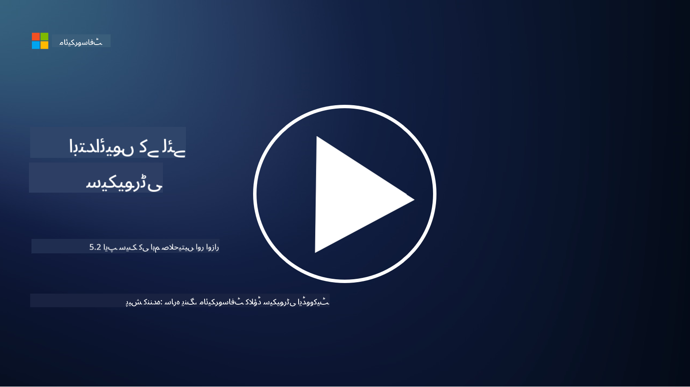

<!--
CO_OP_TRANSLATOR_METADATA:
{
  "original_hash": "790a3fa7e535ec60bb51bde13e759781",
  "translation_date": "2025-09-03T21:27:06+00:00",
  "source_file": "5.2 AppSec key capabilities.md",
  "language_code": "ur"
}
-->
## تعارف

اس سبق میں، ہم ان اہم صلاحیتوں اور ٹولز پر بات کریں گے جو ایپلیکیشن سیکیورٹی میں استعمال ہوتے ہیں۔

## ایپلیکیشن سیکیورٹی کی اہم صلاحیتیں اور ٹولز

ایپلیکیشن سیکیورٹی میں استعمال ہونے والی اہم صلاحیتیں اور ٹولز سافٹ ویئر ایپلیکیشنز میں سیکیورٹی کے خطرات اور کمزوریوں کی شناخت، ان کے خاتمے، اور ان سے بچاؤ کے لیے ضروری ہیں۔ یہاں کچھ اہم ترین صلاحیتیں اور ٹولز دیے گئے ہیں:

**1. اسٹیٹک ایپلیکیشن سیکیورٹی ٹیسٹنگ (SAST)**:

- **صلاحیتیں**: سورس کوڈ، بائٹ کوڈ، یا بائنری کوڈ کا تجزیہ کرکے ایپلیکیشن کے کوڈ میں سیکیورٹی کی کمزوریوں کی شناخت کرتا ہے۔

- **ٹولز**: مثالیں شامل ہیں Fortify، Checkmarx، اور Veracode۔

**2. ڈائنامک ایپلیکیشن سیکیورٹی ٹیسٹنگ (DAST)**:

- **صلاحیتیں**: چلتی ہوئی ایپلیکیشن کو اسکین کرکے ان پٹ درخواستیں بھیج کر اور جوابات کا تجزیہ کرکے کمزوریوں کی شناخت کرتا ہے۔

- **ٹولز**: مثالیں شامل ہیں ZAP، Burp Suite، اور Qualys Web Application Scanning۔

**3. انٹرایکٹو ایپلیکیشن سیکیورٹی ٹیسٹنگ (IAST)**:

- **صلاحیتیں**: SAST اور DAST کے عناصر کو ملا کر رن ٹائم کے دوران کوڈ کا تجزیہ کرتا ہے، زیادہ درست نتائج فراہم کرتا ہے اور غلط مثبت کو کم کرتا ہے۔

- **ٹولز**: مثالیں شامل ہیں Contrast Security اور HCL AppScan۔

**4. رن ٹائم ایپلیکیشن سیلف پروٹیکشن (RASP)**:

- **صلاحیتیں**: ایپلیکیشنز کی حقیقی وقت میں نگرانی اور حفاظت کرتا ہے، سیکیورٹی خطرات کی شناخت اور ان کا جواب دیتا ہے۔

- **ٹولز**: مثالیں شامل ہیں Veracode Runtime Protection اور F5 Advanced WAF with RASP۔

**5. ویب ایپلیکیشن فائر والز (WAFs)**:

- **صلاحیتیں**: ایپلیکیشن اور انٹرنیٹ کے درمیان حفاظتی تہہ فراہم کرتا ہے، آنے والے ٹریفک کو فلٹر کرتا ہے اور نقصان دہ درخواستوں کو بلاک کرتا ہے۔

- **ٹولز**: مثالیں شامل ہیں ModSecurity، AWS WAF، اور Akamai Kona Site Defender۔

**6. ڈیپینڈنسی اسکیننگ**:

- **صلاحیتیں**: ایپلیکیشن میں استعمال ہونے والے تھرڈ پارٹی لائبریریز اور اجزاء میں کمزوریوں کی شناخت کرتا ہے۔

- **ٹولز**: مثالیں شامل ہیں OWASP Dependency-Check اور Snyk۔

**7. پینیٹریشن ٹیسٹنگ (Pen Testing)**:

- **صلاحیتیں**: حقیقی دنیا کے حملوں کی نقل کرکے کمزوریوں کی شناخت کرتا ہے اور ایپلیکیشن کی سیکیورٹی کا جائزہ لیتا ہے۔

- **ٹولز**: سرٹیفائیڈ اخلاقی ہیکرز اور سیکیورٹی پروفیشنلز مختلف ٹولز جیسے Metasploit اور Nmap استعمال کرتے ہیں۔

**8. سیکیورٹی اسکیننگ اور تجزیہ**:

- **صلاحیتیں**: معلوم کمزوریوں، کنفیگریشن کی غلطیوں، اور سیکیورٹی کی غلط ترتیبوں کے لیے اسکین کرتا ہے۔

- **ٹولز**: مثالیں شامل ہیں Nessus، Qualys Vulnerability Management، اور OpenVAS۔

**9. کنٹینر سیکیورٹی ٹولز**:

- **صلاحیتیں**: کنٹینرائزڈ ایپلیکیشنز اور ان کے ماحول کی حفاظت پر توجہ مرکوز کرتا ہے۔

- **ٹولز**: مثالیں شامل ہیں Docker Security Scanning اور Aqua Security۔

**10. محفوظ ترقیاتی تربیت**:

- **صلاحیتیں**: ترقیاتی ٹیموں کے لیے محفوظ کوڈنگ کے طریقوں کو فروغ دینے کے لیے تربیتی اور آگاہی پروگرام فراہم کرتا ہے۔

- **ٹولز**: حسب ضرورت تربیتی پروگرام اور پلیٹ فارمز۔

**11. سیکیورٹی ٹیسٹنگ فریم ورک**:

- **صلاحیتیں**: مختلف ایپلیکیشن سیکیورٹی ٹیسٹنگ کی ضروریات کے لیے جامع ٹیسٹنگ فریم ورک فراہم کرتا ہے۔

- **ٹولز**: OWASP Amass، OWASP OWTF اور FrAppSec۔

**12. محفوظ کوڈ ریویو ٹولز**:

- **صلاحیتیں**: سورس کوڈ کا جائزہ لے کر سیکیورٹی کی کمزوریوں اور کوڈنگ کے بہترین طریقوں کی شناخت کرتا ہے۔

- **ٹولز**: مثالیں شامل ہیں SonarQube اور Checkmarx۔

**13. محفوظ APIs اور مائیکرو سروسز ٹولز**:

- **صلاحیتیں**: APIs اور مائیکرو سروسز کی حفاظت پر توجہ مرکوز کرتا ہے، بشمول تصدیق، اجازت، اور ڈیٹا کی حفاظت۔

- **ٹولز**: مثالیں شامل ہیں Apigee، AWS API Gateway، اور Istio۔

## مزید مطالعہ

- [ایپلیکیشن سیکیورٹی کیا ہے؟ تصورات، ٹولز اور بہترین طریقے | HackerOne](https://www.hackerone.com/knowledge-center/what-application-security-concepts-tools-best-practices)
- [IAST کیا ہے؟ (Interactive Application Security Testing) (comparitech.com)](https://www.comparitech.com/net-admin/what-is-iast/)
- [ایپلیکیشن سیکیورٹی ٹیسٹنگ ٹولز کی 10 اقسام: کب اور کیسے استعمال کریں (cmu.edu)](https://insights.sei.cmu.edu/blog/10-types-of-application-security-testing-tools-when-and-how-to-use-them/)
- [سائبرسیکیورٹی خطرے کے توازن کو تبدیل کرنا: سیکیورٹی بائی ڈیزائن اور ڈیفالٹ کے اصول اور طریقے | Cyber.gov.au](https://www.cyber.gov.au/about-us/view-all-content/publications/principles-and-approaches-for-security-by-design-and-default)

---

**ڈسکلیمر**:  
یہ دستاویز AI ترجمہ سروس [Co-op Translator](https://github.com/Azure/co-op-translator) کا استعمال کرتے ہوئے ترجمہ کی گئی ہے۔ ہم درستگی کے لیے پوری کوشش کرتے ہیں، لیکن براہ کرم آگاہ رہیں کہ خودکار ترجمے میں غلطیاں یا خامیاں ہو سکتی ہیں۔ اصل دستاویز، جو اس کی اصل زبان میں ہے، کو مستند ذریعہ سمجھا جانا چاہیے۔ اہم معلومات کے لیے، پیشہ ور انسانی ترجمہ کی سفارش کی جاتی ہے۔ اس ترجمے کے استعمال سے پیدا ہونے والی کسی بھی غلط فہمی یا غلط تشریح کے لیے ہم ذمہ دار نہیں ہیں۔