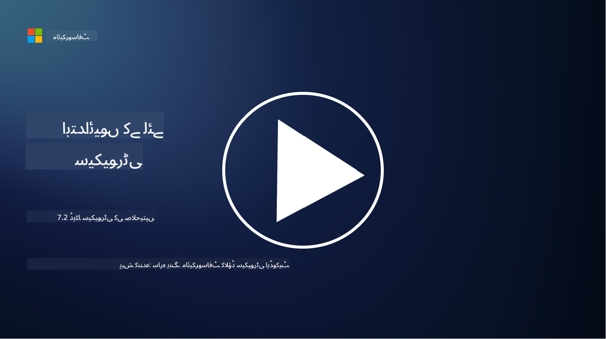

<!--
CO_OP_TRANSLATOR_METADATA:
{
  "original_hash": "50697add9758e54693442d502d2d5f8a",
  "translation_date": "2025-09-03T21:31:09+00:00",
  "source_file": "7.2 Data security capabilities.md",
  "language_code": "ur"
}
-->
# ڈیٹا سیکیورٹی کی صلاحیتیں

اس سیکشن میں، ہم ڈیٹا سیکیورٹی کے لیے استعمال ہونے والے بنیادی ٹولز اور صلاحیتوں کے بارے میں مزید تفصیلات کا احاطہ کریں گے:

**تعارف**

اس سبق میں، ہم درج ذیل موضوعات کا احاطہ کریں گے:

- ڈیٹا لاس پریوینشن ٹولنگ کیا ہے؟

- اندرونی خطرے کے انتظام کے ٹولنگ کیا ہے؟

- کون سے ڈیٹا ریٹینشن ٹولنگ دستیاب ہیں؟

## ڈیٹا لاس پریوینشن ٹولنگ کیا ہے؟

ڈیٹا لاس پریوینشن (DLP) ٹولنگ ایسے سافٹ ویئر حل اور ٹیکنالوجیز کا مجموعہ ہے جو کسی تنظیم کے اندر حساس یا خفیہ ڈیٹا تک غیر مجاز رسائی، شیئرنگ، یا لیک ہونے سے بچانے کے لیے ڈیزائن کیے گئے ہیں۔ یہ ٹولز مواد کی جانچ، پالیسی نافذ کرنے، اور نگرانی کے ذریعے حساس ڈیٹا کی شناخت اور حفاظت کرتے ہیں تاکہ اسے ظاہر یا غلط استعمال ہونے سے بچایا جا سکے۔ ڈی ایل پی مصنوعات کی مثالیں شامل ہیں: Symantec Data Loss Prevention، McAfee Total Protection for Data Loss Prevention، Microsoft 365 DLP**: یہ Microsoft 365 ایپلیکیشنز کے ساتھ انضمام کرتا ہے تاکہ تنظیموں کو ای میلز، دستاویزات، اور پیغامات میں حساس ڈیٹا کی شناخت اور حفاظت میں مدد ملے۔

## اندرونی خطرے کے انتظام کے ٹولنگ کیا ہے؟

اندرونی خطرے کے انتظام کے ٹولنگ تنظیموں کو ان خطرات کی شناخت اور کم کرنے میں مدد فراہم کرتے ہیں جو ملازمین، ٹھیکیداروں، یا شراکت داروں کی طرف سے ہو سکتے ہیں جو جان بوجھ کر یا غیر ارادی طور پر ڈیٹا سیکیورٹی کو نقصان پہنچا سکتے ہیں۔ یہ ٹولز صارف کے رویے، رسائی کے نمونوں، اور ڈیٹا کے استعمال کی نگرانی کرتے ہیں تاکہ مشکوک سرگرمیوں اور ممکنہ اندرونی خطرات کا پتہ لگایا جا سکے۔ اندرونی خطرے کے انتظام کی مصنوعات کی مثالیں شامل ہیں: Microsoft Insider Risk Management (Microsoft 365 کا حصہ)، Forcepoint Insider Threat Data Protection، Varonis Insider Threat Detection۔

## کون سے ڈیٹا ریٹینشن ٹولنگ دستیاب ہیں؟

ڈیٹا ریٹینشن ٹولنگ ایسے سافٹ ویئر اور حل شامل ہیں جو کسی تنظیم کی ڈیٹا ریٹینشن پالیسیوں اور قانونی تقاضوں کے مطابق ڈیٹا کو برقرار رکھنے اور حذف کرنے کا انتظام کرتے ہیں۔ یہ ٹولز مخصوص مدت کے لیے ڈیٹا کو برقرار رکھنے اور جب اس کی ضرورت نہ ہو تو اسے محفوظ طریقے سے حذف کرنے کے عمل کو خودکار بنانے میں مدد کرتے ہیں۔ ڈیٹا ریٹینشن مصنوعات کی مثالیں شامل ہیں: Veritas Enterprise Vault، Commvault Complete Data Protection، Microsoft data lifecycle management۔ یہ ٹولنگ حل تنظیموں کو ڈیٹا ریٹینشن اور ڈسپوزل پر کنٹرول برقرار رکھنے میں مدد دیتے ہیں، ڈیٹا پروٹیکشن کے ضوابط کی تعمیل کو یقینی بناتے ہوئے ڈیٹا کو اس کی زندگی کے دوران مؤثر طریقے سے منظم کرتے ہیں۔

## مزید مطالعہ

- [Guide to Data Security Posture Management (DSPM) | CSA (cloudsecurityalliance.org)](https://cloudsecurityalliance.org/blog/2023/03/31/the-big-guide-to-data-security-posture-management-dspm/)
- [Data Loss Prevention across endpoints, apps, & services | Microsoft Purview](https://youtu.be/hvqq8L_0kgI)
- [18 Best Data Loss Prevention Software Tools 2023 (Free + Paid) (comparitech.com)](https://www.comparitech.com/data-privacy-management/data-loss-prevention-tools-software/)
- [Data Loss Prevention (nist.gov)](https://tsapps.nist.gov/publication/get_pdf.cfm?pub_id=904672)
- [Learn about insider risk management | Microsoft Learn](https://learn.microsoft.com/purview/insider-risk-management?WT.mc_id=academic-96948-sayoung)
- [Data Lifecycle Management | IBM](https://www.ibm.com/topics/data-lifecycle-management)
- [What Is Data Lifecycle Management (DLM)? | 2023 Best Practices (selecthub.com)](https://www.selecthub.com/big-data-analytics/data-lifecycle-management/)

---

**ڈسکلیمر**:  
یہ دستاویز AI ترجمہ سروس [Co-op Translator](https://github.com/Azure/co-op-translator) کا استعمال کرتے ہوئے ترجمہ کی گئی ہے۔ ہم درستگی کے لیے کوشش کرتے ہیں، لیکن براہ کرم آگاہ رہیں کہ خودکار ترجمے میں غلطیاں یا غیر درستیاں ہو سکتی ہیں۔ اصل دستاویز کو اس کی اصل زبان میں مستند ذریعہ سمجھا جانا چاہیے۔ اہم معلومات کے لیے، پیشہ ور انسانی ترجمہ کی سفارش کی جاتی ہے۔ ہم اس ترجمے کے استعمال سے پیدا ہونے والی کسی بھی غلط فہمی یا غلط تشریح کے ذمہ دار نہیں ہیں۔