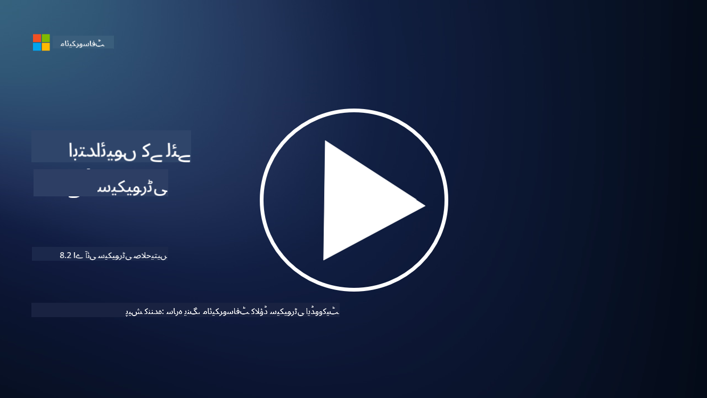

<!--
CO_OP_TRANSLATOR_METADATA:
{
  "original_hash": "b6bb7175672298d1e2f73ba7e0006f95",
  "translation_date": "2025-09-03T21:37:58+00:00",
  "source_file": "8.2 AI security capabilities.md",
  "language_code": "ur"
}
-->
# اے آئی سیکیورٹی صلاحیتیں

## فی الحال ہمارے پاس اے آئی سسٹمز کو محفوظ بنانے کے لیے کون سے ٹولز اور صلاحیتیں موجود ہیں؟

فی الحال، اے آئی سسٹمز کو محفوظ بنانے کے لیے کئی ٹولز اور صلاحیتیں دستیاب ہیں:

-   **Counterfit**: ایک اوپن سورس آٹومیشن ٹول جو اے آئی سسٹمز کی سیکیورٹی ٹیسٹنگ کے لیے بنایا گیا ہے۔ یہ تنظیموں کو اے آئی سیکیورٹی رسک اسیسمنٹ کرنے اور ان کے الگورتھمز کی مضبوطی کو یقینی بنانے میں مدد دیتا ہے۔
-   **Adversarial Machine Learning Tools**: یہ ٹولز مشین لرننگ ماڈلز کی مضبوطی کو مخالفانہ حملوں کے خلاف جانچتے ہیں، تاکہ کمزوریوں کی نشاندہی اور ان کا سدباب کیا جا سکے۔
-   **AI Security Toolkits**: اوپن سورس ٹول کٹس دستیاب ہیں جو اے آئی سسٹمز کو محفوظ بنانے کے لیے وسائل فراہم کرتی ہیں، جن میں لائبریریاں اور فریم ورک شامل ہیں جو سیکیورٹی اقدامات کو نافذ کرنے میں مدد دیتے ہیں۔
-   **Collaborative Platforms**: کمپنیوں اور اے آئی کمیونٹیز کے درمیان شراکت داری، جو اے آئی سپلائی چین کو محفوظ بنانے کے لیے اے آئی مخصوص سیکیورٹی اسکینرز اور دیگر ٹولز تیار کرتی ہیں۔

یہ ٹولز اور صلاحیتیں ایک بڑھتے ہوئے میدان کا حصہ ہیں جو اے آئی سسٹمز کو مختلف خطرات کے خلاف محفوظ بنانے کے لیے وقف ہیں۔ یہ تحقیق، عملی ٹولز، اور صنعت کے تعاون کا امتزاج ہیں جو اے آئی ٹیکنالوجیز کے منفرد چیلنجز کو حل کرنے کے لیے بنائے گئے ہیں۔

## اے آئی ریڈ ٹیمنگ کے بارے میں کیا خیال ہے؟ یہ روایتی سیکیورٹی ریڈ ٹیمنگ سے کیسے مختلف ہے؟

اے آئی ریڈ ٹیمنگ روایتی سیکیورٹی ریڈ ٹیمنگ سے کئی اہم پہلوؤں میں مختلف ہے:

-   **اے آئی سسٹمز پر توجہ**: اے آئی ریڈ ٹیمنگ خاص طور پر اے آئی سسٹمز کی منفرد کمزوریوں کو نشانہ بناتی ہے، جیسے مشین لرننگ ماڈلز اور ڈیٹا پائپ لائنز، بجائے روایتی آئی ٹی انفراسٹرکچر کے۔
-   **اے آئی کے رویے کی جانچ**: یہ جانچتی ہے کہ اے آئی سسٹمز غیر معمولی یا غیر متوقع ان پٹس پر کیسے ردعمل دیتے ہیں، جو ایسی کمزوریاں ظاہر کر سکتی ہیں جنہیں حملہ آور استعمال کر سکتے ہیں۔
-   **اے آئی کی ناکامیوں کا جائزہ**: اے آئی ریڈ ٹیمنگ نہ صرف بدنیتی پر مبنی بلکہ بے ضرر ناکامیوں کو بھی دیکھتی ہے، اور سیکیورٹی خلاف ورزیوں سے آگے جا کر مختلف شخصیات اور ممکنہ سسٹم ناکامیوں پر غور کرتی ہے۔
-   **پرومپٹ انجیکشن اور مواد کی تخلیق**: اے آئی ریڈ ٹیمنگ میں ایسی ناکامیوں کی جانچ بھی شامل ہے جیسے پرومپٹ انجیکشن، جہاں حملہ آور اے آئی سسٹمز کو نقصان دہ یا غیر مستند مواد پیدا کرنے کے لیے چالاکی سے قابو پاتے ہیں۔
-   **اخلاقی اور ذمہ دار اے آئی**: یہ ذمہ دار اے آئی کے ڈیزائن کو یقینی بنانے کا حصہ ہے، تاکہ اے آئی سسٹمز کو غیر ارادی طریقے سے کام کرنے کی کوششوں کے خلاف مضبوط بنایا جا سکے۔

مجموعی طور پر، اے آئی ریڈ ٹیمنگ ایک وسیع تر عمل ہے جو نہ صرف سیکیورٹی کمزوریوں کی جانچ کرتا ہے بلکہ اے آئی ٹیکنالوجیز سے متعلق دیگر قسم کی سسٹم ناکامیوں کی جانچ بھی شامل کرتا ہے۔ یہ اے آئی سسٹمز کو محفوظ تر بنانے کے لیے ایک اہم حصہ ہے، تاکہ اے آئی کے نفاذ سے وابستہ نئے خطرات کو سمجھا اور کم کیا جا سکے۔

## مزید مطالعہ

 - [Microsoft AI Red Team building future of safer AI | Microsoft Security Blog](https://www.microsoft.com/en-us/security/blog/2023/08/07/microsoft-ai-red-team-building-future-of-safer-ai/?WT.mc_id=academic-96948-sayoung)
 - [Announcing Microsoft’s open automation framework to red team generative AI Systems | Microsoft Security Blog](https://www.microsoft.com/en-us/security/blog/2024/02/22/announcing-microsofts-open-automation-framework-to-red-team-generative-ai-systems/?WT.mc_id=academic-96948-sayoung)
 - [AI Security Tools: The Open-Source Toolkit | Wiz](https://www.wiz.io/academy/ai-security-tools)

---

**ڈسکلیمر**:  
یہ دستاویز AI ترجمہ سروس [Co-op Translator](https://github.com/Azure/co-op-translator) کا استعمال کرتے ہوئے ترجمہ کی گئی ہے۔ ہم درستگی کے لیے کوشش کرتے ہیں، لیکن براہ کرم آگاہ رہیں کہ خودکار ترجمے میں غلطیاں یا غیر درستیاں ہو سکتی ہیں۔ اصل دستاویز کو اس کی اصل زبان میں مستند ذریعہ سمجھا جانا چاہیے۔ اہم معلومات کے لیے، پیشہ ور انسانی ترجمہ کی سفارش کی جاتی ہے۔ ہم اس ترجمے کے استعمال سے پیدا ہونے والی کسی بھی غلط فہمی یا غلط تشریح کے ذمہ دار نہیں ہیں۔