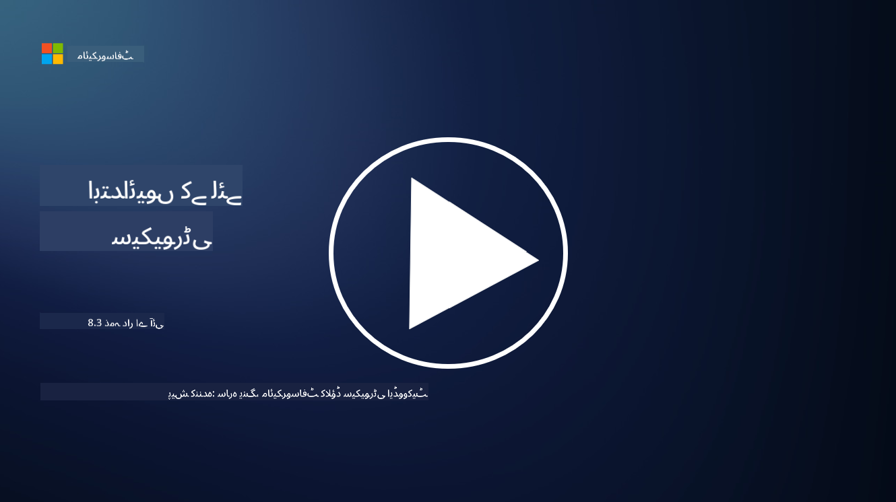

<!--
CO_OP_TRANSLATOR_METADATA:
{
  "original_hash": "5e9775ee91bde7d44577891d5f11c4c5",
  "translation_date": "2025-09-03T20:49:52+00:00",
  "source_file": "8.3 Responsible AI.md",
  "language_code": "ur"
}
-->
# ذمہ دار مصنوعی ذہانت

## ذمہ دار مصنوعی ذہانت کیا ہے اور یہ AI سیکیورٹی سے کیسے متعلق ہے؟

ذمہ دار مصنوعی ذہانت سے مراد مصنوعی ذہانت کی ترقی اور استعمال ہے جو اخلاقی، شفاف ہو اور معاشرتی اقدار کے مطابق ہو۔ اس میں اصول شامل ہیں جیسے انصاف، جوابدہی، اور مضبوطی، تاکہ یہ یقینی بنایا جا سکے کہ AI سسٹمز افراد، کمیونٹیز، اور معاشرے کے لیے فائدہ مند ہوں۔

ذمہ دار مصنوعی ذہانت اور AI سیکیورٹی کے درمیان تعلق اہم ہے کیونکہ:

-   **اخلاقی پہلو**: ذمہ دار مصنوعی ذہانت میں اخلاقی پہلو شامل ہیں جو براہ راست سیکیورٹی پر اثر انداز ہوتے ہیں، جیسے پرائیویسی اور ڈیٹا کی حفاظت۔ یہ یقینی بنانا کہ AI سسٹمز صارفین کی پرائیویسی کا احترام کریں اور ذاتی ڈیٹا کو محفوظ رکھیں، ذمہ دار AI کا ایک اہم حصہ ہے۔
-   **مضبوطی اور قابل اعتمادیت**: AI سسٹمز کو چھیڑ چھاڑ اور حملوں کے خلاف مضبوط ہونا چاہیے، جو ذمہ دار AI اور AI سیکیورٹی دونوں کا بنیادی اصول ہے۔ اس میں مخالفانہ حملوں سے تحفظ اور AI کے فیصلے کرنے کے عمل کی سالمیت کو یقینی بنانا شامل ہے۔
-   **شفافیت اور وضاحت**: ذمہ دار AI کا حصہ یہ یقینی بنانا ہے کہ AI سسٹمز شفاف ہوں اور ان کے فیصلے وضاحت کے قابل ہوں۔ یہ سیکیورٹی کے لیے اہم ہے کیونکہ اسٹیک ہولڈرز کو AI سسٹمز کے کام کرنے کے طریقے کو سمجھنے کی ضرورت ہوتی ہے تاکہ ان کے حفاظتی اقدامات پر اعتماد کیا جا سکے۔
-   **جوابدہی**: AI سسٹمز کو اپنے اعمال کے لیے جوابدہ ہونا چاہیے، یعنی فیصلوں کو ٹریس کرنے اور کسی بھی مسئلے کو درست کرنے کے لیے میکانزم موجود ہونا چاہیے۔ یہ سیکیورٹی کے طریقوں کے ساتھ ہم آہنگ ہے جو سسٹم کی سرگرمیوں کی نگرانی اور آڈٹ کرتے ہیں تاکہ خلاف ورزیوں کو روکنے اور ان کا جواب دینے میں مدد ملے۔

مختصراً، ذمہ دار مصنوعی ذہانت اور AI سیکیورٹی آپس میں جڑے ہوئے ہیں، جہاں ذمہ دار AI کے اصول AI سسٹمز کی سیکیورٹی کو بہتر بناتے ہیں اور اس کے برعکس۔ ذمہ دار AI کے اصولوں کو نافذ کرنا ایسے AI سسٹمز بنانے میں مدد کرتا ہے جو نہ صرف اخلاقی طور پر درست ہوں بلکہ ممکنہ خطرات کے خلاف زیادہ محفوظ بھی ہوں۔

## میں اپنے AI سسٹم کو محفوظ اور اخلاقی کیسے بنا سکتا ہوں؟

اپنے AI سسٹم کو محفوظ اور اخلاقی بنانے کے لیے ایک کثیر الجہتی طریقہ کار اپنانا ضروری ہے، جس میں درج ذیل اقدامات شامل ہیں:

- **اخلاقی اصولوں کی پیروی کریں**: قائم شدہ اخلاقی رہنما اصولوں پر عمل کریں جو انسانی، معاشرتی، اور ماحولیاتی فلاح و بہبود؛ انصاف؛ پرائیویسی کا تحفظ؛ قابل اعتمادیت؛ شفافیت؛ اعتراض کی صلاحیت؛ اور جوابدہی پر زور دیتے ہیں۔

- **مضبوط حفاظتی اقدامات نافذ کریں**: خطرات اور کمزوریوں کے خلاف تحفظ کے لیے فعال حفاظتی ٹیسٹنگ اور AI اعتماد، خطرہ، اور سیکیورٹی مینجمنٹ پروگرام استعمال کریں۔

- **متنوع اسٹیک ہولڈرز کو شامل کریں**: AI کی ترقی کے عمل میں مختلف شرکاء کو شامل کریں، جیسے اخلاقیات کے ماہرین، سماجی سائنسدان، اور متاثرہ کمیونٹیز کے نمائندے تاکہ مختلف نقطہ نظر اور اقدار کو مدنظر رکھا جا سکے۔

- **شفافیت اور وضاحت کو یقینی بنائیں**: یہ یقینی بنائیں کہ AI کے فیصلے کرنے کے عمل شفاف ہوں اور وضاحت کے قابل ہوں، تاکہ زیادہ اعتماد پیدا ہو اور ممکنہ تعصبات یا غلطیوں کی شناخت آسان ہو۔

- **ڈیٹا کی پرائیویسی برقرار رکھیں**: صارفین کے پرائیویسی حقوق کا احترام کرنے کے لیے انکرپشن اور دیگر ڈیٹا تحفظ کے اقدامات کے ذریعے ڈیٹا کی پرائیویسی اور صداقت کو محفوظ رکھیں۔

- **انسانی نگرانی کو فعال کریں**: AI سسٹمز کے فیصلوں پر اعتراض کرنے اور جوابدہی کو یقینی بنانے کے لیے انسانی نگرانی کے میکانزم نافذ کریں۔

- **AI سیکیورٹی پر معلومات حاصل کرتے رہیں**: AI سیکیورٹی اور اخلاقیات کے بدلتے ہوئے منظرنامے کو سمجھنے کے لیے تازہ ترین تحقیق اور مباحثوں سے آگاہ رہیں۔

- **قوانین کی تعمیل کریں**: یہ یقینی بنائیں کہ آپ کا AI سسٹم تمام متعلقہ قوانین اور ضوابط کی تعمیل کرتا ہے، جن میں ڈیٹا تحفظ کے قوانین، امتیاز مخالف قوانین، اور صنعت کے مخصوص رہنما اصول شامل ہو سکتے ہیں۔

## کیا آپ مجھے غیر اخلاقی AI کے استعمال سے پیدا ہونے والے سیکیورٹی مسائل کی کچھ مثالیں دے سکتے ہیں؟

یہاں کچھ مثالیں ہیں کہ غیر اخلاقی AI کے استعمال سے کون سے سیکیورٹی مسائل پیدا ہو سکتے ہیں:

- **متعصب فیصلے**: اگر AI سسٹمز کو متعصب ڈیٹا سیٹس پر تربیت دی جائے تو وہ موجودہ تعصبات کو برقرار رکھ سکتے ہیں اور بڑھا سکتے ہیں۔ مثال کے طور پر، اگر سرچ انجن کو ایسے ڈیٹا پر تربیت دی جائے جو معاشرتی دقیانوسی تصورات کی عکاسی کرتا ہو، تو یہ متعصب سرچ نتائج دکھا سکتا ہے، جو غیر منصفانہ سلوک یا امتیاز کا باعث بن سکتا ہے۔

- **عدالتی نظام میں AI**: قانونی فیصلے کرنے میں AI کا استعمال اخلاقی خدشات پیدا کر سکتا ہے، خاص طور پر اگر AI کے فیصلے کرنے کا عمل شفاف نہ ہو یا متعصب ڈیٹا سے متاثر ہو۔ یہ غیر منصفانہ قانونی نتائج کا باعث بن سکتا ہے اور افراد کے حقوق کی خلاف ورزی کر سکتا ہے۔

- **AI سسٹمز کی چھیڑ چھاڑ**: AI سسٹمز مخالفانہ حملوں کا شکار ہو سکتے ہیں، جہاں ان پٹ ڈیٹا میں معمولی تبدیلیاں غلط نتائج کا باعث بن سکتی ہیں۔ مثال کے طور پر، خود مختار گاڑیوں کو ٹریفک کے نشانات کو غلط سمجھنے پر مجبور کیا جا سکتا ہے، جس سے حفاظتی خطرات پیدا ہو سکتے ہیں۔

- **AI سے چلنے والی نگرانی**: نگرانی کے مقاصد کے لیے AI کی تعیناتی پرائیویسی کی خلاف ورزیوں کا باعث بن سکتی ہے، خاص طور پر اگر اسے مناسب رضامندی کے بغیر یا ایسے طریقوں سے استعمال کیا جائے جو انفرادی آزادیوں کی خلاف ورزی کریں۔ یہ خاص طور پر آمرانہ حکومتوں میں مسئلہ بن سکتا ہے جو AI کو نگرانی اور اختلاف کو دبانے کے لیے استعمال کر سکتی ہیں۔

یہ مثالیں اس بات کو اجاگر کرتی ہیں کہ AI سسٹمز کی ترقی اور تعیناتی میں اخلاقی پہلوؤں پر غور کرنا کیوں ضروری ہے تاکہ سیکیورٹی کے مسائل کو روکا جا سکے اور افراد کے حقوق اور پرائیویسی کا تحفظ کیا جا سکے۔

## مزید مطالعہ

 - [Microsoft Responsible AI Standard v2 General Requirements](https://query.prod.cms.rt.microsoft.com/cms/api/am/binary/RE5cmFl?culture=en-us&country=us&WT.mc_id=academic-96948-sayoung)
 - [Responsible AI (mit.edu)](https://sloanreview.mit.edu/big-ideas/responsible-ai/)
 - [13 Principles for Using AI Responsibly (hbr.org)](https://hbr.org/2023/06/13-principles-for-using-ai-responsibly)

---

**ڈسکلیمر**:  
یہ دستاویز AI ترجمہ سروس [Co-op Translator](https://github.com/Azure/co-op-translator) کا استعمال کرتے ہوئے ترجمہ کی گئی ہے۔ ہم درستگی کے لیے کوشش کرتے ہیں، لیکن براہ کرم آگاہ رہیں کہ خودکار ترجمے میں غلطیاں یا غیر درستیاں ہو سکتی ہیں۔ اصل دستاویز کو اس کی اصل زبان میں مستند ذریعہ سمجھا جانا چاہیے۔ اہم معلومات کے لیے، پیشہ ور انسانی ترجمہ کی سفارش کی جاتی ہے۔ ہم اس ترجمے کے استعمال سے پیدا ہونے والی کسی بھی غلط فہمی یا غلط تشریح کے ذمہ دار نہیں ہیں۔