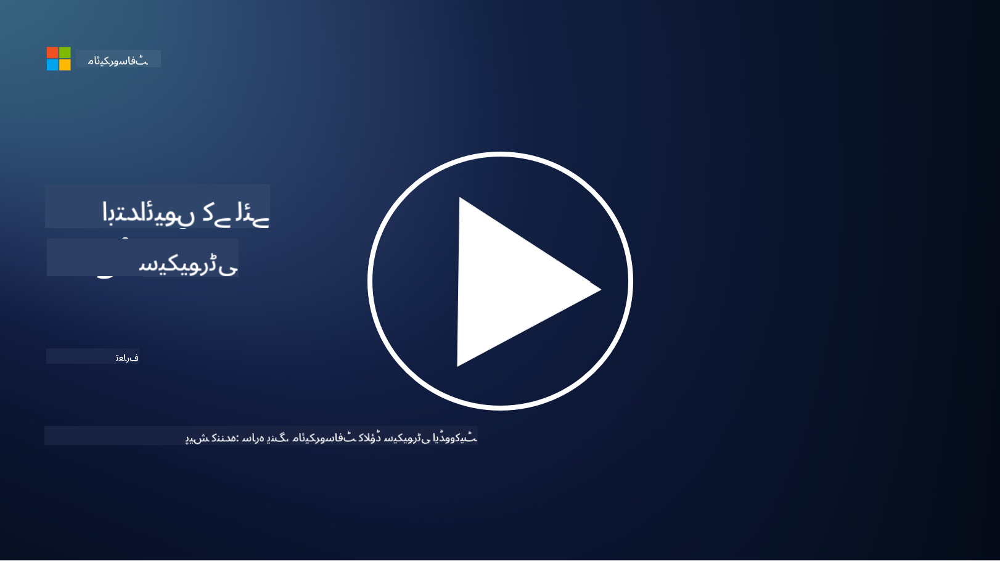

<!--
CO_OP_TRANSLATOR_METADATA:
{
  "original_hash": "fc3d47b5af0cc4fc954ae5d2ea2f7811",
  "translation_date": "2025-10-24T08:56:09+00:00",
  "source_file": "README.md",
  "language_code": "ur"
}
-->

### 🌐 کثیر زبان کی حمایت

#### GitHub ایکشن کے ذریعے دستیاب (خودکار اور ہمیشہ تازہ ترین)

[Arabic](../ar/README.md) | [Bengali](../bn/README.md) | [Bulgarian](../bg/README.md) | [Burmese (Myanmar)](../my/README.md) | [Chinese (Simplified)](../zh/README.md) | [Chinese (Traditional, Hong Kong)](../hk/README.md) | [Chinese (Traditional, Macau)](../mo/README.md) | [Chinese (Traditional, Taiwan)](../tw/README.md) | [Croatian](../hr/README.md) | [Czech](../cs/README.md) | [Danish](../da/README.md) | [Dutch](../nl/README.md) | [Estonian](../et/README.md) | [Finnish](../fi/README.md) | [French](../fr/README.md) | [German](../de/README.md) | [Greek](../el/README.md) | [Hebrew](../he/README.md) | [Hindi](../hi/README.md) | [Hungarian](../hu/README.md) | [Indonesian](../id/README.md) | [Italian](../it/README.md) | [Japanese](../ja/README.md) | [Korean](../ko/README.md) | [Lithuanian](../lt/README.md) | [Malay](../ms/README.md) | [Marathi](../mr/README.md) | [Nepali](../ne/README.md) | [Norwegian](../no/README.md) | [Persian (Farsi)](../fa/README.md) | [Polish](../pl/README.md) | [Portuguese (Brazil)](../br/README.md) | [Portuguese (Portugal)](../pt/README.md) | [Punjabi (Gurmukhi)](../pa/README.md) | [Romanian](../ro/README.md) | [Russian](../ru/README.md) | [Serbian (Cyrillic)](../sr/README.md) | [Slovak](../sk/README.md) | [Slovenian](../sl/README.md) | [Spanish](../es/README.md) | [Swahili](../sw/README.md) | [Swedish](../sv/README.md) | [Tagalog (Filipino)](../tl/README.md) | [Tamil](../ta/README.md) | [Thai](../th/README.md) | [Turkish](../tr/README.md) | [Ukrainian](../uk/README.md) | [Urdu](./README.md) | [Vietnamese](../vi/README.md)

**اگر آپ اضافی زبانوں میں ترجمہ چاہتے ہیں تو دستیاب زبانوں کی فہرست [یہاں](https://github.com/Azure/co-op-translator/blob/main/getting_started/supported-languages.md) موجود ہے۔**

#### ہماری کمیونٹی میں شامل ہوں 

# 🚀 ابتدائی افراد کے لیے سائبر سیکیورٹی – ایک نصاب

اس تیزی سے بدلتے ہوئے دور میں جہاں AI ٹیکنالوجی اپنائی جا رہی ہے، IT سسٹمز کو محفوظ بنانا اور بھی زیادہ اہم ہو گیا ہے۔ یہ کورس آپ کو بنیادی سائبر سیکیورٹی تصورات سکھانے کے لیے ڈیزائن کیا گیا ہے تاکہ آپ اپنی سیکیورٹی کی تعلیم کا آغاز کر سکیں۔ یہ کورس کسی خاص وینڈر سے منسلک نہیں ہے اور چھوٹے اسباق میں تقسیم کیا گیا ہے جنہیں مکمل کرنے میں تقریباً 30-60 منٹ لگتے ہیں۔ ہر سبق کے ساتھ ایک چھوٹا سا کوئز اور مزید مطالعہ کے لنکس شامل ہیں تاکہ آپ موضوع کو مزید گہرائی سے سمجھ سکیں۔

یہ کورس کیا کور کرتا ہے 📚

- 🔐 بنیادی سائبر سیکیورٹی تصورات جیسے کہ CIA ٹرائیڈ، خطرات اور خطرات کے درمیان فرق وغیرہ۔
- 🛡️ سیکیورٹی کنٹرول کو سمجھنا اور ان کی مختلف اقسام۔
- 🌐 زیرو ٹرسٹ کو سمجھنا اور جدید سائبر سیکیورٹی میں اس کی اہمیت۔
- 🔑 شناخت، نیٹ ورکنگ، سیکیورٹی آپریشنز، انفراسٹرکچر اور ڈیٹا سیکیورٹی کے کلیدی تصورات اور موضوعات کو سمجھنا۔
- 🔧 سیکیورٹی کنٹرولز کو نافذ کرنے کے لیے استعمال ہونے والے کچھ ٹولز کی مثالیں دینا۔

یہ کورس کیا کور نہیں کرتا 🙅‍♂️

- 🚫 مخصوص سیکیورٹی ٹولز کا استعمال کیسے کریں۔
- 🚫 "ہیکنگ" یا ریڈ ٹیمنگ/آفینسیو سیکیورٹی کیسے کریں۔
- 🚫 مخصوص کمپلائنس اسٹینڈرڈز کے بارے میں سیکھنا۔

جب آپ یہ کورس مکمل کر لیں، تو آپ ہمارے Microsoft Learn ماڈیولز میں سے کچھ پر جا سکتے ہیں۔ ہم تجویز کرتے ہیں کہ آپ اپنی تعلیم جاری رکھیں [Microsoft Security, Compliance, and Identity Fundamentals](https://learn.microsoft.com/training/paths/describe-concepts-of-security-compliance-identity/?WT.mc_id=academic-96948-sayoung) کے ساتھ۔

آخر میں، آپ [Exam SC-900: Microsoft Security, Compliance, and Identity Fundamentals exam](https://learn.microsoft.com/credentials/certifications/exams/sc-900/?WT.mc_id=academic-96948-sayoung) دینے پر غور کر سکتے ہیں۔

> 💁 اگر آپ کے پاس اس کورس کے بارے میں کوئی رائے یا تجاویز ہیں اور کوئی مواد جو ہم نے شامل نہیں کیا، تو ہمیں آپ کی رائے سن کر خوشی ہوگی!

## ماڈیولز کا جائزہ 📝 
| **ماڈیول نمبر** | **ماڈیول کا نام**                           | **سکھائے گئے تصورات**                  | **تعلیمی مقاصد**                                                                                          |
|-------------------|-------------------------------------------|--------------------------------------|-----------------------------------------------------------------------------------------------------------------|
| **1.1**           | بنیادی سیکیورٹی تصورات                   | [The CIA triad](https://github.com/microsoft/Security-101/blob/main/1.1%20The%20CIA%20triad%20and%20other%20key%20concepts.md)                        | رازداری، دستیابی اور سالمیت کے بارے میں سیکھیں۔ نیز مستندیت، غیر انکار اور پرائیویسی کے بارے میں بھی۔ |
| **1.2**           | بنیادی سیکیورٹی تصورات                   | [عام سائبر سیکیورٹی خطرات](https://github.com/microsoft/Security-101/blob/main/1.2%20Common%20cybersecurity%20threats.md)        | انفرادی اور تنظیموں کو درپیش عام سائبر سیکیورٹی خطرات کے بارے میں سیکھیں۔                             |
| **1.3**           | بنیادی سیکیورٹی تصورات                   | [خطرے کے انتظام کو سمجھنا](https://github.com/microsoft/Security-101/blob/main/1.3%20Understanding%20risk%20management.md)       | خطرے کا جائزہ لینے اور سمجھنے کے بارے میں سیکھیں – اثر/امکان اور کنٹرولز کو نافذ کرنا۔                                                                                                               | |
| **1.4**           | بنیادی سیکیورٹی تصورات                   | [سیکیورٹی کے طریقے اور دستاویزات](https://github.com/microsoft/Security-101/blob/main/1.4%20Security%20practices%20and%20documentation.md) | پالیسیوں، طریقہ کار، معیارات اور ضوابط/قوانین کے درمیان فرق کے بارے میں سیکھیں۔                         |
| **1.5**           | بنیادی سیکیورٹی تصورات                   | [زیرو ٹرسٹ](https://github.com/microsoft/Security-101/blob/main/1.5%20Zero%20trust.md)                           | زیرو ٹرسٹ کیا ہے اور یہ آرکیٹیکچر کو کیسے متاثر کرتا ہے؟ ڈیفنس ان ڈیپتھ کیا ہے؟                   |
| **1.6**           | بنیادی سیکیورٹی تصورات                   | [مشترکہ ذمہ داری ماڈل](https://github.com/microsoft/Security-101/blob/main/1.6%20Shared%20responsibility%20model.md)                           | مشترکہ ذمہ داری ماڈل کیا ہے اور یہ سائبر سیکیورٹی کو کیسے متاثر کرتا ہے؟                  |
| **1.7**           | [ماڈیول کے اختتام کا کوئز](https://github.com/microsoft/Security-101/blob/main/1.7%20End%20of%20module%20quiz.md)                        |                                      |                                                                                                                 |
| **2.1**           | شناخت اور رسائی کے انتظام کی بنیادی باتیں | [IAM کلیدی تصورات](https://github.com/microsoft/Security-101/blob/main/2.1%20IAM%20key%20concepts.md)                     | کم از کم مراعات کے اصول، فرائض کی تقسیم، زیرو ٹرسٹ کی حمایت میں IAM کا کردار سیکھیں۔               |
| **2.2**           | شناخت اور رسائی کے انتظام کی بنیادی باتیں | [IAM زیرو ٹرسٹ آرکیٹیکچر](https://github.com/microsoft/Security-101/blob/main/2.2%20IAM%20zero%20trust%20architecture.md)          | سیکھیں کہ جدید IT ماحول کے لیے شناخت کیسے نیا پیرامیٹر ہے اور یہ کن خطرات کو کم کرتا ہے۔          |
| **2.3**           | شناخت اور رسائی کے انتظام کی بنیادی باتیں | [IAM صلاحیتیں](https://github.com/microsoft/Security-101/blob/main/2.3%20IAM%20capabilities.md)                     | شناختوں کو محفوظ کرنے کے لیے IAM صلاحیتوں اور کنٹرولز کے بارے میں سیکھیں۔                                                  |
| **2.4**           | [ماڈیول کے اختتام کا کوئز](https://github.com/microsoft/Security-101/blob/main/2.4%20End%20of%20module%20quiz.md)                        |                                      |                                                                                                                 |
| **3.1**           | نیٹ ورک سیکیورٹی کی بنیادی باتیں             | [نیٹ ورکنگ کلیدی تصورات](https://github.com/microsoft/Security-101/blob/main/3.1%20Networking%20key%20concepts.md)              | نیٹ ورکنگ کے تصورات کے بارے میں سیکھیں (IP ایڈریسنگ، پورٹ نمبرز، انکرپشن وغیرہ)                                 |
| **3.2**           | نیٹ ورک سیکیورٹی کی بنیادی باتیں             | [نیٹ ورکنگ زیرو ٹرسٹ آرکیٹیکچر](https://github.com/microsoft/Security-101/blob/main/3.2%20Networking%20zero%20trust%20architecture.md)   | سیکھیں کہ نیٹ ورکنگ E2E ZT آرکیٹیکچر میں کیسے حصہ ڈالتی ہے اور یہ کن خطرات کو کم کرتی ہے۔                  |
| **3.3**           | نیٹ ورک سیکیورٹی کی بنیادی باتیں             | [نیٹ ورک سیکیورٹی صلاحیتیں](https://github.com/microsoft/Security-101/blob/main/3.3%20Network%20security%20capabilities.md)        | نیٹ ورک سیکیورٹی ٹولنگ کے بارے میں سیکھیں – فائر والز، WAF، DDoS تحفظ وغیرہ۔                                    |
| **3.4**           | [ماڈیول کے اختتام کا کوئز](https://github.com/microsoft/Security-101/blob/main/3.4%20End%20of%20module%20quiz.md)                        |                                      |                                                                                                                 |
| **4.1**           | سیکیورٹی آپریشنز کی بنیادی باتیں          | [SecOps کلیدی تصورات](https://github.com/microsoft/Security-101/blob/main/4.1%20SecOps%20key%20concepts.md)                  | سیکھیں کہ سیکیورٹی آپریشنز کیوں اہم ہیں اور یہ عام IT آپریشنز ٹیموں سے کیسے مختلف ہیں۔                  |
| **4.2**           | سیکیورٹی آپریشنز کی بنیادی باتیں          | [SecOps زیرو ٹرسٹ آرکیٹیکچر](https://github.com/microsoft/Security-101/blob/main/4.2%20SecOps%20zero%20trust%20architecture.md)       | سیکھیں کہ SecOps E2E ZT آرکیٹیکچر میں کیسے حصہ ڈالتا ہے اور یہ کن خطرات کو کم کرتا ہے۔                      |
| **4.3**           | سیکیورٹی آپریشنز کی بنیادی باتیں          | [SecOps صلاحیتیں](https://github.com/microsoft/Security-101/blob/main/4.3%20SecOps%20capabilities.md)                  | SecOps ٹولنگ کے بارے میں سیکھیں – SIEM، XDR وغیرہ۔                                                                    |
| **4.4**           | [ماڈیول کے اختتام کا کوئز](https://github.com/microsoft/Security-101/blob/main/4.4%20End%20of%20module%20quiz.md)                        |                                      |                                                                                                                 |
| **5.1**           | ایپلیکیشن سیکیورٹی کی بنیادی باتیں         | [AppSec کلیدی تصورات](https://github.com/microsoft/Security-101/blob/main/5.1%20AppSec%20key%20concepts.md)                  | AppSec تصورات کے بارے میں سیکھیں جیسے کہ ڈیزائن کے ذریعے محفوظ، ان پٹ کی توثیق وغیرہ۔                                    |
| **5.2**           | ایپلیکیشن سیکیورٹی کی بنیادی باتیں         | [ایپ سیک صلاحیتیں](https://github.com/microsoft/Security-101/blob/main/5.2%20AppSec%20key%20capabilities.md)                  | ایپ سیک ٹولنگ کے بارے میں سیکھیں: پائپ لائن سیکیورٹی ٹولز، کوڈ اسکیننگ، سیکریٹ اسکیننگ وغیرہ۔                       |
| **5.3**           | [ماڈیول کے اختتام کا کوئز](https://github.com/microsoft/Security-101/blob/main/5.3%20End%20of%20module%20quiz.md)                        |                                      |                                                                                                                 |
| **6.1**           | انفراسٹرکچر سیکیورٹی کی بنیادی باتیں      | [انفراسٹرکچر سیکیورٹی کے اہم تصورات](https://github.com/microsoft/Security-101/blob/main/6.1%20Infrastructure%20security%20key%20concepts.md) | سسٹمز کو مضبوط بنانے، پیچنگ، سیکیورٹی ہائجین، کنٹینر سیکیورٹی کے بارے میں سیکھیں۔                                  |
| **6.2**           | انفراسٹرکچر سیکیورٹی کی بنیادی باتیں      | [انفراسٹرکچر سیکیورٹی کی صلاحیتیں](https://github.com/microsoft/Security-101/blob/main/6.2%20Infrastructure%20security%20capabilities.md) | انفراسٹرکچر سیکیورٹی میں مدد کرنے والے ٹولز کے بارے میں سیکھیں جیسے CSPM، کنٹینر سیکیورٹی وغیرہ۔            |
| **6.3**           | [ماڈیول کے اختتام کا کوئز](https://github.com/microsoft/Security-101/blob/main/6.3%20End%20of%20module%20quiz.md)                        |                                      |                                                                                                                 |
| **7.1**           | ڈیٹا سیکیورٹی کی بنیادی باتیں                | [ڈیٹا سیکیورٹی کے اہم تصورات](https://github.com/microsoft/Security-101/blob/main/7.1%20Data%20security%20key%20concepts.md)           | ڈیٹا کی درجہ بندی اور اس کے تحفظ کے بارے میں سیکھیں اور یہ تنظیم کے لیے کیوں اہم ہے۔                     |
| **7.2**           | ڈیٹا سیکیورٹی کی بنیادی باتیں                | [ڈیٹا سیکیورٹی کی صلاحیتیں](https://github.com/microsoft/Security-101/blob/main/7.2%20Data%20security%20capabilities.md)           | ڈیٹا سیکیورٹی ٹولنگ کے بارے میں سیکھیں – DLP، اندرونی خطرے کا انتظام، ڈیٹا گورننس وغیرہ۔                          |
| **7.3**           | [ماڈیول کے اختتام کا کوئز](https://github.com/microsoft/Security-101/blob/main/7.3%20End%20of%20module%20quiz.md)                        |
| **8.1**           | اے آئی سیکیورٹی کی بنیادی باتیں                | [اے آئی سیکیورٹی کے اہم تصورات](https://github.com/microsoft/Security-101/blob/main/8.1%20AI%20security%20key%20concepts.md)          | روایتی سیکیورٹی اور اے آئی سیکیورٹی کے درمیان فرق اور مماثلت کے بارے میں سیکھیں۔                 |
| **8.2**           | اے آئی سیکیورٹی کی بنیادی باتیں                | [اے آئی سیکیورٹی کی صلاحیتیں](https://github.com/microsoft/Security-101/blob/main/8.2%20AI%20security%20capabilities.md)           | اے آئی سیکیورٹی ٹولنگ اور کنٹرولز کے بارے میں سیکھیں جو اے آئی کو محفوظ بنانے کے لیے استعمال کیے جا سکتے ہیں۔                         |
| **8.3**           | اے آئی سیکیورٹی کی بنیادی باتیں                | [ذمہ دار اے آئی](https://github.com/microsoft/Security-101/blob/main/8.3%20Responsible%20AI.md)          | ذمہ دار اے آئی کیا ہے اور اے آئی سے متعلقہ نقصانات کے بارے میں سیکھیں جن سے سیکیورٹی پروفیشنلز کو آگاہ ہونا چاہیے۔                          |
| **8.4**           | [ماڈیول کے اختتام کا کوئز](https://github.com/microsoft/Security-101/blob/main/8.4%20End%20of%20module%20quiz.md)     

## 🎒 دیگر کورسز 

ہماری ٹیم دیگر کورسز بھی تیار کرتی ہے! دیکھیں:

### Azure / Edge / MCP / Agents

---
 
### جنریٹو اے آئی سیریز

[-9333EA?style=for-the-badge&labelColor=E5E7EB&color=9333EA)](https://github.com/microsoft/Generative-AI-for-beginners-dotnet?WT.mc_id=academic-105485-koreyst)
[-C084FC?style=for-the-badge&labelColor=E5E7EB&color=C084FC)](https://github.com/microsoft/generative-ai-for-beginners-java?WT.mc_id=academic-105485-koreyst)
[-E879F9?style=for-the-badge&labelColor=E5E7EB&color=E879F9)](https://github.com/microsoft/generative-ai-with-javascript?WT.mc_id=academic-105485-koreyst)

---
 
### بنیادی تعلیم

---
 
### کوپائلٹ سیریز

## مدد حاصل کریں

اگر آپ کو کسی مسئلے کا سامنا ہو یا اے آئی ایپس بنانے کے بارے میں کوئی سوال ہو تو شامل ہوں:

اگر آپ کو پروڈکٹ کے بارے میں رائے دینی ہو یا کوئی خرابی ہو تو یہاں جائیں:

---

**ڈسکلیمر**:  
یہ دستاویز AI ترجمہ سروس [Co-op Translator](https://github.com/Azure/co-op-translator) کا استعمال کرتے ہوئے ترجمہ کی گئی ہے۔ ہم درستگی کے لیے کوشش کرتے ہیں، لیکن براہ کرم آگاہ رہیں کہ خودکار ترجمے میں غلطیاں یا غیر درستیاں ہو سکتی ہیں۔ اصل دستاویز کو اس کی اصل زبان میں مستند ذریعہ سمجھا جانا چاہیے۔ اہم معلومات کے لیے، پیشہ ور انسانی ترجمہ کی سفارش کی جاتی ہے۔ ہم اس ترجمے کے استعمال سے پیدا ہونے والی کسی بھی غلط فہمی یا غلط تشریح کے ذمہ دار نہیں ہیں۔