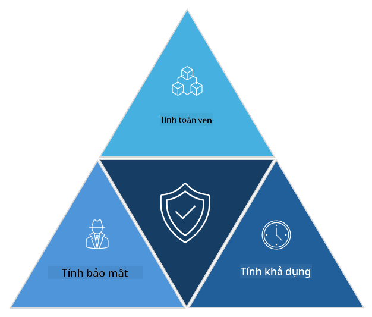

<!--
CO_OP_TRANSLATOR_METADATA:
{
  "original_hash": "16a76f9fa372fb63cffb6d76b855f023",
  "translation_date": "2025-09-04T01:10:55+00:00",
  "source_file": "1.1 The CIA triad and other key concepts.md",
  "language_code": "vi"
}
-->
# Bộ ba CIA và các khái niệm quan trọng khác

## Giới thiệu

Trong bài học này, chúng ta sẽ tìm hiểu:

 - An ninh mạng là gì?
   
 - Bộ ba CIA trong an ninh mạng là gì?

 - Tính xác thực, không thể chối bỏ và quyền riêng tư trong bối cảnh an ninh mạng là gì?

## An ninh mạng là gì?

An ninh mạng, còn được gọi là bảo mật thông tin, là việc bảo vệ các hệ thống máy tính, mạng, thiết bị và dữ liệu khỏi các cuộc tấn công kỹ thuật số, truy cập trái phép, hư hại hoặc đánh cắp. Mục tiêu chính của an ninh mạng là đảm bảo tính bảo mật, toàn vẹn và khả dụng của tài sản và thông tin số. Các chuyên gia an ninh mạng thiết kế và triển khai các biện pháp kiểm soát bảo mật để bảo vệ tài sản, dữ liệu và thông tin. Khi cuộc sống của chúng ta ngày càng số hóa và trực tuyến, an ninh mạng đã trở thành một mối quan tâm hàng đầu đối với cả cá nhân và tổ chức.

## Bộ ba CIA trong an ninh mạng là gì?

Bộ ba an ninh mạng đề cập đến mô hình bao gồm ba yếu tố chính cần xem xét trong bất kỳ công việc an ninh mạng nào hoặc khi thiết kế một hệ thống/môi trường:

### Tính bảo mật (Confidentiality)

Đây là yếu tố mà hầu hết mọi người sẽ nghĩ đến khi nhắc đến "an ninh mạng": tính bảo mật là quá trình bảo vệ dữ liệu và thông tin khỏi các nỗ lực truy cập trái phép, tức là chỉ những người cần xem thông tin mới có thể truy cập được. Tuy nhiên, không phải tất cả dữ liệu đều như nhau, và dữ liệu thường được phân loại và bảo vệ dựa trên mức độ thiệt hại có thể xảy ra nếu nó bị truy cập bởi những người không được phép.

### Tính toàn vẹn (Integrity)

Đề cập đến việc bảo vệ tính chính xác và đáng tin cậy của dữ liệu trong các môi trường và không cho phép dữ liệu bị thay đổi hoặc chỉnh sửa bởi những cá nhân không được phép. Ví dụ: một sinh viên thay đổi ngày sinh của mình trong hồ sơ lái xe tại DMV để làm cho mình lớn tuổi hơn, từ đó có thể in lại giấy phép lái xe với ngày sinh sớm hơn để mua rượu.

### Tính khả dụng (Availability)

Đây là một yếu tố cần xem xét trong toàn bộ hoạt động CNTT, nhưng tính khả dụng cũng rất quan trọng đối với an ninh mạng. Có những loại tấn công cụ thể nhắm vào tính khả dụng mà các chuyên gia bảo mật phải bảo vệ (ví dụ: các cuộc tấn công từ chối dịch vụ phân tán – DDoS).

**Bộ ba CIA trong an ninh mạng**

## Tính xác thực, không thể chối bỏ và quyền riêng tư trong bối cảnh an ninh mạng là gì?

Đây là những khái niệm quan trọng bổ sung liên quan đến việc đảm bảo tính bảo mật và đáng tin cậy của hệ thống và dữ liệu:

**Tính xác thực (Authenticity)** - đề cập đến việc đảm bảo rằng thông tin, giao tiếp hoặc thực thể mà bạn đang tương tác là chính hãng và không bị giả mạo hoặc thay đổi bởi các bên không được phép.

**Không thể chối bỏ (Nonrepudiation)** - là khái niệm đảm bảo rằng một bên không thể phủ nhận sự tham gia của họ hoặc tính xác thực của một giao dịch hoặc giao tiếp. Nó ngăn chặn ai đó tuyên bố rằng họ không gửi một tin nhắn hoặc thực hiện một hành động cụ thể khi có bằng chứng ngược lại.

**Quyền riêng tư (Privacy)** - đề cập đến việc bảo vệ thông tin nhạy cảm và thông tin nhận dạng cá nhân khỏi truy cập, sử dụng, tiết lộ hoặc thao túng trái phép. Nó bao gồm việc kiểm soát ai có quyền truy cập vào dữ liệu cá nhân và cách dữ liệu đó được thu thập, lưu trữ và chia sẻ.

## Đọc thêm

[What Is Information Security (InfoSec)? | Microsoft Security](https://www.microsoft.com/security/business/security-101/what-is-information-security-infosec#:~:text=Three%20pillars%20of%20information%20security%3A%20the%20CIA%20triad,as%20guiding%20principles%20for%20implementing%20an%20InfoSec%20plan.)

---

**Tuyên bố miễn trừ trách nhiệm**:  
Tài liệu này đã được dịch bằng dịch vụ dịch thuật AI [Co-op Translator](https://github.com/Azure/co-op-translator). Mặc dù chúng tôi cố gắng đảm bảo độ chính xác, xin lưu ý rằng các bản dịch tự động có thể chứa lỗi hoặc không chính xác. Tài liệu gốc bằng ngôn ngữ bản địa nên được coi là nguồn tham khảo chính thức. Đối với các thông tin quan trọng, chúng tôi khuyến nghị sử dụng dịch vụ dịch thuật chuyên nghiệp từ con người. Chúng tôi không chịu trách nhiệm cho bất kỳ sự hiểu lầm hoặc diễn giải sai nào phát sinh từ việc sử dụng bản dịch này.