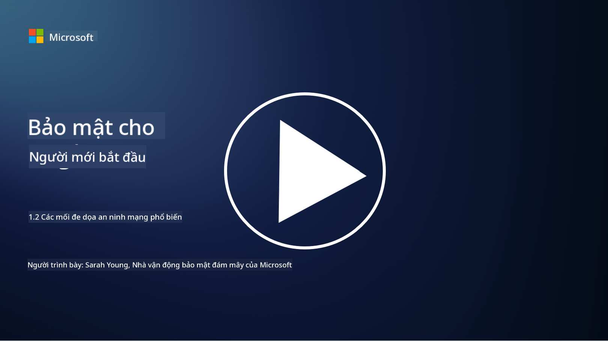

<!--
CO_OP_TRANSLATOR_METADATA:
{
  "original_hash": "6fc3030323139d7134a4ca9d03eccac9",
  "translation_date": "2025-09-03T23:26:01+00:00",
  "source_file": "1.2 Common cybersecurity threats.md",
  "language_code": "vi"
}
-->
# Các mối đe dọa an ninh mạng phổ biến

## Giới thiệu

Trong bài học này, chúng ta sẽ tìm hiểu:

- Mối đe dọa an ninh mạng là gì?

- Tại sao các tác nhân độc hại muốn xâm phạm dữ liệu và hệ thống CNTT?

- Những loại mối đe dọa an ninh mạng phổ biến nhất là gì?

- Khung MITRE ATT&CK là gì?

- Làm thế nào để cập nhật thông tin về bối cảnh các mối đe dọa an ninh mạng?

## Mối đe dọa an ninh mạng là gì?

Mối đe dọa an ninh mạng đề cập đến bất kỳ nguy cơ hoặc rủi ro tiềm tàng nào có thể làm tổn hại đến tính bảo mật, tính toàn vẹn hoặc tính sẵn sàng của dữ liệu hoặc hệ thống CNTT. Những mối đe dọa này xuất phát từ các tác nhân độc hại, những người cố gắng khai thác các lỗ hổng để truy cập trái phép, đánh cắp thông tin nhạy cảm, làm gián đoạn hoạt động hoặc gây hại cho cá nhân, tổ chức, hoặc thậm chí cả quốc gia. Các mối đe dọa an ninh mạng có thể xuất hiện dưới nhiều hình thức và nhắm vào các khía cạnh khác nhau của hệ thống và dữ liệu số.

## Tại sao các tác nhân độc hại muốn xâm phạm dữ liệu và hệ thống CNTT?

Các tác nhân độc hại xâm phạm dữ liệu và hệ thống CNTT vì nhiều lý do khác nhau, thường được thúc đẩy bởi lợi ích cá nhân, động cơ ý thức hệ, hoặc mong muốn gây gián đoạn. Hiểu được những động cơ này có thể giúp các tổ chức và cá nhân bảo vệ tốt hơn trước các mối đe dọa mạng. Một số lý do phổ biến khiến các tác nhân độc hại thực hiện các cuộc tấn công mạng bao gồm:

1. **Lợi ích tài chính**: Nhiều cuộc tấn công được thúc đẩy bởi mong muốn kiếm lợi nhuận tài chính. Các tác nhân độc hại có thể đánh cắp thông tin nhạy cảm như số thẻ tín dụng, chi tiết tài khoản ngân hàng, hoặc thông tin nhận dạng cá nhân để thực hiện gian lận, đánh cắp danh tính, đòi tiền chuộc hoặc bán dữ liệu bị đánh cắp trên dark web.

2. **Gián điệp**: Các quốc gia, đối thủ cạnh tranh, hoặc các thực thể khác có thể thực hiện gián điệp mạng để đánh cắp dữ liệu nhạy cảm của chính phủ, doanh nghiệp, hoặc nghiên cứu nhằm đạt được lợi thế chính trị, kinh tế, hoặc quân sự.

3. **Gây gián đoạn và phá hoại**: Một số cuộc tấn công nhằm mục đích làm gián đoạn cơ sở hạ tầng quan trọng, dịch vụ, hoặc hoạt động vì lý do chính trị hoặc ý thức hệ. Những cuộc tấn công này có thể gây ra hỗn loạn trên diện rộng, tổn thất tài chính, và tổn hại danh tiếng.

4. **Động cơ ý thức hệ**: Các nhóm hacktivist và các nhóm có động cơ chính trị hoặc ý thức hệ có thể xâm phạm hệ thống để nâng cao nhận thức về các vấn đề nhất định, quảng bá niềm tin của họ, hoặc phản đối các hành động hoặc tổ chức cụ thể.

5. **Hành động vô ý**: Không phải tất cả các hành động độc hại đều có chủ ý; một số cá nhân có thể vô tình góp phần vào các mối đe dọa mạng bằng cách trở thành nạn nhân của kỹ thuật xã hội hoặc là một phần của mạng lưới bị xâm phạm.

Cuối cùng, động cơ xâm phạm dữ liệu và hệ thống CNTT có thể rất đa dạng, và tác động của những cuộc tấn công này có thể rất nghiêm trọng. Điều quan trọng là các cá nhân, tổ chức, và chính phủ phải coi trọng an ninh mạng và thực hiện các biện pháp để bảo vệ trước những mối đe dọa này.

## Những loại mối đe dọa an ninh mạng phổ biến nhất là gì?

Có một số loại tấn công an ninh mạng phổ biến mà các tác nhân độc hại sử dụng để xâm phạm hệ thống, đánh cắp dữ liệu, và gây gián đoạn. Dưới đây là một số loại phổ biến nhất tại thời điểm viết bài:

1. **Phishing**:

Phishing liên quan đến việc gửi các email hoặc tin nhắn lừa đảo có vẻ như đến từ các nguồn đáng tin cậy nhằm lừa người nhận tiết lộ thông tin nhạy cảm, chẳng hạn như mật khẩu, số thẻ tín dụng, hoặc thông tin cá nhân. Phishing cũng có thể dẫn dụ nạn nhân đến các trang web độc hại hoặc tải xuống phần mềm độc hại.

2. **Malware**:

Malware (phần mềm độc hại) bao gồm một loạt các chương trình độc hại được thiết kế để lây nhiễm hệ thống, đánh cắp dữ liệu, hoặc gây thiệt hại. Các loại malware bao gồm:

- **Ransomware**: Mã hóa tệp và yêu cầu tiền chuộc để giải mã.

- **Trojans**: Ngụy trang dưới dạng phần mềm hợp pháp, cho phép kẻ tấn công truy cập trái phép.

- **Viruses**: Chương trình tự sao chép, gắn vào tệp và lây lan.

- **Worms**: Chương trình tự sao chép, lây lan qua mạng.

3. **Tấn công từ chối dịch vụ (DoS) và từ chối dịch vụ phân tán (DDoS)**:

Các cuộc tấn công DoS làm quá tải hệ thống mục tiêu, khiến nó không thể truy cập được đối với người dùng. Các cuộc tấn công DDoS sử dụng một mạng lưới các thiết bị bị xâm phạm để làm ngập mục tiêu bằng lưu lượng truy cập, khiến hệ thống khó hoạt động bình thường hoặc ngừng hoạt động hoàn toàn.

4. **SQL Injection**:

Trong cuộc tấn công này, kẻ tấn công thao túng các trường nhập liệu của ứng dụng web để chèn các truy vấn SQL độc hại, có khả năng truy cập trái phép vào cơ sở dữ liệu và dữ liệu nhạy cảm.

5. **Cross-Site Scripting (XSS)**:

Kẻ tấn công chèn các tập lệnh độc hại vào ứng dụng web, sau đó được thực thi bởi trình duyệt của người dùng không nghi ngờ. Điều này có thể dẫn đến việc đánh cắp dữ liệu người dùng và/hoặc lây lan phần mềm độc hại.

6. **Kỹ thuật xã hội**:

Kỹ thuật xã hội khai thác tâm lý con người để thao túng cá nhân tiết lộ thông tin bí mật hoặc thực hiện các hành động làm tổn hại đến an ninh.

7. **Zero-Day (0day) Exploits**:

Những cuộc tấn công này nhắm vào các lỗ hổng trong phần mềm hoặc phần cứng mà nhà cung cấp hoặc công chúng chưa biết đến. Kẻ tấn công lợi dụng những lỗ hổng này trước khi các bản vá được phát triển. Nhiều tổ chức lo ngại về zero-day vì không có bản vá cho chúng, nhưng chúng không phổ biến như các cuộc tấn công khác trong danh sách này. Khi một zero-day được phát hiện, các nhà nghiên cứu bảo mật sẽ nhanh chóng làm việc để tạo ra bản vá, do đó zero-day thường tồn tại trong thời gian ngắn.

8. **Tấn công thông tin xác thực**:

Các cuộc tấn công này bao gồm tấn công brute force, nơi kẻ tấn công đoán mật khẩu lặp đi lặp lại, và tấn công credential stuffing, nơi thông tin xác thực bị đánh cắp từ một trang web được sử dụng để cố gắng truy cập vào các trang web khác.

## Khung MITRE ATT&CK là gì?

[Khung MITRE ATT&CK](https://attack.mitre.org/) (Adversarial Tactics, Techniques, and Common Knowledge) là một khung phân loại và sắp xếp các chiến thuật, kỹ thuật, và quy trình (TTPs) mà các tác nhân độc hại sử dụng trong các cuộc tấn công mạng. Khung này được tạo ra bởi MITRE Corporation, một tổ chức phi lợi nhuận điều hành các trung tâm nghiên cứu và phát triển cho nhiều cơ quan chính phủ.

Khung MITRE ATT&CK cung cấp một cách tiêu chuẩn hóa để mô tả và phân tích các mối đe dọa mạng, cho phép các chuyên gia an ninh mạng hiểu rõ hơn và bảo vệ trước các kỹ thuật tấn công khác nhau. Nó được sử dụng rộng rãi bởi các nhóm bảo mật, các nhà săn lùng mối đe dọa, và các nhà phản ứng sự cố để:

1. **Hiểu hành vi của kẻ tấn công**: Khung này ghi lại các hành vi tấn công thực tế, phác thảo các bước mà kẻ tấn công thực hiện từ khi xâm nhập ban đầu đến khi đạt được mục tiêu của chúng. Nó bao gồm một loạt các kỹ thuật tấn công được sử dụng bởi các nhóm đe dọa khác nhau.

2. **Lập kế hoạch và triển khai chiến lược phòng thủ**: Các nhóm bảo mật có thể sử dụng khung này để phát triển các chiến lược phòng thủ chủ động phù hợp với các chiến thuật và kỹ thuật cụ thể mà kẻ tấn công có thể sử dụng.

3. **Phản ứng sự cố và săn lùng mối đe dọa**: Khi điều tra các sự cố hoặc thực hiện săn lùng mối đe dọa, các chuyên gia bảo mật có thể tham khảo khung này để xác định và giảm thiểu các kỹ thuật cụ thể mà kẻ tấn công đã sử dụng.

Khung MITRE ATT&CK được tổ chức thành các ma trận nhóm các kỹ thuật tấn công dựa trên các nền tảng và môi trường cụ thể, chẳng hạn như Windows, macOS, Linux, và các dịch vụ đám mây. Mỗi ma trận được chia thành các chiến thuật (mục tiêu cấp cao) và kỹ thuật (phương pháp cụ thể được sử dụng để đạt được các mục tiêu đó). Đối với mỗi kỹ thuật, khung cung cấp thông tin về cách nó hoạt động, các biện pháp giảm thiểu tiềm năng, và các tham chiếu liên quan đến các tác nhân đe dọa thực tế đã sử dụng kỹ thuật này.

Khung này liên tục được cập nhật và mở rộng khi có thêm thông tin tình báo về mối đe dọa và khi bối cảnh an ninh mạng phát triển. Đây là một nguồn tài nguyên quý giá để nâng cao tư thế an ninh mạng của tổ chức bằng cách cho phép hiểu sâu hơn về cách kẻ tấn công hoạt động và cách bảo vệ trước các chiến thuật của chúng.

## Làm thế nào để cập nhật thông tin về bối cảnh các mối đe dọa an ninh mạng?

Có nhiều nguồn có thể được sử dụng để cập nhật thông tin về các mối đe dọa an ninh mạng, dưới đây là một số lựa chọn:

- [Open Web Application Security Project (OWASP) top 10 vulnerabilities](https://owasp.org/Top10/)
- [Common Vulnerabilities and Exposures (CVEs)](https://www.bing.com/ck/a?!&&p=53df6007f017bca2JmltdHM9MTY5MjU3NjAwMCZpZ3VpZD0zYmY4N2RiYS1jYWI1LTYwMDgtMWY1YS02ZmYyY2JjNjYxZWUmaW5zaWQ9NTc2OQ&ptn=3&hsh=3&fclid=3bf87dba-cab5-6008-1f5a-6ff2cbc661ee&psq=cve&u=a1aHR0cHM6Ly9iaW5nLmNvbS9hbGluay9saW5rP3VybD1odHRwcyUzYSUyZiUyZmN2ZS5taXRyZS5vcmclMmYmc291cmNlPXNlcnAtcnImaD1BZXN4S0VBWTNnbGhNZEFpd3daMlNSZkZQNTlrODhIUnYxRUtlSkY1RTk0JTNkJnA9a2NvZmZjaWFsd2Vic2l0ZQ&ntb=1 "Common Vulnerabilities and Exposures")
- [Microsoft Security Response Center blogs](https://msrc.microsoft.com/blog/)
- [National Institute of Standards and Technology (NIST)](https://www.dhs.gov/topics/cybersecurity): NIST cung cấp các tài nguyên, cảnh báo, và cập nhật mới nhất về các mối đe dọa an ninh mạng tiềm tàng.
- [Cybersecurity and Infrastructure Security Agency (CISA)](https://www.cisa.gov/resources-tools/resources/free-cybersecurity-services-and-tools): CISA cung cấp các tài nguyên và thực hành tốt nhất về an ninh mạng cho các doanh nghiệp, cơ quan chính phủ, và các tổ chức khác. CISA chia sẻ thông tin cập nhật về các loại hoạt động an ninh có tác động lớn ảnh hưởng đến cộng đồng và phân tích chuyên sâu về các mối đe dọa mạng mới và đang phát triển.
- [National Cybersecurity Center of Excellence (NCCoE)](https://www.dhs.gov/topics/cybersecurity): NCCoE là một trung tâm cung cấp các giải pháp an ninh mạng thực tiễn có thể áp dụng trong các tình huống thực tế.
- [US-CERT](https://www.cisa.gov/resources-tools/resources/free-cybersecurity-services-and-tools): Đội Ứng cứu Khẩn cấp Máy tính Hoa Kỳ (US-CERT) cung cấp nhiều tài nguyên an ninh mạng, bao gồm cảnh báo, mẹo, và nhiều hơn nữa.
- Đội Ứng cứu Khẩn cấp Máy tính (CERT) của quốc gia bạn.

---

**Tuyên bố miễn trừ trách nhiệm**:  
Tài liệu này đã được dịch bằng dịch vụ dịch thuật AI [Co-op Translator](https://github.com/Azure/co-op-translator). Mặc dù chúng tôi cố gắng đảm bảo độ chính xác, xin lưu ý rằng các bản dịch tự động có thể chứa lỗi hoặc không chính xác. Tài liệu gốc bằng ngôn ngữ bản địa nên được coi là nguồn thông tin chính thức. Đối với các thông tin quan trọng, khuyến nghị sử dụng dịch vụ dịch thuật chuyên nghiệp bởi con người. Chúng tôi không chịu trách nhiệm cho bất kỳ sự hiểu lầm hoặc diễn giải sai nào phát sinh từ việc sử dụng bản dịch này.