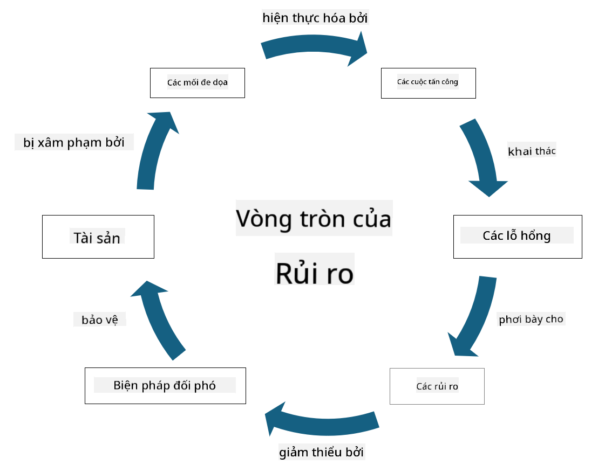

<!--
CO_OP_TRANSLATOR_METADATA:
{
  "original_hash": "fcca304f072cabf206388199e8e2e578",
  "translation_date": "2025-09-04T01:32:08+00:00",
  "source_file": "1.3 Understanding risk management.md",
  "language_code": "vi"
}
-->
# Hiểu về quản lý rủi ro

## Giới thiệu

Trong bài học này, chúng ta sẽ tìm hiểu:

- Các định nghĩa về thuật ngữ bảo mật thường dùng

- Các loại biện pháp kiểm soát bảo mật

- Đánh giá rủi ro bảo mật

## Các định nghĩa về thuật ngữ bảo mật thường dùng

Những thuật ngữ này là các khái niệm cơ bản trong lĩnh vực an ninh mạng và quản lý rủi ro. Hãy cùng phân tích từng thuật ngữ và mối liên hệ giữa chúng:

1. **Tác nhân đe dọa**:

Tác nhân đe dọa là cá nhân, nhóm, tổ chức hoặc hệ thống tự động có khả năng khai thác các lỗ hổng trong hệ thống hoặc mạng để gây hại hoặc thiệt hại. Tác nhân đe dọa có thể là hacker, tác giả phần mềm độc hại, nhân viên bất mãn, hoặc bất kỳ thực thể nào gây rủi ro cho hệ thống thông tin và công nghệ.

2. **Mối đe dọa**:

Mối đe dọa là một sự kiện hoặc hành động tiềm tàng có thể khai thác lỗ hổng trong hệ thống và gây hại cho tài sản. Mối đe dọa có thể bao gồm các hành động như tấn công mạng, rò rỉ dữ liệu, tấn công từ chối dịch vụ, và nhiều hơn nữa. Mối đe dọa là "cái gì" trong việc gây hại tiềm tàng cho tài sản của tổ chức.

3. **Lỗ hổng**:

Lỗ hổng là điểm yếu hoặc lỗi trong thiết kế, triển khai, hoặc cấu hình của hệ thống mà tác nhân đe dọa có thể khai thác để làm tổn hại đến bảo mật của hệ thống. Lỗ hổng có thể tồn tại trong phần mềm, phần cứng, quy trình, hoặc hành vi con người. Việc xác định và khắc phục lỗ hổng là rất quan trọng để giảm thiểu rủi ro của các cuộc tấn công thành công.

4. **Rủi ro**:

Rủi ro là khả năng xảy ra mất mát, tổn hại, hoặc thiệt hại do sự tương tác giữa mối đe dọa và lỗ hổng. Đây là khả năng mà tác nhân đe dọa sẽ khai thác lỗ hổng để gây ra tác động tiêu cực. Rủi ro thường được đánh giá dựa trên mức độ tác động tiềm tàng và khả năng xảy ra.

5. **Tài sản**:

Tài sản là bất cứ thứ gì có giá trị mà tổ chức muốn bảo vệ. Tài sản có thể bao gồm các vật thể vật lý (như máy tính và máy chủ), dữ liệu (thông tin khách hàng, hồ sơ tài chính), tài sản trí tuệ (bí mật thương mại, bằng sáng chế), và thậm chí cả nguồn nhân lực (kỹ năng và kiến thức của nhân viên). Bảo vệ tài sản là mục tiêu chính của an ninh mạng.

6. **Sự phơi nhiễm**:

Sự phơi nhiễm đề cập đến trạng thái dễ bị tổn thương trước các mối đe dọa tiềm tàng. Nó xảy ra khi tồn tại lỗ hổng mà tác nhân đe dọa có thể khai thác. Sự phơi nhiễm làm nổi bật rủi ro liên quan đến việc có các lỗ hổng trong hệ thống hoặc mạng.

7. **Biện pháp kiểm soát**:

Biện pháp kiểm soát là các biện pháp được thực hiện để giảm rủi ro liên quan đến lỗ hổng và mối đe dọa. Các biện pháp kiểm soát có thể mang tính kỹ thuật, quy trình, hoặc hành chính. Chúng được thiết kế để ngăn chặn, phát hiện, hoặc giảm thiểu các mối đe dọa và lỗ hổng tiềm tàng. Ví dụ bao gồm tường lửa, kiểm soát truy cập, mã hóa, chính sách bảo mật, và đào tạo nhân viên.

Tóm lại, mối quan hệ giữa các thuật ngữ này là: Tác nhân đe dọa khai thác lỗ hổng để thực hiện mối đe dọa, dẫn đến rủi ro có khả năng gây hại cho tài sản có giá trị. Sự phơi nhiễm xảy ra khi có lỗ hổng, và các biện pháp kiểm soát được thực hiện để giảm rủi ro bằng cách ngăn chặn hoặc giảm thiểu tác động của mối đe dọa lên tài sản. Khung này là cơ sở của quản lý rủi ro an ninh mạng, hướng dẫn các tổ chức trong việc xác định, đánh giá, và xử lý các rủi ro tiềm tàng đối với hệ thống thông tin và tài sản của họ.

## Các loại biện pháp kiểm soát bảo mật

Biện pháp kiểm soát bảo mật là các biện pháp hoặc biện pháp bảo vệ được thực hiện để bảo vệ hệ thống thông tin và tài sản khỏi các mối đe dọa và lỗ hổng khác nhau. Chúng có thể được phân loại thành nhiều loại dựa trên trọng tâm và mục đích của chúng. Dưới đây là một số loại biện pháp kiểm soát bảo mật phổ biến:

1. **Kiểm soát hành chính**:

Các biện pháp kiểm soát này liên quan đến các chính sách, quy trình, và hướng dẫn quản lý các thực hành bảo mật và hành vi của người dùng trong tổ chức.

- Chính sách và quy trình bảo mật: Các hướng dẫn được tài liệu hóa định nghĩa cách duy trì bảo mật trong tổ chức.

- Nhận thức và đào tạo về bảo mật: Các chương trình giáo dục nhân viên về các thực hành bảo mật tốt nhất và các mối đe dọa tiềm tàng.

- Phản ứng và quản lý sự cố: Kế hoạch để phản ứng và giảm thiểu các sự cố bảo mật.

2. **Kiểm soát kỹ thuật**:

Kiểm soát kỹ thuật liên quan đến việc sử dụng công nghệ để thực thi các biện pháp bảo mật và bảo vệ hệ thống và dữ liệu. Ví dụ về kiểm soát kỹ thuật bao gồm:

- Kiểm soát truy cập: Các biện pháp hạn chế quyền truy cập của người dùng vào tài nguyên dựa trên vai trò và quyền hạn của họ.

- Mã hóa: Chuyển đổi dữ liệu sang định dạng an toàn để ngăn chặn truy cập trái phép.

- Tường lửa: Thiết bị bảo mật mạng lọc và kiểm soát lưu lượng vào và ra.

- Hệ thống phát hiện và ngăn chặn xâm nhập (IDPS): Công cụ giám sát lưu lượng mạng để phát hiện hoạt động đáng ngờ.

- Phần mềm chống virus và chống phần mềm độc hại: Chương trình phát hiện và loại bỏ phần mềm độc hại.

- Cơ chế xác thực: Phương pháp xác minh danh tính của người dùng, như mật khẩu, sinh trắc học, và xác thực đa yếu tố.

- Quản lý bản vá lỗi: Cập nhật phần mềm thường xuyên để khắc phục các lỗ hổng đã biết.

3. **Kiểm soát vật lý**:

Kiểm soát vật lý là các biện pháp bảo vệ tài sản vật lý và cơ sở hạ tầng.

- Nhân viên bảo vệ và kiểm soát truy cập: Nhân viên giám sát và kiểm soát quyền truy cập vào cơ sở vật lý.

- Camera giám sát: Hệ thống giám sát video để theo dõi và ghi lại hoạt động.

- Khóa và rào cản vật lý: Các biện pháp vật lý để hạn chế quyền truy cập vào khu vực nhạy cảm.

- Kiểm soát môi trường: Các biện pháp điều chỉnh nhiệt độ, độ ẩm, và các yếu tố môi trường khác ảnh hưởng đến thiết bị và trung tâm dữ liệu.

4. **Kiểm soát hoạt động**:

Các biện pháp kiểm soát này liên quan đến các hoạt động và hoạt động hàng ngày đảm bảo bảo mật liên tục của hệ thống.

- Quản lý thay đổi: Quy trình theo dõi và phê duyệt các thay đổi đối với hệ thống và cấu hình.

- Sao lưu và khôi phục thảm họa: Kế hoạch sao lưu dữ liệu và khôi phục trong trường hợp hệ thống gặp sự cố hoặc thảm họa.

- Ghi nhật ký và kiểm toán: Giám sát và ghi lại hoạt động hệ thống để đảm bảo bảo mật và tuân thủ.

- Thực hành mã hóa an toàn: Hướng dẫn viết phần mềm để giảm thiểu lỗ hổng.

5. **Kiểm soát pháp lý và quy định**:

Các biện pháp kiểm soát này đảm bảo tuân thủ các luật, quy định, và tiêu chuẩn ngành liên quan. Các tiêu chuẩn mà tổ chức cần tuân thủ phụ thuộc vào khu vực pháp lý, ngành nghề, và các yếu tố khác.

- Quy định bảo vệ dữ liệu: Tuân thủ các luật như GDPR, HIPAA, và CCPA.

- Tiêu chuẩn ngành cụ thể: Tuân thủ các tiêu chuẩn như PCI DSS để bảo mật dữ liệu thẻ thanh toán.

Các loại biện pháp kiểm soát bảo mật này phối hợp với nhau để tạo ra một tư thế bảo mật toàn diện cho tổ chức, giúp bảo vệ hệ thống, dữ liệu, và tài sản của họ khỏi nhiều mối đe dọa.

## Đánh giá rủi ro bảo mật

Một số chuyên gia bảo mật cho rằng quản lý rủi ro là công việc của các chuyên gia rủi ro, nhưng việc hiểu quy trình quản lý rủi ro bảo mật rất quan trọng đối với bất kỳ chuyên gia bảo mật nào để có thể diễn đạt rủi ro bảo mật bằng ngôn ngữ mà phần còn lại của tổ chức có thể hiểu và hành động.

Các tổ chức phải liên tục đánh giá rủi ro bảo mật và quyết định hành động (hoặc không hành động) đối với các rủi ro đối với doanh nghiệp. Dưới đây là tổng quan về cách quy trình này thường được thực hiện. Lưu ý rằng quy trình này thường được thực hiện bởi nhiều nhóm khác nhau trong tổ chức, hiếm khi một nhóm chịu trách nhiệm toàn bộ quy trình quản lý rủi ro từ đầu đến cuối.

1. **Xác định tài sản và mối đe dọa**:

Tổ chức xác định các tài sản mà họ muốn bảo vệ. Những tài sản này có thể bao gồm dữ liệu, hệ thống, phần cứng, phần mềm, tài sản trí tuệ, và nhiều hơn nữa. Tiếp theo, họ xác định các mối đe dọa tiềm tàng có thể nhắm vào các tài sản này.

2. **Đánh giá lỗ hổng**:

Tổ chức sau đó xác định các lỗ hổng hoặc điểm yếu trong hệ thống hoặc quy trình có thể bị khai thác bởi các mối đe dọa. Những lỗ hổng này có thể xuất phát từ lỗi phần mềm, cấu hình sai, thiếu biện pháp kiểm soát bảo mật, và lỗi con người.

3. **Đánh giá khả năng xảy ra**:

Tổ chức sau đó đánh giá khả năng xảy ra của từng mối đe dọa. Điều này bao gồm việc xem xét dữ liệu lịch sử, thông tin tình báo về mối đe dọa, xu hướng ngành, và các yếu tố nội bộ. Khả năng xảy ra có thể được phân loại là thấp, trung bình, hoặc cao dựa trên xác suất mối đe dọa xảy ra.

4. **Đánh giá tác động**:

Tiếp theo, tổ chức xác định tác động tiềm tàng của từng mối đe dọa nếu nó khai thác lỗ hổng. Tác động có thể bao gồm tổn thất tài chính, gián đoạn hoạt động, tổn hại danh tiếng, hậu quả pháp lý, và nhiều hơn nữa. Tác động cũng có thể được phân loại là thấp, trung bình, hoặc cao dựa trên hậu quả tiềm tàng.

5. **Tính toán rủi ro**:

Đánh giá khả năng xảy ra và tác động được kết hợp để tính toán mức độ rủi ro tổng thể cho từng mối đe dọa đã xác định. Điều này thường được thực hiện bằng cách sử dụng ma trận rủi ro, trong đó gán giá trị số hoặc mô tả định tính cho các mức độ khả năng xảy ra và tác động. Mức độ rủi ro kết quả giúp ưu tiên các rủi ro cần được chú ý ngay lập tức.

6. **Ưu tiên và ra quyết định**:

Tổ chức sau đó ưu tiên các rủi ro bằng cách tập trung vào những rủi ro có giá trị khả năng xảy ra và tác động cao nhất. Điều này cho phép họ phân bổ nguồn lực và thực hiện các biện pháp kiểm soát một cách hiệu quả hơn. Các mối đe dọa có rủi ro cao cần được chú ý ngay lập tức, trong khi các mối đe dọa có rủi ro thấp hơn có thể được xử lý trong thời gian dài hơn.

7. **Xử lý rủi ro**:

Dựa trên đánh giá rủi ro, tổ chức xác định cách giảm thiểu hoặc quản lý từng rủi ro. Điều này có thể bao gồm việc thực hiện các biện pháp kiểm soát bảo mật, chuyển giao rủi ro thông qua bảo hiểm, hoặc thậm chí chấp nhận một số mức độ rủi ro còn lại nếu chúng được coi là có thể quản lý/chi phí quá cao để khắc phục/v.v.

8. **Giám sát và xem xét liên tục**:

Đánh giá rủi ro không phải là một quy trình thực hiện một lần. Nó nên được thực hiện định kỳ hoặc bất cứ khi nào có sự thay đổi đáng kể trong môi trường của tổ chức. Giám sát liên tục đảm bảo rằng các mối đe dọa mới, lỗ hổng, hoặc thay đổi trong bối cảnh kinh doanh được tính đến.

Bằng cách đánh giá rủi ro bảo mật theo cách có cấu trúc này, các tổ chức có thể đưa ra quyết định sáng suốt về việc phân bổ nguồn lực, biện pháp kiểm soát bảo mật, và chiến lược quản lý rủi ro tổng thể. Mục tiêu là giảm thiểu sự phơi nhiễm rủi ro tổng thể của tổ chức trong khi điều chỉnh các nỗ lực bảo mật với các mục tiêu và mục đích kinh doanh của tổ chức.

---

**Tuyên bố miễn trừ trách nhiệm**:  
Tài liệu này đã được dịch bằng dịch vụ dịch thuật AI [Co-op Translator](https://github.com/Azure/co-op-translator). Mặc dù chúng tôi cố gắng đảm bảo độ chính xác, xin lưu ý rằng các bản dịch tự động có thể chứa lỗi hoặc không chính xác. Tài liệu gốc bằng ngôn ngữ bản địa nên được coi là nguồn thông tin chính thức. Đối với các thông tin quan trọng, nên sử dụng dịch vụ dịch thuật chuyên nghiệp từ con người. Chúng tôi không chịu trách nhiệm về bất kỳ sự hiểu lầm hoặc diễn giải sai nào phát sinh từ việc sử dụng bản dịch này.