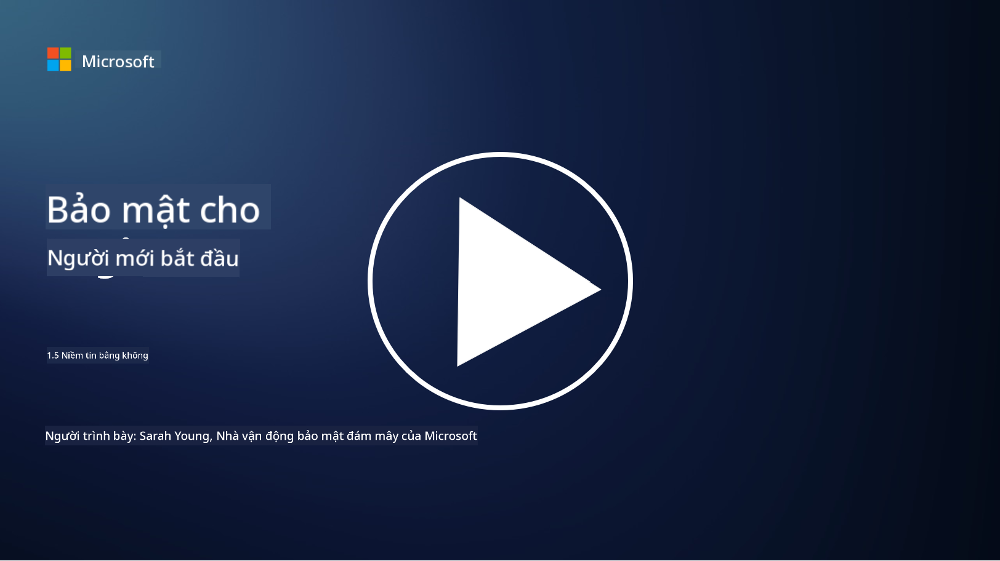
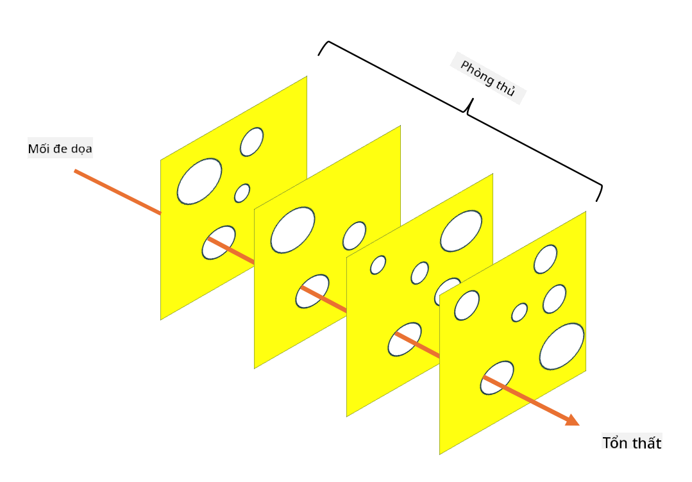

<!--
CO_OP_TRANSLATOR_METADATA:
{
  "original_hash": "75f77f972d2233c584f87c1eb96c983b",
  "translation_date": "2025-09-03T23:48:33+00:00",
  "source_file": "1.5 Zero trust.md",
  "language_code": "vi"
}
-->
# Zero Trust

“Zero trust” là một cụm từ được sử dụng rất nhiều trong lĩnh vực an ninh mạng hiện nay. Nhưng nó có nghĩa là gì, liệu nó chỉ là một từ thông dụng? Trong bài học này, chúng ta sẽ tìm hiểu chính xác về khái niệm zero trust.

## Giới thiệu

 - Trong bài học này, chúng ta sẽ tìm hiểu:
   
   
 - Zero trust là gì?

   
  

 - Zero trust khác biệt như thế nào so với các kiến trúc bảo mật truyền thống?

   
   

 - Defense in depth là gì?

## Zero Trust

Zero Trust là một cách tiếp cận an ninh mạng thách thức quan niệm truyền thống "tin tưởng nhưng xác minh" bằng cách giả định rằng không có thực thể nào, dù bên trong hay bên ngoài mạng của tổ chức, được tin tưởng một cách mặc định. Thay vào đó, Zero Trust khuyến khích việc xác minh mọi người dùng, thiết bị và ứng dụng cố gắng truy cập tài nguyên, bất kể vị trí của họ. Nguyên tắc cốt lõi của Zero Trust là giảm thiểu "bề mặt tấn công" và giảm thiểu tác động tiềm tàng của các vi phạm an ninh.

Trong mô hình Zero Trust, các nguyên tắc sau được nhấn mạnh:

1. **Xác minh danh tính**: Xác thực và cấp quyền được áp dụng nghiêm ngặt cho tất cả người dùng và thiết bị, bất kể vị trí của họ. Hãy nhớ rằng danh tính không nhất thiết phải là con người: nó có thể là một thiết bị, một ứng dụng, v.v.

2. **Quyền hạn tối thiểu**: Người dùng và thiết bị chỉ được cấp quyền truy cập ở mức tối thiểu cần thiết để thực hiện nhiệm vụ của họ, giảm thiểu thiệt hại nếu bị xâm phạm.

3. **Phân đoạn vi mô**: Tài nguyên mạng được chia thành các phân đoạn nhỏ hơn để hạn chế sự di chuyển ngang trong mạng nếu xảy ra vi phạm.

4. **Giám sát liên tục**: Việc giám sát và phân tích hành vi của người dùng và thiết bị được thực hiện liên tục để phát hiện các bất thường và mối đe dọa tiềm tàng. Các kỹ thuật giám sát hiện đại cũng sử dụng học máy, AI và thông tin tình báo về mối đe dọa để cung cấp thêm chi tiết và ngữ cảnh cho việc giám sát.

5. **Mã hóa dữ liệu**: Dữ liệu được mã hóa cả khi truyền tải và khi lưu trữ để ngăn chặn truy cập trái phép.

6. **Kiểm soát truy cập nghiêm ngặt**: Các kiểm soát truy cập được thực thi dựa trên ngữ cảnh, chẳng hạn như vai trò của người dùng, tình trạng thiết bị và vị trí mạng.

Microsoft chia Zero Trust thành năm trụ cột, chúng ta sẽ thảo luận trong bài học sau.

## Sự khác biệt so với các kiến trúc bảo mật truyền thống

Zero Trust khác biệt so với các kiến trúc bảo mật truyền thống, chẳng hạn như mô hình dựa trên chu vi, ở một số điểm:

1. **Chu vi vs. Tập trung vào danh tính**: Các mô hình truyền thống tập trung vào việc bảo vệ chu vi của mạng và giả định rằng người dùng và thiết bị nội bộ có thể được tin tưởng khi đã vào bên trong. Zero Trust, ngược lại, giả định rằng mối đe dọa có thể xuất phát từ cả bên trong và bên ngoài mạng và thực thi các kiểm soát nghiêm ngặt dựa trên danh tính.

2. **Tin tưởng ngầm vs. Tin tưởng rõ ràng**: Các mô hình truyền thống tin tưởng ngầm vào thiết bị và người dùng trong mạng cho đến khi chứng minh ngược lại. Zero Trust xác minh danh tính một cách rõ ràng và liên tục giám sát các bất thường.

3. **Mạng phẳng vs. Mạng phân đoạn**: Các kiến trúc truyền thống thường liên quan đến mạng phẳng, nơi người dùng nội bộ có quyền truy cập rộng rãi. Zero Trust khuyến khích phân đoạn mạng thành các khu vực nhỏ, cô lập để ngăn chặn vi phạm tiềm tàng.

4. **Phản ứng vs. Chủ động**: Bảo mật truyền thống thường dựa vào các biện pháp phản ứng như tường lửa chu vi và phát hiện xâm nhập. Zero Trust áp dụng cách tiếp cận chủ động bằng cách giả định rằng vi phạm là điều có thể xảy ra và giảm thiểu tác động của chúng.

## Defense in Depth

Defense in depth, còn được gọi là bảo mật nhiều lớp, là một chiến lược an ninh mạng liên quan đến việc triển khai nhiều lớp kiểm soát và biện pháp bảo mật để bảo vệ tài sản của tổ chức. Mục tiêu là tạo ra các lớp bảo vệ chồng chéo để nếu một lớp bị xâm phạm, các lớp khác vẫn có thể cung cấp sự bảo vệ. Mỗi lớp tập trung vào một khía cạnh khác nhau của bảo mật và tăng cường tư thế bảo mật tổng thể của tổ chức.

Defense in depth bao gồm sự kết hợp giữa các biện pháp kỹ thuật, quy trình và bảo mật vật lý. Những biện pháp này có thể bao gồm tường lửa, hệ thống phát hiện xâm nhập, kiểm soát truy cập, mã hóa, đào tạo người dùng, chính sách bảo mật và nhiều hơn nữa. Ý tưởng là tạo ra nhiều rào cản để tập thể làm cho việc xâm nhập vào hệ thống và mạng của tổ chức trở nên khó khăn. Điều này đôi khi cũng được gọi là mô hình "phô mai Thụy Sĩ", được sử dụng trong phòng ngừa tai nạn ở các ngành công nghiệp khác (ví dụ: vận tải).

## Đọc thêm

[Zero Trust là gì?](https://learn.microsoft.com/security/zero-trust/zero-trust-overview?WT.mc_id=academic-96948-sayoung)

[Phát triển Zero Trust – Tài liệu quan điểm của Microsoft](https://query.prod.cms.rt.microsoft.com/cms/api/am/binary/RWJJdT?WT.mc_id=academic-96948-sayoung)

[Zero Trust và BeyondCorp Google Cloud | Blog Google Cloud](https://cloud.google.com/blog/topics/developers-practitioners/zero-trust-and-beyondcorp-google-cloud)

---

**Tuyên bố miễn trừ trách nhiệm**:  
Tài liệu này đã được dịch bằng dịch vụ dịch thuật AI [Co-op Translator](https://github.com/Azure/co-op-translator). Mặc dù chúng tôi cố gắng đảm bảo độ chính xác, xin lưu ý rằng các bản dịch tự động có thể chứa lỗi hoặc không chính xác. Tài liệu gốc bằng ngôn ngữ bản địa nên được coi là nguồn thông tin chính thức. Đối với các thông tin quan trọng, khuyến nghị sử dụng dịch vụ dịch thuật chuyên nghiệp bởi con người. Chúng tôi không chịu trách nhiệm cho bất kỳ sự hiểu lầm hoặc diễn giải sai nào phát sinh từ việc sử dụng bản dịch này.