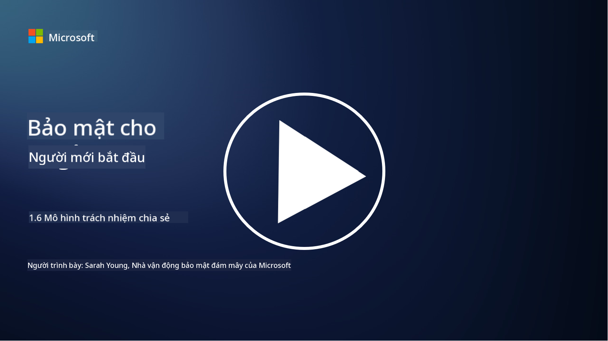

<!--
CO_OP_TRANSLATOR_METADATA:
{
  "original_hash": "a48db640d80c786b928ca178c414f084",
  "translation_date": "2025-09-04T00:27:13+00:00",
  "source_file": "1.6 Shared responsibility model.md",
  "language_code": "vi"
}
-->
# Mô hình trách nhiệm chia sẻ

Trách nhiệm chia sẻ là một khái niệm mới trong lĩnh vực CNTT, xuất hiện cùng với sự phát triển của điện toán đám mây. Từ góc độ an ninh mạng, việc hiểu rõ ai cung cấp các biện pháp kiểm soát an ninh nào là rất quan trọng để tránh các lỗ hổng trong hệ thống phòng thủ.

## Giới thiệu

Trong bài học này, chúng ta sẽ tìm hiểu:

 - Trách nhiệm chia sẻ trong bối cảnh an ninh mạng là gì?
   
 - Sự khác biệt về trách nhiệm chia sẻ đối với các biện pháp kiểm soát an ninh giữa IaaS, PaaS và SaaS là gì?

 - Làm thế nào để bạn biết được nền tảng đám mây của mình cung cấp các biện pháp kiểm soát an ninh nào?

 - “Tin tưởng nhưng cần xác minh” nghĩa là gì?

## Trách nhiệm chia sẻ trong bối cảnh an ninh mạng là gì?

Trách nhiệm chia sẻ trong an ninh mạng đề cập đến việc phân chia trách nhiệm an ninh giữa nhà cung cấp dịch vụ đám mây (CSP) và khách hàng của họ. Trong môi trường điện toán đám mây, chẳng hạn như Infrastructure as a Service (IaaS), Platform as a Service (PaaS), và Software as a Service (SaaS), cả CSP và khách hàng đều có vai trò trong việc đảm bảo an ninh cho dữ liệu, ứng dụng và hệ thống.

## Sự khác biệt về trách nhiệm chia sẻ đối với các biện pháp kiểm soát an ninh giữa IaaS, PaaS và SaaS là gì?

Phân chia trách nhiệm thường phụ thuộc vào loại dịch vụ đám mây được sử dụng:

 - **IaaS (Infrastructure as a Service)**: CSP cung cấp cơ sở hạ tầng nền tảng (máy chủ, mạng, lưu trữ), trong khi khách hàng chịu trách nhiệm quản lý hệ điều hành, ứng dụng và cấu hình an ninh trên cơ sở hạ tầng đó.
   
 - **PaaS (Platform as a Service):** CSP cung cấp một nền tảng để khách hàng xây dựng và triển khai ứng dụng. CSP quản lý cơ sở hạ tầng nền tảng, còn khách hàng tập trung vào phát triển ứng dụng và bảo mật dữ liệu.

 - **SaaS (Software as a Service)**: CSP cung cấp các ứng dụng hoàn chỉnh có thể truy cập qua internet. Trong trường hợp này, CSP chịu trách nhiệm về an ninh của ứng dụng và cơ sở hạ tầng, trong khi khách hàng quản lý quyền truy cập của người dùng và việc sử dụng dữ liệu.

Hiểu rõ trách nhiệm chia sẻ là rất quan trọng vì nó làm rõ các khía cạnh an ninh nào được CSP đảm bảo và các khía cạnh nào khách hàng cần xử lý. Điều này giúp tránh hiểu lầm và đảm bảo rằng các biện pháp an ninh được thực hiện một cách toàn diện.

## Làm thế nào để bạn biết được nền tảng đám mây của mình cung cấp các biện pháp kiểm soát an ninh nào?

Để biết được nền tảng đám mây của bạn cung cấp các biện pháp kiểm soát an ninh nào, bạn cần tham khảo tài liệu và nguồn thông tin từ nhà cung cấp dịch vụ đám mây. Các nguồn này bao gồm:

 - **Trang web và tài liệu của CSP**: Trang web của CSP sẽ cung cấp thông tin về các tính năng và biện pháp kiểm soát an ninh được cung cấp như một phần của dịch vụ. CSP thường cung cấp tài liệu chi tiết giải thích các thực hành, biện pháp kiểm soát và khuyến nghị về an ninh. Điều này có thể bao gồm các tài liệu trắng, hướng dẫn an ninh và tài liệu kỹ thuật.
   
 - **Đánh giá và kiểm toán an ninh**: Hầu hết các CSP đều được các chuyên gia và tổ chức an ninh độc lập đánh giá các biện pháp kiểm soát an ninh của họ. Những đánh giá này có thể cung cấp thông tin chi tiết về chất lượng các biện pháp an ninh của CSP. Đôi khi điều này dẫn đến việc CSP nhận được chứng chỉ tuân thủ an ninh (xem mục tiếp theo).
   
 - **Chứng chỉ tuân thủ an ninh**: Hầu hết các CSP đều đạt được các chứng chỉ như ISO:27001, SOC 2, và FedRAMP, v.v. Những chứng chỉ này chứng minh rằng nhà cung cấp đáp ứng các tiêu chuẩn an ninh và tuân thủ cụ thể.

Hãy nhớ rằng mức độ chi tiết và sự sẵn có của thông tin có thể khác nhau giữa các nhà cung cấp đám mây. Luôn đảm bảo rằng bạn tham khảo các nguồn chính thức và cập nhật từ nhà cung cấp dịch vụ đám mây để đưa ra quyết định đúng đắn về an ninh cho tài sản trên đám mây của mình.

## “Tin tưởng nhưng cần xác minh” nghĩa là gì?

Trong bối cảnh sử dụng CSP, phần mềm của bên thứ ba hoặc các dịch vụ an ninh CNTT khác, một tổ chức có thể ban đầu tin tưởng vào các tuyên bố của nhà cung cấp về các biện pháp an ninh. Tuy nhiên, để thực sự đảm bảo an toàn cho dữ liệu và hệ thống của mình, tổ chức cần xác minh các tuyên bố này thông qua các đánh giá an ninh, kiểm tra thâm nhập và xem xét các biện pháp kiểm soát an ninh của bên ngoài trước khi tích hợp hoàn toàn phần mềm hoặc dịch vụ vào hoạt động của mình. Tất cả cá nhân và tổ chức nên tin tưởng nhưng cần xác minh các biện pháp kiểm soát an ninh mà họ không chịu trách nhiệm.

## Trách nhiệm chia sẻ trong nội bộ tổ chức

Hãy nhớ rằng trách nhiệm chia sẻ về an ninh trong nội bộ tổ chức giữa các đội nhóm cũng cần được xem xét. Đội ngũ an ninh hiếm khi tự mình thực hiện tất cả các biện pháp kiểm soát và sẽ cần hợp tác với các đội vận hành, nhà phát triển và các bộ phận khác trong doanh nghiệp để triển khai tất cả các biện pháp kiểm soát an ninh cần thiết nhằm bảo vệ tổ chức.

## Đọc thêm
- [Trách nhiệm chia sẻ trên đám mây - Microsoft Azure | Microsoft Learn](https://learn.microsoft.com/azure/security/fundamentals/shared-responsibility?WT.mc_id=academic-96948-sayoung)
- [Mô hình trách nhiệm chia sẻ là gì? – Định nghĩa từ TechTarget.com](https://www.techtarget.com/searchcloudcomputing/definition/shared-responsibility-model)
- [Giải thích mô hình trách nhiệm chia sẻ và ý nghĩa đối với an ninh đám mây | CSO Online](https://www.csoonline.com/article/570779/the-shared-responsibility-model-explained-and-what-it-means-for-cloud-security.html)
- [Trách nhiệm chia sẻ về an ninh đám mây: Những điều bạn cần biết (cisecurity.org)](https://www.cisecurity.org/insights/blog/shared-responsibility-cloud-security-what-you-need-to-know)

---

**Tuyên bố miễn trừ trách nhiệm**:  
Tài liệu này đã được dịch bằng dịch vụ dịch thuật AI [Co-op Translator](https://github.com/Azure/co-op-translator). Mặc dù chúng tôi cố gắng đảm bảo độ chính xác, xin lưu ý rằng các bản dịch tự động có thể chứa lỗi hoặc không chính xác. Tài liệu gốc bằng ngôn ngữ bản địa nên được coi là nguồn thông tin chính thức. Đối với các thông tin quan trọng, khuyến nghị sử dụng dịch vụ dịch thuật chuyên nghiệp bởi con người. Chúng tôi không chịu trách nhiệm cho bất kỳ sự hiểu lầm hoặc diễn giải sai nào phát sinh từ việc sử dụng bản dịch này.