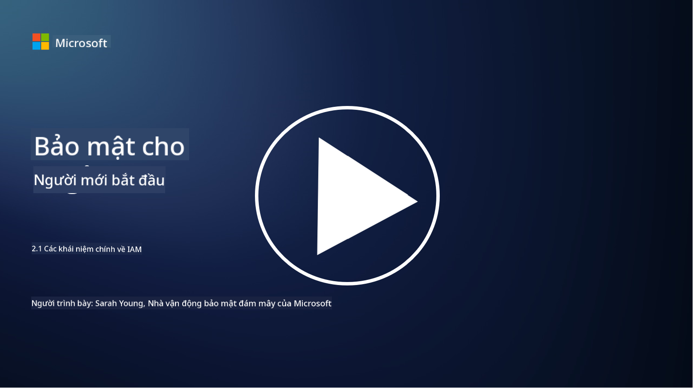

<!--
CO_OP_TRANSLATOR_METADATA:
{
  "original_hash": "2e3864e3d579f0dbb4ac2ec8c5f82acf",
  "translation_date": "2025-09-03T22:41:21+00:00",
  "source_file": "2.1 IAM key concepts.md",
  "language_code": "vi"
}
-->
# Các khái niệm chính về IAM

Bạn đã bao giờ đăng nhập vào máy tính hoặc trang web chưa? Chắc chắn là có! Điều đó có nghĩa là bạn đã sử dụng các kiểm soát danh tính trong cuộc sống hàng ngày của mình. Quản lý danh tính và quyền truy cập (IAM) là một trụ cột quan trọng của bảo mật, chúng ta sẽ tìm hiểu thêm về nó trong các bài học tiếp theo.

**Giới thiệu**

Trong bài học này, chúng ta sẽ tìm hiểu:

- Quản lý danh tính và quyền truy cập (IAM) trong bối cảnh an ninh mạng là gì?
- Nguyên tắc quyền tối thiểu là gì?
- Nguyên tắc phân tách nhiệm vụ là gì?
- Xác thực và cấp quyền là gì?

## Quản lý danh tính và quyền truy cập (IAM) trong bối cảnh an ninh mạng là gì?

Quản lý danh tính và quyền truy cập (IAM) đề cập đến một tập hợp các quy trình, công nghệ và chính sách được triển khai để đảm bảo rằng các cá nhân phù hợp có quyền truy cập thích hợp vào các tài nguyên trong môi trường kỹ thuật số của tổ chức. IAM liên quan đến việc quản lý danh tính kỹ thuật số (người dùng, nhân viên, đối tác) và quyền truy cập của họ vào hệ thống, ứng dụng, dữ liệu và mạng. Mục tiêu chính của IAM là tăng cường bảo mật, đơn giản hóa quyền truy cập của người dùng và đảm bảo tuân thủ các chính sách và quy định của tổ chức. Các giải pháp IAM thường bao gồm xác thực người dùng, cấp quyền, cung cấp danh tính, kiểm soát quyền truy cập và quản lý vòng đời người dùng (đảm bảo tài khoản được xóa khi không còn sử dụng).

## Nguyên tắc quyền tối thiểu là gì?

Nguyên tắc quyền tối thiểu là một khái niệm cơ bản khuyến khích việc chỉ cấp cho người dùng và hệ thống các quyền tối thiểu cần thiết để thực hiện các nhiệm vụ hoặc vai trò dự định của họ. Nguyên tắc này giúp hạn chế thiệt hại tiềm ẩn có thể xảy ra trong trường hợp vi phạm bảo mật hoặc mối đe dọa nội bộ. Bằng cách tuân thủ nguyên tắc quyền tối thiểu, các tổ chức giảm thiểu bề mặt tấn công và giảm nguy cơ truy cập trái phép, vi phạm dữ liệu và sử dụng sai quyền. Trong thực tế, điều này có nghĩa là người dùng chỉ được cấp quyền truy cập vào các tài nguyên và chức năng cụ thể cần thiết cho vai trò công việc của họ, và không hơn. Ví dụ, nếu bạn chỉ cần đọc một tài liệu, việc cấp quyền quản trị đầy đủ cho tài liệu đó sẽ là không cần thiết.

## Nguyên tắc phân tách nhiệm vụ là gì?

Nguyên tắc phân tách nhiệm vụ nhằm ngăn chặn xung đột lợi ích và giảm nguy cơ gian lận và sai sót bằng cách phân chia các nhiệm vụ và trách nhiệm quan trọng giữa các cá nhân khác nhau trong tổ chức. Trong bối cảnh an ninh mạng, nguyên tắc phân tách nhiệm vụ liên quan đến việc đảm bảo rằng không một cá nhân nào có quyền kiểm soát tất cả các khía cạnh của một quy trình hoặc hệ thống quan trọng. Mục tiêu là tạo ra một hệ thống kiểm tra và cân bằng để ngăn chặn bất kỳ cá nhân nào có khả năng thực hiện cả giai đoạn thiết lập và phê duyệt của một quy trình. Ví dụ, trong các hệ thống tài chính, điều này có thể yêu cầu rằng người nhập giao dịch vào hệ thống không phải là người phê duyệt các giao dịch đó. Điều này giảm nguy cơ hành động trái phép hoặc gian lận không bị phát hiện.

## Xác thực và cấp quyền là gì?

Xác thực và cấp quyền là hai khái niệm cơ bản trong an ninh mạng đóng vai trò quan trọng trong việc đảm bảo bảo mật và tính toàn vẹn của hệ thống máy tính và dữ liệu. Chúng thường được sử dụng cùng nhau để kiểm soát quyền truy cập vào tài nguyên và bảo vệ thông tin nhạy cảm.

**1. Xác thực**: Xác thực là quá trình xác minh danh tính của người dùng, hệ thống hoặc thực thể đang cố gắng truy cập vào hệ thống máy tính hoặc tài nguyên cụ thể. Nó đảm bảo rằng danh tính được tuyên bố là chính xác và hợp lệ. Các phương pháp xác thực thường bao gồm việc sử dụng một hoặc nhiều yếu tố sau:

   a. Những gì bạn biết: Bao gồm mật khẩu, mã PIN hoặc các thông tin bí mật khác mà chỉ người dùng được phép mới biết.

   b. Những gì bạn có: Bao gồm các thiết bị hoặc vật dụng vật lý như thẻ thông minh, token bảo mật hoặc điện thoại di động được sử dụng để xác nhận danh tính của người dùng.

   c. Những gì bạn là: Bao gồm các yếu tố sinh trắc học như dấu vân tay, nhận diện khuôn mặt hoặc quét võng mạc, những yếu tố này là duy nhất đối với từng cá nhân.

Các cơ chế xác thực được sử dụng để xác nhận rằng người dùng là người mà họ tuyên bố trước khi cho phép truy cập vào hệ thống hoặc tài nguyên. Nó giúp ngăn chặn truy cập trái phép và đảm bảo rằng chỉ những người dùng hợp pháp mới có thể thực hiện hành động trong hệ thống.

**2. Cấp quyền**: Cấp quyền là quá trình cấp hoặc từ chối các quyền và đặc quyền cụ thể cho người dùng hoặc thực thể đã được xác thực sau khi danh tính của họ được xác minh. Nó xác định những hành động hoặc thao tác mà người dùng được phép thực hiện trong hệ thống hoặc trên các tài nguyên cụ thể. Cấp quyền thường dựa trên các chính sách được xác định trước, quy tắc kiểm soát quyền truy cập và vai trò được gán cho người dùng.

Cấp quyền có thể được hiểu như việc trả lời câu hỏi, "Người dùng đã được xác thực có thể làm gì?" Nó liên quan đến việc xác định và thực thi các chính sách kiểm soát quyền truy cập để bảo vệ dữ liệu và tài nguyên nhạy cảm khỏi truy cập hoặc sửa đổi trái phép.

**Tóm lại:**

- Xác thực xác định danh tính của người dùng hoặc thực thể.
- Cấp quyền xác định những hành động và tài nguyên mà người dùng đã được xác thực được phép truy cập hoặc thao tác.

## Đọc thêm

- [Describe identity concepts - Training | Microsoft Learn](https://learn.microsoft.com/training/modules/describe-identity-principles-concepts/?WT.mc_id=academic-96948-sayoung)
- [Introduction to identity - Microsoft Entra | Microsoft Learn](https://learn.microsoft.com/azure/active-directory/fundamentals/identity-fundamental-concepts?WT.mc_id=academic-96948-sayoung)
- [What is Identity Access Management (IAM)? | Microsoft Security](https://www.microsoft.com/security/business/security-101/what-is-identity-access-management-iam?WT.mc_id=academic-96948-sayoung)
- [What is IAM? Identity and access management explained | CSO Online](https://www.csoonline.com/article/518296/what-is-iam-identity-and-access-management-explained.html)
- [What is IAM? (auth0.com)](https://auth0.com/blog/what-is-iam/)
- [Security+: implementing Identity and Access Management (IAM) controls [updated 2021] | Infosec (infosecinstitute.com)](https://resources.infosecinstitute.com/certifications/securityplus/security-implementing-identity-and-access-management-iam-controls/)
- [least privilege - Glossary | CSRC (nist.gov)](https://csrc.nist.gov/glossary/term/least_privilege)
- [Security: The Principle of Least Privilege (POLP) - Microsoft Community Hub](https://techcommunity.microsoft.com/t5/azure-sql-blog/security-the-principle-of-least-privilege-polp/ba-p/2067390?WT.mc_id=academic-96948-sayoung)
- [Principle of least privilege | CERT NZ](https://www.cert.govt.nz/it-specialists/critical-controls/principle-of-least-privilege/)
- [Why is separation of duties required by NIST 800-171 and CMMC? - (totem.tech)](https://www.totem.tech/cmmc-separation-of-duties/)

---

**Tuyên bố miễn trừ trách nhiệm**:  
Tài liệu này đã được dịch bằng dịch vụ dịch thuật AI [Co-op Translator](https://github.com/Azure/co-op-translator). Mặc dù chúng tôi cố gắng đảm bảo độ chính xác, xin lưu ý rằng các bản dịch tự động có thể chứa lỗi hoặc không chính xác. Tài liệu gốc bằng ngôn ngữ bản địa nên được coi là nguồn thông tin chính thức. Đối với các thông tin quan trọng, nên sử dụng dịch vụ dịch thuật chuyên nghiệp từ con người. Chúng tôi không chịu trách nhiệm cho bất kỳ sự hiểu lầm hoặc diễn giải sai nào phát sinh từ việc sử dụng bản dịch này.