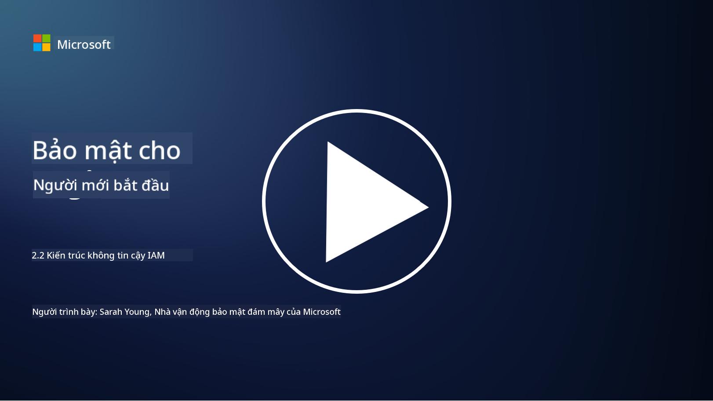

<!--
CO_OP_TRANSLATOR_METADATA:
{
  "original_hash": "4774a978af123f72ebb872199c4c4d4f",
  "translation_date": "2025-09-03T23:42:00+00:00",
  "source_file": "2.2 IAM zero trust architecture.md",
  "language_code": "vi"
}
-->
# Kiến trúc IAM Zero Trust

Danh tính là một phần quan trọng trong việc triển khai kiến trúc Zero Trust và xây dựng một ranh giới bảo mật cho bất kỳ môi trường CNTT nào. Trong phần này, chúng ta sẽ tìm hiểu tại sao việc sử dụng các biện pháp kiểm soát danh tính lại quan trọng để thực hiện Zero Trust.

## Giới thiệu

Trong bài học này, chúng ta sẽ đề cập đến:

- Tại sao chúng ta cần sử dụng danh tính làm ranh giới bảo mật trong các môi trường CNTT hiện đại?

- Điều này khác biệt như thế nào so với các kiến trúc CNTT truyền thống?

- Danh tính được sử dụng như thế nào để triển khai kiến trúc Zero Trust?

## Tại sao chúng ta cần sử dụng danh tính làm ranh giới bảo mật trong các môi trường CNTT hiện đại?

Trong các môi trường CNTT hiện đại, khái niệm truyền thống về một ranh giới vật lý (sử dụng các công cụ như tường lửa và ranh giới mạng) như là tuyến phòng thủ chính chống lại các mối đe dọa mạng đang trở nên kém hiệu quả hơn do sự phức tạp ngày càng tăng của công nghệ, sự gia tăng của làm việc từ xa, và việc áp dụng các dịch vụ đám mây. Thay vào đó, các tổ chức đang chuyển sang sử dụng danh tính như ranh giới bảo mật mới. Điều này có nghĩa là bảo mật xoay quanh việc xác minh và quản lý danh tính của người dùng, thiết bị, và ứng dụng cố gắng truy cập tài nguyên, bất kể vị trí vật lý của chúng.

Dưới đây là lý do tại sao việc sử dụng danh tính làm ranh giới bảo mật lại quan trọng trong các môi trường CNTT hiện đại:

**Lực lượng lao động từ xa**: Với làm việc từ xa và các thiết bị di động trở thành tiêu chuẩn, người dùng có thể truy cập tài nguyên từ nhiều địa điểm và thiết bị khác nhau. Phương pháp ranh giới truyền thống không hiệu quả khi người dùng không còn bị giới hạn trong văn phòng vật lý.

**Môi trường đám mây và lai**: Các tổ chức ngày càng áp dụng các dịch vụ đám mây và môi trường lai. Dữ liệu và ứng dụng không còn chỉ nằm trong phạm vi của tổ chức, khiến các biện pháp bảo vệ ranh giới truyền thống trở nên ít phù hợp hơn.

**Bảo mật Zero Trust**: Khái niệm bảo mật Zero Trust giả định rằng không có thực thể nào, dù bên trong hay bên ngoài mạng, được tin tưởng một cách tự động. Danh tính trở thành nền tảng để xác minh các yêu cầu truy cập, bất kể chúng xuất phát từ đâu.

**Bối cảnh mối đe dọa**: Các mối đe dọa mạng đang phát triển, và kẻ tấn công đang tìm cách vượt qua các biện pháp bảo vệ ranh giới truyền thống. Phishing, kỹ thuật xã hội, và các mối đe dọa nội bộ thường khai thác điểm yếu của con người thay vì cố gắng xâm nhập vào ranh giới mạng.

**Cách tiếp cận tập trung vào dữ liệu**: Bảo vệ dữ liệu nhạy cảm là điều tối quan trọng. Bằng cách tập trung vào danh tính, các tổ chức có thể kiểm soát ai truy cập dữ liệu nào, giảm nguy cơ rò rỉ dữ liệu.

## Điều này khác biệt như thế nào so với các kiến trúc CNTT truyền thống?

Các kiến trúc CNTT truyền thống dựa nhiều vào các mô hình bảo mật dựa trên ranh giới, nơi tường lửa và ranh giới mạng đóng vai trò quan trọng trong việc ngăn chặn các mối đe dọa. Những khác biệt chính giữa cách tiếp cận truyền thống và cách tiếp cận tập trung vào danh tính là:

|      Khía cạnh              |      Kiến trúc CNTT truyền thống                                                               |      Cách tiếp cận tập trung vào danh tính                                                              |
|-----------------------------|------------------------------------------------------------------------------------------------|---------------------------------------------------------------------------------------------------------|
|     Trọng tâm               |     Trọng tâm ranh giới: Dựa vào các biện pháp bảo vệ ranh giới như tường lửa và kiểm soát truy cập. |     Trọng tâm xác minh danh tính: Chuyển từ ranh giới mạng sang xác minh danh tính người dùng/thiết bị. |
|     Vị trí                  |     Phụ thuộc vào vị trí: Bảo mật gắn liền với các địa điểm văn phòng vật lý và ranh giới mạng. |     Không phụ thuộc vào vị trí: Bảo mật không gắn liền với địa điểm cụ thể; truy cập từ bất kỳ đâu.     |
|     Giả định tin cậy        |     Giả định tin cậy: Tin tưởng các thực thể bên trong ranh giới mạng.                        |     Cách tiếp cận Zero Trust: Không bao giờ tin tưởng tự động; truy cập được xác minh dựa trên danh tính và ngữ cảnh. |
|     Xem xét thiết bị        |     Đa dạng thiết bị: Giả định rằng các thiết bị bên trong ranh giới mạng là an toàn.         |     Nhận thức về thiết bị: Xem xét tình trạng và tư thế bảo mật của thiết bị, bất kể vị trí.            |
|     Bảo vệ dữ liệu          |     Bảo vệ dữ liệu: Tập trung vào bảo vệ ranh giới mạng để bảo vệ dữ liệu.                     |     Bảo vệ tập trung vào dữ liệu: Tập trung vào kiểm soát truy cập dữ liệu dựa trên danh tính và độ nhạy cảm của dữ liệu. |

## Danh tính được sử dụng như thế nào để triển khai kiến trúc Zero Trust?

Trong kiến trúc Zero Trust, nguyên tắc cơ bản là không bao giờ tin tưởng tự động bất kỳ thực thể nào, bất kể nó nằm bên trong hay bên ngoài ranh giới mạng. Danh tính đóng vai trò trung tâm trong việc triển khai cách tiếp cận Zero Trust bằng cách cho phép xác minh liên tục các thực thể cố gắng truy cập tài nguyên. Các biện pháp kiểm soát bảo mật danh tính hiện đại đảm bảo rằng mọi người dùng, thiết bị, ứng dụng, và dịch vụ muốn truy cập tài nguyên đều phải được xác định và xác thực kỹ lưỡng trước khi được cấp quyền truy cập. Điều này bao gồm việc xác minh danh tính kỹ thuật số của họ thông qua các phương pháp như kết hợp tên người dùng/mật khẩu, xác thực đa yếu tố (MFA), sinh trắc học, và các cơ chế xác thực mạnh khác.

## Đọc thêm

- [Securing identity with Zero Trust | Microsoft Learn](https://learn.microsoft.com/security/zero-trust/deploy/identity?WT.mc_id=academic-96948-sayoung)
- [Zero Trust Principles and Guidance for Identity and Access | CSA (cloudsecurityalliance.org)](https://cloudsecurityalliance.org/artifacts/zero-trust-principles-and-guidance-for-iam/)
- [Zero Trust Identity Controls - Essentials Series - Episode 2 - YouTube](https://www.youtube.com/watch?v=fQZQznIKcGM&list=PLXtHYVsvn_b_gtX1-NB62wNervQx1Fhp4&index=13)

---

**Tuyên bố miễn trừ trách nhiệm**:  
Tài liệu này đã được dịch bằng dịch vụ dịch thuật AI [Co-op Translator](https://github.com/Azure/co-op-translator). Mặc dù chúng tôi cố gắng đảm bảo độ chính xác, xin lưu ý rằng các bản dịch tự động có thể chứa lỗi hoặc không chính xác. Tài liệu gốc bằng ngôn ngữ bản địa nên được coi là nguồn tham khảo chính thức. Đối với các thông tin quan trọng, nên sử dụng dịch vụ dịch thuật chuyên nghiệp từ con người. Chúng tôi không chịu trách nhiệm cho bất kỳ sự hiểu lầm hoặc diễn giải sai nào phát sinh từ việc sử dụng bản dịch này.