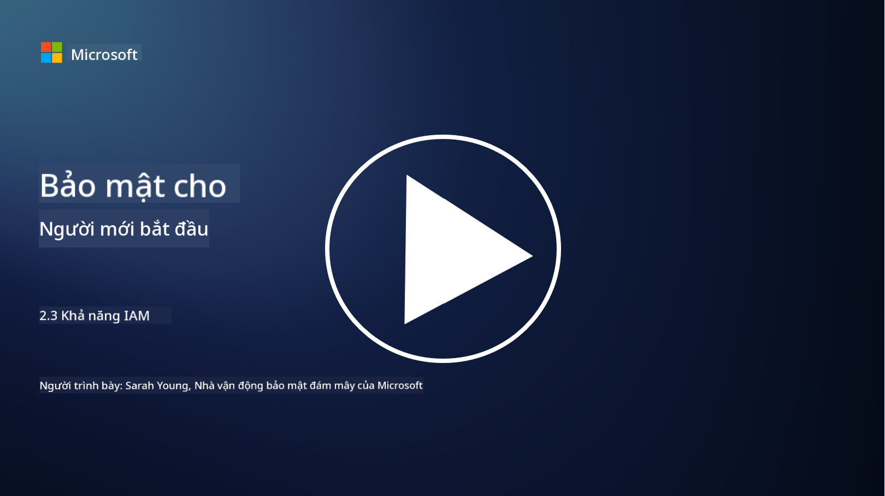

<!--
CO_OP_TRANSLATOR_METADATA:
{
  "original_hash": "bf0b8a54f2c69951744df5a94bc923f7",
  "translation_date": "2025-09-04T01:56:50+00:00",
  "source_file": "2.3 IAM capabilities.md",
  "language_code": "vi"
}
-->
# Khả năng của IAM

Trong phần này, chúng ta sẽ tìm hiểu chi tiết hơn về các công cụ và khả năng cốt lõi được sử dụng trong bảo mật danh tính.

## Giới thiệu

Trong bài học này, chúng ta sẽ tìm hiểu:

 - Dịch vụ thư mục là gì?
      
     
    
 - Những khả năng nào có thể được sử dụng để bảo vệ danh tính?
>
>        Xác thực đa yếu tố (MFA)
> 
>        Đăng nhập một lần (SSO)
> 
>        Kiểm soát truy cập dựa trên vai trò (RBAC)
> 
>        Xác thực thích ứng
> 
>        Xác thực sinh trắc học
> 
>        Quản lý truy cập đặc quyền (PAM)
> 
>        Quản trị và quản lý danh tính (IGA)
> 
>        Phân tích hành vi

## Dịch vụ thư mục là gì?

Dịch vụ thư mục là một cơ sở dữ liệu chuyên biệt lưu trữ và quản lý thông tin về các tài nguyên mạng, bao gồm người dùng, nhóm, thiết bị, ứng dụng và các đối tượng khác. Nó đóng vai trò như một kho lưu trữ tập trung về dữ liệu liên quan đến danh tính và truy cập, cho phép các tổ chức quản lý và kiểm soát việc xác thực, ủy quyền người dùng và các nhiệm vụ liên quan đến bảo mật một cách hiệu quả.

Dịch vụ thư mục đóng vai trò quan trọng trong môi trường CNTT hiện đại bằng cách cung cấp nền tảng cho các giải pháp quản lý danh tính và truy cập (IAM). Chúng hỗ trợ truy cập an toàn vào tài nguyên, thực thi các chính sách truy cập và đơn giản hóa các nhiệm vụ quản trị. Một trong những dịch vụ thư mục nổi tiếng nhất là Microsoft Active Directory, nhưng cũng có các giải pháp khác như thư mục LDAP (Lightweight Directory Access Protocol) phục vụ mục đích tương tự.

Các chức năng và tính năng chính của dịch vụ thư mục trong bối cảnh an ninh mạng bao gồm:

 - **Xác thực người dùng**: Dịch vụ thư mục xác minh thông tin đăng nhập của người dùng (như tên người dùng và mật khẩu) để đảm bảo chỉ những người dùng được ủy quyền mới có thể truy cập mạng và tài nguyên của nó.
 - **Ủy quyền người dùng**: Chúng xác định mức độ truy cập của mỗi người dùng dựa trên vai trò, thành viên nhóm và các thuộc tính khác. Điều này đảm bảo rằng người dùng chỉ có thể truy cập các tài nguyên mà họ được phép.
 - **Quản lý nhóm**: Dịch vụ thư mục cho phép quản trị viên tổ chức người dùng thành các nhóm logic, đơn giản hóa việc quản lý kiểm soát truy cập. Quyền có thể được gán cho nhóm thay vì từng người dùng riêng lẻ.
 - **Chính sách mật khẩu**: Chúng thực thi các quy tắc về độ phức tạp và thời hạn của mật khẩu, tăng cường bảo mật cho tài khoản người dùng.
 - **Đăng nhập một lần (SSO)**: Một số dịch vụ thư mục hỗ trợ SSO, cho phép người dùng truy cập nhiều ứng dụng và dịch vụ chỉ với một bộ thông tin đăng nhập.
 - **Quản lý người dùng tập trung**: Dịch vụ thư mục tập trung thông tin người dùng, giúp dễ dàng quản lý tài khoản, hồ sơ và thuộc tính người dùng từ một vị trí duy nhất.
 - **Ghi nhật ký và kiểm tra**: Chúng có thể ghi lại các hoạt động xác thực và truy cập của người dùng, hỗ trợ kiểm tra bảo mật và tuân thủ.

## Những khả năng nào có thể được sử dụng để bảo vệ danh tính?

**Xác thực đa yếu tố (MFA)**

MFA yêu cầu người dùng cung cấp nhiều hình thức xác minh trước khi được cấp quyền truy cập. Điều này thường bao gồm một thứ mà người dùng biết (mật khẩu), một thứ mà người dùng sở hữu (điện thoại thông minh hoặc token bảo mật), và một thứ mà người dùng là (dữ liệu sinh trắc học như dấu vân tay hoặc nhận diện khuôn mặt).

**Đăng nhập một lần (SSO)**

SSO cho phép người dùng truy cập nhiều ứng dụng và hệ thống chỉ với một bộ thông tin đăng nhập. Điều này cải thiện trải nghiệm người dùng và giảm rủi ro liên quan đến việc quản lý nhiều mật khẩu.

**Kiểm soát truy cập dựa trên vai trò (RBAC)**

RBAC gán quyền dựa trên các vai trò được định nghĩa trước. Người dùng được cấp quyền truy cập dựa trên vai trò của họ trong tổ chức.

**Xác thực thích ứng**

Xác thực thích ứng đánh giá các yếu tố rủi ro như vị trí, thiết bị, thời gian truy cập và hành vi của người dùng để điều chỉnh mức độ xác thực cần thiết một cách linh hoạt. Nếu một yêu cầu có vẻ đáng ngờ, các bước xác thực bổ sung có thể được kích hoạt.

**Xác thực sinh trắc học**

Xác thực sinh trắc học sử dụng các đặc điểm sinh học độc nhất như dấu vân tay, đặc điểm khuôn mặt, giọng nói và thậm chí cả các đặc điểm hành vi như tốc độ gõ phím để xác minh danh tính.

**Quản lý truy cập đặc quyền (PAM)**

PAM tập trung vào việc bảo vệ quyền truy cập vào các hệ thống và dữ liệu quan trọng bằng cách thực thi các kiểm soát nghiêm ngặt đối với các tài khoản đặc quyền. Nó bao gồm các tính năng như truy cập đúng lúc và giám sát phiên làm việc.

**Quản trị và quản lý danh tính (IGA)**

Các giải pháp IGA quản lý danh tính người dùng và quyền truy cập của họ vào tài nguyên trong suốt vòng đời của họ. Điều này bao gồm việc gia nhập, cấp quyền, kiểm soát truy cập dựa trên vai trò và hủy quyền.

**Phân tích hành vi**

Phân tích hành vi giám sát hành vi của người dùng và thiết lập các mẫu cơ bản. Các sai lệch so với chuẩn có thể kích hoạt cảnh báo để điều tra thêm.

# Đọc thêm
- [Tài liệu cơ bản về Azure Active Directory - Microsoft Entra | Microsoft Learn](https://learn.microsoft.com/azure/active-directory/fundamentals/?WT.mc_id=academic-96948-sayoung)
- [Azure Active Directory là gì? - Microsoft Entra | Microsoft Learn](https://learn.microsoft.com/azure/active-directory/fundamentals/whatis?WT.mc_id=academic-96948-sayoung)
- [Quản lý cơ sở hạ tầng danh tính đa đám mây của bạn với Microsoft Entra - YouTube](https://www.youtube.com/watch?v=9qQiq3wTS2Y&list=PLXtHYVsvn_b_gtX1-NB62wNervQx1Fhp4&index=18)

---

**Tuyên bố miễn trừ trách nhiệm**:  
Tài liệu này đã được dịch bằng dịch vụ dịch thuật AI [Co-op Translator](https://github.com/Azure/co-op-translator). Mặc dù chúng tôi cố gắng đảm bảo độ chính xác, xin lưu ý rằng các bản dịch tự động có thể chứa lỗi hoặc không chính xác. Tài liệu gốc bằng ngôn ngữ bản địa nên được coi là nguồn tham khảo chính thức. Đối với các thông tin quan trọng, nên sử dụng dịch vụ dịch thuật chuyên nghiệp từ con người. Chúng tôi không chịu trách nhiệm cho bất kỳ sự hiểu lầm hoặc diễn giải sai nào phát sinh từ việc sử dụng bản dịch này.