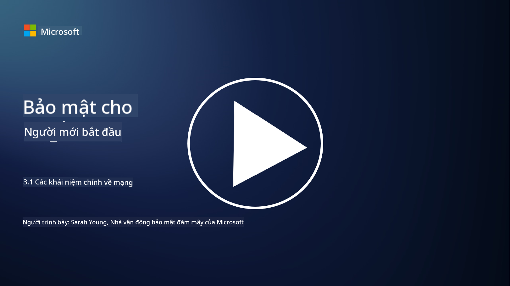
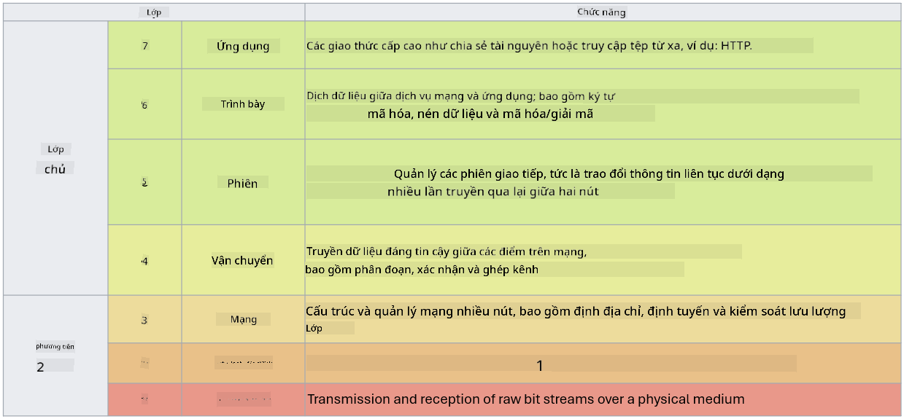

<!--
CO_OP_TRANSLATOR_METADATA:
{
  "original_hash": "252724eceeb183fb9018f88c5e1a3f0c",
  "translation_date": "2025-09-04T01:47:51+00:00",
  "source_file": "3.1 Networking key concepts.md",
  "language_code": "vi"
}
-->
# Các khái niệm chính về mạng

Nếu bạn đã từng làm việc trong lĩnh vực CNTT, rất có thể bạn đã tiếp xúc với các khái niệm về mạng. Mặc dù chúng ta sử dụng danh tính như là biện pháp kiểm soát chu vi chính trong các môi trường hiện đại, điều này không có nghĩa là các biện pháp kiểm soát mạng trở nên thừa thãi. Mặc dù đây là một chủ đề rất rộng, trong bài học này, chúng ta sẽ tìm hiểu một số khái niệm chính về mạng.

Trong bài học này, chúng ta sẽ tìm hiểu:

- Địa chỉ IP là gì?
  
- Mô hình OSI là gì?

- TCP/UDP là gì?

- Số cổng là gì?

- Mã hóa khi lưu trữ và khi truyền tải là gì?

## Địa chỉ IP là gì?

Địa chỉ IP, hay Internet Protocol, là một nhãn số được gán cho mỗi thiết bị kết nối với mạng máy tính sử dụng giao thức Internet để giao tiếp. Nó hoạt động như một định danh duy nhất cho các thiết bị trong mạng, cho phép chúng gửi và nhận dữ liệu qua internet hoặc các mạng liên kết khác. Có hai phiên bản chính của địa chỉ IP: IPv4 (Internet Protocol version 4) và IPv6 (Internet Protocol version 6). Một địa chỉ IP thường được biểu diễn dưới dạng IPv4 (ví dụ: 192.168.1.1) hoặc IPv6 (ví dụ: 2001:0db8:85a3:0000:0000:8a2e:0370:7334).

## Mô hình OSI là gì?

Mô hình OSI (Open Systems Interconnection) là một khung khái niệm chuẩn hóa các chức năng của một hệ thống giao tiếp thành bảy lớp riêng biệt. Mỗi lớp thực hiện các nhiệm vụ cụ thể và giao tiếp với các lớp liền kề để đảm bảo việc truyền dữ liệu hiệu quả và đáng tin cậy giữa các thiết bị trong mạng. Các lớp, từ dưới lên trên, bao gồm:

1. Lớp Vật lý (Physical Layer)
   
2. Lớp Liên kết Dữ liệu (Data Link Layer)

3. Lớp Mạng (Network Layer)

4. Lớp Vận chuyển (Transport Layer)

5. Lớp Phiên (Session Layer)

6. Lớp Trình bày (Presentation Layer)

7. Lớp Ứng dụng (Application Layer)

Mô hình OSI cung cấp một tham chiếu chung để hiểu cách các giao thức và công nghệ mạng tương tác, bất kể phần cứng hay phần mềm cụ thể được triển khai.

  
_ref: https://en.wikipedia.org/wiki/OSI_model_

## TCP/UDP là gì?

TCP (Transmission Control Protocol) và UDP (User Datagram Protocol) là hai giao thức cơ bản ở lớp vận chuyển được sử dụng trong mạng máy tính để hỗ trợ giao tiếp giữa các thiết bị qua internet hoặc trong mạng cục bộ. Chúng chịu trách nhiệm chia nhỏ dữ liệu thành các gói để truyền tải và sau đó tái tạo lại các gói đó thành dữ liệu gốc ở phía nhận. Tuy nhiên, chúng khác nhau về đặc điểm và trường hợp sử dụng.

**TCP (Transmission Control Protocol):**

TCP là một giao thức hướng kết nối, cung cấp việc truyền dữ liệu đáng tin cậy và theo thứ tự giữa các thiết bị. Nó thiết lập một kết nối giữa người gửi và người nhận trước khi bắt đầu trao đổi dữ liệu. TCP đảm bảo rằng các gói dữ liệu đến đúng thứ tự và có thể xử lý việc truyền lại các gói bị mất để đảm bảo tính toàn vẹn và đầy đủ của dữ liệu. Điều này làm cho TCP phù hợp với các ứng dụng yêu cầu truyền dữ liệu đáng tin cậy, chẳng hạn như duyệt web, email, truyền tệp (FTP) và giao tiếp cơ sở dữ liệu.

**UDP (User Datagram Protocol):**

UDP là một giao thức không hướng kết nối, cung cấp tốc độ truyền dữ liệu nhanh hơn nhưng không đảm bảo độ tin cậy như TCP. Nó không thiết lập một kết nối chính thức trước khi gửi dữ liệu và không bao gồm các cơ chế để xác nhận hoặc truyền lại các gói bị mất. UDP phù hợp với các ứng dụng mà tốc độ và hiệu quả quan trọng hơn việc đảm bảo truyền tải, chẳng hạn như giao tiếp thời gian thực, phát trực tuyến, trò chơi trực tuyến và truy vấn DNS.

Tóm lại, TCP ưu tiên độ tin cậy và truyền tải theo thứ tự, làm cho nó phù hợp với các ứng dụng yêu cầu độ chính xác của dữ liệu, trong khi UDP nhấn mạnh tốc độ và hiệu quả, phù hợp với các ứng dụng mà việc mất dữ liệu nhỏ hoặc sắp xếp lại thứ tự là chấp nhận được để đổi lấy độ trễ thấp hơn. Việc lựa chọn giữa TCP và UDP phụ thuộc vào yêu cầu cụ thể của ứng dụng hoặc dịch vụ đang được sử dụng.

## Số cổng là gì?

Trong mạng, số cổng là một định danh số được sử dụng để phân biệt giữa các dịch vụ hoặc ứng dụng khác nhau đang chạy trên một thiết bị duy nhất trong mạng. Các cổng giúp định tuyến dữ liệu đến đúng ứng dụng. Số cổng là các số nguyên không dấu 16-bit, có nghĩa là chúng nằm trong khoảng từ 0 đến 65535. Chúng được chia thành ba phạm vi:

- Cổng Nổi tiếng (0-1023): Dành riêng cho các dịch vụ tiêu chuẩn như HTTP (cổng 80) và FTP (cổng 21).

- Cổng Đăng ký (1024-49151): Được sử dụng cho các ứng dụng và dịch vụ không thuộc phạm vi nổi tiếng nhưng đã được đăng ký chính thức.

- Cổng Động/Tư nhân (49152-65535): Có sẵn cho việc sử dụng tạm thời hoặc riêng tư bởi các ứng dụng.

## Mã hóa khi lưu trữ và khi truyền tải là gì?

Mã hóa là quá trình chuyển đổi dữ liệu sang một định dạng an toàn để bảo vệ nó khỏi truy cập trái phép hoặc giả mạo. Mã hóa có thể được áp dụng cho dữ liệu cả "khi lưu trữ" (khi được lưu trên thiết bị hoặc máy chủ) và "khi truyền tải" (khi được truyền giữa các thiết bị hoặc qua mạng).

**Mã hóa khi lưu trữ:** Điều này bao gồm việc mã hóa dữ liệu được lưu trên các thiết bị, máy chủ hoặc hệ thống lưu trữ. Ngay cả khi kẻ tấn công có được quyền truy cập vật lý vào phương tiện lưu trữ, chúng không thể truy cập dữ liệu nếu không có khóa mã hóa. Điều này rất quan trọng để bảo vệ dữ liệu nhạy cảm trong trường hợp thiết bị bị đánh cắp, vi phạm dữ liệu hoặc truy cập trái phép.

**Mã hóa khi truyền tải:** Điều này bao gồm việc mã hóa dữ liệu khi nó di chuyển giữa các thiết bị hoặc qua mạng. Điều này ngăn chặn việc nghe lén và chặn dữ liệu trái phép trong quá trình truyền tải. Các giao thức phổ biến cho mã hóa khi truyền tải bao gồm HTTPS cho giao tiếp web và TLS/SSL để bảo mật các loại lưu lượng mạng khác nhau.

## Đọc thêm
- [How Do IP Addresses Work? (howtogeek.com)](https://www.howtogeek.com/341307/how-do-ip-addresses-work/)  
- [Understanding IP Address: An Introductory Guide (geekflare.com)](https://geekflare.com/understanding-ip-address/)  
- [What is the OSI model? The 7 layers of OSI explained (techtarget.com)](https://www.techtarget.com/searchnetworking/definition/OSI)  
- [The OSI Model – The 7 Layers of Networking Explained in Plain English (freecodecamp.org)](https://www.freecodecamp.org/news/osi-model-networking-layers-explained-in-plain-english/)  
- [TCP/IP protocols - IBM Documentation](https://www.ibm.com/docs/en/aix/7.3?topic=protocol-tcpip-protocols)  
- [Common Ports Cheat Sheet: The Ultimate Ports & Protocols List (stationx.net)](https://www.stationx.net/common-ports-cheat-sheet/)  
- [Azure Data Encryption-at-Rest - Azure Security | Microsoft Learn](https://learn.microsoft.com/azure/security/fundamentals/encryption-atrest?WT.mc_id=academic-96948-sayoung)  

---

**Tuyên bố miễn trừ trách nhiệm**:  
Tài liệu này đã được dịch bằng dịch vụ dịch thuật AI [Co-op Translator](https://github.com/Azure/co-op-translator). Mặc dù chúng tôi cố gắng đảm bảo độ chính xác, xin lưu ý rằng các bản dịch tự động có thể chứa lỗi hoặc sự không chính xác. Tài liệu gốc bằng ngôn ngữ bản địa nên được coi là nguồn tham khảo chính thức. Đối với các thông tin quan trọng, nên sử dụng dịch vụ dịch thuật chuyên nghiệp từ con người. Chúng tôi không chịu trách nhiệm cho bất kỳ sự hiểu lầm hoặc diễn giải sai nào phát sinh từ việc sử dụng bản dịch này.