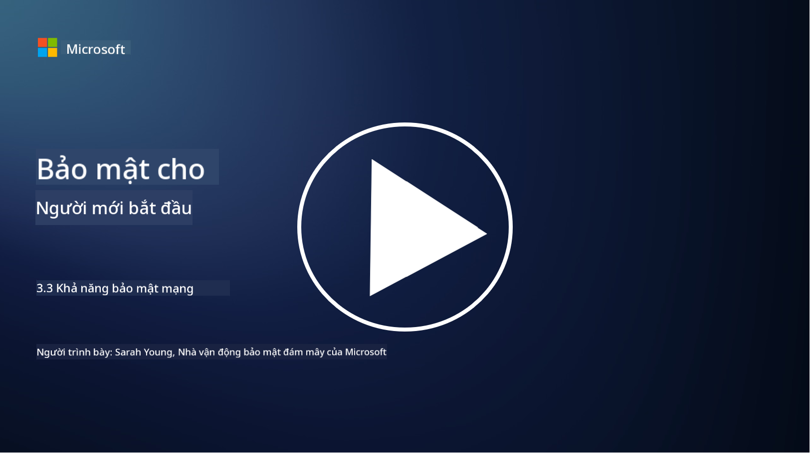

<!--
CO_OP_TRANSLATOR_METADATA:
{
  "original_hash": "c3aba077bb98eebc925dd58d870229ab",
  "translation_date": "2025-09-03T23:34:37+00:00",
  "source_file": "3.3 Network security capabilities.md",
  "language_code": "vi"
}
-->
# Khả năng bảo mật mạng

Trong bài học này, chúng ta sẽ tìm hiểu về các khả năng sau đây có thể được sử dụng để bảo vệ mạng:

 - Tường lửa truyền thống
 - Tường lửa ứng dụng web
 - Nhóm bảo mật trên đám mây
 - CDN
 - Bộ cân bằng tải
 - Máy chủ Bastion
 - VPN
 - Công cụ bảo vệ DDoS

## Tường lửa truyền thống

Tường lửa truyền thống là các thiết bị bảo mật kiểm soát và giám sát lưu lượng mạng vào và ra dựa trên các quy tắc bảo mật được định trước. Chúng hoạt động như một rào cản giữa mạng nội bộ đáng tin cậy và các mạng bên ngoài không đáng tin cậy, lọc lưu lượng để ngăn chặn truy cập trái phép và các mối đe dọa tiềm ẩn.

## Tường lửa ứng dụng web

Tường lửa ứng dụng web (WAF) là các tường lửa chuyên dụng được thiết kế để bảo vệ ứng dụng web khỏi các cuộc tấn công như SQL injection, cross-site scripting và các lỗ hổng khác. Chúng phân tích các yêu cầu và phản hồi HTTP để xác định và chặn lưu lượng độc hại nhắm vào ứng dụng web.

## Nhóm bảo mật trên đám mây

Nhóm bảo mật là một tính năng bảo mật mạng cơ bản được cung cấp bởi các nhà cung cấp dịch vụ đám mây. Chúng hoạt động như các tường lửa ảo kiểm soát lưu lượng vào và ra đối với các tài nguyên đám mây, chẳng hạn như máy ảo (VM) và các phiên bản. Nhóm bảo mật cho phép tổ chức định nghĩa các quy tắc xác định loại lưu lượng nào được phép và bị từ chối, bổ sung thêm một lớp bảo vệ cho triển khai đám mây.

## Mạng phân phối nội dung (CDN)

Mạng phân phối nội dung là một mạng lưới phân tán các máy chủ đặt tại nhiều vị trí địa lý khác nhau. CDN giúp cải thiện hiệu suất và tính khả dụng của các trang web bằng cách lưu trữ nội dung và cung cấp từ các máy chủ gần người dùng hơn. Chúng cũng cung cấp một mức độ bảo vệ nhất định chống lại các cuộc tấn công DDoS bằng cách phân phối lưu lượng qua nhiều vị trí máy chủ.

## Bộ cân bằng tải

Bộ cân bằng tải phân phối lưu lượng mạng vào giữa nhiều máy chủ để tối ưu hóa việc sử dụng tài nguyên, đảm bảo tính khả dụng cao và cải thiện hiệu suất ứng dụng. Chúng giúp ngăn chặn tình trạng quá tải máy chủ và duy trì thời gian phản hồi hiệu quả, tăng cường khả năng phục hồi của mạng.

## Máy chủ Bastion

Máy chủ Bastion là các máy chủ được bảo mật cao và cách ly, cung cấp quyền truy cập có kiểm soát vào mạng từ một mạng bên ngoài không đáng tin cậy (chẳng hạn như internet). Chúng đóng vai trò là điểm truy cập cho quản trị viên để truy cập hệ thống nội bộ một cách an toàn. Máy chủ Bastion thường được cấu hình với các biện pháp bảo mật mạnh mẽ để giảm thiểu bề mặt tấn công.

## Mạng riêng ảo (VPN)

VPN tạo ra các đường hầm được mã hóa giữa thiết bị của người dùng và máy chủ từ xa, đảm bảo giao tiếp an toàn và riêng tư qua các mạng có thể không an toàn như internet. VPN thường được sử dụng để cung cấp quyền truy cập từ xa vào mạng nội bộ, cho phép người dùng truy cập tài nguyên như thể họ đang ở cùng một mạng.

## Công cụ bảo vệ DDoS

Các công cụ và dịch vụ bảo vệ DDoS (Tấn công từ chối dịch vụ phân tán) được thiết kế để giảm thiểu tác động của các cuộc tấn công DDoS, nơi nhiều thiết bị bị xâm phạm làm ngập mạng hoặc dịch vụ để làm quá tải nó. Các giải pháp bảo vệ DDoS xác định và lọc lưu lượng độc hại, đảm bảo rằng lưu lượng hợp pháp vẫn có thể đến được đích dự định.

## Đọc thêm

- [What Is a Firewall? - Cisco](https://www.cisco.com/c/en/us/products/security/firewalls/what-is-a-firewall.html#~types-of-firewalls)
- [What Does a Firewall Actually Do? (howtogeek.com)](https://www.howtogeek.com/144269/htg-explains-what-firewalls-actually-do/)
- [What is a Firewall? How Firewalls Work & Types of Firewalls (kaspersky.com)](https://www.kaspersky.com/resource-center/definitions/firewall)
- [Network security group - how it works | Microsoft Learn](https://learn.microsoft.com/azure/virtual-network/network-security-group-how-it-works)
- [Introduction to Azure Content Delivery Network (CDN) - Training | Microsoft Learn](https://learn.microsoft.com/training/modules/intro-to-azure-content-delivery-network/?WT.mc_id=academic-96948-sayoung)
- [What is a content delivery network (CDN)? - Azure | Microsoft Learn](https://learn.microsoft.com/azure/cdn/cdn-overview?WT.mc_id=academic-96948-sayoung)
- [What Is Load Balancing? How Load Balancers Work (nginx.com)](https://www.nginx.com/resources/glossary/load-balancing/)
- [Bastion hosts vs. VPNs · Tailscale](https://tailscale.com/learn/bastion-hosts-vs-vpns/)
- [What is VPN? How It Works, Types of VPN (kaspersky.com)](https://www.kaspersky.com/resource-center/definitions/what-is-a-vpn)
- [Introduction to Azure DDoS Protection - Training | Microsoft Learn](https://learn.microsoft.com/training/modules/introduction-azure-ddos-protection/?WT.mc_id=academic-96948-sayoung)
- [What Is a DDoS Attack? | Microsoft Security](https://www.microsoft.com/security/business/security-101/what-is-a-ddos-attack?WT.mc_id=academic-96948-sayoung)

---

**Tuyên bố miễn trừ trách nhiệm**:  
Tài liệu này đã được dịch bằng dịch vụ dịch thuật AI [Co-op Translator](https://github.com/Azure/co-op-translator). Mặc dù chúng tôi cố gắng đảm bảo độ chính xác, xin lưu ý rằng các bản dịch tự động có thể chứa lỗi hoặc sự không chính xác. Tài liệu gốc bằng ngôn ngữ bản địa nên được coi là nguồn tham khảo chính thức. Đối với các thông tin quan trọng, nên sử dụng dịch vụ dịch thuật chuyên nghiệp từ con người. Chúng tôi không chịu trách nhiệm cho bất kỳ sự hiểu lầm hoặc diễn giải sai nào phát sinh từ việc sử dụng bản dịch này.