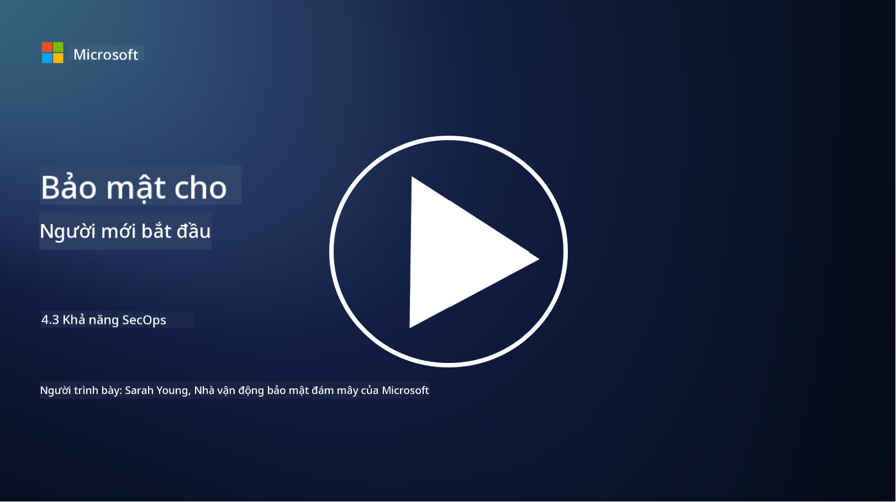

<!--
CO_OP_TRANSLATOR_METADATA:
{
  "original_hash": "553eb694c89f1caca0694e8d8ab89e0e",
  "translation_date": "2025-09-04T01:20:38+00:00",
  "source_file": "4.3 SecOps capabilities.md",
  "language_code": "vi"
}
-->
# Các khả năng của SecOps

Trong phần này, chúng ta sẽ tìm hiểu chi tiết hơn về các công cụ và khả năng cốt lõi có thể được sử dụng trong hoạt động bảo mật.

Trong bài học này, chúng ta sẽ tìm hiểu:

- Công cụ quản lý thông tin và sự kiện bảo mật (SIEM) là gì?

- XDR là gì?

- Những khả năng nào có thể được sử dụng để nâng cao hoạt động bảo mật?

## Công cụ quản lý thông tin và sự kiện bảo mật (SIEM) là gì?

Công cụ Quản lý Thông tin và Sự kiện Bảo mật (SIEM) được sử dụng để phân tích các cảnh báo bảo mật được tạo ra trong toàn bộ môi trường CNTT của tổ chức. Chúng thu thập, tổng hợp, tương quan và phân tích dữ liệu nhật ký và các sự kiện bảo mật từ nhiều nguồn khác nhau, chẳng hạn như thiết bị mạng, máy chủ, ứng dụng và hệ thống bảo mật.

Các chức năng và khả năng chính của công cụ SIEM bao gồm:

1. **Thu thập nhật ký**: Công cụ SIEM thu thập dữ liệu nhật ký và sự kiện bảo mật từ nhiều thiết bị, hệ thống và ứng dụng khác nhau, bao gồm tường lửa, hệ thống phát hiện xâm nhập, phần mềm chống virus, và nhiều hơn nữa.

2. **Chuẩn hóa dữ liệu**: Chúng chuẩn hóa dữ liệu nhật ký thành một định dạng chung để dễ dàng phân tích và tương quan.

3. **Tương quan sự kiện**: Công cụ SIEM tương quan các sự kiện để xác định các mẫu và bất thường có thể chỉ ra các sự cố hoặc mối đe dọa bảo mật.

4. **Cảnh báo và thông báo**: Công cụ SIEM tạo ra các cảnh báo và thông báo theo thời gian thực khi phát hiện các hoạt động đáng ngờ hoặc vi phạm bảo mật, cho phép phản ứng ngay lập tức.

5. **Phát hiện sự cố**: Chúng hỗ trợ phát hiện các sự cố bảo mật, bao gồm truy cập trái phép, rò rỉ dữ liệu, nhiễm phần mềm độc hại và các mối đe dọa nội bộ.

6. **Phân tích hành vi người dùng và thực thể (UEBA)**: Một số công cụ SIEM tích hợp khả năng UEBA để xác định các hành vi bất thường của người dùng và thực thể, có thể chỉ ra tài khoản bị xâm phạm hoặc mối đe dọa nội bộ.

7. **Tích hợp thông tin mối đe dọa**: Công cụ SIEM có thể tích hợp với các nguồn thông tin mối đe dọa để nâng cao khả năng phát hiện mối đe dọa bằng cách so sánh các chỉ số xâm phạm (IOC) đã biết với hoạt động mạng.

8. **Tự động hóa và điều phối**: Các tính năng tự động hóa cho phép công cụ SIEM tự động phản ứng với các sự cố bảo mật phổ biến, giảm thời gian phản hồi và công sức thủ công.

9. **Bảng điều khiển và trực quan hóa**: Chúng cung cấp các bảng điều khiển và công cụ trực quan hóa để giám sát dữ liệu bảo mật và tạo báo cáo tùy chỉnh.

10. **Tích hợp với các công cụ bảo mật khác**: Công cụ SIEM thường tích hợp với các công cụ và công nghệ bảo mật khác, chẳng hạn như giải pháp phát hiện và phản hồi điểm cuối (EDR), để cung cấp cái nhìn toàn diện về tình trạng bảo mật của tổ chức.

## XDR là gì?

XDR (Phát hiện và Phản hồi Mở rộng) là một công nghệ mở rộng khả năng của Phát hiện và Phản hồi Điểm cuối (EDR) truyền thống và kết hợp chúng với dữ liệu bảo mật rộng hơn từ nhiều nguồn khác nhau để cung cấp cái nhìn toàn diện hơn về tình trạng bảo mật của tổ chức. XDR nhằm mục đích cải thiện khả năng phát hiện mối đe dọa, phản hồi sự cố và bảo mật tổng thể bằng cách giải quyết các hạn chế của việc chỉ dựa vào EDR, SIEM hoặc các công cụ bảo mật riêng lẻ khác.

Các đặc điểm và thành phần chính của XDR bao gồm:

1. **Tích hợp dữ liệu**: XDR tích hợp dữ liệu từ nhiều nguồn, bao gồm điểm cuối, lưu lượng mạng, dịch vụ đám mây, email và nhiều hơn nữa. Việc tổng hợp dữ liệu toàn diện này cung cấp bối cảnh rộng hơn cho việc phát hiện và phân tích mối đe dọa.

2. **Phân tích nâng cao**: XDR sử dụng phân tích nâng cao, học máy và phân tích hành vi để xác định và ưu tiên các mối đe dọa bảo mật. Nó tìm kiếm các mẫu và bất thường trong dữ liệu tích hợp để phát hiện cả các mối đe dọa đã biết và chưa biết.

3. **Phát hiện mối đe dọa tự động**: XDR tự động hóa việc phát hiện các mối đe dọa và bất thường bằng cách tương quan thông tin từ nhiều nguồn. Nó có thể xác định các chuỗi tấn công phức tạp có thể trải dài trên nhiều vector.

4. **Điều tra và phản hồi sự cố**: XDR cung cấp các công cụ để điều tra và phản hồi sự cố, giúp các nhóm bảo mật nhanh chóng đánh giá phạm vi và tác động của sự cố và thực hiện các hành động khắc phục phù hợp.

5. **Tích hợp thông tin mối đe dọa**: Nó tích hợp các nguồn thông tin mối đe dọa để nâng cao khả năng phát hiện mối đe dọa bằng cách so sánh các chỉ số xâm phạm (IOC) đã biết với hoạt động mạng và điểm cuối của tổ chức.

6. **Bảng điều khiển hợp nhất**: XDR thường cung cấp một bảng điều khiển hoặc giao diện hợp nhất, nơi các nhóm bảo mật có thể xem và quản lý các cảnh báo và sự cố bảo mật từ các nguồn khác nhau một cách tập trung.

7. **Phạm vi đa nền tảng**: Các giải pháp XDR bao phủ nhiều nền tảng, bao gồm điểm cuối, máy chủ, môi trường đám mây và thiết bị di động, phù hợp với các môi trường CNTT hiện đại, đa nền tảng.

## Những khả năng nào có thể được sử dụng để nâng cao hoạt động bảo mật?

Để nâng cao hoạt động bảo mật, các tổ chức có thể tận dụng một số khả năng ngoài công cụ SIEM:

1. **Học máy và Trí tuệ nhân tạo**: Triển khai phân tích nâng cao, học máy và AI để phát hiện các mối đe dọa đang phát triển và tự động hóa việc săn tìm mối đe dọa.

2. **Phân tích hành vi người dùng và thực thể (UEBA)**: Phân tích hành vi của người dùng và thực thể để phát hiện các bất thường và mối đe dọa nội bộ.

3. **Nguồn thông tin mối đe dọa**: Tích hợp các nguồn thông tin mối đe dọa để cập nhật các mối đe dọa mới nhất và các chỉ số xâm phạm.

4. **Điều phối, Tự động hóa và Phản hồi Bảo mật (SOAR)**: Triển khai các nền tảng SOAR để tự động hóa phản hồi sự cố và tối ưu hóa quy trình làm việc của hoạt động bảo mật.

5. **Công nghệ đánh lừa**: Triển khai các công nghệ đánh lừa để đánh lạc hướng và phát hiện kẻ tấn công trong mạng.

## Đọc thêm

- [What is SIEM? | Microsoft Security](https://www.microsoft.com/security/business/security-101/what-is-siem?WT.mc_id=academic-96948-sayoung)
- [What Is SIEM? - Security Information and Event Management - Cisco](https://www.cisco.com/c/en/us/products/security/what-is-siem.html)
- [Security information and event management - Wikipedia](https://en.wikipedia.org/wiki/Security_information_and_event_management)
- [What Is XDR? | Microsoft Security](https://www.microsoft.com/security/business/security-101/what-is-xdr?WT.mc_id=academic-96948-sayoung)
- [XDR & XDR Security (kaspersky.com.au)](https://www.kaspersky.com.au/resource-center/definitions/what-is-xdr)
- [The Power of SecOps: Redefining Core Security Capabilities - The New Stack](https://thenewstack.io/the-power-of-secops-redefining-core-security-capabilities/)
- [Seven Steps to Improve Your Security Operations and Response (securityintelligence.com)](https://securityintelligence.com/seven-steps-to-improve-your-security-operations-and-response/)

---

**Tuyên bố miễn trừ trách nhiệm**:  
Tài liệu này đã được dịch bằng dịch vụ dịch thuật AI [Co-op Translator](https://github.com/Azure/co-op-translator). Mặc dù chúng tôi cố gắng đảm bảo độ chính xác, xin lưu ý rằng các bản dịch tự động có thể chứa lỗi hoặc sự không chính xác. Tài liệu gốc bằng ngôn ngữ bản địa nên được coi là nguồn tham khảo chính thức. Đối với các thông tin quan trọng, nên sử dụng dịch vụ dịch thuật chuyên nghiệp từ con người. Chúng tôi không chịu trách nhiệm cho bất kỳ sự hiểu lầm hoặc diễn giải sai nào phát sinh từ việc sử dụng bản dịch này.