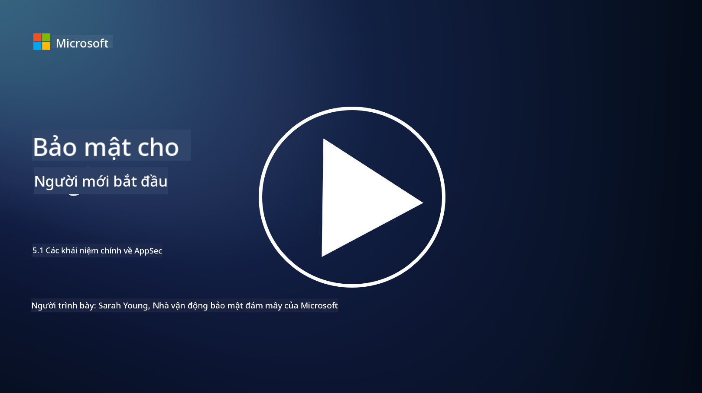

<!--
CO_OP_TRANSLATOR_METADATA:
{
  "original_hash": "e4b56bb23078d3ffb7ad407d280b0c36",
  "translation_date": "2025-09-04T00:33:01+00:00",
  "source_file": "5.1 AppSec key concepts.md",
  "language_code": "vi"
}
-->
# Các khái niệm chính về bảo mật ứng dụng

Bảo mật ứng dụng là một lĩnh vực chuyên môn về bảo mật. Trong phần này của khóa học, chúng ta sẽ tìm hiểu sâu hơn về bảo mật ứng dụng.

## Giới thiệu

Trong bài học này, chúng ta sẽ tìm hiểu:

- Bảo mật ứng dụng là gì?

- Các khái niệm/nguyên tắc chính của bảo mật ứng dụng là gì?

## Bảo mật ứng dụng là gì?

Bảo mật ứng dụng, thường được viết tắt là "AppSec," đề cập đến việc bảo vệ các ứng dụng phần mềm khỏi các mối đe dọa, lỗ hổng và tấn công bảo mật. Nó bao gồm các quy trình, kỹ thuật và công cụ được sử dụng để xác định, giảm thiểu và ngăn chặn các rủi ro bảo mật trong suốt vòng đời phát triển, triển khai và bảo trì của một ứng dụng.

Bảo mật ứng dụng rất quan trọng vì các ứng dụng thường là mục tiêu phổ biến của các cuộc tấn công mạng. Các tác nhân độc hại khai thác lỗ hổng và điểm yếu trong phần mềm để truy cập trái phép, đánh cắp dữ liệu, làm gián đoạn dịch vụ hoặc thực hiện các hoạt động độc hại khác. Bảo mật ứng dụng hiệu quả giúp đảm bảo tính bảo mật, toàn vẹn và khả năng hoạt động của ứng dụng và dữ liệu liên quan.

## Các khái niệm/nguyên tắc chính của bảo mật ứng dụng là gì?

Các khái niệm và nguyên tắc chính làm nền tảng cho bảo mật ứng dụng bao gồm:

1. **Thiết kế bảo mật ngay từ đầu**:

- Bảo mật nên được tích hợp vào thiết kế và kiến trúc của ứng dụng từ đầu, thay vì thêm vào sau này.

2. **Xác thực đầu vào**:

- Tất cả các đầu vào từ người dùng cần được xác thực để đảm bảo chúng tuân theo định dạng mong đợi và không chứa mã hoặc dữ liệu độc hại.

3. **Mã hóa đầu ra**:

- Dữ liệu gửi đến phía khách hàng cần được mã hóa đúng cách để ngăn chặn các lỗ hổng như cross-site scripting (XSS).

4. **Xác thực và phân quyền**:

- Xác thực người dùng và phân quyền truy cập tài nguyên dựa trên vai trò và quyền hạn của họ.

5. **Bảo vệ dữ liệu**:

- Dữ liệu nhạy cảm cần được mã hóa khi lưu trữ, truyền tải và xử lý để ngăn chặn truy cập trái phép.

6. **Quản lý phiên làm việc**:

- Quản lý phiên làm việc an toàn đảm bảo các phiên của người dùng được bảo vệ khỏi việc chiếm đoạt và truy cập trái phép.

7. **Bảo mật các phụ thuộc**:

- Cập nhật tất cả các phụ thuộc phần mềm với các bản vá bảo mật để ngăn chặn lỗ hổng.

8. **Xử lý lỗi và ghi nhật ký**:

- Thực hiện xử lý lỗi an toàn để tránh tiết lộ thông tin nhạy cảm và đảm bảo các thực hành ghi nhật ký an toàn.

9. **Kiểm tra bảo mật**:

- Thường xuyên kiểm tra ứng dụng để tìm lỗ hổng bằng các phương pháp như kiểm tra thâm nhập, đánh giá mã nguồn và sử dụng công cụ quét tự động.

10. **Vòng đời phát triển phần mềm an toàn (SDLC)**:

- Tích hợp các thực hành bảo mật vào mọi giai đoạn của vòng đời phát triển phần mềm, từ yêu cầu đến triển khai và bảo trì.

## Đọc thêm

- [SheHacksPurple: Bảo mật ứng dụng là gì? - YouTube](https://www.youtube.com/watch?v=eNmccQNzSSY)
- [Bảo mật ứng dụng là gì? - Cisco](https://www.cisco.com/c/en/us/solutions/security/application-first-security/what-is-application-security.html#~how-does-it-work)
- [Bảo mật ứng dụng là gì? Quy trình và công cụ để bảo vệ phần mềm | CSO Online](https://www.csoonline.com/article/566471/what-is-application-security-a-process-and-tools-for-securing-software.html)
- [OWASP Cheat Sheet Series | OWASP Foundation](https://owasp.org/www-project-cheat-sheets/)

---

**Tuyên bố miễn trừ trách nhiệm**:  
Tài liệu này đã được dịch bằng dịch vụ dịch thuật AI [Co-op Translator](https://github.com/Azure/co-op-translator). Mặc dù chúng tôi cố gắng đảm bảo độ chính xác, xin lưu ý rằng các bản dịch tự động có thể chứa lỗi hoặc không chính xác. Tài liệu gốc bằng ngôn ngữ bản địa nên được coi là nguồn thông tin chính thức. Đối với các thông tin quan trọng, khuyến nghị sử dụng dịch vụ dịch thuật chuyên nghiệp bởi con người. Chúng tôi không chịu trách nhiệm cho bất kỳ sự hiểu lầm hoặc diễn giải sai nào phát sinh từ việc sử dụng bản dịch này.