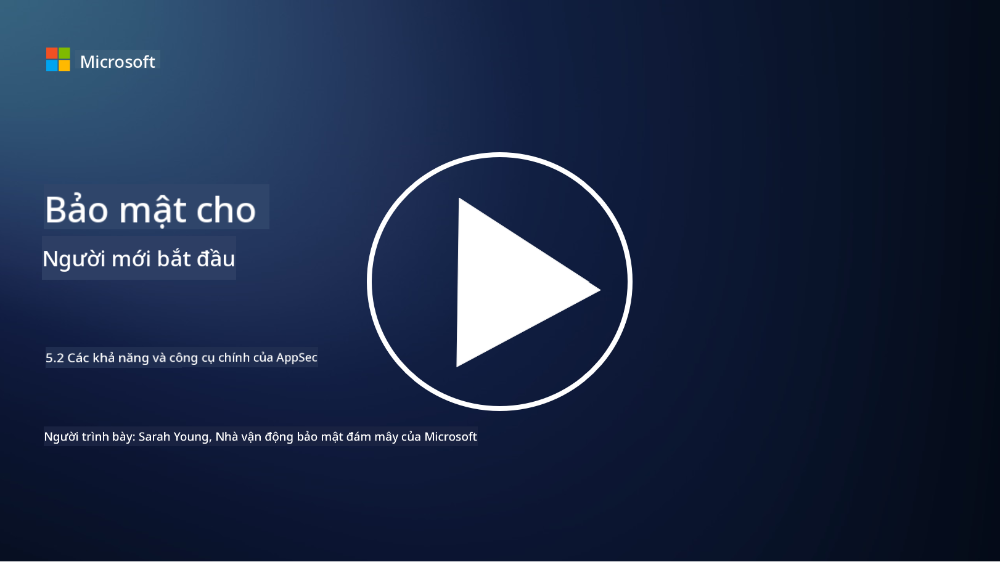

<!--
CO_OP_TRANSLATOR_METADATA:
{
  "original_hash": "790a3fa7e535ec60bb51bde13e759781",
  "translation_date": "2025-09-04T00:51:20+00:00",
  "source_file": "5.2 AppSec key capabilities.md",
  "language_code": "vi"
}
-->
## Giới thiệu

Trong bài học này, chúng ta sẽ tìm hiểu về các khả năng và công cụ chính được sử dụng trong bảo mật ứng dụng.

## Các khả năng và công cụ chính trong bảo mật ứng dụng

Các khả năng và công cụ chính được sử dụng trong bảo mật ứng dụng rất quan trọng để xác định, giảm thiểu và ngăn chặn các lỗ hổng bảo mật và mối đe dọa trong các ứng dụng phần mềm. Dưới đây là một số công cụ và khả năng quan trọng nhất:

**1. Kiểm tra bảo mật ứng dụng tĩnh (SAST)**:

- **Khả năng**: Phân tích mã nguồn, bytecode hoặc mã nhị phân để xác định các lỗ hổng bảo mật trong mã nguồn của ứng dụng.

- **Công cụ**: Ví dụ bao gồm Fortify, Checkmarx và Veracode.

**2. Kiểm tra bảo mật ứng dụng động (DAST)**:

- **Khả năng**: Quét ứng dụng đang chạy để xác định lỗ hổng bằng cách gửi các yêu cầu đầu vào và phân tích phản hồi.

- **Công cụ**: Ví dụ bao gồm ZAP, Burp Suite và Qualys Web Application Scanning.

**3. Kiểm tra bảo mật ứng dụng tương tác (IAST)**:

- **Khả năng**: Kết hợp các yếu tố của SAST và DAST để phân tích mã trong thời gian chạy, cung cấp kết quả chính xác hơn và giảm thiểu các cảnh báo sai.

- **Công cụ**: Ví dụ bao gồm Contrast Security và HCL AppScan.

**4. Bảo vệ ứng dụng tự động trong thời gian chạy (RASP)**:

- **Khả năng**: Giám sát và bảo vệ ứng dụng theo thời gian thực, phát hiện và phản ứng với các mối đe dọa bảo mật khi chúng xảy ra.

- **Công cụ**: Ví dụ bao gồm Veracode Runtime Protection và F5 Advanced WAF với RASP.

**5. Tường lửa ứng dụng web (WAFs)**:

- **Khả năng**: Cung cấp một lớp bảo vệ giữa ứng dụng và internet, lọc lưu lượng truy cập đến và chặn các yêu cầu độc hại.

- **Công cụ**: Ví dụ bao gồm ModSecurity, AWS WAF và Akamai Kona Site Defender.

**6. Quét phụ thuộc**:

- **Khả năng**: Xác định các lỗ hổng trong thư viện và thành phần bên thứ ba được sử dụng trong ứng dụng.

- **Công cụ**: Ví dụ bao gồm OWASP Dependency-Check và Snyk.

**7. Kiểm tra thâm nhập (Pen Testing)**:

- **Khả năng**: Mô phỏng các cuộc tấn công thực tế để phát hiện lỗ hổng và đánh giá mức độ bảo mật của ứng dụng.

- **Công cụ**: Được thực hiện bởi các hacker mũ trắng và chuyên gia bảo mật sử dụng các công cụ như Metasploit và Nmap.

**8. Quét và phân tích bảo mật**:

- **Khả năng**: Quét các lỗ hổng đã biết, lỗi cấu hình và các cấu hình bảo mật không đúng.

- **Công cụ**: Ví dụ bao gồm Nessus, Qualys Vulnerability Management và OpenVAS.

**9. Công cụ bảo mật container**:

- **Khả năng**: Tập trung vào việc bảo mật các ứng dụng container hóa và môi trường của chúng.

- **Công cụ**: Ví dụ bao gồm Docker Security Scanning và Aqua Security.

**10. Đào tạo phát triển an toàn**:

- **Khả năng**: Cung cấp các chương trình đào tạo và nâng cao nhận thức cho đội ngũ phát triển để thúc đẩy các thực hành mã hóa an toàn.

- **Công cụ**: Các chương trình đào tạo và nền tảng tùy chỉnh.

**11. Khung kiểm tra bảo mật**:

- **Khả năng**: Cung cấp các khung kiểm tra toàn diện cho các nhu cầu kiểm tra bảo mật ứng dụng khác nhau.

- **Công cụ**: OWASP Amass, OWASP OWTF và FrAppSec.

**12. Công cụ kiểm tra mã nguồn an toàn**:

- **Khả năng**: Xem xét mã nguồn để tìm các lỗ hổng bảo mật và các thực hành mã hóa tốt nhất.

- **Công cụ**: Ví dụ bao gồm SonarQube và Checkmarx.

**13. Công cụ bảo mật API và microservices**:

- **Khả năng**: Tập trung vào việc bảo mật API và microservices, bao gồm xác thực, ủy quyền và bảo vệ dữ liệu.

- **Công cụ**: Ví dụ bao gồm Apigee, AWS API Gateway và Istio.

## Đọc thêm

- [What Is Application Security? Concepts, Tools & Best Practices | HackerOne](https://www.hackerone.com/knowledge-center/what-application-security-concepts-tools-best-practices)
- [What is IAST? (Interactive Application Security Testing) (comparitech.com)](https://www.comparitech.com/net-admin/what-is-iast/)
- [10 Types of Application Security Testing Tools: When and How to Use Them (cmu.edu)](https://insights.sei.cmu.edu/blog/10-types-of-application-security-testing-tools-when-and-how-to-use-them/)
- [Shifting the Balance of Cybersecurity Risk: Principles and Approaches for Security-by-Design and Default | Cyber.gov.au](https://www.cyber.gov.au/about-us/view-all-content/publications/principles-and-approaches-for-security-by-design-and-default)

---

**Tuyên bố miễn trừ trách nhiệm**:  
Tài liệu này đã được dịch bằng dịch vụ dịch thuật AI [Co-op Translator](https://github.com/Azure/co-op-translator). Mặc dù chúng tôi cố gắng đảm bảo độ chính xác, xin lưu ý rằng các bản dịch tự động có thể chứa lỗi hoặc không chính xác. Tài liệu gốc bằng ngôn ngữ bản địa nên được coi là nguồn tham khảo chính thức. Đối với các thông tin quan trọng, nên sử dụng dịch vụ dịch thuật chuyên nghiệp từ con người. Chúng tôi không chịu trách nhiệm cho bất kỳ sự hiểu lầm hoặc diễn giải sai nào phát sinh từ việc sử dụng bản dịch này.