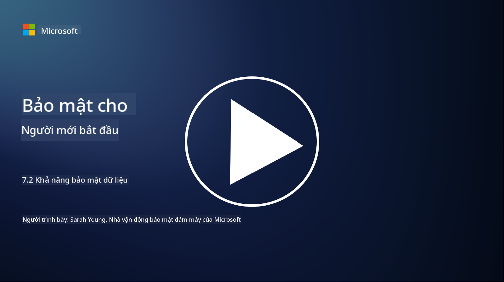

<!--
CO_OP_TRANSLATOR_METADATA:
{
  "original_hash": "50697add9758e54693442d502d2d5f8a",
  "translation_date": "2025-09-04T00:56:57+00:00",
  "source_file": "7.2 Data security capabilities.md",
  "language_code": "vi"
}
-->
# Khả năng bảo mật dữ liệu

Trong phần này, chúng ta sẽ tìm hiểu chi tiết hơn về các công cụ và khả năng cốt lõi được sử dụng trong bảo mật dữ liệu:

**Giới thiệu**

Trong bài học này, chúng ta sẽ tìm hiểu:

- Công cụ ngăn chặn mất dữ liệu là gì?

- Công cụ quản lý rủi ro nội bộ là gì?

- Những công cụ nào hỗ trợ lưu trữ dữ liệu?

## Công cụ ngăn chặn mất dữ liệu là gì?

Công cụ Ngăn Chặn Mất Dữ Liệu (Data Loss Prevention - DLP) là tập hợp các giải pháp phần mềm và công nghệ được thiết kế để ngăn chặn truy cập trái phép, chia sẻ hoặc rò rỉ dữ liệu nhạy cảm hoặc bí mật trong tổ chức. Các công cụ này sử dụng kiểm tra nội dung, thực thi chính sách và giám sát để xác định và bảo vệ dữ liệu nhạy cảm khỏi bị lộ hoặc sử dụng sai mục đích. Ví dụ về các sản phẩm DLP bao gồm: Symantec Data Loss Prevention, McAfee Total Protection for Data Loss Prevention, Microsoft 365 DLP**: Tích hợp với các ứng dụng Microsoft 365 để giúp tổ chức xác định và bảo vệ dữ liệu nhạy cảm trong email, tài liệu và tin nhắn.

## Công cụ quản lý rủi ro nội bộ là gì?

Công cụ Quản Lý Rủi Ro Nội Bộ giúp các tổ chức xác định và giảm thiểu rủi ro từ nhân viên, nhà thầu hoặc đối tác có thể cố ý hoặc vô ý làm tổn hại đến bảo mật dữ liệu. Các công cụ này giám sát hành vi người dùng, mô hình truy cập và việc sử dụng dữ liệu để phát hiện các hoạt động đáng ngờ và các mối đe dọa nội bộ tiềm ẩn. Ví dụ về các sản phẩm quản lý rủi ro nội bộ bao gồm: Microsoft Insider Risk Management (một phần của Microsoft 365), Forcepoint Insider Threat Data Protection, Varonis Insider Threat Detection.

## Những công cụ nào hỗ trợ lưu trữ dữ liệu?

Công cụ lưu trữ dữ liệu bao gồm phần mềm và giải pháp được thiết kế để quản lý việc lưu trữ và xóa dữ liệu theo chính sách lưu trữ dữ liệu và yêu cầu pháp lý của tổ chức. Các công cụ này giúp tự động hóa quy trình lưu trữ dữ liệu trong khoảng thời gian cụ thể và xóa an toàn khi không còn cần thiết. Ví dụ về các sản phẩm lưu trữ dữ liệu bao gồm: Veritas Enterprise Vault, Commvault Complete Data Protection, Microsoft data lifecycle management. Những giải pháp này giúp tổ chức duy trì kiểm soát việc lưu trữ và xử lý dữ liệu, đảm bảo tuân thủ các quy định bảo vệ dữ liệu đồng thời quản lý hiệu quả dữ liệu trong suốt vòng đời của nó.

## Đọc thêm

- [Hướng dẫn về Quản Lý Tư Thế Bảo Mật Dữ Liệu (DSPM) | CSA (cloudsecurityalliance.org)](https://cloudsecurityalliance.org/blog/2023/03/31/the-big-guide-to-data-security-posture-management-dspm/)
- [Ngăn Chặn Mất Dữ Liệu trên các thiết bị, ứng dụng và dịch vụ | Microsoft Purview](https://youtu.be/hvqq8L_0kgI)
- [18 Công Cụ Phần Mềm Ngăn Chặn Mất Dữ Liệu Tốt Nhất 2023 (Miễn phí + Trả phí) (comparitech.com)](https://www.comparitech.com/data-privacy-management/data-loss-prevention-tools-software/)
- [Ngăn Chặn Mất Dữ Liệu (nist.gov)](https://tsapps.nist.gov/publication/get_pdf.cfm?pub_id=904672)
- [Tìm hiểu về quản lý rủi ro nội bộ | Microsoft Learn](https://learn.microsoft.com/purview/insider-risk-management?WT.mc_id=academic-96948-sayoung)
- [Quản Lý Vòng Đời Dữ Liệu | IBM](https://www.ibm.com/topics/data-lifecycle-management)
- [Quản Lý Vòng Đời Dữ Liệu (DLM) là gì? | Thực hành tốt nhất năm 2023 (selecthub.com)](https://www.selecthub.com/big-data-analytics/data-lifecycle-management/)

---

**Tuyên bố miễn trừ trách nhiệm**:  
Tài liệu này đã được dịch bằng dịch vụ dịch thuật AI [Co-op Translator](https://github.com/Azure/co-op-translator). Mặc dù chúng tôi cố gắng đảm bảo độ chính xác, xin lưu ý rằng các bản dịch tự động có thể chứa lỗi hoặc không chính xác. Tài liệu gốc bằng ngôn ngữ bản địa nên được coi là nguồn tham khảo chính thức. Đối với các thông tin quan trọng, chúng tôi khuyến nghị sử dụng dịch vụ dịch thuật chuyên nghiệp từ con người. Chúng tôi không chịu trách nhiệm cho bất kỳ sự hiểu lầm hoặc diễn giải sai nào phát sinh từ việc sử dụng bản dịch này.