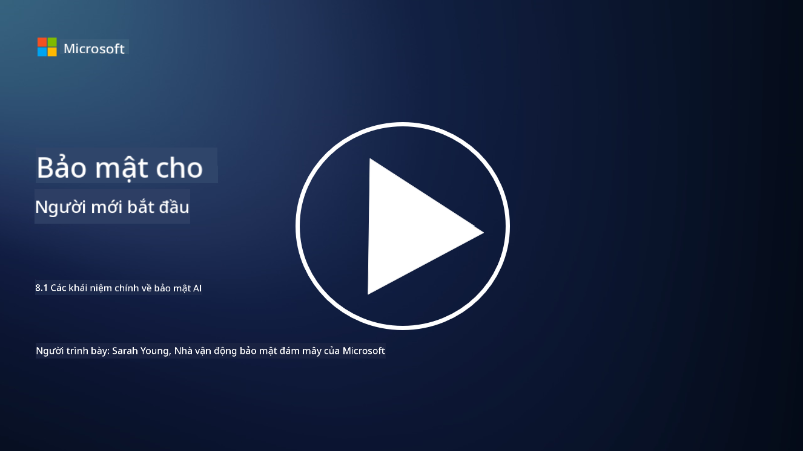

<!--
CO_OP_TRANSLATOR_METADATA:
{
  "original_hash": "66b61d96936cf25d20fcb411d4ce5227",
  "translation_date": "2025-09-03T22:49:18+00:00",
  "source_file": "8.1 AI security key concepts.md",
  "language_code": "vi"
}
-->
# Các khái niệm chính về bảo mật AI

## Bảo mật AI khác gì so với bảo mật mạng truyền thống?

Bảo mật hệ thống AI mang đến những thách thức độc đáo so với bảo mật mạng truyền thống, chủ yếu do khả năng học tập và quá trình ra quyết định của AI. Dưới đây là một số điểm khác biệt chính:

-   **Tính toàn vẹn của dữ liệu**: Hệ thống AI phụ thuộc rất nhiều vào dữ liệu để học tập. [Đảm bảo tính toàn vẹn của dữ liệu này là rất quan trọng, vì kẻ tấn công có thể thao túng dữ liệu để ảnh hưởng đến hành vi của AI, một chiến thuật được gọi là "nhiễm độc dữ liệu."
-   **Bảo mật mô hình**: Mô hình ra quyết định của AI cũng có thể trở thành mục tiêu. [Kẻ tấn công có thể cố gắng đảo ngược kỹ thuật mô hình hoặc khai thác các điểm yếu của nó để đưa ra các quyết định sai lầm hoặc gây hại.
-   **Tấn công đối kháng**: Hệ thống AI có thể dễ bị tấn công đối kháng, nơi các thay đổi nhỏ, thường không thể nhận thấy trong dữ liệu đầu vào, có thể khiến AI mắc lỗi hoặc đưa ra dự đoán sai.
-   **Bảo mật hạ tầng**: Mặc dù bảo mật mạng truyền thống cũng tập trung vào việc bảo vệ hạ tầng, hệ thống AI có thể có các lớp phức tạp bổ sung, chẳng hạn như dịch vụ dựa trên đám mây hoặc phần cứng chuyên dụng, đòi hỏi các biện pháp bảo mật cụ thể.
-   **Cân nhắc đạo đức**: Việc sử dụng AI trong bảo mật mang đến các cân nhắc đạo đức, chẳng hạn như lo ngại về quyền riêng tư và khả năng thiên vị trong quá trình ra quyết định, cần được giải quyết trong chiến lược bảo mật.

Nhìn chung, bảo mật hệ thống AI đòi hỏi một cách tiếp cận khác biệt, xem xét các khía cạnh độc đáo của công nghệ AI, bao gồm bảo vệ dữ liệu, mô hình và quá trình học tập của AI, đồng thời giải quyết các tác động đạo đức của việc triển khai AI.

Bảo mật AI và bảo mật mạng truyền thống có nhiều điểm tương đồng, nhưng cũng có những khác biệt rõ rệt do các đặc điểm và khả năng độc đáo của hệ thống trí tuệ nhân tạo. Dưới đây là cách chúng khác nhau:

- **Độ phức tạp của mối đe dọa**: Hệ thống AI mang đến các lớp phức tạp mới cho bảo mật mạng. Bảo mật mạng truyền thống chủ yếu đối phó với các mối đe dọa như phần mềm độc hại, tấn công lừa đảo và xâm nhập mạng. Tuy nhiên, hệ thống AI có thể dễ bị tấn công như tấn công đối kháng, nhiễm độc dữ liệu và né tránh mô hình, những mối đe dọa nhắm trực tiếp vào các thuật toán học máy.

- **Bề mặt tấn công**: Hệ thống AI thường có bề mặt tấn công lớn hơn so với hệ thống truyền thống. Điều này là do chúng không chỉ dựa vào phần mềm mà còn vào dữ liệu và mô hình. Kẻ tấn công có thể nhắm vào dữ liệu huấn luyện, thao túng mô hình hoặc khai thác các lỗ hổng trong chính thuật toán.

- **Khả năng thích nghi của mối đe dọa**: Hệ thống AI có thể thích nghi và học hỏi từ môi trường của chúng, điều này khiến chúng dễ bị tấn công thích nghi và tiến hóa hơn. Các biện pháp bảo mật mạng truyền thống có thể không đủ để bảo vệ trước các cuộc tấn công liên tục thay đổi dựa trên hành vi của hệ thống AI.

- **Khả năng giải thích và minh bạch**: Việc hiểu tại sao một hệ thống AI đưa ra một quyết định cụ thể thường khó khăn hơn so với các hệ thống phần mềm truyền thống. Sự thiếu khả năng giải thích và minh bạch này có thể khiến việc phát hiện và giảm thiểu các cuộc tấn công vào hệ thống AI trở nên khó khăn hơn.

- **Lo ngại về quyền riêng tư dữ liệu**: Hệ thống AI thường dựa vào lượng dữ liệu lớn, điều này có thể gây ra rủi ro về quyền riêng tư nếu không được xử lý đúng cách. Các biện pháp bảo mật mạng truyền thống có thể không giải quyết đầy đủ các lo ngại về quyền riêng tư dữ liệu cụ thể đối với hệ thống AI.

- **Tuân thủ quy định**: Bối cảnh quy định cho bảo mật AI vẫn đang phát triển, với các quy định và tiêu chuẩn cụ thể xuất hiện để giải quyết các thách thức độc đáo do hệ thống AI đặt ra. Các khung bảo mật mạng truyền thống có thể cần được mở rộng hoặc điều chỉnh để đảm bảo tuân thủ các quy định mới này.

- **Cân nhắc đạo đức**: Bảo mật AI không chỉ liên quan đến việc bảo vệ hệ thống khỏi các cuộc tấn công độc hại mà còn đảm bảo rằng hệ thống AI được sử dụng một cách đạo đức và có trách nhiệm. Điều này bao gồm các cân nhắc như tính công bằng, minh bạch và trách nhiệm, những yếu tố có thể không nổi bật trong bảo mật mạng truyền thống.

## Bảo mật AI giống gì với bảo mật hệ thống CNTT truyền thống?

Bảo mật hệ thống AI chia sẻ một số nguyên tắc cơ bản với bảo mật mạng truyền thống:

-   **Bảo vệ khỏi mối đe dọa**: Cả hệ thống AI và hệ thống truyền thống đều cần được bảo vệ khỏi truy cập trái phép, sửa đổi dữ liệu và phá hủy, cũng như các mối đe dọa phổ biến khác.
-   **Quản lý lỗ hổng**: Nhiều lỗ hổng ảnh hưởng đến hệ thống truyền thống, chẳng hạn như lỗi phần mềm hoặc cấu hình sai, cũng có thể tác động đến hệ thống AI.
-   **Bảo mật dữ liệu**: Việc bảo vệ dữ liệu được xử lý là rất quan trọng trong cả hai lĩnh vực để ngăn chặn vi phạm dữ liệu và đảm bảo tính bảo mật.
-   **Bảo mật chuỗi cung ứng**: Cả hai loại hệ thống đều dễ bị tấn công chuỗi cung ứng, nơi một thành phần bị xâm phạm có thể làm suy yếu bảo mật của toàn bộ hệ thống.

Những điểm tương đồng này cho thấy rằng mặc dù hệ thống AI mang đến những thách thức bảo mật mới, chúng cũng yêu cầu áp dụng các thực tiễn bảo mật mạng đã được thiết lập để đảm bảo sự bảo vệ mạnh mẽ. Đây là sự kết hợp giữa việc tận dụng kiến thức bảo mật truyền thống và thích nghi với các khía cạnh độc đáo của công nghệ AI.

## Đọc thêm

- [Not with a Bug, But with a Sticker [Book] (oreilly.com)](https://www.oreilly.com/library/view/not-with-a/9781119883982/)
   
- [Intro to AI Security Part 1: AI Security 101 | by HarrietHacks | Medium](https://medium.com/@harrietfarlow/intro-to-ai-security-part-1-ai-security-101-b8662a9efe5)
   
- [Best practices for AI security risk management | Microsoft Security Blog](https://www.microsoft.com/en-us/security/blog/2021/12/09/best-practices-for-ai-security-risk-management/?WT.mc_id=academic-96948-sayoung)
   
- [OWASP AI Security and Privacy Guide | OWASP Foundation](https://owasp.org/www-project-ai-security-and-privacy-guide/)

---

**Tuyên bố miễn trừ trách nhiệm**:  
Tài liệu này đã được dịch bằng dịch vụ dịch thuật AI [Co-op Translator](https://github.com/Azure/co-op-translator). Mặc dù chúng tôi cố gắng đảm bảo độ chính xác, xin lưu ý rằng các bản dịch tự động có thể chứa lỗi hoặc không chính xác. Tài liệu gốc bằng ngôn ngữ bản địa nên được coi là nguồn thông tin chính thức. Đối với các thông tin quan trọng, khuyến nghị sử dụng dịch vụ dịch thuật chuyên nghiệp từ con người. Chúng tôi không chịu trách nhiệm cho bất kỳ sự hiểu lầm hoặc diễn giải sai nào phát sinh từ việc sử dụng bản dịch này.